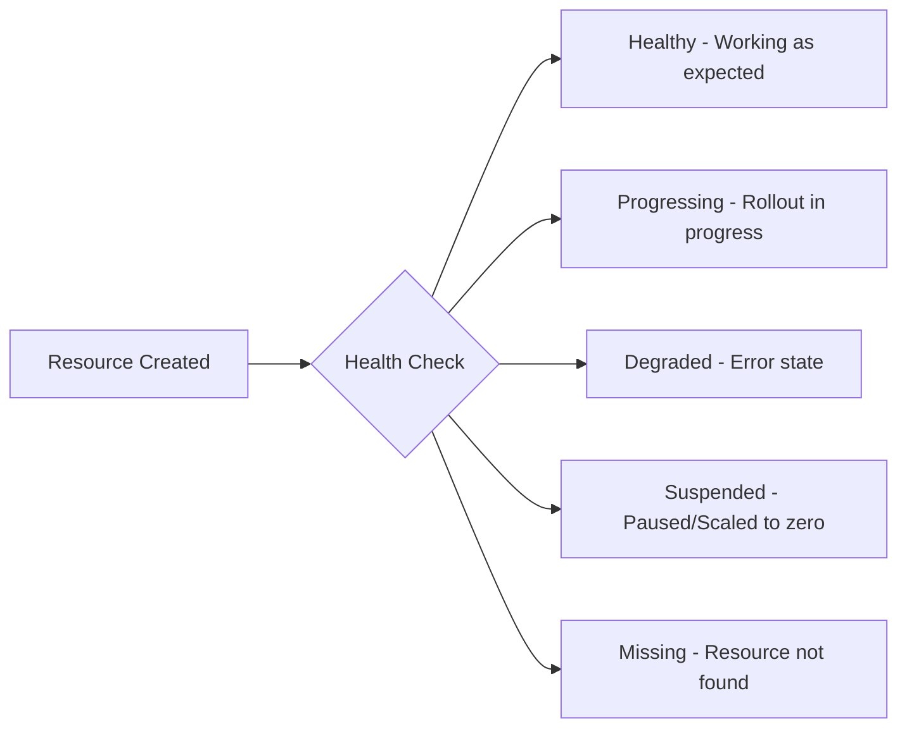
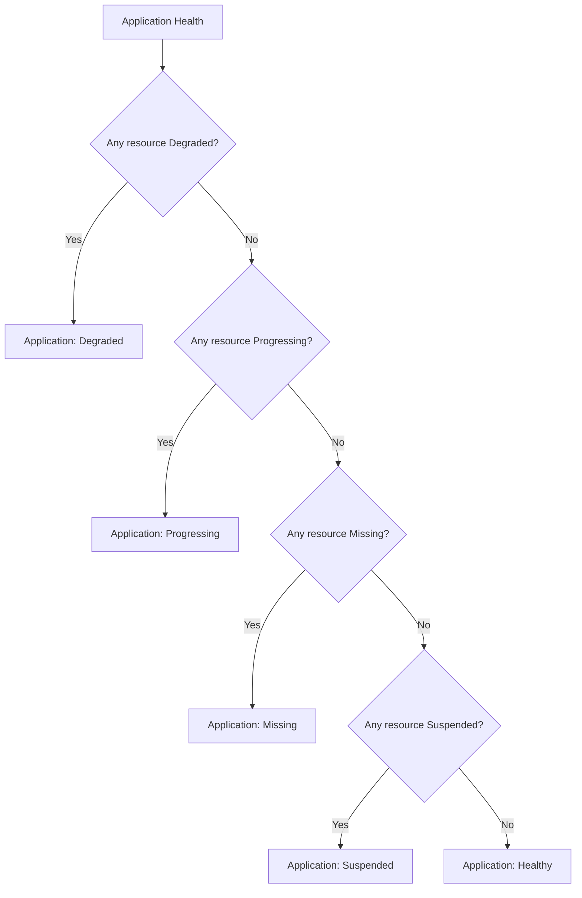

# How to Understand Built-in Health Checks in ArgoCD

Author: [nawazdhandala](https://github.com/nawazdhandala)

Tags: ArgoCD, GitOps, Kubernetes, Health Checks, Monitoring

Description: Learn how ArgoCD built-in health checks work for standard Kubernetes resources including Deployments, StatefulSets, Services, Jobs, and more.

---

ArgoCD does not just tell you whether your application is synced with Git. It also tells you whether your application is healthy. The health status is separate from the sync status, and understanding the difference is critical for operating GitOps workflows. An application can be perfectly synced but unhealthy (all Pods are crashing), or out of sync but healthy (running an older version that works fine).

ArgoCD includes built-in health checks for all standard Kubernetes resource types. This guide explains what each health check evaluates, what the different health statuses mean, and how to interpret them.

## Health Status Values

ArgoCD uses five health status values:



| Status | Meaning | Icon Color |
|--------|---------|------------|
| **Healthy** | Resource is operating correctly | Green |
| **Progressing** | Resource is not yet healthy but has not failed | Yellow |
| **Degraded** | Resource has failed or is in an error state | Red |
| **Suspended** | Resource is paused intentionally | Blue |
| **Missing** | Resource does not exist in the cluster | Yellow |
| **Unknown** | Health status cannot be determined | Grey |

## Application-Level Health

The overall Application health is determined by aggregating the health of all its resources:



The worst health status among all resources becomes the Application's health status. One Degraded Deployment makes the entire Application Degraded.

## Deployment Health Check

ArgoCD evaluates Deployments by checking replica status:

**Healthy** when:
- `status.updatedReplicas` equals `spec.replicas`
- `status.availableReplicas` equals `spec.replicas`
- No old ReplicaSets have running pods
- The Deployment generation matches the observed generation

**Progressing** when:
- Replicas are being updated (rolling update in progress)
- New pods are starting but not yet available
- The rollout has not exceeded `progressDeadlineSeconds`

**Degraded** when:
- The Deployment has exceeded `progressDeadlineSeconds` (defaults to 600 seconds)
- The Deployment condition shows `Available: False` or `Progressing: False` with reason `ProgressDeadlineExceeded`

```bash
# Check what ArgoCD sees for Deployment health
kubectl get deployment my-app -o json | jq '{
  replicas: .spec.replicas,
  updatedReplicas: .status.updatedReplicas,
  availableReplicas: .status.availableReplicas,
  conditions: [.status.conditions[] | {type, status, reason}]
}'
```

**Key detail**: If `spec.replicas` is 0, the Deployment is reported as **Suspended**, not Healthy.

## StatefulSet Health Check

Similar to Deployments but also considers the update strategy:

**Healthy** when:
- `status.updatedReplicas` equals `spec.replicas`
- `status.readyReplicas` equals `spec.replicas`
- `status.currentRevision` equals `status.updateRevision`

**Progressing** when:
- Pods are being updated sequentially (OrderedReady strategy)
- The `currentRevision` does not match `updateRevision`

**Degraded** when:
- A pod fails to start after the timeout
- The observed generation does not match the metadata generation after a reasonable time

## DaemonSet Health Check

**Healthy** when:
- `status.desiredNumberScheduled` equals `status.currentNumberScheduled`
- `status.updatedNumberScheduled` equals `status.desiredNumberScheduled`
- `status.numberAvailable` equals `status.desiredNumberScheduled`

**Progressing** when:
- Nodes are being updated with new pod versions
- Some nodes still run the old pod version

**Degraded** when:
- `status.numberMisscheduled` is greater than 0 for an extended period
- Pods are failing to schedule on target nodes

## Service Health Check

Services are almost always **Healthy**. ArgoCD simply checks that the Service exists. It does not verify that endpoints are available or that backend pods are running.

```yaml
# This Service will be Healthy even if no pods match the selector
apiVersion: v1
kind: Service
metadata:
  name: my-service
spec:
  selector:
    app: my-app  # No pods with this label? Still Healthy
  ports:
    - port: 80
```

If you need endpoint health checking, you will need a custom health check.

## Ingress Health Check

**Healthy** when:
- The Ingress resource exists
- For AWS ALB Ingress: `status.loadBalancer.ingress` is populated

**Progressing** when:
- The load balancer is being provisioned (no address assigned yet)

## Job Health Check

**Healthy** when:
- `status.succeeded` is greater than 0
- The Job has completed successfully

**Progressing** when:
- The Job is still running (active pods exist)

**Degraded** when:
- `status.failed` exceeds the backoff limit
- The Job has condition `Failed: True`

```bash
# Check Job status
kubectl get job my-job -o json | jq '{
  active: .status.active,
  succeeded: .status.succeeded,
  failed: .status.failed,
  conditions: .status.conditions
}'
```

## CronJob Health Check

CronJobs are typically **Healthy** if they exist. ArgoCD does not evaluate whether the most recent Job run was successful.

## Pod Health Check

**Healthy** when:
- `status.phase` is `Running`
- All containers have `ready: true`

**Progressing** when:
- `status.phase` is `Pending`
- Containers are being started

**Degraded** when:
- `status.phase` is `Failed`
- Containers are in `CrashLoopBackOff`
- Containers are in `ImagePullBackOff`

**Note**: ArgoCD typically does not directly track Pods as they are managed by higher-level controllers. Pods are usually assessed through their parent Deployment or StatefulSet.

## PersistentVolumeClaim Health Check

**Healthy** when:
- `status.phase` is `Bound`

**Progressing** when:
- `status.phase` is `Pending` (waiting for provisioning)

**Degraded** when:
- `status.phase` is `Lost`

## HorizontalPodAutoscaler Health Check

**Healthy** when:
- `status.currentReplicas` is within the desired range
- Scaling conditions are normal

**Progressing** when:
- Scaling is actively in progress

**Degraded** when:
- The HPA cannot compute desired replicas (metrics unavailable)
- The HPA condition shows `ScalingLimited` or `AbleToScale: False`

## ReplicaSet Health Check

**Healthy** when:
- `status.availableReplicas` equals `spec.replicas`

**Progressing** when:
- Replicas are being created

**Degraded** when:
- Replicas cannot be created after timeout

## Namespace Health Check

Namespaces are always **Healthy** unless:
- The namespace is in `Terminating` phase (then it is **Progressing**)

## ConfigMap and Secret Health Check

ConfigMaps and Secrets do not have health checks. They are always considered **Healthy** if they exist. There is no way for ArgoCD to know if the data inside them is correct.

## Resources Without Built-in Health Checks

For resources that ArgoCD does not have a built-in health check for, it defaults to **Healthy** if the resource exists. This includes:

- ServiceAccounts
- ClusterRoles and ClusterRoleBindings
- Roles and RoleBindings
- NetworkPolicies
- ResourceQuotas
- LimitRanges
- Most Custom Resources (CRDs)

If you need health assessment for these resources, you will need to write custom health checks. See [How to Write Custom Health Check Scripts in Lua](https://oneuptime.com/blog/post/2026-02-26-argocd-custom-health-check-lua/view).

## Interpreting Health Status in Practice

### Application Stuck in Progressing

If your application stays in Progressing for a long time:

```bash
# Find which resources are progressing
argocd app get my-app -o json | \
  jq '.status.resources[] | select(.health.status == "Progressing") | {kind, name, health}'

# Common causes:
# - Image pull taking too long
# - Pod scheduling issues (insufficient resources)
# - Readiness probe failing
# - PVC waiting for provisioning
```

### Application Shows Degraded

```bash
# Find degraded resources
argocd app get my-app -o json | \
  jq '.status.resources[] | select(.health.status == "Degraded") | {kind, name, health}'

# Check the specific resource for errors
kubectl describe deployment my-app -n production
kubectl get events -n production --sort-by='.lastTimestamp' | tail -20
```

### Understanding Progressing to Degraded Transition

Deployments transition from Progressing to Degraded when `progressDeadlineSeconds` is exceeded (default: 600 seconds / 10 minutes). If your deployments routinely take longer:

```yaml
apiVersion: apps/v1
kind: Deployment
metadata:
  name: my-large-app
spec:
  progressDeadlineSeconds: 1200  # Increase to 20 minutes
```

## Best Practices

1. **Set appropriate progressDeadlineSeconds** - Default 10 minutes may not be enough for large images or slow registries
2. **Configure readiness probes** - ArgoCD relies on Kubernetes readiness to determine Deployment health
3. **Watch for stuck Progressing** - An application permanently in Progressing usually indicates a misconfigured readiness probe
4. **Add custom health checks for CRDs** - Default "Healthy if exists" is usually not enough for custom resources
5. **Use health checks for deployment gating** - ArgoCD sync hooks can wait for health before proceeding

For more on custom health checks, see [How to Write Custom Health Check Scripts in Lua](https://oneuptime.com/blog/post/2026-02-26-argocd-custom-health-check-lua/view) and [How to Configure Custom Health Checks for CRDs](https://oneuptime.com/blog/post/2026-02-26-argocd-health-checks-crds/view).
