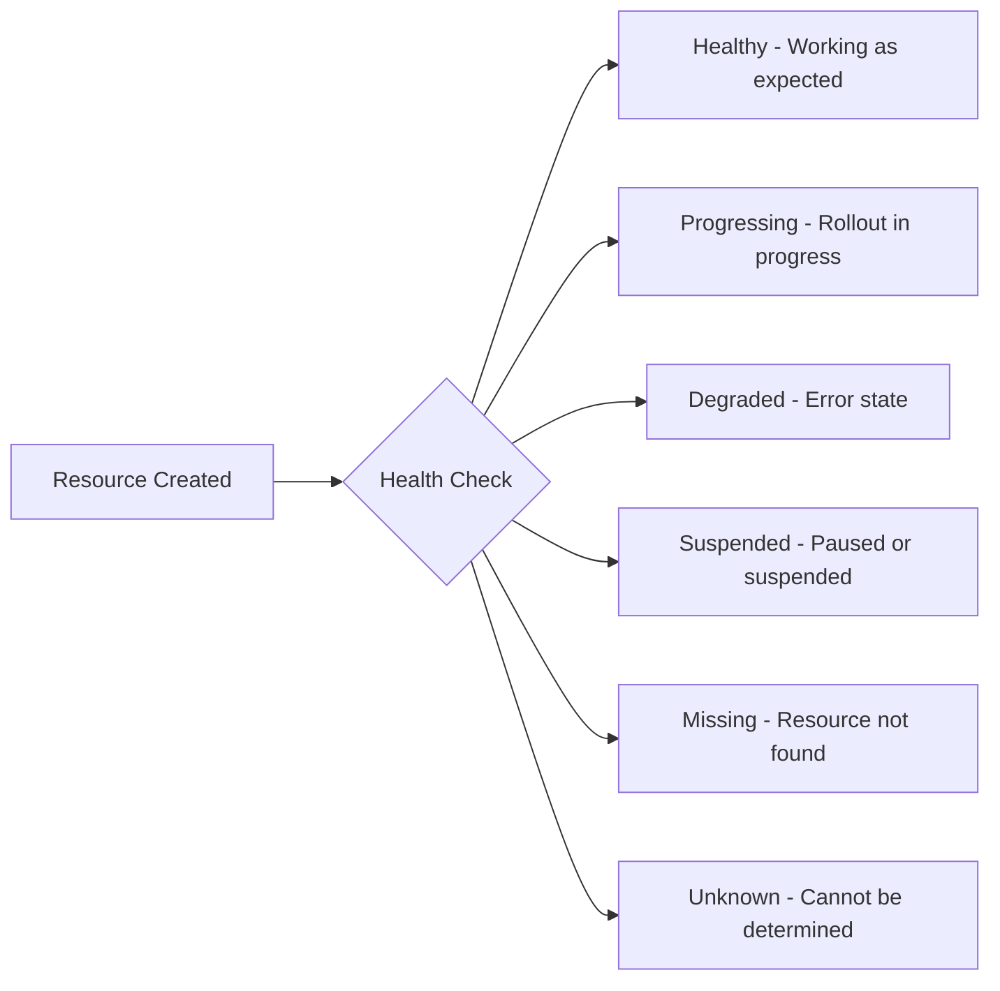
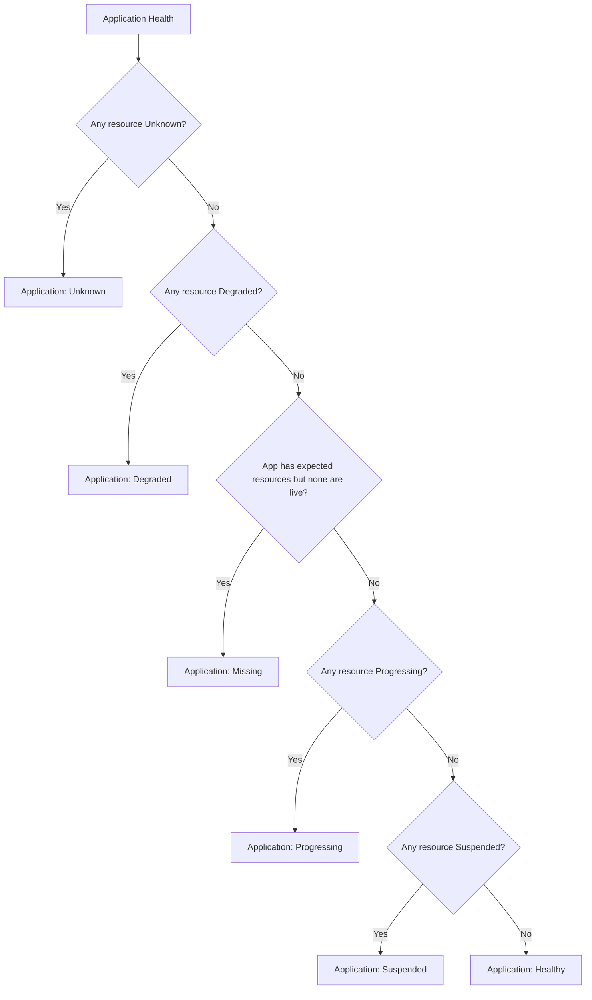

# How to Understand Built-in Health Checks in ArgoCD

Author: [nawazdhandala](https://www.github.com/nawazdhandala)

Tags: ArgoCD, GitOps, Kubernetes, Health Check, Monitoring

Description: Learn how ArgoCD built-in health checks work for standard Kubernetes resources including Deployments, StatefulSets, Services, Jobs, and more.

---

ArgoCD does not just tell you whether your application is synced with Git. It also tells you whether your application is healthy. The health status is separate from the sync status, and understanding the difference is critical for operating GitOps workflows. An application can be perfectly synced but unhealthy (all Pods are crashing), or out of sync but healthy (running an older version that works fine).

ArgoCD includes built-in health checks for several standard Kubernetes resource types. This guide explains what each health check evaluates, what the different health statuses mean, and how to interpret them.

## Health Status Values

ArgoCD uses six health status values:


```mermaid
flowchart LR
    A[Resource Created] --> B{Health Check}
    B --> C[Healthy - Working as expected]
    B --> D[Progressing - Rollout in progress]
    B --> E[Degraded - Error state]
    B --> F[Suspended - Paused or suspended]
    B --> G[Missing - Resource not found]
    B --> H[Unknown - Cannot be determined]
```

| Status | Meaning | Icon Color |
|--------|---------|------------|
| **Healthy** | Resource is operating correctly | Green |
| **Progressing** | Resource is not yet healthy but has not failed | Yellow |
| **Degraded** | Resource has failed or is in an error state | Red |
| **Suspended** | Resource is paused intentionally | Blue |
| **Missing** | Resource does not exist in the cluster | Yellow |
| **Unknown** | Health status cannot be determined | Grey |

## Application-Level Health

The overall Application health is determined by aggregating the health of its immediate child resources:


```mermaid
flowchart TD
    A[Application Health] --> B{Any resource Unknown?}
    B -->|Yes| C[Application: Unknown]
    B -->|No| D{Any resource Degraded?}
    D -->|Yes| E[Application: Degraded]
    D -->|No| F{App has expected resources but none are live?}
    F -->|Yes| G[Application: Missing]
    F -->|No| H{Any resource Progressing?}
    H -->|Yes| I[Application: Progressing]
    H -->|No| J{Any resource Suspended?}
    J -->|Yes| K[Application: Suspended]
    J -->|No| L[Application: Healthy]
```

The worst health status among immediate child resources becomes the Application's health status, using this order from most to least healthy: Healthy, Suspended, Progressing, Missing, Degraded, Unknown. Current ArgoCD also treats individual missing live resources as sync drift rather than always making the Application health Missing; an Application becomes Missing when it is expected to have resources but has no live resources. One Degraded Deployment makes the entire Application Degraded unless another child resource is Unknown.

## Deployment Health Check

ArgoCD evaluates Deployments by checking replica status:

**Healthy** when:
- `status.updatedReplicas` equals `spec.replicas`
- `status.availableReplicas` equals `status.updatedReplicas`
- No old ReplicaSets have running pods
- The Deployment generation matches the observed generation

**Progressing** when:
- Replicas are being updated (rolling update in progress)
- New pods are starting but not yet available
- The rollout has not exceeded `progressDeadlineSeconds`

**Degraded** when:
- The Deployment condition has reason `ProgressDeadlineExceeded`, which Kubernetes sets when the Deployment exceeds `progressDeadlineSeconds` (defaults to 600 seconds)

```bash
# Check what ArgoCD sees for Deployment health

kubectl get deployment my-app -o json | jq '{
  replicas: .spec.replicas,
  updatedReplicas: .status.updatedReplicas,
  availableReplicas: .status.availableReplicas,
  conditions: [.status.conditions[] | {type, status, reason}]
}'
```

**Key detail**: A paused Deployment (`spec.paused: true`) is reported as **Suspended**. A Deployment scaled to `spec.replicas: 0` can be reported as Healthy once the controller has observed the desired generation.

## StatefulSet Health Check

Similar to Deployments but also considers the update strategy:

**Healthy** when:
- `status.readyReplicas` equals `spec.replicas`
- For rolling updates without a partition, `status.currentRevision` equals `status.updateRevision`
- For a partitioned rolling update, enough pods have been updated for the configured partition
- For `OnDelete` updates, the StatefulSet has the expected ready pods

**Progressing** when:
- The StatefulSet controller has not observed the latest generation
- Not all desired pods are ready
- The `currentRevision` does not match `updateRevision`
- A partitioned rollout has not updated enough pods

**Degraded** when:
- ArgoCD's built-in StatefulSet health check does not normally emit Degraded; stuck rollouts usually remain Progressing unless you add a custom health check.

## DaemonSet Health Check

**Healthy** when:
- `status.updatedNumberScheduled` equals `status.desiredNumberScheduled`
- `status.numberAvailable` equals `status.desiredNumberScheduled`
- Or the DaemonSet uses the `OnDelete` update strategy and the controller has observed the latest generation

**Progressing** when:
- The DaemonSet controller has not observed the latest generation
- Nodes are being updated with new pod versions
- Some nodes still run the old pod version
- Updated pods are not yet available

**Degraded** when:
- ArgoCD's built-in DaemonSet health check does not normally emit Degraded; scheduling or availability problems usually appear as Progressing unless you add a custom health check.

## Service Health Check

Services are almost always **Healthy**. For `LoadBalancer` Services, ArgoCD reports **Progressing** until `status.loadBalancer.ingress` is populated. It does not verify that endpoints are available or that backend pods are running.

```yaml
# This Service will be Healthy even if no pods match the selector
apiVersion: v1
kind: Service
metadata:
  name: my-service
spec:
  selector:
    app: my-app  # No pods with this label? Still Healthy
  ports:
    - port: 80
```

If you need endpoint health checking, you will need a custom health check.

## Ingress Health Check

**Healthy** when:
- `status.loadBalancer.ingress` is populated

**Progressing** when:
- The load balancer is being provisioned (no address assigned yet)

## Job Health Check

**Healthy** when:
- The Job has condition `Complete`

**Progressing** when:
- The Job has not yet reached a terminal condition

**Degraded** when:
- The Job has condition `Failed: True`

**Suspended** when:
- The Job has condition `Suspended: True`

```bash
# Check Job status
kubectl get job my-job -o json | jq '{
  active: .status.active,
  succeeded: .status.succeeded,
  failed: .status.failed,
  conditions: .status.conditions
}'
```

## CronJob Health Check

CronJobs are typically **Healthy** if they have not been scheduled yet or if the last scheduled run completed successfully. ArgoCD reports a CronJob as **Degraded** when `status.lastSuccessfulTime` is older than `status.lastScheduleTime`. Current ArgoCD behavior reports suspended CronJobs and active CronJobs as Healthy with explanatory messages.

## Pod Health Check

**Healthy** when:
- `status.phase` is `Running` and the Pod is ready for `restartPolicy: Always`
- `status.phase` is `Succeeded`

**Progressing** when:
- `status.phase` is `Pending`
- Containers are being started
- `status.phase` is `Running` but the Pod is not yet ready for `restartPolicy: Always`
- A running Pod uses `restartPolicy: OnFailure` or `Never`

**Degraded** when:
- `status.phase` is `Failed`
- A `restartPolicy: Always` container is waiting with an error or backoff reason such as `CrashLoopBackOff` or `ImagePullBackOff`
- A running `restartPolicy: Always` Pod has a container with a previous termination

**Note**: ArgoCD typically does not directly track Pods as they are managed by higher-level controllers. Pods are usually assessed through their parent Deployment or StatefulSet.

## PersistentVolumeClaim Health Check

**Healthy** when:
- `status.phase` is `Bound`

**Progressing** when:
- `status.phase` is `Pending` (waiting for provisioning)

**Degraded** when:
- `status.phase` is `Lost`

## HorizontalPodAutoscaler Health Check

**Healthy** when:
- The HPA has an `AbleToScale` or `ScalingLimited` condition with status `True`

**Progressing** when:
- ArgoCD is waiting for autoscaling conditions

**Degraded** when:
- The HPA condition has `AbleToScale` with reason `FailedGetScale` or `FailedUpdateScale`
- The HPA condition has `ScalingActive` with reason `FailedGetResourceMetric` or `InvalidSelector`

## ReplicaSet Health Check

**Healthy** when:
- `status.availableReplicas` equals `spec.replicas`
- The ReplicaSet generation matches the observed generation

**Progressing** when:
- Replicas are being created
- The ReplicaSet controller has not observed the latest generation

**Degraded** when:
- The ReplicaSet has condition `ReplicaFailure: True`

## Namespace Health Check

Namespaces do not have a built-in ArgoCD health check. If you need namespace phase assessment, add a custom health check.

## ConfigMap and Secret Health Check

ConfigMaps and Secrets do not have built-in health checks. There is no way for ArgoCD to know if the data inside them is correct.

Resources Without Built-in Health Checks

For resources that ArgoCD does not have a built-in or configured health check for, ArgoCD does not calculate a resource health status. These resources do not make the Application unhealthy just because they exist. This includes:

- ServiceAccounts
- ClusterRoles and ClusterRoleBindings
- Roles and RoleBindings
- NetworkPolicies
- ResourceQuotas
- LimitRanges
- Custom Resources (CRDs) without a bundled or configured health check

If you need health assessment for these resources, you will need to write custom health checks. See [How to Write Custom Health Check Scripts in Lua](https://oneuptime.com/blog/post/2026-02-26-argocd-custom-health-check-lua/view).

## Interpreting Health Status in Practice

### Application Stuck in Progressing

If your application stays in Progressing for a long time:

```bash
# Find which resources are progressing
argocd app get my-app -o json | \
  jq '.status.resources[] | select(.health.status == "Progressing") | {kind, name, health}'

# Common causes:
# - Image pull taking too long
# - Pod scheduling issues (insufficient resources)
# - Readiness probe failing
# - PVC waiting for provisioning
```

### Application Shows Degraded

```bash
# Find degraded resources
argocd app get my-app -o json | \
  jq '.status.resources[] | select(.health.status == "Degraded") | {kind, name, health}'

# Check the specific resource for errors
kubectl describe deployment my-app -n production
kubectl get events -n production --sort-by='.lastTimestamp' | tail -20
```

### Understanding Progressing to Degraded Transition

Deployments transition from Progressing to Degraded when `progressDeadlineSeconds` is exceeded (default: 600 seconds / 10 minutes). If your deployments routinely take longer:

```yaml
apiVersion: apps/v1
kind: Deployment
metadata:
  name: my-large-app
spec:
  progressDeadlineSeconds: 1200  # Increase to 20 minutes
```

## Best Practices

1. **Set appropriate progressDeadlineSeconds** - Default 10 minutes may not be enough for large images or slow registries
2. **Configure readiness probes** - ArgoCD relies on Kubernetes readiness to determine Deployment health
3. **Watch for stuck Progressing** - An application permanently in Progressing usually indicates a misconfigured readiness probe
4. **Add custom health checks for CRDs** - No health assessment, or a generic bundled health check, is usually not enough for custom resources
5. **Use health checks for deployment gating** - ArgoCD sync hooks can wait for health before proceeding

For more on custom health checks, see [How to Write Custom Health Check Scripts in Lua](https://oneuptime.com/blog/post/2026-02-26-argocd-custom-health-check-lua/view) and [How to Configure Custom Health Checks for CRDs](https://oneuptime.com/blog/post/2026-02-26-argocd-health-checks-crds/view).
