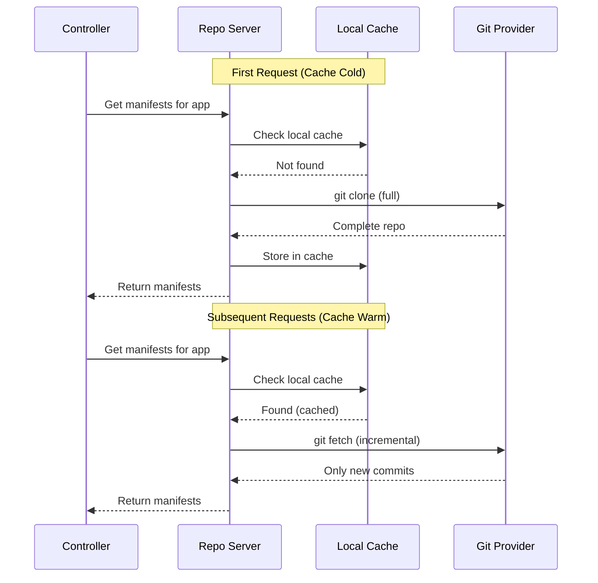

# How to Cache Git Repos Locally in ArgoCD

Author: [nawazdhandala](https://github.com/nawazdhandala)

Tags: ArgoCD, GitOps, Kubernetes, Git, Caching

Description: Learn how to configure and optimize ArgoCD's local Git repository caching to reduce clone times, lower network bandwidth, and improve reconciliation performance.

---

Every time ArgoCD reconciles an application, it needs the latest manifests from your Git repository. Without proper caching, this means a full clone on each cycle - an expensive operation that burns CPU, bandwidth, and time. ArgoCD's repo server has built-in Git caching, but it needs proper configuration to be effective. This guide covers how the cache works, how to configure it, and how to maximize cache efficiency.

## How ArgoCD Git Caching Works

The repo server maintains a local clone of each Git repository it works with. On the first request, it performs a full clone. On subsequent requests for the same repo, it performs a `git fetch` to get only the new changes.



The cache lives in the repo server's filesystem at `/tmp`. By default, this is an `emptyDir` volume that is lost on pod restart.

## Configuring Cache Expiration

The repo server caches both Git repositories and generated manifests. Configure how long they are kept:

```yaml
# argocd-cmd-params-cm ConfigMap
apiVersion: v1
kind: ConfigMap
metadata:
  name: argocd-cmd-params-cm
  namespace: argocd
data:
  # How long to keep cached repos (default: 24h)
  reposerver.repo.cache.expiration: "72h"

  # How long to keep cached manifests (default: 24h)
  # Manifests are cached per commit hash
  reposerver.default.cache.expiration: "48h"
```

Longer cache expiration means the repo server keeps repos longer before purging, reducing the chance of needing a full re-clone.

## Using Persistent Storage for Git Cache

The most impactful optimization is making the Git cache persistent so it survives pod restarts:

```yaml
apiVersion: v1
kind: PersistentVolumeClaim
metadata:
  name: argocd-repo-server-cache
  namespace: argocd
spec:
  accessModes:
    - ReadWriteOnce
  resources:
    requests:
      storage: 30Gi
  storageClassName: gp3  # Use SSD-backed storage
---
apiVersion: apps/v1
kind: Deployment
metadata:
  name: argocd-repo-server
  namespace: argocd
spec:
  template:
    spec:
      volumes:
        - name: tmp
          persistentVolumeClaim:
            claimName: argocd-repo-server-cache
      containers:
        - name: argocd-repo-server
          volumeMounts:
            - name: tmp
              mountPath: /tmp
```

### Sizing the Persistent Volume

Calculate the storage needed:

```
Total cache size = Sum of all repo sizes * 1.5 (overhead for git objects)
```

For example, with 50 repositories averaging 200MB each:
```
50 * 200MB * 1.5 = 15GB
```

Add a safety margin of 2x:
```
Recommended PV size = 30GB
```

### With Multiple Repo Server Replicas

When running multiple replicas, each needs its own cache. Use a StatefulSet or per-replica PVCs:

```yaml
apiVersion: apps/v1
kind: StatefulSet
metadata:
  name: argocd-repo-server
  namespace: argocd
spec:
  replicas: 3
  serviceName: argocd-repo-server
  volumeClaimTemplates:
    - metadata:
        name: cache
      spec:
        accessModes:
          - ReadWriteOnce
        resources:
          requests:
            storage: 30Gi
        storageClassName: gp3
  template:
    spec:
      containers:
        - name: argocd-repo-server
          volumeMounts:
            - name: cache
              mountPath: /tmp
```

Note: Switching from a Deployment to a StatefulSet requires deleting the existing Deployment first.

## Enabling Shallow Clones

Shallow clones reduce the initial clone size and time by downloading only the latest commit:

```yaml
# argocd-cmd-params-cm ConfigMap
apiVersion: v1
kind: ConfigMap
metadata:
  name: argocd-cmd-params-cm
  namespace: argocd
data:
  reposerver.git.shallow.clone: "true"
```

The impact depends on your repository's history depth:

| Repo History | Full Clone Size | Shallow Clone Size | Savings |
|-------------|----------------|-------------------|---------|
| 100 commits | 50MB | 30MB | 40% |
| 1,000 commits | 200MB | 40MB | 80% |
| 10,000 commits | 1GB | 50MB | 95% |

Shallow clones are especially effective for monorepos and repositories with large binary files in their history.

## Configuring Git Fetch Optimization

Tune how the repo server fetches updates from remote:

```yaml
apiVersion: apps/v1
kind: Deployment
metadata:
  name: argocd-repo-server
  namespace: argocd
spec:
  template:
    spec:
      containers:
        - name: argocd-repo-server
          env:
            # Increase git buffer for large repos
            - name: GIT_CONFIG_COUNT
              value: "3"
            - name: GIT_CONFIG_KEY_0
              value: "http.postBuffer"
            - name: GIT_CONFIG_VALUE_0
              value: "524288000"  # 500MB
            - name: GIT_CONFIG_KEY_1
              value: "core.compression"
            - name: GIT_CONFIG_VALUE_1
              value: "0"  # No compression (trade bandwidth for CPU)
            - name: GIT_CONFIG_KEY_2
              value: "http.lowSpeedLimit"
            - name: GIT_CONFIG_VALUE_2
              value: "0"  # Disable low speed timeout
```

## Cache Warm-Up After Restart

When a repo server pod restarts with an empty cache, the first reconciliation cycle is slow because every repository needs a full clone. To speed up warm-up:

### Pre-warm the Cache

Create a startup script that pre-clones frequently-used repositories:

```yaml
apiVersion: apps/v1
kind: Deployment
metadata:
  name: argocd-repo-server
  namespace: argocd
spec:
  template:
    spec:
      initContainers:
        - name: cache-warmup
          image: alpine/git
          command:
            - /bin/sh
            - -c
            - |
              echo "Warming up Git cache..."
              cd /tmp
              # Clone your most frequently used repos
              git clone --depth 1 https://github.com/org/repo1.git _org_repo1 || true
              git clone --depth 1 https://github.com/org/repo2.git _org_repo2 || true
              echo "Cache warm-up complete."
          volumeMounts:
            - name: tmp
              mountPath: /tmp
```

Note: The directory naming convention must match what ArgoCD's repo server uses internally. This init container approach is a simplified example; persistent volumes are the recommended solution.

## Monitoring Cache Effectiveness

### Check Cache Hit Rate

```bash
# Port-forward repo server metrics
kubectl port-forward svc/argocd-repo-server -n argocd 8084:8084 &

# Check Git request duration (lower = better caching)
curl -s http://localhost:8084/metrics | grep argocd_git_request_duration_seconds

# Check cache-related metrics
curl -s http://localhost:8084/metrics | grep cache
```

### Check Disk Usage

```bash
# Check cache size on the repo server
kubectl exec -n argocd deployment/argocd-repo-server -- du -sh /tmp

# Check individual repo cache sizes
kubectl exec -n argocd deployment/argocd-repo-server -- du -sh /tmp/*/ | sort -rh | head -10
```

### Alert on Low Disk Space

```yaml
groups:
  - name: argocd-cache
    rules:
      - alert: ArgocdRepoServerCacheFull
        expr: |
          kubelet_volume_stats_available_bytes{
            namespace="argocd",
            persistentvolumeclaim="argocd-repo-server-cache"
          }
          /
          kubelet_volume_stats_capacity_bytes{
            namespace="argocd",
            persistentvolumeclaim="argocd-repo-server-cache"
          }
          < 0.1
        for: 5m
        labels:
          severity: warning
        annotations:
          summary: "ArgoCD repo server cache is >90% full"
```

## Cache Cleanup

If the cache grows too large, you can clean it without losing application state:

```bash
# Delete all cached repos (they will be re-cloned on next reconciliation)
kubectl exec -n argocd deployment/argocd-repo-server -- rm -rf /tmp/_*

# Or restart the repo server (with emptyDir volumes, this clears everything)
kubectl rollout restart deployment argocd-repo-server -n argocd
```

With persistent volumes, only delete specific repo caches:

```bash
# List cached repos
kubectl exec -n argocd deployment/argocd-repo-server -- ls -la /tmp/ | grep -E "^d"

# Delete a specific repo's cache
kubectl exec -n argocd deployment/argocd-repo-server -- rm -rf /tmp/_github.com_org_large-repo
```

## Caching with Git Mirrors

For environments with strict network policies or air-gapped setups, use a local Git mirror:

```bash
# Set up a Gitea or GitLab instance as a mirror
# Configure ArgoCD to use the mirror
```

```yaml
# Point ArgoCD at the local mirror
apiVersion: v1
kind: Secret
metadata:
  name: local-mirror-creds
  namespace: argocd
  labels:
    argocd.argoproj.io/secret-type: repo-creds
stringData:
  type: git
  url: https://git-mirror.internal
  username: argocd
  password: "mirror-token"
```

This eliminates external Git requests entirely and provides unlimited "rate limit" capacity.

For monitoring your ArgoCD Git caching effectiveness and overall repo server performance, [OneUptime](https://oneuptime.com) provides infrastructure monitoring that helps you optimize your GitOps pipeline.

## Key Takeaways

- Use persistent volumes for the repo server cache to survive pod restarts
- Enable shallow clones to reduce initial clone size by up to 95%
- Increase cache expiration to 48h or 72h to avoid unnecessary re-clones
- Size your persistent volume to at least 2x the total size of all repositories
- Use StatefulSet for multiple repo server replicas to give each its own persistent cache
- Monitor cache disk usage and set alerts for low space
- Consider local Git mirrors for air-gapped environments or extreme rate limit concerns
- A warm cache turns expensive `git clone` operations into lightweight `git fetch` calls
