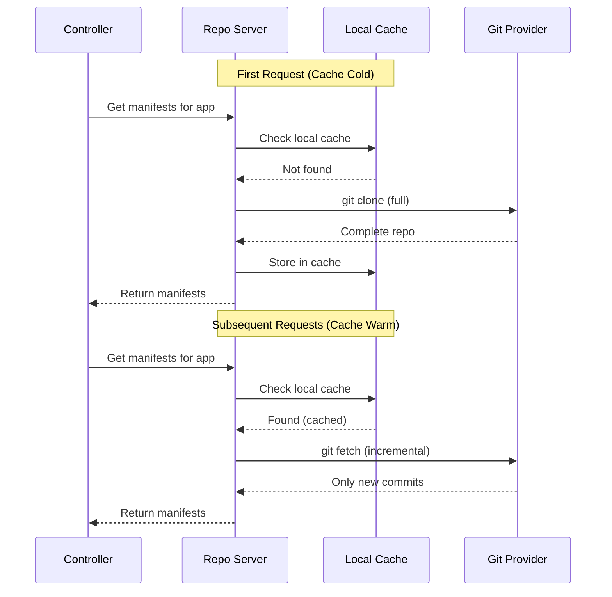

# How to Cache Git Repos Locally in ArgoCD

Author: [nawazdhandala](https://github.com/nawazdhandala)

Tags: ArgoCD, GitOps, Kubernetes, Git, Caching

Description: Learn how to configure and optimize ArgoCD's local Git repository caching to reduce clone times, lower network bandwidth, and improve reconciliation performance.

---

Every time ArgoCD reconciles an application, it needs the latest manifests from your Git repository. When the repo server's local cache is empty, this means cloning the repository - an expensive operation that burns CPU, bandwidth, and time. ArgoCD's repo server has built-in Git caching, but it needs proper configuration to be effective. This guide covers how the cache works, how to configure it, and how to maximize cache efficiency.

## How ArgoCD Git Caching Works

The repo server maintains a local clone of each Git repository it works with. On the first request, it performs a full clone. On subsequent requests for the same repo, it performs a `git fetch` to get only the new changes.


```mermaid
sequenceDiagram
    participant C as Controller
    participant RS as Repo Server
    participant LC as Local Cache
    participant Git as Git Provider

    Note over RS,LC: First Request (Cache Cold)
    C->>RS: Get manifests for app
    RS->>LC: Check local cache
    LC-->>RS: Not found
    RS->>Git: git clone (full)
    Git-->>RS: Complete repo
    RS->>LC: Store in cache
    RS-->>C: Return manifests

    Note over RS,LC: Subsequent Requests (Cache Warm)
    C->>RS: Get manifests for app
    RS->>LC: Check local cache
    LC-->>RS: Found (cached)
    RS->>Git: git fetch (incremental)
    Git-->>RS: Only new commits
    RS-->>C: Return manifests
```

The cache lives in the repo server's filesystem at `/tmp`. By default, this is an `emptyDir` volume that is lost on pod restart.

## Configuring Cache Expiration

The repo server caches repository state, revision metadata, and generated manifests. Configure how long those cache entries are kept:

```yaml
# argocd-cmd-params-cm ConfigMap

apiVersion: v1
kind: ConfigMap
metadata:
  name: argocd-cmd-params-cm
  namespace: argocd
data:
  # How long to keep cached repo state (default: 24h)
  reposerver.repo.cache.expiration: "72h"

  # How long to keep cached manifests (default: 24h)
  # Manifests are cached per commit hash
  reposerver.default.cache.expiration: "48h"
```

Longer cache expiration means the repo server keeps generated manifests and repository metadata longer before refreshing them. This can reduce repeated manifest generation, but ArgoCD still checks Git for changes during reconciliation.

## Using Persistent Storage for Git Cache

The most impactful optimization is making the Git cache persistent so it survives pod restarts:

```yaml
apiVersion: v1
kind: PersistentVolumeClaim
metadata:
  name: argocd-repo-server-cache
  namespace: argocd
spec:
  accessModes:
    - ReadWriteOnce
  resources:
    requests:
      storage: 30Gi
  storageClassName: gp3  # Use SSD-backed storage
---
apiVersion: apps/v1
kind: Deployment
metadata:
  name: argocd-repo-server
  namespace: argocd
spec:
  template:
    spec:
      volumes:
        - name: tmp
          persistentVolumeClaim:
            claimName: argocd-repo-server-cache
      containers:
        - name: argocd-repo-server
          volumeMounts:
            - name: tmp
              mountPath: /tmp
```

### Sizing the Persistent Volume

Calculate the storage needed:

```text
Total cache size = Sum of all repo sizes * 1.5 (overhead for git objects)
```

For example, with 50 repositories averaging 200MB each:
```text
50 * 200MB * 1.5 = 15GB
```

Add a safety margin of 2x:
```text
Recommended PV size = 30GB
```

### With Multiple Repo Server Replicas

When running multiple replicas, each needs its own cache. Use a StatefulSet or per-replica PVCs:

```yaml
apiVersion: apps/v1
kind: StatefulSet
metadata:
  name: argocd-repo-server
  namespace: argocd
spec:
  replicas: 3
  serviceName: argocd-repo-server
  volumeClaimTemplates:
    - metadata:
        name: cache
      spec:
        accessModes:
          - ReadWriteOnce
        resources:
          requests:
            storage: 30Gi
        storageClassName: gp3
  template:
    spec:
      containers:
        - name: argocd-repo-server
          volumeMounts:
            - name: cache
              mountPath: /tmp
```

Note: Switching from a Deployment to a StatefulSet requires deleting the existing Deployment first.

## Enabling Shallow Clones

Shallow clones reduce the initial clone size and time by downloading only the required commit. Configure this per repository with the `depth` repository option:

```yaml
apiVersion: v1
kind: Secret
metadata:
  name: my-repo
  namespace: argocd
  labels:
    argocd.argoproj.io/secret-type: repository
type: Opaque
stringData:
  type: git
  url: https://github.com/org/repo.git
  depth: "1"
```

You can also set it when adding the repository with the ArgoCD CLI:

```bash
argocd repo add https://github.com/org/repo.git --depth 1
```

The impact depends on your repository's history depth:

| Repo History | Full Clone Size | Shallow Clone Size | Savings |
|-------------|----------------|-------------------|---------|
| 100 commits | 50MB | 30MB | 40% |
| 1,000 commits | 200MB | 40MB | 80% |
| 10,000 commits | 1GB | 50MB | 95% |

The exact savings depend on the repository contents, but shallow clones are especially effective for repositories with large histories or large files in past revisions.

## Configuring Git Fetch Behavior

For specific Git HTTP transport issues, you can pass standard Git configuration through environment variables:

```yaml
apiVersion: apps/v1
kind: Deployment
metadata:
  name: argocd-repo-server
  namespace: argocd
spec:
  template:
    spec:
      containers:
        - name: argocd-repo-server
          env:
            - name: GIT_CONFIG_COUNT
              value: "2"
            - name: GIT_CONFIG_KEY_0
              value: "core.compression"
            - name: GIT_CONFIG_VALUE_0
              value: "0"  # No compression (trade bandwidth for CPU)
            - name: GIT_CONFIG_KEY_1
              value: "http.lowSpeedLimit"
            - name: GIT_CONFIG_VALUE_1
              value: "0"  # Disable Git's low-speed check
```

Avoid using `http.postBuffer` as a general large-repository fetch optimization. Git documents it as the buffer used when POSTing data to a remote over smart HTTP, so it is mainly relevant to push/proxy troubleshooting rather than normal fetch performance.

## Cache Warm-Up After Restart

When a repo server pod restarts with an empty cache, the first reconciliation cycle is slow because every repository needs to be cloned or updated again. Persistent volumes are the recommended solution because they let ArgoCD manage its own cache layout across restarts.

If you still need to warm the repo server after a restart, trigger refreshes through ArgoCD instead of pre-creating directories in `/tmp`, because the on-disk cache paths are internal implementation details:

```bash
argocd app list -o name | xargs -n1 argocd app get --refresh
```

This asks ArgoCD to refresh each application and lets the repo server populate its cache using its normal repository handling.

## Monitoring Cache Effectiveness

### Check Git Request Metrics

```bash
# Port-forward repo server metrics
kubectl port-forward svc/argocd-repo-server -n argocd 8084:8084 &

# Check Git request duration
curl -s http://localhost:8084/metrics | grep argocd_git_request_duration_seconds

# Check Git request counts by request type
curl -s http://localhost:8084/metrics | grep argocd_git_request_total
```

### Check Disk Usage

```bash
# Check cache size on the repo server
kubectl exec -n argocd deployment/argocd-repo-server -- du -sh /tmp

# Check individual directories under /tmp before deleting anything
kubectl exec -n argocd deployment/argocd-repo-server -- du -sh /tmp/*/ | sort -rh | head -10
```

### Alert on Low Disk Space

```yaml
groups:
  - name: argocd-cache
    rules:
      - alert: ArgocdRepoServerCacheFull
        expr: |
          kubelet_volume_stats_available_bytes{
            namespace="argocd",
            persistentvolumeclaim="argocd-repo-server-cache"
          }
          /
          kubelet_volume_stats_capacity_bytes{
            namespace="argocd",
            persistentvolumeclaim="argocd-repo-server-cache"
          }
          < 0.1
        for: 5m
        labels:
          severity: warning
        annotations:
          summary: "ArgoCD repo server cache is >90% full"
```

## Cache Cleanup

If the cache grows too large, you can clean it without losing application state:

```bash
# Restart the repo server (with emptyDir volumes, this clears the on-disk cache)
kubectl rollout restart deployment argocd-repo-server -n argocd
```

With persistent volumes, inspect `/tmp` and delete only directories you have verified are safe to remove:

```bash
# List directories under /tmp
kubectl exec -n argocd deployment/argocd-repo-server -- ls -la /tmp/ | grep -E "^d"

# Delete a verified cache directory
kubectl exec -n argocd deployment/argocd-repo-server -- rm -rf /tmp/<verified-cache-dir>
```

## Caching with Git Mirrors

For environments with strict network policies or air-gapped setups, use a local Git mirror:

```bash
# Set up a Gitea or GitLab instance as a mirror
# Configure Applications and repository entries to use the mirror URL
```

```yaml
# Add credentials for repositories served by the local mirror
apiVersion: v1
kind: Secret
metadata:
  name: local-mirror-creds
  namespace: argocd
  labels:
    argocd.argoproj.io/secret-type: repo-creds
stringData:
  type: git
  url: https://git-mirror.internal
  username: argocd
  password: "mirror-token"
```

When applications use the mirror URL, Git requests go to the local mirror instead of the upstream provider, which avoids upstream rate limits for ArgoCD reconciliation traffic.

For monitoring your ArgoCD Git caching effectiveness and overall repo server performance, [OneUptime](https://oneuptime.com) provides infrastructure monitoring that helps you optimize your GitOps pipeline.

## Key Takeaways

- Use persistent volumes for the repo server cache to survive pod restarts
- Enable shallow clones per repository to reduce initial clone size
- Increase cache expiration to 48h or 72h to reduce repeated manifest generation and metadata refreshes
- Size your persistent volume to at least 2x the total size of all repositories
- Use StatefulSet for multiple repo server replicas to give each its own persistent cache
- Monitor cache disk usage and set alerts for low space
- Consider local Git mirrors for air-gapped environments or extreme rate limit concerns
- A warm cache lets the repo server update existing local repositories with `git fetch` instead of cloning from scratch
