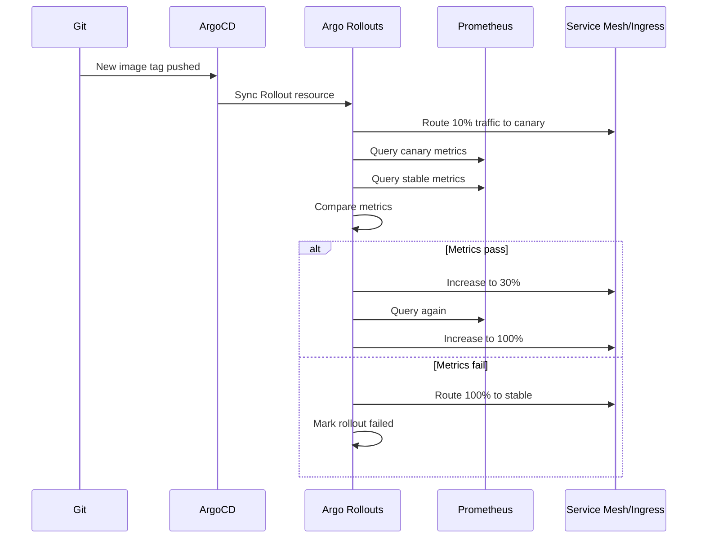

# How to Handle Canary Analysis with ArgoCD and Prometheus

Author: [nawazdhandala](https://github.com/nawazdhandala)

Tags: ArgoCD, GitOps, Kubernetes, Canary Deployment, Prometheus

Description: Learn how to implement automated canary analysis with ArgoCD and Prometheus using Argo Rollouts for data-driven deployment decisions based on real-time metrics.

---

Canary deployments let you test new code with a small percentage of production traffic before rolling out to everyone. But manual observation of canary health does not scale. You need automated analysis that compares canary metrics against the stable version and makes data-driven promotion or rollback decisions. ArgoCD combined with Argo Rollouts and Prometheus gives you exactly this.

This guide covers setting up automated canary analysis that uses Prometheus metrics to decide whether a deployment should proceed or roll back.

## How Canary Analysis Works



## Prerequisites

You need:

- ArgoCD installed
- Argo Rollouts controller installed
- Prometheus with your application metrics
- An ingress controller that supports traffic splitting (NGINX, Istio, Traefik)

## Step 1: Install Argo Rollouts via ArgoCD

```yaml
apiVersion: argoproj.io/v1alpha1
kind: Application
metadata:
  name: argo-rollouts
  namespace: argocd
spec:
  project: infrastructure
  source:
    repoURL: https://argoproj.github.io/argo-helm
    chart: argo-rollouts
    targetRevision: 2.35.0
    helm:
      values: |
        controller:
          resources:
            requests:
              cpu: "200m"
              memory: "256Mi"
        dashboard:
          enabled: true
  destination:
    server: https://kubernetes.default.svc
    namespace: argo-rollouts
  syncPolicy:
    automated:
      prune: true
      selfHeal: true
    syncOptions:
      - CreateNamespace=true
```

## Step 2: Define Analysis Templates

Analysis templates define the metrics to check and their success criteria:

```yaml
# analysis/error-rate-analysis.yaml
apiVersion: argoproj.io/v1alpha1
kind: AnalysisTemplate
metadata:
  name: error-rate-check
spec:
  args:
    - name: service-name
    - name: canary-hash
    - name: stable-hash
  metrics:
    - name: error-rate
      interval: 2m
      count: 5
      successCondition: result[0] < 0.05
      failureCondition: result[0] >= 0.10
      failureLimit: 3
      provider:
        prometheus:
          address: http://prometheus.monitoring:9090
          query: |
            sum(rate(http_requests_total{
              service="{{args.service-name}}",
              rollouts_pod_template_hash="{{args.canary-hash}}",
              status=~"5.."
            }[5m])) /
            sum(rate(http_requests_total{
              service="{{args.service-name}}",
              rollouts_pod_template_hash="{{args.canary-hash}}"
            }[5m]))
---
# analysis/latency-analysis.yaml
apiVersion: argoproj.io/v1alpha1
kind: AnalysisTemplate
metadata:
  name: latency-check
spec:
  args:
    - name: service-name
    - name: canary-hash
  metrics:
    - name: p99-latency
      interval: 2m
      count: 5
      successCondition: result[0] < 500
      failureCondition: result[0] >= 1000
      failureLimit: 2
      provider:
        prometheus:
          address: http://prometheus.monitoring:9090
          query: |
            histogram_quantile(0.99,
              sum(rate(http_request_duration_seconds_bucket{
                service="{{args.service-name}}",
                rollouts_pod_template_hash="{{args.canary-hash}}"
              }[5m])) by (le)
            ) * 1000
    - name: p50-latency
      interval: 2m
      count: 5
      successCondition: result[0] < 200
      failureLimit: 3
      provider:
        prometheus:
          address: http://prometheus.monitoring:9090
          query: |
            histogram_quantile(0.5,
              sum(rate(http_request_duration_seconds_bucket{
                service="{{args.service-name}}",
                rollouts_pod_template_hash="{{args.canary-hash}}"
              }[5m])) by (le)
            ) * 1000
---
# analysis/throughput-analysis.yaml
apiVersion: argoproj.io/v1alpha1
kind: AnalysisTemplate
metadata:
  name: throughput-check
spec:
  args:
    - name: service-name
    - name: canary-hash
    - name: stable-hash
  metrics:
    - name: throughput-comparison
      interval: 3m
      count: 3
      # Canary throughput should be at least 80% of stable
      successCondition: result[0] >= 0.8
      failureCondition: result[0] < 0.5
      failureLimit: 2
      provider:
        prometheus:
          address: http://prometheus.monitoring:9090
          query: |
            (
              sum(rate(http_requests_total{
                service="{{args.service-name}}",
                rollouts_pod_template_hash="{{args.canary-hash}}"
              }[5m]))
            ) / (
              sum(rate(http_requests_total{
                service="{{args.service-name}}",
                rollouts_pod_template_hash="{{args.stable-hash}}"
              }[5m]))
            )
```

Key concepts:

- `successCondition` - the metric must satisfy this for the check to pass
- `failureCondition` - if this is met, the check fails immediately without waiting for more samples
- `failureLimit` - how many consecutive failures before the analysis is considered failed
- `count` - total number of measurements to take
- `interval` - time between measurements

## Step 3: Define the Rollout

Create a Rollout resource that uses these analysis templates:

```yaml
# rollout.yaml
apiVersion: argoproj.io/v1alpha1
kind: Rollout
metadata:
  name: api-server
  labels:
    app: api-server
spec:
  replicas: 6
  revisionHistoryLimit: 5
  selector:
    matchLabels:
      app: api-server
  strategy:
    canary:
      canaryService: api-server-canary
      stableService: api-server-stable
      trafficRouting:
        nginx:
          stableIngress: api-server-ingress
      analysis:
        templates:
          - templateName: error-rate-check
          - templateName: latency-check
          - templateName: throughput-check
        startingStep: 1  # Start analysis after initial traffic shift
        args:
          - name: service-name
            value: api-server
          - name: canary-hash
            valueFrom:
              podTemplateHashValue: Latest
          - name: stable-hash
            valueFrom:
              podTemplateHashValue: Stable
      steps:
        - setWeight: 5
        - pause: { duration: 3m }  # Let metrics accumulate
        - setWeight: 15
        - pause: { duration: 5m }
        - setWeight: 30
        - pause: { duration: 5m }
        - setWeight: 50
        - pause: { duration: 5m }
        - setWeight: 80
        - pause: { duration: 5m }
      maxSurge: "25%"
      maxUnavailable: 0
  template:
    metadata:
      labels:
        app: api-server
    spec:
      containers:
        - name: api
          image: myregistry/api:v2.0.0
          ports:
            - containerPort: 8080
          readinessProbe:
            httpGet:
              path: /healthz
              port: 8080
            initialDelaySeconds: 10
            periodSeconds: 5
          resources:
            requests:
              cpu: "500m"
              memory: "512Mi"
```

## Step 4: Services and Ingress

Create the stable and canary services:

```yaml
# services.yaml
apiVersion: v1
kind: Service
metadata:
  name: api-server-stable
spec:
  selector:
    app: api-server
  ports:
    - port: 80
      targetPort: 8080
---
apiVersion: v1
kind: Service
metadata:
  name: api-server-canary
spec:
  selector:
    app: api-server
  ports:
    - port: 80
      targetPort: 8080
---
apiVersion: networking.k8s.io/v1
kind: Ingress
metadata:
  name: api-server-ingress
  annotations:
    nginx.ingress.kubernetes.io/canary: "true"
    nginx.ingress.kubernetes.io/canary-weight: "0"
spec:
  ingressClassName: nginx
  rules:
    - host: api.example.com
      http:
        paths:
          - path: /
            pathType: Prefix
            backend:
              service:
                name: api-server-stable
                port:
                  number: 80
```

## Step 5: ArgoCD Application

```yaml
apiVersion: argoproj.io/v1alpha1
kind: Application
metadata:
  name: api-server
  namespace: argocd
spec:
  project: production
  source:
    repoURL: https://github.com/myorg/api-server.git
    targetRevision: main
    path: k8s/production
  destination:
    server: https://kubernetes.default.svc
    namespace: api
  syncPolicy:
    automated:
      prune: true
      selfHeal: true
    syncOptions:
      - RespectIgnoreDifferences=true
  ignoreDifferences:
    - group: argoproj.io
      kind: Rollout
      jsonPointers:
        - /spec/strategy/canary/steps
        - /status
```

## Step 6: Custom Analysis with Business Metrics

Go beyond infrastructure metrics. Check business KPIs during canary:

```yaml
apiVersion: argoproj.io/v1alpha1
kind: AnalysisTemplate
metadata:
  name: business-metrics-check
spec:
  args:
    - name: canary-hash
  metrics:
    - name: conversion-rate
      interval: 5m
      count: 3
      # Conversion rate should not drop more than 10%
      successCondition: result[0] >= 0.9
      provider:
        prometheus:
          address: http://prometheus.monitoring:9090
          query: |
            (
              sum(rate(checkout_completed_total{
                rollouts_pod_template_hash="{{args.canary-hash}}"
              }[10m]))
              /
              sum(rate(add_to_cart_total{
                rollouts_pod_template_hash="{{args.canary-hash}}"
              }[10m]))
            ) / (
              sum(rate(checkout_completed_total{
                rollouts_pod_template_hash!="{{args.canary-hash}}"
              }[10m]))
              /
              sum(rate(add_to_cart_total{
                rollouts_pod_template_hash!="{{args.canary-hash}}"
              }[10m]))
            )
```

## Handling Analysis Failures

When analysis fails, Argo Rollouts automatically rolls back. You can configure notifications:

```yaml
apiVersion: argoproj.io/v1alpha1
kind: Rollout
metadata:
  name: api-server
  annotations:
    notifications.argoproj.io/subscribe.on-rollout-aborted.slack: deployment-alerts
```

With the notification controller configured, your team gets alerted whenever a canary is rolled back due to metric failures.

## Monitoring the Canary Process

Track canary deployment health in Prometheus:

```yaml
# Grafana dashboard query examples

# Current canary weight
argo_rollouts_info{name="api-server", namespace="api"}

# Analysis run status
argo_rollouts_analysis_run_info{rollout="api-server"}

# Time spent in canary
argo_rollouts_info{name="api-server"} * on() group_left timestamp(argo_rollouts_info{name="api-server"})
```

## Best Practices

1. **Start with conservative thresholds** - Set success conditions wider than you think necessary, then tighten them as you gain confidence.

2. **Allow enough time for metrics** - The initial pause after each weight change should be long enough for meaningful metric samples to accumulate.

3. **Use multiple metric types** - Check error rates, latency, throughput, and business metrics. A single metric can miss problems that others catch.

4. **Set both success and failure conditions** - `failureCondition` triggers immediate rollback for obvious failures, while `successCondition` handles gradual degradation.

5. **Test your analysis templates** - Run the Prometheus queries manually first to verify they return expected results.

6. **Monitor analysis runs** - Use the Argo Rollouts dashboard or CLI to watch analysis progress in real time.

Canary analysis with ArgoCD and Prometheus turns deployments from nerve-wracking events into data-driven decisions. Instead of watching dashboards and hoping nothing breaks, you let automated analysis make the call based on real traffic metrics.
