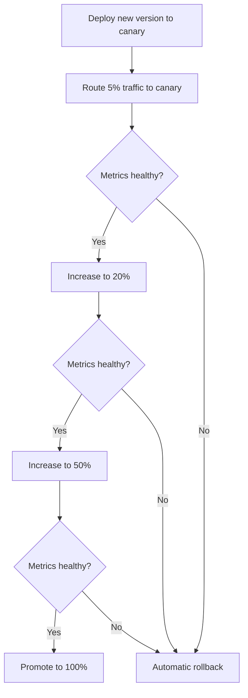

# How to Implement Canary Deployments with ArgoCD and Argo Rollouts

Author: [nawazdhandala](https://github.com/nawazdhandala)

Tags: ArgoCD, GitOps, Kubernetes, Argo Rollouts, Canary Deployment

Description: Learn how to implement canary deployments using ArgoCD and Argo Rollouts with gradual traffic shifting, analysis, and automated rollback.

---

Canary deployments let you roll out a new version to a small percentage of users first, monitor its behavior, and gradually increase traffic if everything looks good. If the canary shows problems, you roll back before most users are affected. This approach reduces blast radius significantly compared to full deployments.

In this guide, we will set up canary deployments using ArgoCD for GitOps state management and Argo Rollouts for the traffic shifting mechanics.

## How Canary Deployments Work

The basic idea is straightforward:



Argo Rollouts manages this process by maintaining two ReplicaSets and progressively shifting traffic between them.

## Prerequisites

You need ArgoCD and Argo Rollouts installed:

```bash
# Install Argo Rollouts
kubectl create namespace argo-rollouts
kubectl apply -n argo-rollouts -f https://github.com/argoproj/argo-rollouts/releases/latest/download/install.yaml

# Verify installation
kubectl get pods -n argo-rollouts
```

For traffic management, you also need one of these:
- NGINX Ingress Controller
- Istio service mesh
- AWS ALB Ingress Controller
- Traefik
- Or just basic Kubernetes replica-based traffic splitting (no ingress controller required)

## Basic Canary Rollout

The simplest canary setup uses replica-based traffic splitting. Traffic is distributed based on the ratio of pods between the canary and stable ReplicaSets:

```yaml
# rollout.yaml
apiVersion: argoproj.io/v1alpha1
kind: Rollout
metadata:
  name: my-app
  namespace: production
spec:
  replicas: 10
  revisionHistoryLimit: 3
  selector:
    matchLabels:
      app: my-app
  template:
    metadata:
      labels:
        app: my-app
    spec:
      containers:
        - name: my-app
          image: myorg/my-app:1.0.0
          ports:
            - containerPort: 8080
          resources:
            requests:
              memory: "128Mi"
              cpu: "100m"
          readinessProbe:
            httpGet:
              path: /health
              port: 8080
            initialDelaySeconds: 5
  strategy:
    canary:
      steps:
        # Step 1: Send 10% of traffic to canary
        - setWeight: 10
        # Step 2: Pause for manual validation or analysis
        - pause: {duration: 5m}
        # Step 3: Increase to 30%
        - setWeight: 30
        - pause: {duration: 5m}
        # Step 4: Increase to 60%
        - setWeight: 60
        - pause: {duration: 5m}
        # Step 5: Full promotion happens automatically after last step
```

## Canary with NGINX Traffic Management

For precise traffic splitting (not just replica-based), use NGINX Ingress:

```yaml
# rollout.yaml with NGINX traffic routing
apiVersion: argoproj.io/v1alpha1
kind: Rollout
metadata:
  name: my-app
  namespace: production
spec:
  replicas: 5
  selector:
    matchLabels:
      app: my-app
  template:
    metadata:
      labels:
        app: my-app
    spec:
      containers:
        - name: my-app
          image: myorg/my-app:1.0.0
          ports:
            - containerPort: 8080
  strategy:
    canary:
      # Reference to the stable Service
      stableService: my-app-stable
      # Reference to the canary Service
      canaryService: my-app-canary
      trafficRouting:
        nginx:
          # Reference to the Ingress
          stableIngress: my-app-ingress
      steps:
        - setWeight: 5
        - pause: {duration: 2m}
        - setWeight: 20
        - pause: {duration: 5m}
        - setWeight: 50
        - pause: {duration: 5m}
        - setWeight: 80
        - pause: {duration: 2m}
---
# services.yaml
apiVersion: v1
kind: Service
metadata:
  name: my-app-stable
spec:
  selector:
    app: my-app
  ports:
    - port: 80
      targetPort: 8080
---
apiVersion: v1
kind: Service
metadata:
  name: my-app-canary
spec:
  selector:
    app: my-app
  ports:
    - port: 80
      targetPort: 8080
---
# ingress.yaml
apiVersion: networking.k8s.io/v1
kind: Ingress
metadata:
  name: my-app-ingress
  annotations:
    kubernetes.io/ingress.class: nginx
spec:
  rules:
    - host: my-app.example.com
      http:
        paths:
          - path: /
            pathType: Prefix
            backend:
              service:
                name: my-app-stable
                port:
                  number: 80
```

Argo Rollouts will automatically create a canary Ingress with the appropriate annotations for traffic splitting.

## Adding Automated Analysis

The real power of canary deployments comes from automated analysis. Instead of manually checking if the canary is healthy, define metrics-based checks:

```yaml
# analysis-template.yaml
apiVersion: argoproj.io/v1alpha1
kind: AnalysisTemplate
metadata:
  name: canary-analysis
  namespace: production
spec:
  args:
    - name: canary-hash
  metrics:
    # Check that error rate stays below 1%
    - name: error-rate
      interval: 30s
      count: 10
      failureLimit: 3
      successCondition: result[0] <= 0.01
      provider:
        prometheus:
          address: http://prometheus.monitoring:9090
          query: |
            sum(rate(http_requests_total{app="my-app",rollouts_pod_template_hash="{{args.canary-hash}}",status=~"5.."}[2m]))
            /
            sum(rate(http_requests_total{app="my-app",rollouts_pod_template_hash="{{args.canary-hash}}"}[2m]))
    # Check that p99 latency stays below 500ms
    - name: latency-p99
      interval: 30s
      count: 10
      failureLimit: 3
      successCondition: result[0] < 500
      provider:
        prometheus:
          address: http://prometheus.monitoring:9090
          query: |
            histogram_quantile(0.99, sum(rate(http_request_duration_milliseconds_bucket{app="my-app",rollouts_pod_template_hash="{{args.canary-hash}}"}[2m])) by (le))
```

Reference the analysis in your Rollout:

```yaml
strategy:
  canary:
    steps:
      - setWeight: 10
      - pause: {duration: 2m}
      # Run analysis during the canary phase
      - analysis:
          templates:
            - templateName: canary-analysis
          args:
            - name: canary-hash
              valueFrom:
                podTemplateHashValue: Latest
      - setWeight: 30
      - pause: {duration: 5m}
      - setWeight: 60
      - pause: {duration: 5m}
```

If the analysis fails, Argo Rollouts automatically rolls back the canary.

## ArgoCD Application Configuration

Wrap the Rollout in an ArgoCD Application:

```yaml
apiVersion: argoproj.io/v1alpha1
kind: Application
metadata:
  name: my-app-production
  namespace: argocd
spec:
  project: default
  source:
    repoURL: https://github.com/myorg/my-manifests.git
    targetRevision: main
    path: production/my-app
  destination:
    server: https://kubernetes.default.svc
    namespace: production
  syncPolicy:
    automated:
      prune: true
      selfHeal: true
```

## Monitoring a Canary in Progress

Track the canary progress:

```bash
# Watch the rollout in real time
kubectl argo rollouts get rollout my-app -n production --watch

# Check current step
kubectl argo rollouts status my-app -n production

# View the canary weight
kubectl get rollout my-app -n production -o jsonpath='{.status.currentStepIndex}'
```

In the ArgoCD UI, the Rollout resource will show as "Progressing" during the canary process.

## Manual Intervention

You can manually promote or abort a canary:

```bash
# Skip the current pause and move to the next step
kubectl argo rollouts promote my-app -n production

# Skip all remaining steps and promote fully
kubectl argo rollouts promote my-app -n production --full

# Abort the canary and roll back
kubectl argo rollouts abort my-app -n production

# Retry after an abort
kubectl argo rollouts retry rollout my-app -n production
```

## Canary with Istio Traffic Management

For Istio-based traffic routing:

```yaml
strategy:
  canary:
    stableService: my-app-stable
    canaryService: my-app-canary
    trafficRouting:
      istio:
        virtualService:
          name: my-app-vsvc
          routes:
            - primary
    steps:
      - setWeight: 5
      - pause: {duration: 2m}
      - setWeight: 25
      - pause: {duration: 5m}
      - setWeight: 50
      - pause: {duration: 5m}
```

## Summary

Canary deployments with ArgoCD and Argo Rollouts give you a controlled, metrics-driven release process. Define canary steps with traffic weights and pause durations, add AnalysisTemplates for automated health validation, and let ArgoCD manage the desired state through Git. The canary approach is ideal when you want gradual exposure and automated rollback based on real production metrics. For instant full-swap deployments, consider [blue-green deployments](https://oneuptime.com/blog/post/2026-02-26-argocd-blue-green-deployments/view) instead.
