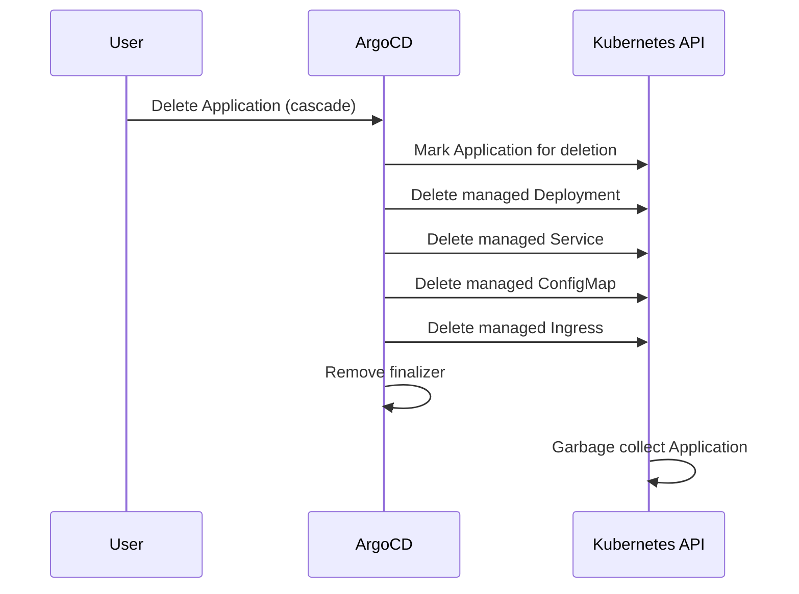

# How to Use Cascade Delete in ArgoCD

Author: [nawazdhandala](https://github.com/nawazdhandala)

Tags: ArgoCD, GitOps, Kubernetes, Application Management, Resource Cleanup

Description: Learn how cascade delete works in ArgoCD to remove applications and all their managed Kubernetes resources, including foreground and background deletion strategies.

---

Cascade delete in ArgoCD removes both the Application custom resource and every Kubernetes resource it manages. When you deploy a service through ArgoCD, that application might manage Deployments, Services, ConfigMaps, Secrets, Ingresses, and more. Cascade delete ensures all of those go away when you delete the application.

This is the behavior most people expect when they say "delete my application," but understanding exactly how it works, the propagation policies available, and edge cases that can trip you up is critical for production use.

## How cascade delete works internally

When you trigger a cascade delete, ArgoCD follows this sequence:

1. ArgoCD receives the delete request
2. It checks for the `resources-finalizer.argocd.argoproj.io` finalizer on the Application
3. If the finalizer is present, ArgoCD identifies all resources it tracks for that application
4. ArgoCD deletes each managed resource from the cluster
5. Once all resources are deleted (or deletion is initiated), ArgoCD removes the finalizer
6. Kubernetes then garbage-collects the Application resource itself



## Setting up cascade delete with finalizers

Cascade delete only works when the correct finalizer is present on the Application resource. There are two options:

### Foreground cascade delete

```yaml
apiVersion: argoproj.io/v1alpha1
kind: Application
metadata:
  name: web-frontend
  namespace: argocd
  finalizers:
    # Foreground: ArgoCD waits for all resources to be fully deleted
    - resources-finalizer.argocd.argoproj.io
spec:
  project: default
  source:
    repoURL: https://github.com/myorg/web-frontend.git
    targetRevision: main
    path: manifests
  destination:
    server: https://kubernetes.default.svc
    namespace: web-frontend
```

With foreground deletion, ArgoCD waits until each resource is confirmed deleted before removing the finalizer. This means the Application stays in a "Deleting" state until all resources are gone.

### Background cascade delete

```yaml
apiVersion: argoproj.io/v1alpha1
kind: Application
metadata:
  name: web-frontend
  namespace: argocd
  finalizers:
    # Background: ArgoCD initiates deletion and moves on
    - resources-finalizer.argocd.argoproj.io/background
spec:
  project: default
  source:
    repoURL: https://github.com/myorg/web-frontend.git
    targetRevision: main
    path: manifests
  destination:
    server: https://kubernetes.default.svc
    namespace: web-frontend
```

Background deletion is faster because ArgoCD sends delete requests for all resources and immediately removes the finalizer. The Application disappears quickly, but resource cleanup happens asynchronously in Kubernetes.

## Triggering cascade delete from the CLI

```bash
# Default behavior when finalizer is present - cascade delete
argocd app delete web-frontend

# Explicitly request cascade delete
argocd app delete web-frontend --cascade

# Cascade with propagation policy control
argocd app delete web-frontend --cascade --propagation-policy foreground

# Available propagation policies:
# foreground - parent waits for children to be deleted first
# background - parent is deleted immediately, children are garbage collected
# orphan     - children are NOT deleted (despite cascade flag)
argocd app delete web-frontend --cascade --propagation-policy background
```

## Propagation policies explained

The propagation policy controls how Kubernetes garbage collection handles the deletion of resources that own other resources (like Deployments owning ReplicaSets which own Pods):

**Foreground propagation:**
```bash
argocd app delete web-frontend --cascade --propagation-policy foreground
```
Kubernetes deletes child resources (Pods) before parent resources (ReplicaSets, Deployments). This ensures a clean, ordered teardown but takes longer.

**Background propagation:**
```bash
argocd app delete web-frontend --cascade --propagation-policy background
```
Kubernetes deletes parent resources immediately and schedules child resources for deletion asynchronously. Faster but the order is not guaranteed.

**Orphan propagation (careful with this one):**
```bash
argocd app delete web-frontend --cascade --propagation-policy orphan
```
This seems contradictory - cascade is on but orphan propagation means Kubernetes will not garbage-collect child resources. The ArgoCD-managed resources themselves get deleted, but any sub-resources they own may be left behind.

## Cascade delete via the UI

In the ArgoCD web interface:

1. Open the application you want to delete
2. Click **DELETE** in the top toolbar
3. Select **Foreground** for cascade deletion
4. Type the application name to confirm
5. Click **OK**

The UI defaults to foreground cascade deletion, which is the safest option for most cases.

## Cascade delete in declarative setups

When using app-of-apps pattern, cascade delete has additional implications:

```yaml
# Parent application (app-of-apps)
apiVersion: argoproj.io/v1alpha1
kind: Application
metadata:
  name: platform-apps
  namespace: argocd
  finalizers:
    - resources-finalizer.argocd.argoproj.io
spec:
  project: default
  source:
    repoURL: https://github.com/myorg/platform.git
    targetRevision: main
    path: apps
  destination:
    server: https://kubernetes.default.svc
    namespace: argocd
  syncPolicy:
    automated:
      prune: true  # When child app YAML is removed from Git, the child Application is deleted
```

When prune is enabled and you remove a child application manifest from Git, the parent application will delete the child Application resource. If the child also has cascade finalizers, this triggers a full cascade - deleting the child application AND all its managed resources.

```yaml
# Child application (apps/web-frontend.yaml)
apiVersion: argoproj.io/v1alpha1
kind: Application
metadata:
  name: web-frontend
  namespace: argocd
  finalizers:
    - resources-finalizer.argocd.argoproj.io  # Cascade when this child is deleted
spec:
  project: default
  source:
    repoURL: https://github.com/myorg/web-frontend.git
    targetRevision: main
    path: manifests
  destination:
    server: https://kubernetes.default.svc
    namespace: web-frontend
```

## Verifying cascade delete completion

After triggering a cascade delete, verify everything was cleaned up:

```bash
# Check the application is gone
argocd app list | grep web-frontend

# Check that managed resources are removed
kubectl get all -n web-frontend

# Check for any lingering resources (PVCs, ConfigMaps, Secrets)
kubectl get pvc,configmap,secret -n web-frontend

# Check for resources in other namespaces if the app was cluster-scoped
kubectl get clusterrolebinding -l app.kubernetes.io/instance=web-frontend
```

## When cascade delete gets stuck

If cascade delete hangs, it is usually because one of the managed resources has its own finalizer preventing deletion:

```bash
# Find resources stuck in Terminating state
kubectl get all -n web-frontend --field-selector=metadata.deletionTimestamp!=

# Check which finalizers are blocking
kubectl get pod stuck-pod -n web-frontend -o jsonpath='{.metadata.finalizers}'
```

For a deeper look at troubleshooting stuck deletions, see the guide on [handling stuck application deletion](https://oneuptime.com/blog/post/2026-02-26-argocd-stuck-application-deletion/view).

## Cascade delete with PersistentVolumeClaims

One important caveat: cascade delete will remove PVCs if they are managed by ArgoCD. This means your persistent data is at risk:

```bash
# Check if PVCs are tracked by ArgoCD before deleting
argocd app resources web-frontend | grep PersistentVolumeClaim
```

If you need to preserve data, either remove PVCs from ArgoCD management before deletion or use non-cascade delete. For more on this topic, see the post on [PVC retention after application deletion](https://oneuptime.com/blog/post/2026-02-26-argocd-pvc-retention-after-deletion/view).

## Summary

Cascade delete in ArgoCD is the standard way to fully clean up an application and all its resources. Use foreground propagation for ordered cleanup in production, background propagation when speed matters more than order, and always verify that deletion completed successfully. Pay special attention to cascade behavior in app-of-apps setups where one deletion can trigger a chain of cascade deletes across multiple applications.
