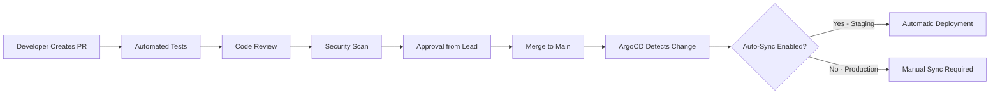

# How to Implement Change Approval Workflows with ArgoCD

Author: [nawazdhandala](https://github.com/nawazdhandala)

Tags: ArgoCD, GitOps, Kubernetes, Change Management, Compliance

Description: Learn how to implement change approval workflows in ArgoCD using sync windows, manual sync policies, Git-based approvals, and integration with ITSM tools.

---

In enterprise environments, you cannot just push to main and have changes automatically roll out to production. Change advisory boards, approval processes, and maintenance windows are a reality. The challenge is implementing these controls without sacrificing the speed and reliability that GitOps provides.

ArgoCD offers several mechanisms for implementing change approval workflows. In this guide, I will show you how to combine Git-based approvals, ArgoCD sync windows, manual sync policies, and ITSM integrations to build a compliant change management process.

## The GitOps Approval Model

In a traditional deployment pipeline, approval happens between the "build" and "deploy" stages. In GitOps, the approval happens at the Git level. A pull request review IS the change approval. The merge to the target branch IS the authorization to deploy.



## Strategy 1: Manual Sync for Production

The simplest approval mechanism is disabling auto-sync for production applications. Changes appear as "OutOfSync" in ArgoCD but are not applied until someone manually triggers a sync.

```yaml
# production-app.yaml
apiVersion: argoproj.io/v1alpha1
kind: Application
metadata:
  name: api-production
  namespace: argocd
spec:
  project: production
  source:
    repoURL: https://github.com/myorg/gitops.git
    path: apps/production/api
    targetRevision: main
  destination:
    server: https://kubernetes.default.svc
    namespace: production
  # No automated sync policy - requires manual approval
  syncPolicy:
    syncOptions:
      - CreateNamespace=false
      - PrunePropagationPolicy=foreground
```

With this configuration, after code is merged and ArgoCD detects the change, an operator must explicitly click "Sync" in the UI or run `argocd app sync api-production` to deploy.

## Strategy 2: Sync Windows

Sync windows restrict when ArgoCD can sync applications. This is useful for implementing maintenance windows.

```yaml
# argocd-project.yaml
apiVersion: argoproj.io/v1alpha1
kind: AppProject
metadata:
  name: production
  namespace: argocd
spec:
  description: Production environment with controlled sync windows
  syncWindows:
    # Allow syncs only during business hours on weekdays
    - kind: allow
      schedule: "0 9 * * 1-5"  # Monday-Friday at 9 AM
      duration: 8h              # Until 5 PM
      applications:
        - "*"
      namespaces:
        - production
      clusters:
        - https://kubernetes.default.svc
    # Deny syncs during end-of-quarter freeze
    - kind: deny
      schedule: "0 0 25 3,6,9,12 *"  # 25th of quarter-end months
      duration: 168h                   # 7-day freeze
      applications:
        - "*"
      namespaces:
        - production
    # Allow emergency syncs with manual override
    - kind: allow
      schedule: "* * * * *"  # Always
      duration: 24h
      applications:
        - "*"
      manualSync: true  # Only manual syncs allowed outside windows
  sourceRepos:
    - https://github.com/myorg/*
  destinations:
    - namespace: production
      server: https://kubernetes.default.svc
```

## Strategy 3: Git Branch Protection as Approval Gate

Configure your Git repository so that merges to the production branch require specific approvals.

```yaml
# GitHub branch protection (conceptual - configured in GitHub UI)
# For the 'main' branch:
#   - Require pull request reviews: 2 approvers
#   - Require review from code owners
#   - Require signed commits
#   - Require status checks: tests, security-scan, policy-check
#   - Restrict who can push: release-managers team only
```

Create a CODEOWNERS file to require approval from specific teams.

```
# CODEOWNERS
# Production changes require platform team approval
apps/production/ @myorg/platform-team @myorg/sre-team

# Staging changes require tech lead approval
apps/staging/ @myorg/tech-leads

# Infrastructure changes require DevOps approval
infrastructure/ @myorg/devops-team
```

## Strategy 4: ArgoCD RBAC for Sync Authorization

Use ArgoCD's RBAC system to control who can trigger syncs.

```csv
# argocd-rbac-cm.yaml
apiVersion: v1
kind: ConfigMap
metadata:
  name: argocd-rbac-cm
  namespace: argocd
data:
  policy.csv: |
    # Developers can view all apps but not sync production
    p, role:developer, applications, get, */*, allow
    p, role:developer, applications, sync, staging/*, allow
    p, role:developer, applications, sync, development/*, allow

    # Release managers can sync production
    p, role:release-manager, applications, get, */*, allow
    p, role:release-manager, applications, sync, */*, allow
    p, role:release-manager, applications, override, */*, allow

    # SRE team has full access
    p, role:sre, applications, *, */*, allow

    # Map SSO groups to ArgoCD roles
    g, sso-group:developers, role:developer
    g, sso-group:release-managers, role:release-manager
    g, sso-group:sre, role:sre
  policy.default: role:developer
```

For more on ArgoCD RBAC configuration, see our guide on [configuring RBAC policies in ArgoCD](https://oneuptime.com/blog/post/2026-01-25-rbac-policies-argocd/view).

## Strategy 5: Integration with ITSM Tools

For organizations using ServiceNow, Jira Service Management, or similar ITSM tools, integrate the change request process with ArgoCD.

```yaml
# pre-sync-change-validation.yaml
apiVersion: batch/v1
kind: Job
metadata:
  name: validate-change-request
  annotations:
    argocd.argoproj.io/hook: PreSync
    argocd.argoproj.io/hook-delete-policy: HookSucceeded
spec:
  template:
    spec:
      containers:
        - name: change-validator
          image: python:3.11-slim
          command:
            - python
            - -c
            - |
              import os
              import requests
              import sys
              import json

              # Check for approved change request
              servicenow_url = os.environ['SERVICENOW_URL']
              app_name = os.environ.get('APP_NAME', 'unknown')

              # Query ServiceNow for approved change requests
              response = requests.get(
                  f"{servicenow_url}/api/now/table/change_request",
                  params={
                      "sysparm_query": f"cmdb_ci.name={app_name}^state=scheduled^approval=approved",
                      "sysparm_limit": 1
                  },
                  auth=(os.environ['SN_USER'], os.environ['SN_PASS']),
                  headers={"Accept": "application/json"}
              )

              result = response.json()
              if result.get('result'):
                  print(f"Approved change request found: {result['result'][0]['number']}")
                  sys.exit(0)
              else:
                  print("ERROR: No approved change request found. Sync blocked.")
                  sys.exit(1)
          env:
            - name: SERVICENOW_URL
              valueFrom:
                secretKeyRef:
                  name: servicenow-creds
                  key: url
            - name: SN_USER
              valueFrom:
                secretKeyRef:
                  name: servicenow-creds
                  key: username
            - name: SN_PASS
              valueFrom:
                secretKeyRef:
                  name: servicenow-creds
                  key: password
            - name: APP_NAME
              value: "production-api"
      restartPolicy: Never
```

## Strategy 6: Two-Person Rule with ArgoCD

For high-security environments, implement a two-person rule where one person commits the change and a different person approves the sync.

Enforce this at the Git level through branch protection requiring reviews from someone other than the author, and at the ArgoCD level by mapping RBAC so that the person who merged the PR cannot also sync.

```yaml
# Use a webhook to check the sync initiator
# differs from the last commit author
apiVersion: batch/v1
kind: Job
metadata:
  name: two-person-check
  annotations:
    argocd.argoproj.io/hook: PreSync
    argocd.argoproj.io/hook-delete-policy: HookSucceeded
spec:
  template:
    spec:
      containers:
        - name: checker
          image: bitnami/git:latest
          command:
            - /bin/sh
            - -c
            - |
              # Get the last commit author
              COMMIT_AUTHOR=$(git log -1 --format='%ae' HEAD)

              # Get the ArgoCD sync initiator from the annotation
              SYNC_INITIATOR="${ARGOCD_APP_SYNC_INITIATOR}"

              if [ "$COMMIT_AUTHOR" = "$SYNC_INITIATOR" ]; then
                echo "ERROR: Same person cannot commit and approve deployment"
                exit 1
              fi
              echo "Two-person rule satisfied: committed by $COMMIT_AUTHOR, synced by $SYNC_INITIATOR"
      restartPolicy: Never
```

## Emergency Change Process

Even with strict approval workflows, you need an escape valve for emergencies.

```yaml
# Emergency sync window - always allows manual sync
syncWindows:
  - kind: allow
    schedule: "* * * * *"
    duration: 24h
    applications:
      - "*"
    manualSync: true
```

Combine this with a notification that alerts leadership when emergency syncs occur outside normal windows.

```yaml
template.emergency-sync-alert: |
  message: |
    EMERGENCY SYNC: {{.app.metadata.name}} was synced outside the normal
    change window by {{.app.status.operationState.operation.initiatedBy.username}}
    at {{.app.status.operationState.startedAt}}.
    Please create a retroactive change request.
```

## Conclusion

Change approval workflows in ArgoCD are about layering controls. Git branch protection provides the first gate with pull request reviews. ArgoCD RBAC controls who can trigger syncs. Sync windows restrict when syncs can happen. Pre-sync hooks can validate external approvals from ITSM tools. Together, these create a comprehensive change management process that satisfies compliance requirements while preserving the speed and reliability of GitOps.
