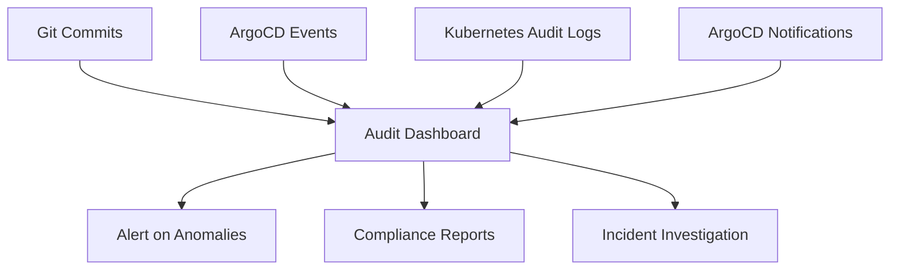

# How to Implement Change Auditing with GitOps

Author: [nawazdhandala](https://github.com/nawazdhandala)

Tags: ArgoCD, GitOps, Kubernetes, Auditing, Compliance

Description: Learn how to implement comprehensive change auditing in GitOps workflows with ArgoCD, using Git history, ArgoCD events, and external audit tools for full deployment traceability.

---

One of the strongest selling points of GitOps is built-in auditing. Every change to your cluster starts as a Git commit, which means you have a complete, immutable record of who changed what, when, and why. But getting real value from this audit trail requires intentional design.

This guide covers how to build a comprehensive change auditing system using ArgoCD and GitOps principles.

## Git as Your Audit Log

In a GitOps workflow, Git is your primary audit trail. Every deployment change is a commit with:

- **Who:** The commit author and PR approver
- **What:** The diff showing exactly what changed
- **When:** The commit timestamp
- **Why:** The commit message and PR description

To make this audit trail useful, enforce discipline around commits:

```bash
# Good commit message - clear what changed and why
git commit -m "Increase backend-api replicas from 3 to 5 for holiday traffic

Approved by: @sre-lead
Ticket: INFRA-1234"

# Bad commit message - useless for auditing
git commit -m "update deployment"
```

### Enforce Signed Commits

For compliance, require GPG-signed commits so you can verify the identity of who made each change:

```bash
# Configure Git to sign commits
git config --global commit.gpgsign true
git config --global user.signingkey YOUR_GPG_KEY_ID
```

Configure ArgoCD to verify commit signatures at the project level:

```yaml
apiVersion: argoproj.io/v1alpha1
kind: AppProject
metadata:
  name: production
  namespace: argocd
spec:
  signatureKeys:
    - keyID: "ABCD1234EFGH5678"
    - keyID: "IJKL9012MNOP3456"
  sourceRepos:
    - "https://github.com/myorg/config-repo.git"
  destinations:
    - namespace: "*"
      server: "https://kubernetes.default.svc"
```

## ArgoCD Audit Events

Beyond Git, ArgoCD itself produces audit events for every operation. These include:

- Application creation and deletion
- Sync operations (who triggered them, what was synced)
- Parameter changes
- RBAC decisions (who was denied access)

### Viewing Audit Events

Check recent events via the CLI:

```bash
# View application events
argocd app get my-app --show-events

# View all application history
argocd app history my-app
```

The output shows each sync operation with the revision, date, and initiator:

```
ID  DATE                           REVISION
1   2024-03-15T10:30:00Z          abc123f
2   2024-03-16T14:22:00Z          def456a
3   2024-03-18T09:15:00Z          ghi789b
```

### Streaming ArgoCD Audit Logs

ArgoCD API server logs contain audit information. Configure the log level to capture all operations:

```yaml
apiVersion: v1
kind: ConfigMap
metadata:
  name: argocd-cmd-params-cm
  namespace: argocd
data:
  server.log.level: info
  controller.log.level: info
```

Then collect these logs with your logging infrastructure (Fluentd, Fluent Bit, etc.) and forward them to a centralized logging system.

## Building a Complete Audit Pipeline

A production audit system combines multiple data sources:



### Step 1: Enable Kubernetes Audit Logging

Kubernetes API server audit logs capture all API calls, including those made by ArgoCD:

```yaml
# audit-policy.yaml
apiVersion: audit.k8s.io/v1
kind: Policy
rules:
  # Log all changes to deployments, services, configmaps
  - level: RequestResponse
    resources:
      - group: ""
        resources: ["pods", "services", "configmaps", "secrets"]
      - group: "apps"
        resources: ["deployments", "statefulsets", "daemonsets"]
    verbs: ["create", "update", "patch", "delete"]

  # Log ArgoCD Application changes
  - level: RequestResponse
    resources:
      - group: "argoproj.io"
        resources: ["applications", "applicationsets", "appprojects"]
    verbs: ["create", "update", "patch", "delete"]

  # Metadata only for read operations
  - level: Metadata
    resources:
      - group: ""
        resources: ["pods", "services"]
    verbs: ["get", "list", "watch"]
```

### Step 2: Configure ArgoCD Notifications for Audit Events

Use ArgoCD notifications to send audit events to an external system:

```yaml
apiVersion: v1
kind: ConfigMap
metadata:
  name: argocd-notifications-cm
  namespace: argocd
data:
  trigger.on-sync-succeeded: |
    - description: Application synced successfully
      send:
        - audit-log
      when: app.status.operationState.phase in ['Succeeded']

  trigger.on-sync-failed: |
    - description: Application sync failed
      send:
        - audit-log
      when: app.status.operationState.phase in ['Error', 'Failed']

  trigger.on-health-degraded: |
    - description: Application health degraded
      send:
        - audit-log
      when: app.status.health.status == 'Degraded'

  template.audit-log: |
    webhook:
      audit-webhook:
        method: POST
        body: |
          {
            "timestamp": "{{.app.status.operationState.finishedAt}}",
            "application": "{{.app.metadata.name}}",
            "project": "{{.app.spec.project}}",
            "event": "{{.app.status.operationState.phase}}",
            "revision": "{{.app.status.operationState.syncResult.revision}}",
            "initiatedBy": "{{.app.status.operationState.operation.initiatedBy.username}}",
            "destination": "{{.app.spec.destination.server}}/{{.app.spec.destination.namespace}}",
            "message": "{{.app.status.operationState.message}}"
          }

  service.webhook.audit-webhook: |
    url: https://audit.myorg.com/api/events
    headers:
      - name: Content-Type
        value: application/json
      - name: Authorization
        value: Bearer $audit-token
```

Subscribe your applications to audit notifications:

```yaml
apiVersion: argoproj.io/v1alpha1
kind: Application
metadata:
  name: backend-api
  annotations:
    notifications.argoproj.io/subscribe.on-sync-succeeded.audit-webhook: ""
    notifications.argoproj.io/subscribe.on-sync-failed.audit-webhook: ""
    notifications.argoproj.io/subscribe.on-health-degraded.audit-webhook: ""
```

### Step 3: Track Manual Interventions

One weakness of GitOps auditing is manual kubectl commands that bypass ArgoCD. Detect these with drift detection:

```yaml
apiVersion: argoproj.io/v1alpha1
kind: Application
metadata:
  name: backend-api
spec:
  syncPolicy:
    automated:
      selfHeal: true    # Auto-revert manual changes
      prune: true
```

When self-healing reverts a manual change, ArgoCD logs the event. You can trigger a notification for this:

```yaml
trigger.on-sync-status-unknown: |
  - description: Application went out of sync (possible manual change)
    send:
      - manual-change-alert
    when: app.status.sync.status == 'OutOfSync'
```

## Querying the Audit Trail

With all data flowing into your audit system, you can answer critical questions:

**Who deployed to production last week?**

```bash
# From Git
git log --since="1 week ago" --format="%H %an %ae %s" -- overlays/production/

# From ArgoCD
argocd app history production-backend --output json | \
  jq '.[] | select(.deployedAt > "2024-03-11")'
```

**What changed in the last deployment?**

```bash
# Get the last two revisions
argocd app history my-app

# Diff between them
git diff abc123..def456 -- apps/my-app/
```

**Were there any unauthorized changes?**

Check ArgoCD's self-heal events in the logs. Any self-heal event means someone made a change outside of GitOps.

## Compliance Report Generation

For SOC2, PCI-DSS, or HIPAA compliance, generate periodic reports from your audit data:

```yaml
apiVersion: batch/v1
kind: CronJob
metadata:
  name: compliance-report
spec:
  schedule: "0 8 1 * *"    # Monthly on the 1st
  jobTemplate:
    spec:
      template:
        spec:
          containers:
            - name: report
              image: myorg/compliance-reporter:latest
              command:
                - python
                - generate_report.py
                - --period=monthly
                - --output=s3://compliance-reports/
              env:
                - name: ARGOCD_SERVER
                  value: argocd-server.argocd.svc
                - name: ARGOCD_AUTH_TOKEN
                  valueFrom:
                    secretKeyRef:
                      name: argocd-audit-token
                      key: token
          restartPolicy: OnFailure
```

## Best Practices for Audit

1. **Require PR reviews** for all config repo changes - this creates a clear approval chain
2. **Use signed commits** for production environments
3. **Enable self-healing** to detect and revert unauthorized changes
4. **Forward ArgoCD logs** to a centralized, tamper-proof logging system
5. **Set up alerts** for out-of-sync events that might indicate manual interventions
6. **Retain audit data** for the period required by your compliance framework
7. **Regularly test** that your audit pipeline captures all expected events

## Summary

GitOps with ArgoCD provides a strong foundation for change auditing, but you need to intentionally build on it. Combine Git commit history with ArgoCD events, Kubernetes audit logs, and notification webhooks to create a complete audit trail. Enforce signed commits, require PR reviews, and enable self-healing to detect unauthorized changes. With these practices, you can satisfy compliance requirements and quickly investigate production incidents.
