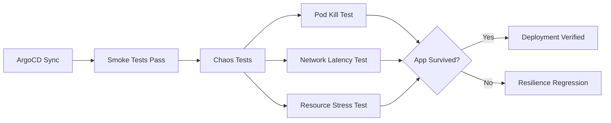

# How to Implement Chaos Testing After ArgoCD Deployment

Author: [nawazdhandala](https://github.com/nawazdhandala)

Tags: ArgoCD, GitOps, Kubernetes, Chaos Engineering, Reliability

Description: Learn how to run automated chaos tests after ArgoCD deployments using Chaos Mesh and Litmus to validate application resilience against pod failures, network disruption, and resource pressure.

---

Your application works perfectly in ideal conditions. But production is never ideal. Pods get killed, networks partition, nodes run out of memory, and DNS resolvers time out. Chaos testing deliberately introduces these failures to verify that your application handles them gracefully. Running chaos tests after every ArgoCD deployment ensures that new releases do not introduce resilience regressions.

This guide shows how to integrate chaos testing into your ArgoCD PostSync workflow using Chaos Mesh and Litmus Chaos.

## Why Chaos Test After Deployment

Most teams run chaos tests as periodic exercises - maybe once a quarter during a "Game Day." This is better than nothing, but it misses the window where chaos testing matters most: right after a new deployment. Code changes can break resilience in subtle ways:

- A new dependency that does not handle timeouts
- A retry loop that was accidentally removed
- A circuit breaker that was misconfigured
- A health check that returns 200 even when the service is degraded

Running chaos tests as part of the deployment pipeline catches these issues immediately.



## Setting Up Chaos Mesh

Install Chaos Mesh in your cluster:

```bash
# Add Chaos Mesh Helm repo
helm repo add chaos-mesh https://charts.chaos-mesh.org
helm repo update

# Install Chaos Mesh
helm install chaos-mesh chaos-mesh/chaos-mesh \
  --namespace chaos-mesh \
  --create-namespace \
  --set chaosDaemon.runtime=containerd \
  --set chaosDaemon.socketPath=/run/containerd/containerd.sock
```

## Pod Kill Chaos Test

The most basic chaos test: kill application pods and verify the service recovers. This validates your Deployment's replica count, readiness probes, and service mesh configuration:

```yaml
apiVersion: batch/v1
kind: Job
metadata:
  name: chaos-test-pod-kill
  annotations:
    argocd.argoproj.io/hook: PostSync
    # Run after smoke tests pass
    argocd.argoproj.io/sync-wave: "3"
    argocd.argoproj.io/hook-delete-policy: BeforeHookCreation,HookSucceeded
spec:
  backoffLimit: 0
  activeDeadlineSeconds: 300
  template:
    spec:
      restartPolicy: Never
      serviceAccountName: chaos-runner
      containers:
        - name: chaos-test
          image: bitnami/kubectl:1.29
          command:
            - sh
            - -c
            - |
              NAMESPACE=${NAMESPACE:-default}
              APP_LABEL="app=api-service"
              SERVICE_URL="http://api-service.$NAMESPACE.svc:8080/health"

              echo "=== Chaos Test: Pod Kill ==="
              echo "Target: $APP_LABEL in $NAMESPACE"

              # Record initial pod count
              INITIAL_PODS=$(kubectl get pods -n "$NAMESPACE" -l "$APP_LABEL" \
                --field-selector=status.phase=Running --no-headers | wc -l | tr -d ' ')
              echo "Initial running pods: $INITIAL_PODS"

              if [ "$INITIAL_PODS" -lt 2 ]; then
                echo "SKIP: Need at least 2 replicas for pod kill test"
                exit 0
              fi

              # Verify service is healthy before chaos
              code=$(curl -s -o /dev/null -w "%{http_code}" --max-time 5 "$SERVICE_URL")
              if [ "$code" != "200" ]; then
                echo "FAIL: Service not healthy before chaos test"
                exit 1
              fi

              # Apply pod kill chaos
              cat <<CHAOS_EOF | kubectl apply -f -
              apiVersion: chaos-mesh.org/v1alpha1
              kind: PodChaos
              metadata:
                name: pod-kill-test
                namespace: $NAMESPACE
              spec:
                action: pod-kill
                mode: one
                selector:
                  namespaces:
                    - $NAMESPACE
                  labelSelectors:
                    app: api-service
                duration: "30s"
              CHAOS_EOF

              echo "Pod kill chaos applied"
              sleep 5

              # Check service availability during chaos
              AVAILABLE=0
              UNAVAILABLE=0

              for i in $(seq 1 20); do
                code=$(curl -s -o /dev/null -w "%{http_code}" --max-time 3 "$SERVICE_URL")
                if [ "$code" = "200" ]; then
                  AVAILABLE=$((AVAILABLE + 1))
                else
                  UNAVAILABLE=$((UNAVAILABLE + 1))
                fi
                sleep 1
              done

              echo "During chaos: $AVAILABLE available, $UNAVAILABLE unavailable"

              # Clean up chaos experiment
              kubectl delete podchaos pod-kill-test -n "$NAMESPACE" 2>/dev/null

              # Wait for recovery
              echo "Waiting for recovery..."
              sleep 30

              # Verify full recovery
              RECOVERED_PODS=$(kubectl get pods -n "$NAMESPACE" -l "$APP_LABEL" \
                --field-selector=status.phase=Running --no-headers | wc -l | tr -d ' ')
              echo "Recovered pods: $RECOVERED_PODS"

              # Verify service is healthy after chaos
              code=$(curl -s -o /dev/null -w "%{http_code}" --max-time 5 "$SERVICE_URL")
              if [ "$code" != "200" ]; then
                echo "FAIL: Service did not recover after pod kill"
                exit 1
              fi

              # Check availability threshold (must stay up 80% of the time)
              AVAILABILITY=$((AVAILABLE * 100 / (AVAILABLE + UNAVAILABLE)))
              echo "Availability during chaos: ${AVAILABILITY}%"

              if [ "$AVAILABILITY" -lt 80 ]; then
                echo "FAIL: Availability dropped below 80% during pod kill"
                exit 1
              fi

              echo "PASS: Pod kill chaos test passed"
          env:
            - name: NAMESPACE
              valueFrom:
                fieldRef:
                  fieldPath: metadata.namespace
```

## Network Latency Chaos Test

Inject network latency to verify your application handles slow responses from dependencies:

```yaml
apiVersion: batch/v1
kind: Job
metadata:
  name: chaos-test-network-latency
  annotations:
    argocd.argoproj.io/hook: PostSync
    argocd.argoproj.io/sync-wave: "3"
    argocd.argoproj.io/hook-delete-policy: BeforeHookCreation,HookSucceeded
spec:
  backoffLimit: 0
  activeDeadlineSeconds: 300
  template:
    spec:
      restartPolicy: Never
      serviceAccountName: chaos-runner
      containers:
        - name: chaos-test
          image: bitnami/kubectl:1.29
          command:
            - sh
            - -c
            - |
              NAMESPACE=${NAMESPACE:-default}
              SERVICE_URL="http://api-service.$NAMESPACE.svc:8080/health"

              echo "=== Chaos Test: Network Latency ==="

              # Verify service is healthy before chaos
              code=$(curl -s -o /dev/null -w "%{http_code}" --max-time 5 "$SERVICE_URL")
              if [ "$code" != "200" ]; then
                echo "FAIL: Service not healthy before test"
                exit 1
              fi

              # Apply 200ms network latency
              cat <<CHAOS_EOF | kubectl apply -f -
              apiVersion: chaos-mesh.org/v1alpha1
              kind: NetworkChaos
              metadata:
                name: network-latency-test
                namespace: $NAMESPACE
              spec:
                action: delay
                mode: all
                selector:
                  namespaces:
                    - $NAMESPACE
                  labelSelectors:
                    app: api-service
                delay:
                  latency: "200ms"
                  jitter: "50ms"
                  correlation: "50"
                duration: "60s"
              CHAOS_EOF

              echo "Network latency chaos applied (200ms +/- 50ms)"
              sleep 10

              # Test service under latency
              ERRORS=0
              TOTAL=10

              for i in $(seq 1 $TOTAL); do
                # Use a generous timeout to account for added latency
                start=$(date +%s%N)
                code=$(curl -s -o /dev/null -w "%{http_code}" --max-time 10 "$SERVICE_URL")
                end=$(date +%s%N)
                elapsed=$(( (end - start) / 1000000 ))

                if [ "$code" = "200" ]; then
                  echo "  Request $i: ${elapsed}ms (OK)"
                else
                  echo "  Request $i: ${elapsed}ms (ERROR: $code)"
                  ERRORS=$((ERRORS + 1))
                fi
                sleep 1
              done

              # Clean up
              kubectl delete networkchaos network-latency-test -n "$NAMESPACE" 2>/dev/null

              ERROR_RATE=$((ERRORS * 100 / TOTAL))
              echo ""
              echo "Error rate under latency: ${ERROR_RATE}%"

              if [ "$ERROR_RATE" -gt 10 ]; then
                echo "FAIL: Error rate too high under network latency"
                exit 1
              fi

              echo "PASS: Network latency chaos test passed"
          env:
            - name: NAMESPACE
              valueFrom:
                fieldRef:
                  fieldPath: metadata.namespace
```

## CPU Stress Chaos Test

Verify your application handles CPU pressure gracefully by not crashing or producing errors:

```yaml
apiVersion: chaos-mesh.org/v1alpha1
kind: StressChaos
metadata:
  name: cpu-stress-test
  namespace: default
spec:
  mode: one
  selector:
    namespaces:
      - default
    labelSelectors:
      app: api-service
  stressors:
    cpu:
      workers: 2
      load: 80
  duration: "60s"
```

Wrap this in a Job similar to the previous examples, and verify the service continues responding during CPU pressure.

## Using Litmus Chaos as an Alternative

Litmus Chaos provides pre-built chaos experiments as ChaosEngine resources:

```yaml
apiVersion: litmuschaos.io/v1alpha1
kind: ChaosEngine
metadata:
  name: post-deploy-chaos
  namespace: default
  annotations:
    argocd.argoproj.io/hook: PostSync
    argocd.argoproj.io/sync-wave: "3"
    argocd.argoproj.io/hook-delete-policy: BeforeHookCreation
spec:
  engineState: "active"
  appinfo:
    appns: default
    applabel: "app=api-service"
    appkind: deployment
  chaosServiceAccount: litmus-admin
  experiments:
    - name: pod-delete
      spec:
        components:
          env:
            - name: TOTAL_CHAOS_DURATION
              value: "30"
            - name: CHAOS_INTERVAL
              value: "10"
            - name: FORCE
              value: "false"
        probe:
          - name: health-check
            type: httpProbe
            httpProbe/inputs:
              url: http://api-service.default.svc:8080/health
              insecureSkipVerify: false
              method:
                get:
                  criteria: ==
                  responseCode: "200"
            mode: Continuous
            runProperties:
              probeTimeout: 5s
              interval: 2s
              retry: 3
```

Litmus includes built-in probes that validate service health during chaos, making it a good choice for PostSync validation.

## RBAC for Chaos Testing

The chaos test runner needs specific permissions. Be careful to scope these narrowly:

```yaml
apiVersion: v1
kind: ServiceAccount
metadata:
  name: chaos-runner
---
apiVersion: rbac.authorization.k8s.io/v1
kind: Role
metadata:
  name: chaos-runner
rules:
  - apiGroups: [""]
    resources: ["pods"]
    verbs: ["get", "list", "delete"]
  - apiGroups: ["chaos-mesh.org"]
    resources: ["*"]
    verbs: ["create", "delete", "get", "list"]
  - apiGroups: ["apps"]
    resources: ["deployments"]
    verbs: ["get", "list"]
---
apiVersion: rbac.authorization.k8s.io/v1
kind: RoleBinding
metadata:
  name: chaos-runner
subjects:
  - kind: ServiceAccount
    name: chaos-runner
roleRef:
  kind: Role
  name: chaos-runner
  apiGroup: rbac.authorization.k8s.io
```

## Running Chaos Tests Only in Non-Production

You probably do not want chaos tests running after every production deployment. Use environment-specific configurations:

```yaml
# Only include chaos tests in staging/qa overlays
# staging/kustomization.yaml
resources:
  - ../../base
  - chaos-tests/pod-kill-job.yaml
  - chaos-tests/network-latency-job.yaml
```

Production can run a lighter version that only validates resilience configuration exists (like checking replica counts and PDB presence) without actually killing pods.

For handling test failures and triggering rollbacks automatically, see our guide on [test failures and automated rollback in ArgoCD](https://oneuptime.com/blog/post/2026-02-26-argocd-test-failures-automated-rollback/view).

## Best Practices

1. **Start small** - Begin with pod kill tests before moving to network and resource chaos.
2. **Set blast radius limits** - Never chaos-test more than one pod at a time in PostSync hooks.
3. **Use short durations** - PostSync chaos tests should run for 30 to 60 seconds, not minutes.
4. **Always clean up** - Delete chaos resources after the test, even on failure.
5. **Monitor during chaos** - Use OneUptime to track service health during chaos experiments and correlate results with deployment events.
6. **Skip in emergency deployments** - Provide a way to bypass chaos tests for hotfix deployments.
7. **Gradually increase intensity** - Start with mild chaos (200ms latency) and work up to severe conditions over time.

Chaos testing after deployment is the ultimate validation. It proves not just that your code works, but that it works when things go wrong. With ArgoCD PostSync hooks, this validation happens automatically, every time you deploy.
