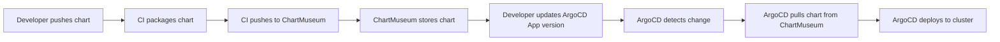

# How to Add ChartMuseum as a Helm Repository in ArgoCD

Author: [nawazdhandala](https://github.com/nawazdhandala)

Tags: ArgoCD, GitOps, Kubernetes, Helm, ChartMuseum

Description: Learn how to integrate ChartMuseum with ArgoCD for hosting and deploying private Helm charts using a lightweight, self-hosted Helm chart repository.

---

ChartMuseum is an open-source Helm chart repository server that is simple to set up and widely used for hosting private charts. It supports multiple storage backends including local filesystem, Amazon S3, Google Cloud Storage, Azure Blob Storage, and more. Integrating ChartMuseum with ArgoCD creates a self-contained GitOps workflow for managing internal Helm charts.

## Setting Up ChartMuseum

Before connecting ArgoCD to ChartMuseum, you need a running ChartMuseum instance. Here is how to deploy it in your Kubernetes cluster using ArgoCD itself:

```yaml
# chartmuseum-app.yaml
apiVersion: argoproj.io/v1alpha1
kind: Application
metadata:
  name: chartmuseum
  namespace: argocd
spec:
  project: default
  source:
    repoURL: https://chartmuseum.github.io/charts
    chart: chartmuseum
    targetRevision: 3.10.2
    helm:
      releaseName: chartmuseum
      values: |
        env:
          open:
            # Enable API for chart push
            DISABLE_API: false
            # Enable basic auth
            AUTH_ANONYMOUS_GET: false
            BASIC_AUTH_USER: admin
            BASIC_AUTH_PASS: changeme
            # Storage backend
            STORAGE: local
          secret:
            BASIC_AUTH_PASS: secure-password-here
        persistence:
          enabled: true
          size: 10Gi
        ingress:
          enabled: true
          ingressClassName: nginx
          hosts:
            - name: charts.company.com
              path: /
              tls: true
              tlsSecret: chartmuseum-tls
  destination:
    server: https://kubernetes.default.svc
    namespace: chartmuseum
  syncPolicy:
    automated:
      prune: true
      selfHeal: true
    syncOptions:
      - CreateNamespace=true
```

For S3-backed storage, the configuration changes:

```yaml
helm:
  values: |
    env:
      open:
        STORAGE: amazon
        STORAGE_AMAZON_BUCKET: my-helm-charts
        STORAGE_AMAZON_REGION: us-east-1
```

## Connecting ArgoCD to ChartMuseum

### Via the CLI

```bash
# Add ChartMuseum as a Helm repository
argocd repo add https://charts.company.com \
  --type helm \
  --name chartmuseum \
  --username admin \
  --password secure-password-here
```

### Declaratively

```yaml
# chartmuseum-repo-secret.yaml
apiVersion: v1
kind: Secret
metadata:
  name: chartmuseum-repo
  namespace: argocd
  labels:
    argocd.argoproj.io/secret-type: repository
stringData:
  type: helm
  name: chartmuseum
  url: https://charts.company.com
  username: admin
  password: secure-password-here
```

```bash
kubectl apply -f chartmuseum-repo-secret.yaml
```

### Without Authentication (Anonymous Access)

If ChartMuseum is configured with `AUTH_ANONYMOUS_GET: true`, you can read without credentials:

```yaml
apiVersion: v1
kind: Secret
metadata:
  name: chartmuseum-public
  namespace: argocd
  labels:
    argocd.argoproj.io/secret-type: repository
stringData:
  type: helm
  name: chartmuseum
  url: https://charts.company.com
```

## Deploying Charts from ChartMuseum

Once connected, deploy charts the same way as any other Helm repository:

```yaml
# deploy-internal-chart.yaml
apiVersion: argoproj.io/v1alpha1
kind: Application
metadata:
  name: internal-api
  namespace: argocd
spec:
  project: default
  source:
    repoURL: https://charts.company.com
    chart: internal-api
    targetRevision: 1.3.0
    helm:
      releaseName: internal-api
      values: |
        replicaCount: 3
        image:
          repository: registry.company.com/internal-api
          tag: v2.1.0
        config:
          database:
            host: postgres.company.com
            port: 5432
          redis:
            host: redis.company.com
  destination:
    server: https://kubernetes.default.svc
    namespace: internal-api
  syncPolicy:
    automated:
      prune: true
      selfHeal: true
    syncOptions:
      - CreateNamespace=true
```

## Publishing Charts to ChartMuseum

For the full workflow, you need to push charts to ChartMuseum from your CI/CD pipeline. Here is an example using the Helm push plugin:

```bash
# Install the cm-push plugin
helm plugin install https://github.com/chartmuseum/helm-push

# Add ChartMuseum as a Helm repo
helm repo add chartmuseum https://charts.company.com \
  --username admin --password secure-password

# Package and push a chart
cd my-chart/
helm package .
helm cm-push my-chart-1.0.0.tgz chartmuseum
```

In a CI/CD pipeline (GitHub Actions example):

```yaml
# .github/workflows/publish-chart.yaml
name: Publish Helm Chart
on:
  push:
    paths:
      - 'charts/**'
    branches:
      - main

jobs:
  publish:
    runs-on: ubuntu-latest
    steps:
      - uses: actions/checkout@v4
      - name: Install Helm
        uses: azure/setup-helm@v3
      - name: Install cm-push plugin
        run: helm plugin install https://github.com/chartmuseum/helm-push
      - name: Add ChartMuseum repo
        run: |
          helm repo add chartmuseum ${{ secrets.CHARTMUSEUM_URL }} \
            --username ${{ secrets.CHARTMUSEUM_USER }} \
            --password ${{ secrets.CHARTMUSEUM_PASS }}
      - name: Package and push charts
        run: |
          for chart_dir in charts/*/; do
            helm package "$chart_dir"
            helm cm-push "$chart_dir" chartmuseum
          done
```

## Complete GitOps Workflow

The complete workflow from code to deployment looks like this:



## ChartMuseum with Internal TLS

If ChartMuseum uses an internal CA certificate:

```yaml
# Add CA cert to ArgoCD
apiVersion: v1
kind: ConfigMap
metadata:
  name: argocd-tls-certs-cm
  namespace: argocd
data:
  charts.company.com: |
    -----BEGIN CERTIFICATE-----
    MIIFjTCCA3WgAwIBAgIUK...
    -----END CERTIFICATE-----
```

## ChartMuseum with Multiple Tenants

ChartMuseum supports multi-tenancy through URL-based org separation. Configure separate repos for each team:

```yaml
# Team A charts
apiVersion: v1
kind: Secret
metadata:
  name: chartmuseum-team-a
  namespace: argocd
  labels:
    argocd.argoproj.io/secret-type: repository
stringData:
  type: helm
  name: team-a-charts
  url: https://charts.company.com/api/charts/team-a
  username: team-a-reader
  password: team-a-token
---
# Team B charts
apiVersion: v1
kind: Secret
metadata:
  name: chartmuseum-team-b
  namespace: argocd
  labels:
    argocd.argoproj.io/secret-type: repository
stringData:
  type: helm
  name: team-b-charts
  url: https://charts.company.com/api/charts/team-b
  username: team-b-reader
  password: team-b-token
```

## ChartMuseum Running Inside the Cluster

If ChartMuseum runs in the same cluster as ArgoCD, use the internal Kubernetes service URL:

```yaml
apiVersion: v1
kind: Secret
metadata:
  name: chartmuseum-internal
  namespace: argocd
  labels:
    argocd.argoproj.io/secret-type: repository
stringData:
  type: helm
  name: chartmuseum-internal
  url: http://chartmuseum.chartmuseum.svc.cluster.local:8080
  username: admin
  password: secure-password
```

Using the internal service URL avoids external DNS, TLS, and proxy issues.

## Troubleshooting

### "No chart name found"

ChartMuseum might be empty or the chart has not been published:

```bash
# List all charts in ChartMuseum
curl -u admin:password https://charts.company.com/api/charts

# Check if a specific chart exists
curl -u admin:password https://charts.company.com/api/charts/my-chart
```

### Index Not Updating

ChartMuseum caches its index. After pushing a new chart:

```bash
# Force ArgoCD to refresh the repo
argocd repo get https://charts.company.com --refresh
```

### Storage Backend Issues

```bash
# Check ChartMuseum logs
kubectl logs -n chartmuseum deployment/chartmuseum --tail=50

# Common issues:
# - S3 bucket permissions
# - Local storage disk full
# - GCS service account missing
```

### Authentication Mismatch

```bash
# Test credentials directly
curl -u admin:password https://charts.company.com/index.yaml | head -20

# If this fails, check ChartMuseum's auth configuration
kubectl get deployment chartmuseum -n chartmuseum -o yaml | grep -A2 BASIC_AUTH
```

ChartMuseum is an excellent choice for teams that need a simple, lightweight Helm chart repository. Combined with ArgoCD, it provides a complete GitOps workflow for managing internal applications. For more on deploying Helm charts with ArgoCD, see the [Helm deployment guide](https://oneuptime.com/blog/post/2026-01-25-deploy-helm-charts-argocd/view).
