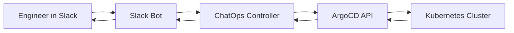

# How to Implement Chat-Based Deployment with ArgoCD

Author: [nawazdhandala](https://github.com/nawazdhandala)

Tags: ArgoCD, GitOps, Kubernetes, ChatOps, Slack

Description: Learn how to implement chat-based deployments with ArgoCD using Slack and Microsoft Teams, including bot configuration, deployment commands, approval workflows, and status notifications.

---

ChatOps brings deployment operations into your team's communication channels. Instead of switching between Slack, Git, and the ArgoCD UI, engineers can trigger syncs, check application status, and approve deployments directly from their chat platform. This makes deployments more visible to the team, creates a natural audit trail in chat history, and reduces context switching.

This guide covers building a ChatOps deployment workflow with ArgoCD using Slack and Microsoft Teams.

## ChatOps Architecture



The bot receives commands from chat, validates the user's permissions, calls the ArgoCD API, and posts results back to the channel.

## Option 1: ArgoCD Notifications for Status Updates

Before building a full bot, start with ArgoCD Notifications to push deployment status into Slack:

```yaml
apiVersion: v1
kind: ConfigMap
metadata:
  name: argocd-notifications-cm
  namespace: argocd
data:
  # Slack service configuration
  service.slack: |
    token: $slack-token
    signingSecret: $slack-signing-secret

  # Trigger on sync events
  trigger.on-deployed: |
    - when: app.status.operationState.phase in ['Succeeded'] and app.status.health.status == 'Healthy'
      send: [slack-deployment-success]

  trigger.on-sync-failed: |
    - when: app.status.operationState.phase in ['Error', 'Failed']
      send: [slack-deployment-failed]

  trigger.on-health-degraded: |
    - when: app.status.health.status == 'Degraded'
      send: [slack-health-degraded]

  # Message templates
  template.slack-deployment-success: |
    slack:
      attachments: |
        [{
          "color": "#18be52",
          "title": "{{.app.metadata.name}} deployed successfully",
          "fields": [
            {"title": "Environment", "value": "{{.app.spec.destination.namespace}}", "short": true},
            {"title": "Revision", "value": "{{.app.status.sync.revision | trunc 7}}", "short": true},
            {"title": "Sync Status", "value": "{{.app.status.sync.status}}", "short": true},
            {"title": "Health", "value": "{{.app.status.health.status}}", "short": true}
          ],
          "actions": [
            {"type": "button", "text": "View in ArgoCD", "url": "{{.context.argocdUrl}}/applications/{{.app.metadata.name}}"}
          ]
        }]

  template.slack-deployment-failed: |
    slack:
      attachments: |
        [{
          "color": "#E96D76",
          "title": ":x: {{.app.metadata.name}} deployment FAILED",
          "fields": [
            {"title": "Environment", "value": "{{.app.spec.destination.namespace}}", "short": true},
            {"title": "Error", "value": "{{.app.status.operationState.message | trunc 200}}", "short": false}
          ],
          "actions": [
            {"type": "button", "text": "View Details", "url": "{{.context.argocdUrl}}/applications/{{.app.metadata.name}}"}
          ]
        }]

  template.slack-health-degraded: |
    slack:
      attachments: |
        [{
          "color": "#f4c030",
          "title": ":warning: {{.app.metadata.name}} health degraded",
          "fields": [
            {"title": "Environment", "value": "{{.app.spec.destination.namespace}}", "short": true},
            {"title": "Health", "value": "{{.app.status.health.status}}", "short": true}
          ]
        }]
```

Annotate your applications to subscribe to notifications:

```yaml
apiVersion: argoproj.io/v1alpha1
kind: Application
metadata:
  name: myapp-production
  annotations:
    notifications.argoproj.io/subscribe.on-deployed.slack: deployments
    notifications.argoproj.io/subscribe.on-sync-failed.slack: deployments
    notifications.argoproj.io/subscribe.on-health-degraded.slack: deployments
```

## Option 2: Build a Custom Slack Bot

For interactive commands (sync, rollback, status), build a Slack bot that talks to the ArgoCD API:

```python
# chatops-bot/app.py
import os
import json
import requests
from slack_bolt import App
from slack_bolt.adapter.socket_mode import SocketModeHandler

app = App(token=os.environ["SLACK_BOT_TOKEN"])

ARGOCD_SERVER = os.environ["ARGOCD_SERVER"]
ARGOCD_TOKEN = os.environ["ARGOCD_TOKEN"]

def argocd_api(method, path, data=None):
    """Helper to call ArgoCD API"""
    headers = {
        "Authorization": f"Bearer {ARGOCD_TOKEN}",
        "Content-Type": "application/json"
    }
    url = f"{ARGOCD_SERVER}/api/v1/{path}"
    resp = requests.request(method, url, headers=headers, json=data, verify=True)
    return resp.json()

@app.command("/deploy")
def handle_deploy(ack, say, command):
    """Handle /deploy <app-name> command"""
    ack()
    app_name = command["text"].strip()
    user = command["user_name"]

    # Check if app exists
    try:
        app_info = argocd_api("GET", f"applications/{app_name}")
    except Exception as e:
        say(f":x: Application `{app_name}` not found")
        return

    # Trigger sync
    say(f":rocket: *{user}* triggered deployment of `{app_name}`...")

    sync_result = argocd_api("POST", f"applications/{app_name}/sync", {
        "revision": app_info["spec"]["source"]["targetRevision"],
        "prune": True
    })

    say(f":white_check_mark: Sync initiated for `{app_name}`. "
        f"<{ARGOCD_SERVER}/applications/{app_name}|View in ArgoCD>")

@app.command("/deploy-status")
def handle_status(ack, say, command):
    """Handle /deploy-status <app-name> command"""
    ack()
    app_name = command["text"].strip()

    try:
        app_info = argocd_api("GET", f"applications/{app_name}")
        status = app_info["status"]

        blocks = [
            {
                "type": "section",
                "text": {
                    "type": "mrkdwn",
                    "text": f"*{app_name}* Status"
                }
            },
            {
                "type": "section",
                "fields": [
                    {"type": "mrkdwn", "text": f"*Sync:* {status['sync']['status']}"},
                    {"type": "mrkdwn", "text": f"*Health:* {status['health']['status']}"},
                    {"type": "mrkdwn", "text": f"*Revision:* `{status['sync'].get('revision', 'N/A')[:7]}`"},
                    {"type": "mrkdwn", "text": f"*Namespace:* {app_info['spec']['destination']['namespace']}"}
                ]
            }
        ]
        say(blocks=blocks)
    except Exception as e:
        say(f":x: Could not get status for `{app_name}`: {str(e)}")

@app.command("/deploy-rollback")
def handle_rollback(ack, say, command):
    """Handle /deploy-rollback <app-name> command"""
    ack()
    app_name = command["text"].strip()
    user = command["user_name"]

    # Get deployment history
    app_info = argocd_api("GET", f"applications/{app_name}")
    history = app_info.get("status", {}).get("history", [])

    if len(history) < 2:
        say(f":x: No previous version to rollback to for `{app_name}`")
        return

    previous = history[-2]
    say(f":rewind: *{user}* initiated rollback of `{app_name}` "
        f"to revision `{previous['revision'][:7]}`...")

    argocd_api("PUT", f"applications/{app_name}/rollback", {
        "id": previous["id"]
    })

    say(f":white_check_mark: Rollback initiated. "
        f"<{ARGOCD_SERVER}/applications/{app_name}|View in ArgoCD>")

@app.command("/deploy-list")
def handle_list(ack, say, command):
    """Handle /deploy-list command"""
    ack()
    filter_text = command["text"].strip()

    apps = argocd_api("GET", "applications")
    app_list = apps.get("items", [])

    if filter_text:
        app_list = [a for a in app_list if filter_text in a["metadata"]["name"]]

    lines = []
    for a in app_list[:20]:  # Limit to 20 results
        name = a["metadata"]["name"]
        sync = a["status"]["sync"]["status"]
        health = a["status"]["health"]["status"]
        icon = ":white_check_mark:" if health == "Healthy" else ":warning:"
        lines.append(f"{icon} `{name}` - Sync: {sync} | Health: {health}")

    say("\n".join(lines) if lines else "No applications found")

if __name__ == "__main__":
    handler = SocketModeHandler(app, os.environ["SLACK_APP_TOKEN"])
    handler.start()
```

## Deploy the Bot on Kubernetes

```yaml
apiVersion: apps/v1
kind: Deployment
metadata:
  name: argocd-chatops-bot
  namespace: argocd
spec:
  replicas: 1
  selector:
    matchLabels:
      app: chatops-bot
  template:
    metadata:
      labels:
        app: chatops-bot
    spec:
      containers:
      - name: bot
        image: org/argocd-chatops-bot:latest
        env:
        - name: SLACK_BOT_TOKEN
          valueFrom:
            secretKeyRef:
              name: chatops-secrets
              key: slack-bot-token
        - name: SLACK_APP_TOKEN
          valueFrom:
            secretKeyRef:
              name: chatops-secrets
              key: slack-app-token
        - name: ARGOCD_SERVER
          value: "https://argocd-server.argocd.svc.cluster.local"
        - name: ARGOCD_TOKEN
          valueFrom:
            secretKeyRef:
              name: chatops-secrets
              key: argocd-token
        resources:
          requests:
            cpu: 100m
            memory: 128Mi
```

## Approval Workflow in Chat

Implement deployment approvals through Slack interactive messages:

```python
@app.action("approve_deploy")
def handle_approval(ack, body, say):
    """Handle deployment approval button click"""
    ack()
    user = body["user"]["username"]
    app_name = body["actions"][0]["value"]

    # Verify user is authorized to approve
    # (check against ArgoCD RBAC or a local allowlist)

    say(f":white_check_mark: *{user}* approved deployment of `{app_name}`")

    # Trigger the sync
    argocd_api("POST", f"applications/{app_name}/sync", {
        "prune": True
    })

@app.action("reject_deploy")
def handle_rejection(ack, body, say):
    """Handle deployment rejection"""
    ack()
    user = body["user"]["username"]
    app_name = body["actions"][0]["value"]
    say(f":no_entry: *{user}* rejected deployment of `{app_name}`")
```

## Microsoft Teams Integration

For Teams, use ArgoCD Notifications with the Teams webhook:

```yaml
apiVersion: v1
kind: ConfigMap
metadata:
  name: argocd-notifications-cm
  namespace: argocd
data:
  service.teams: |
    recipientUrls:
      deployments: https://outlook.office.com/webhook/xxx/IncomingWebhook/yyy/zzz

  template.teams-deployment: |
    teams:
      title: "{{.app.metadata.name}} Deployment"
      themeColor: "{{if eq .app.status.health.status \"Healthy\"}}00FF00{{else}}FF0000{{end}}"
      sections: |
        [{
          "activityTitle": "{{.app.metadata.name}}",
          "facts": [
            {"name": "Status", "value": "{{.app.status.sync.status}}"},
            {"name": "Health", "value": "{{.app.status.health.status}}"},
            {"name": "Revision", "value": "{{.app.status.sync.revision | trunc 7}}"}
          ]
        }]
      potentialAction: |
        [{
          "@type": "OpenUri",
          "name": "View in ArgoCD",
          "targets": [{"os": "default", "uri": "{{.context.argocdUrl}}/applications/{{.app.metadata.name}}"}]
        }]
```

For comprehensive deployment monitoring that goes beyond chat notifications, integrate with [OneUptime](https://oneuptime.com/blog/post/2026-02-09-argocd-monitoring-prometheus/view) to track deployment health trends and set up escalation policies when chat-based alerts are missed.

## Conclusion

ChatOps with ArgoCD brings deployment visibility directly into your team's communication flow. Start with ArgoCD Notifications for passive status updates, then graduate to an interactive bot for commands like deploy, rollback, and status checks. The approval workflow pattern - where deployments post to a channel and wait for a button click - bridges the gap between fully automated and manually controlled deployments. The key principle is that chat becomes the deployment dashboard, making operations transparent to everyone on the team without requiring them to log into ArgoCD directly.
