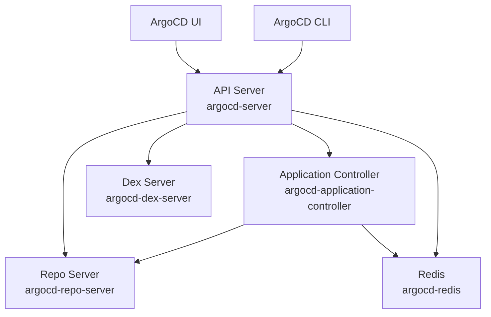

# How to Check ArgoCD Component Logs Effectively

Author: [nawazdhandala](https://github.com/nawazdhandala)

Tags: ArgoCD, GitOps, Kubernetes, Logging, Troubleshooting

Description: Learn how to read and filter ArgoCD component logs effectively for the API server, application controller, repo server, Dex, and Redis to quickly find root causes of issues.

---

ArgoCD runs as multiple microservices, each producing its own logs. When something goes wrong, knowing which component to check and how to filter its logs is the difference between spending five minutes or five hours on debugging. This guide teaches you how to read ArgoCD logs like a pro.

## ArgoCD Component Architecture



Each component is responsible for different things:
- **API Server**: Authentication, RBAC, API requests, webhook processing
- **Application Controller**: Reconciliation, sync operations, health checks
- **Repo Server**: Git operations, manifest generation (Helm, Kustomize, etc.)
- **Dex Server**: SSO and external authentication
- **Redis**: Caching, state management

## Quick Log Commands for Each Component

```bash
# API Server logs
kubectl logs -n argocd deploy/argocd-server --tail=100

# Application Controller logs
kubectl logs -n argocd deploy/argocd-application-controller --tail=100

# Repo Server logs
kubectl logs -n argocd deploy/argocd-repo-server --tail=100

# Dex Server logs
kubectl logs -n argocd deploy/argocd-dex-server --tail=100

# Redis logs
kubectl logs -n argocd deploy/argocd-redis --tail=100
```

## Which Component to Check

Use this table to determine which component to check based on the symptom:

| Symptom | Component | What to Look For |
|---------|-----------|-----------------|
| Login failures | Dex Server | Authentication errors, connector issues |
| API errors | API Server | RBAC denials, validation errors |
| Sync failures | Application Controller | Apply errors, sync timeouts |
| Manifest errors | Repo Server | Git errors, template rendering |
| Slow UI | API Server + Redis | High latency, connection errors |
| OutOfSync stuck | Application Controller | Reconciliation errors |
| Webhook not working | API Server | Webhook payload processing |

## Filtering Logs by Application

When you have hundreds of applications, you need to filter logs for just one:

```bash
# Filter controller logs for a specific application
kubectl logs -n argocd deploy/argocd-application-controller --tail=500 | \
  grep "my-app-name"

# Filter with context lines (3 lines before and after)
kubectl logs -n argocd deploy/argocd-application-controller --tail=500 | \
  grep -B3 -A3 "my-app-name"

# Filter repo server logs for a specific repository
kubectl logs -n argocd deploy/argocd-repo-server --tail=500 | \
  grep "github.com/my-org/my-repo"
```

## Filtering Logs by Severity

ArgoCD uses structured logging. Filter by log level:

```bash
# Show only errors
kubectl logs -n argocd deploy/argocd-application-controller --tail=500 | \
  grep 'level=error'

# Show errors and warnings
kubectl logs -n argocd deploy/argocd-application-controller --tail=500 | \
  grep -E 'level=(error|warning)'

# Show fatal messages (component is crashing)
kubectl logs -n argocd deploy/argocd-application-controller --tail=500 | \
  grep 'level=fatal'
```

## Streaming Logs in Real-Time

When debugging an active issue, stream logs while reproducing the problem:

```bash
# Stream API server logs while triggering a sync from another terminal
kubectl logs -n argocd deploy/argocd-server -f | grep -i "sync\|error"

# Stream controller logs during a sync operation
kubectl logs -n argocd deploy/argocd-application-controller -f | grep -i "my-app"

# Stream multiple components at once using stern (recommended)
# Install stern: brew install stern (macOS) or go install github.com/stern/stern@latest
stern -n argocd argocd --tail=0
```

The `stern` tool is particularly useful because it shows logs from all ArgoCD pods with color-coded labels.

## Reading ArgoCD Log Format

ArgoCD logs use a structured format. Here is how to read them:

```
time="2024-01-15T10:30:45Z" level=info msg="Sync operation to abc1234" application=my-app dest-namespace=production dest-server="https://kubernetes.default.svc" reason=OperationCompleted type=Normal
```

Key fields:
- `time`: Timestamp in UTC
- `level`: Severity (debug, info, warning, error, fatal)
- `msg`: Human-readable message
- `application`: Application name (controller logs)
- `dest-namespace`: Target namespace
- `dest-server`: Target cluster
- `reason`: Event reason code

## Checking Previous Container Logs

When a pod has restarted (possibly due to OOMKill or crash), check the previous container's logs:

```bash
# Get logs from the previous container instance
kubectl logs -n argocd deploy/argocd-application-controller --previous --tail=200

# Check why the pod restarted
kubectl describe pod -n argocd -l app.kubernetes.io/name=argocd-application-controller | \
  grep -A5 "Last State\|Restart Count\|Exit Code"
```

## Multi-Pod Log Collection

In HA setups, ArgoCD runs multiple replicas. You need logs from all of them:

```bash
# Get logs from all API server pods
kubectl logs -n argocd -l app.kubernetes.io/name=argocd-server --tail=100

# Get logs from all controller pods (if sharded)
kubectl logs -n argocd -l app.kubernetes.io/name=argocd-application-controller --tail=100 --max-log-requests=10

# Use label selectors for all ArgoCD components
kubectl logs -n argocd -l app.kubernetes.io/part-of=argocd --tail=50 --max-log-requests=20
```

## JSON Log Format

You can configure ArgoCD to output JSON logs, which are much easier to parse:

```bash
# Enable JSON logging
kubectl patch configmap argocd-cmd-params-cm -n argocd --type merge -p '{
  "data": {
    "server.log.format": "json",
    "controller.log.format": "json",
    "reposerver.log.format": "json"
  }
}'

# Restart components to apply
kubectl rollout restart deployment -n argocd argocd-server argocd-application-controller argocd-repo-server
```

With JSON logs, you can use `jq` for powerful filtering:

```bash
# Parse JSON logs and filter by application
kubectl logs -n argocd deploy/argocd-application-controller --tail=200 | \
  jq -r 'select(.application == "my-app") | "\(.time) \(.level) \(.msg)"'

# Find all errors with their applications
kubectl logs -n argocd deploy/argocd-application-controller --tail=500 | \
  jq -r 'select(.level == "error") | "\(.application): \(.msg)"'
```

## Comprehensive Log Collection Script

```bash
#!/bin/bash
# collect-argocd-logs.sh - Collect all ArgoCD component logs

NAMESPACE="argocd"
OUTPUT_DIR="argocd-logs-$(date +%Y%m%d-%H%M%S)"
TAIL_LINES=500

mkdir -p $OUTPUT_DIR

echo "Collecting ArgoCD logs to $OUTPUT_DIR..."

# Collect logs from each component
COMPONENTS=(
    "argocd-server"
    "argocd-application-controller"
    "argocd-repo-server"
    "argocd-dex-server"
    "argocd-redis"
    "argocd-notifications-controller"
    "argocd-applicationset-controller"
)

for component in "${COMPONENTS[@]}"; do
    echo "Collecting logs for: $component"

    # Current logs
    kubectl logs -n $NAMESPACE -l app.kubernetes.io/name=$component \
      --tail=$TAIL_LINES --max-log-requests=10 \
      > "$OUTPUT_DIR/${component}-current.log" 2>&1

    # Previous logs (if container restarted)
    kubectl logs -n $NAMESPACE -l app.kubernetes.io/name=$component \
      --previous --tail=$TAIL_LINES --max-log-requests=10 \
      > "$OUTPUT_DIR/${component}-previous.log" 2>&1
done

# Collect pod status
echo "Collecting pod status..."
kubectl get pods -n $NAMESPACE -o wide > "$OUTPUT_DIR/pod-status.txt" 2>&1
kubectl describe pods -n $NAMESPACE > "$OUTPUT_DIR/pod-describe.txt" 2>&1

# Collect events
echo "Collecting events..."
kubectl get events -n $NAMESPACE --sort-by='.lastTimestamp' > "$OUTPUT_DIR/events.txt" 2>&1

# Create a summary of errors
echo "Creating error summary..."
grep -h "level=error\|level=fatal" "$OUTPUT_DIR"/*.log | sort | uniq -c | sort -rn \
  > "$OUTPUT_DIR/error-summary.txt" 2>&1

echo "Logs collected in: $OUTPUT_DIR"
echo "Error summary:"
cat "$OUTPUT_DIR/error-summary.txt"
```

## Using Log Aggregation

For production environments, send ArgoCD logs to a centralized logging system:

```yaml
# Example: Fluentd sidecar for ArgoCD components
# Or configure your cluster-level log collector to capture
# logs from the argocd namespace
#
# Common label selectors:
#   app.kubernetes.io/part-of: argocd
#   app.kubernetes.io/name: argocd-server
#   app.kubernetes.io/name: argocd-application-controller
#   app.kubernetes.io/name: argocd-repo-server
```

## Summary

Effective ArgoCD log reading starts with knowing which component to check. API server for auth and API issues, controller for sync and reconciliation, repo server for manifest generation, Dex for SSO. Use `stern` for real-time multi-component streaming, enable JSON log format for structured parsing, and always check previous container logs when pods have restarted. For production environments, centralize ArgoCD logs with [OneUptime](https://oneuptime.com) or your preferred logging platform to enable historical analysis and alerting.
