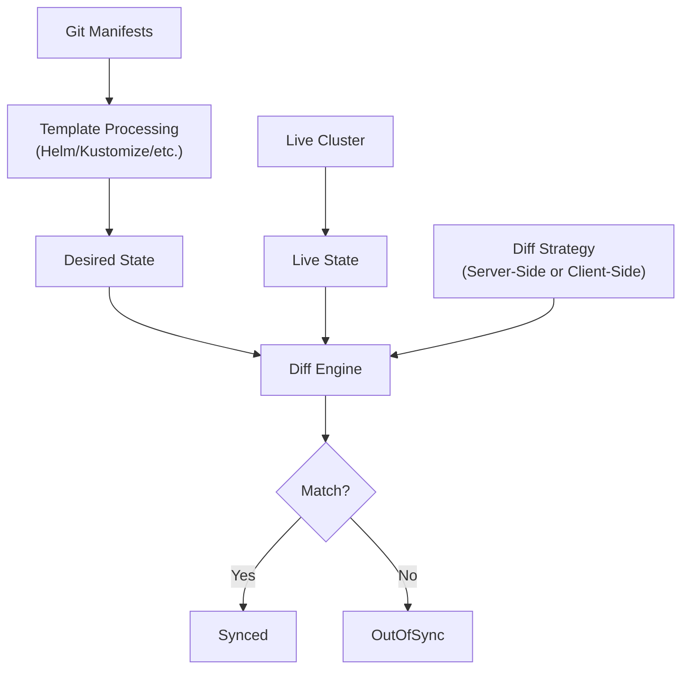

# How to Choose the Right Diff Strategy in ArgoCD

Author: [nawazdhandala](https://github.com/nawazdhandala)

Tags: ArgoCD, GitOps, Kubernetes, Diff Strategy, Configuration

Description: Learn how to choose between server-side and client-side diff strategies in ArgoCD to get accurate sync status and reduce false OutOfSync detections.

---

ArgoCD determines whether your application is in sync by comparing the desired state from Git against the live state in the cluster. The diff strategy controls how this comparison works. Choosing the wrong strategy leads to false OutOfSync reports, noisy diffs, or missed drift. This guide explains the available strategies and helps you pick the right one for your setup.

## How ArgoCD Diffing Works

At its core, ArgoCD takes the manifests from Git, processes them (through Helm, Kustomize, or plain YAML), and compares the result against what is actually running in the cluster. The diff strategy determines the method of comparison.



## The Two Diff Strategies

### Client-Side Diff (Legacy Default)

Client-side diff is the traditional approach. ArgoCD's repo server renders the manifests locally and compares them against the live state fetched from the Kubernetes API. The comparison happens entirely within ArgoCD's processes.

How it works:

1. ArgoCD renders manifests from Git (Helm template, Kustomize build, etc.)
2. ArgoCD fetches the live resource from the cluster
3. ArgoCD normalizes both states (removing known runtime fields)
4. ArgoCD compares the normalized states

```yaml
# No special configuration needed - this is the default
apiVersion: argoproj.io/v1alpha1
kind: Application
metadata:
  name: my-app
  namespace: argocd
spec:
  source:
    repoURL: https://github.com/myorg/app.git
    path: k8s
  destination:
    server: https://kubernetes.default.svc
    namespace: my-app
```

**Pros:**
- Works with all Kubernetes versions
- No additional server-side requirements
- Predictable behavior

**Cons:**
- Produces false diffs for fields set by admission controllers
- Cannot account for defaulting by the API server
- Struggles with fields modified by operators or controllers
- Does not understand field ownership (managedFields)

### Server-Side Diff (Recommended)

Server-side diff uses Kubernetes' built-in server-side apply mechanism to compute the diff. Instead of comparing manifests locally, ArgoCD sends a dry-run server-side apply request to the API server and compares the result.

How it works:

1. ArgoCD renders manifests from Git
2. ArgoCD sends a dry-run server-side apply request to the Kubernetes API
3. The API server returns what the resource would look like after applying
4. ArgoCD compares this against the current live state

```yaml
apiVersion: argoproj.io/v1alpha1
kind: Application
metadata:
  name: my-app
  namespace: argocd
spec:
  source:
    repoURL: https://github.com/myorg/app.git
    path: k8s
  destination:
    server: https://kubernetes.default.svc
    namespace: my-app
  # Enable server-side diff
  syncPolicy:
    syncOptions:
      - ServerSideApply=true
```

Or enable it at the global level:

```yaml
# argocd-cmd-params-cm
apiVersion: v1
kind: ConfigMap
metadata:
  name: argocd-cmd-params-cm
  namespace: argocd
data:
  controller.diff.server.side: "true"
```

**Pros:**
- Accurate diffs that account for API server defaulting
- Properly handles admission controller modifications
- Uses field ownership to determine what ArgoCD manages
- Fewer false OutOfSync reports
- Better handling of CRDs and operator-managed resources

**Cons:**
- Requires Kubernetes 1.22+ (server-side apply GA)
- Slightly higher API server load (dry-run requests)
- Behavior depends on API server version and configuration

## When to Use Each Strategy

### Use Client-Side Diff When:

- Running Kubernetes versions older than 1.22
- You need complete control over diff normalization
- Your manifests are simple and do not trigger defaulting issues
- You have extensive `ignoreDifferences` configurations that work well

### Use Server-Side Diff When:

- Running Kubernetes 1.22 or later (recommended)
- You see frequent false OutOfSync reports
- Admission controllers or operators modify resources after apply
- You use CRDs that have complex defaulting behavior
- You want to reduce `ignoreDifferences` configuration

Most teams in 2025 and beyond should use server-side diff as the default.

## Comparing Results: A Practical Example

Consider a Deployment where you do not specify resource requests. With client-side diff, the API server adds default values (like the default service account), but ArgoCD's rendered manifest does not have them, causing a false diff.

**Your manifest in Git:**

```yaml
apiVersion: apps/v1
kind: Deployment
metadata:
  name: web-app
spec:
  replicas: 3
  template:
    spec:
      containers:
        - name: web
          image: nginx:1.25
          ports:
            - containerPort: 80
```

**What the cluster has (after API server defaults):**

```yaml
apiVersion: apps/v1
kind: Deployment
metadata:
  name: web-app
spec:
  replicas: 3
  revisionHistoryLimit: 10        # defaulted
  progressDeadlineSeconds: 600    # defaulted
  strategy:
    type: RollingUpdate           # defaulted
    rollingUpdate:
      maxSurge: 25%               # defaulted
      maxUnavailable: 25%         # defaulted
  template:
    spec:
      terminationGracePeriodSeconds: 30  # defaulted
      dnsPolicy: ClusterFirst            # defaulted
      containers:
        - name: web
          image: nginx:1.25
          ports:
            - containerPort: 80
              protocol: TCP       # defaulted
          terminationMessagePath: /dev/termination-log     # defaulted
          terminationMessagePolicy: File                    # defaulted
          imagePullPolicy: IfNotPresent                    # defaulted
```

**Client-side diff** may flag some of these defaults as differences, depending on ArgoCD's normalization rules.

**Server-side diff** uses the API server's understanding of defaults and field ownership to correctly ignore fields that ArgoCD does not manage.

## Configuring Per-Application Diff Strategy

You can use different strategies for different applications:

```yaml
# App using server-side diff
apiVersion: argoproj.io/v1alpha1
kind: Application
metadata:
  name: complex-app
  namespace: argocd
spec:
  syncPolicy:
    syncOptions:
      - ServerSideApply=true
---
# App using client-side diff (default)
apiVersion: argoproj.io/v1alpha1
kind: Application
metadata:
  name: simple-app
  namespace: argocd
spec:
  # No ServerSideApply option - uses client-side diff
```

## Global Default with Per-App Override

Set server-side diff as the global default and opt out for specific applications:

```yaml
# Global default: server-side diff
apiVersion: v1
kind: ConfigMap
metadata:
  name: argocd-cmd-params-cm
  namespace: argocd
data:
  controller.diff.server.side: "true"
```

For applications that need client-side diff, there is no explicit opt-out flag. Instead, those applications would need to work with the server-side diff or have appropriate `ignoreDifferences` configurations.

## Combining Diff Strategy with ignoreDifferences

Both strategies can be combined with `ignoreDifferences` to suppress known acceptable differences:

```yaml
apiVersion: argoproj.io/v1alpha1
kind: Application
metadata:
  name: my-app
  namespace: argocd
spec:
  ignoreDifferences:
    # Ignore HPA-managed replicas
    - group: apps
      kind: Deployment
      jsonPointers:
        - /spec/replicas
    # Ignore operator-managed annotations
    - group: ''
      kind: Service
      jqPathExpressions:
        - '.metadata.annotations["service.beta.kubernetes.io/aws-load-balancer-internal"]'
  syncPolicy:
    syncOptions:
      - ServerSideApply=true
```

With server-side diff, you typically need fewer `ignoreDifferences` entries because the strategy naturally handles many of the fields that cause false diffs with client-side diff.

## Monitoring Diff Accuracy

After switching strategies, monitor your diff accuracy:

```bash
# Check how many applications are OutOfSync
argocd app list --output json | jq '[.[] | select(.status.sync.status == "OutOfSync")] | length'

# Compare before and after switching strategies
# Run this before switching:
argocd app list --output json | jq '[.[] | .metadata.name + ": " + .status.sync.status]' > before.json

# Switch strategy, wait for reconciliation, then:
argocd app list --output json | jq '[.[] | .metadata.name + ": " + .status.sync.status]' > after.json

# Compare
diff before.json after.json
```

## Migration Path

To migrate from client-side to server-side diff:

1. Enable server-side diff on a few non-critical applications first
2. Monitor for changes in sync status
3. Review any new OutOfSync reports - they may indicate real drift that client-side diff was hiding
4. Gradually roll out to more applications
5. Enable globally once you are confident

The diff strategy affects how ArgoCD perceives your cluster state. Choosing server-side diff gives you more accurate results with less configuration, but always validate the change against your specific workloads. For more on customizing diffs, see our guides on [server-side diff](https://oneuptime.com/blog/post/2026-02-26-argocd-server-side-diff/view) and [client-side diff](https://oneuptime.com/blog/post/2026-02-26-argocd-client-side-diff/view).
