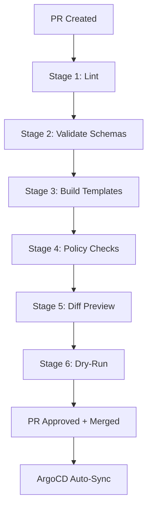

# How to Set Up CI/CD Checks for ArgoCD Configurations

Author: [nawazdhandala](https://github.com/nawazdhandala)

Tags: ArgoCD, GitOps, Kubernetes, CI/CD, Automation

Description: Learn how to set up comprehensive CI/CD checks for ArgoCD configurations, including linting, validation, policy testing, and diff previews in your pipeline.

---

Your GitOps repository is infrastructure code, and it deserves the same CI/CD rigor as application code. Every change to an ArgoCD configuration should pass through automated checks before it reaches the main branch. This guide shows how to build a comprehensive CI/CD pipeline for ArgoCD configurations.

## The CI/CD Check Pipeline

A well-structured pipeline for ArgoCD configurations includes multiple stages:



Each stage catches different categories of errors:

- **Lint** - Catches syntax errors, formatting issues
- **Validate** - Catches schema violations, invalid API versions
- **Build** - Catches Helm/Kustomize rendering failures
- **Policy** - Catches security and compliance violations
- **Diff** - Shows the actual cluster impact
- **Dry-Run** - Validates against the live API server

## Stage 1: YAML Linting

Catch the most basic errors first:

```yaml
# .github/workflows/argocd-checks.yaml
name: ArgoCD Configuration Checks
on:
  pull_request:
    paths:
      - 'apps/**'
      - 'argocd-apps/**'
      - 'charts/**'
      - 'overlays/**'
      - 'base/**'

jobs:
  lint:
    name: YAML Lint
    runs-on: ubuntu-latest
    steps:
      - uses: actions/checkout@v4

      - name: Install yamllint
        run: pip install yamllint

      - name: Lint YAML files
        run: |
          yamllint -c .yamllint.yaml \
            --format github \
            apps/ argocd-apps/ base/ overlays/ || true

          # Strict lint for ArgoCD Application definitions
          yamllint -c .yamllint.yaml --strict argocd-apps/
```

## Stage 2: Schema Validation

Validate manifests against Kubernetes and CRD schemas:

```yaml
  validate:
    name: Schema Validation
    runs-on: ubuntu-latest
    needs: lint
    steps:
      - uses: actions/checkout@v4

      - name: Install kubeconform
        run: |
          curl -L https://github.com/yannh/kubeconform/releases/latest/download/kubeconform-linux-amd64.tar.gz | \
            tar xz -C /usr/local/bin/

      - name: Validate plain manifests
        run: |
          # Find directories with plain YAML (not Helm templates)
          find apps/ -name "*.yaml" \
            -not -path "*/templates/*" \
            -not -name "kustomization.yaml" \
            -not -name "Chart.yaml" \
            -not -name "values*.yaml" | \
            xargs kubeconform \
              -kubernetes-version 1.29.0 \
              -schema-location default \
              -schema-location 'https://raw.githubusercontent.com/datreeio/CRDs-catalog/main/{{.Group}}/{{.ResourceKind}}_{{.ResourceAPIVersion}}.json' \
              -summary \
              -output json

      - name: Validate ArgoCD resources
        run: |
          kubeconform \
            -kubernetes-version 1.29.0 \
            -schema-location default \
            -schema-location 'https://raw.githubusercontent.com/datreeio/CRDs-catalog/main/{{.Group}}/{{.ResourceKind}}_{{.ResourceAPIVersion}}.json' \
            -summary \
            argocd-apps/
```

## Stage 3: Template Rendering

Verify that Helm charts and Kustomize overlays render correctly:

```yaml
  build:
    name: Template Rendering
    runs-on: ubuntu-latest
    needs: lint
    steps:
      - uses: actions/checkout@v4

      - name: Set up Helm
        uses: azure/setup-helm@v3

      - name: Install Kustomize
        run: |
          curl -s "https://raw.githubusercontent.com/kubernetes-sigs/kustomize/master/hack/install_kustomize.sh" | bash
          mv kustomize /usr/local/bin/

      - name: Render Helm charts
        run: |
          for chart_dir in charts/*/; do
            chart_name=$(basename "$chart_dir")
            echo "::group::Rendering $chart_name"

            # Render with each environment's values
            for values_file in values/${chart_name}/*.yaml; do
              if [ -f "$values_file" ]; then
                env_name=$(basename "$values_file" .yaml)
                echo "  Environment: $env_name"
                helm template "$chart_name" "$chart_dir" \
                  --values "$values_file" \
                  --namespace "$env_name" > /dev/null
                echo "  OK"
              fi
            done

            echo "::endgroup::"
          done

      - name: Build Kustomize overlays
        run: |
          for overlay in overlays/*/; do
            env_name=$(basename "$overlay")
            echo "::group::Building $env_name"
            kustomize build "$overlay" > /dev/null
            echo "OK"
            echo "::endgroup::"
          done

      - name: Validate rendered output
        run: |
          # Render and validate Helm charts
          for chart_dir in charts/*/; do
            chart_name=$(basename "$chart_dir")
            for values_file in values/${chart_name}/*.yaml; do
              if [ -f "$values_file" ]; then
                helm template "$chart_name" "$chart_dir" \
                  --values "$values_file" | \
                  kubeconform -kubernetes-version 1.29.0 -summary
              fi
            done
          done

          # Render and validate Kustomize overlays
          for overlay in overlays/*/; do
            kustomize build "$overlay" | \
              kubeconform -kubernetes-version 1.29.0 -summary
          done
```

## Stage 4: Policy Checks

Enforce organizational policies:

```yaml
  policy:
    name: Policy Checks
    runs-on: ubuntu-latest
    needs: build
    steps:
      - uses: actions/checkout@v4

      - name: Install Conftest
        run: |
          curl -L https://github.com/open-policy-agent/conftest/releases/latest/download/conftest_Linux_x86_64.tar.gz | \
            tar xz -C /usr/local/bin/

      - name: Check plain manifests
        run: |
          find apps/ -name "*.yaml" \
            -not -path "*/templates/*" \
            -not -name "kustomization.yaml" \
            -not -name "values*.yaml" | \
            xargs conftest test --policy policy/ --output json

      - name: Check rendered Helm output
        run: |
          for chart_dir in charts/*/; do
            chart_name=$(basename "$chart_dir")
            for values_file in values/${chart_name}/production.yaml; do
              if [ -f "$values_file" ]; then
                echo "Policy check: $chart_name (production)"
                helm template "$chart_name" "$chart_dir" \
                  --values "$values_file" | \
                  conftest test --policy policy/ -
              fi
            done
          done

      - name: Check rendered Kustomize output
        run: |
          for overlay in overlays/*/; do
            env_name=$(basename "$overlay")
            echo "Policy check: $env_name"
            kustomize build "$overlay" | \
              conftest test --policy policy/ -
          done
```

## Stage 5: Diff Preview

Show what would change in the cluster:

```yaml
  diff:
    name: Diff Preview
    runs-on: ubuntu-latest
    needs: policy
    if: github.event_name == 'pull_request'
    steps:
      - uses: actions/checkout@v4

      - name: Install ArgoCD CLI
        run: |
          curl -sSL -o /usr/local/bin/argocd \
            https://github.com/argoproj/argo-cd/releases/latest/download/argocd-linux-amd64
          chmod +x /usr/local/bin/argocd

      - name: Login to ArgoCD
        run: |
          argocd login ${{ secrets.ARGOCD_SERVER }} \
            --username ${{ secrets.ARGOCD_USER }} \
            --password ${{ secrets.ARGOCD_PASSWORD }} \
            --grpc-web

      - name: Generate diff report
        id: diff
        run: |
          # Find affected applications
          changed_files=$(git diff --name-only origin/main...HEAD)
          affected_apps=$(echo "$changed_files" | \
            grep -oP '(apps|overlays)/\K[^/]+' | sort -u)

          report=""
          for app in $affected_apps; do
            app_diff=$(argocd app diff "$app" \
              --local "apps/$app/production/" 2>&1) || true
            if [ -n "$app_diff" ]; then
              report="${report}### $app\n\`\`\`diff\n${app_diff}\n\`\`\`\n\n"
            fi
          done

          echo "$report" > /tmp/diff-report.md

      - name: Post diff to PR
        uses: actions/github-script@v7
        with:
          script: |
            const fs = require('fs');
            const report = fs.readFileSync('/tmp/diff-report.md', 'utf8');
            if (report.trim()) {
              await github.rest.issues.createComment({
                owner: context.repo.owner,
                repo: context.repo.repo,
                issue_number: context.issue.number,
                body: `## ArgoCD Diff Preview\n\n${report}`,
              });
            }
```

## Stage 6: Dry-Run (Optional)

For critical changes, run a server-side dry-run:

```yaml
  dry-run:
    name: Server Dry-Run
    runs-on: ubuntu-latest
    needs: diff
    if: contains(github.event.pull_request.labels.*.name, 'needs-dry-run')
    steps:
      - uses: actions/checkout@v4

      - name: Configure kubectl
        uses: azure/k8s-set-context@v4
        with:
          kubeconfig: ${{ secrets.KUBE_CONFIG }}

      - name: Dry-run changed manifests
        run: |
          for overlay in overlays/*/; do
            env_name=$(basename "$overlay")
            echo "Dry-running: $env_name"
            kustomize build "$overlay" | \
              kubectl apply --dry-run=server -f - 2>&1 || {
                echo "FAIL: Dry-run failed for $env_name"
                exit 1
              }
          done
```

## GitLab CI Equivalent

```yaml
# .gitlab-ci.yml
stages:
  - lint
  - validate
  - build
  - policy
  - diff

yaml-lint:
  stage: lint
  image: python:3.11-slim
  before_script:
    - pip install yamllint
  script:
    - yamllint -c .yamllint.yaml apps/ argocd-apps/
  rules:
    - changes: [apps/**/*,argocd-apps/**/*]

schema-validate:
  stage: validate
  image: alpine:latest
  before_script:
    - apk add --no-cache curl
    - curl -L https://github.com/yannh/kubeconform/releases/latest/download/kubeconform-linux-amd64.tar.gz | tar xz -C /usr/local/bin/
  script:
    - kubeconform -kubernetes-version 1.29.0 -summary apps/ argocd-apps/
  rules:
    - changes: [apps/**/*,argocd-apps/**/*]

build-templates:
  stage: build
  image: alpine/helm:latest
  script:
    - |
      for chart in charts/*/; do
        helm template test "$chart" > /dev/null
      done
  rules:
    - changes: [charts/**/*]

policy-check:
  stage: policy
  image: openpolicyagent/conftest:latest
  script:
    - conftest test --policy policy/ apps/
  rules:
    - changes: [apps/**/*,policy/**/*]
```

## Branch Protection Rules

Configure your Git provider to require checks before merging:

```bash
# GitHub CLI - require checks
gh api repos/myorg/gitops-repo/branches/main/protection \
  --method PUT \
  --field required_status_checks='{"strict":true,"contexts":["YAML Lint","Schema Validation","Template Rendering","Policy Checks"]}' \
  --field enforce_admins=true \
  --field required_pull_request_reviews='{"required_approving_review_count":1}'
```

## Monitoring CI/CD Pipeline Health

Track your CI/CD pipeline metrics to ensure checks are running reliably. [OneUptime](https://oneuptime.com) can monitor your pipeline execution times, failure rates, and the correlation between CI check coverage and ArgoCD sync success rates.

## Conclusion

A comprehensive CI/CD pipeline for ArgoCD configurations is your strongest defense against deployment issues. By layering lint, schema validation, template rendering, policy checks, and diff previews, you catch errors at every level. Each stage adds a few seconds to your pipeline but saves minutes to hours of debugging failed syncs in production. Treat your GitOps repository like the critical infrastructure code it is, and protect it with the same rigor.
