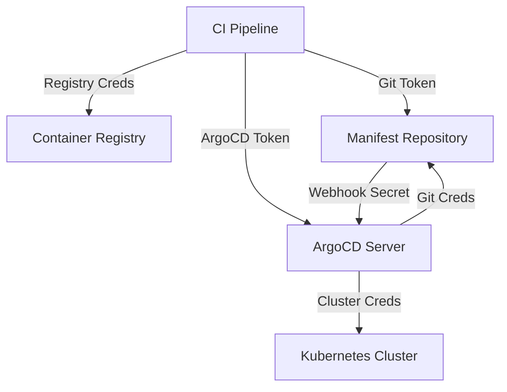
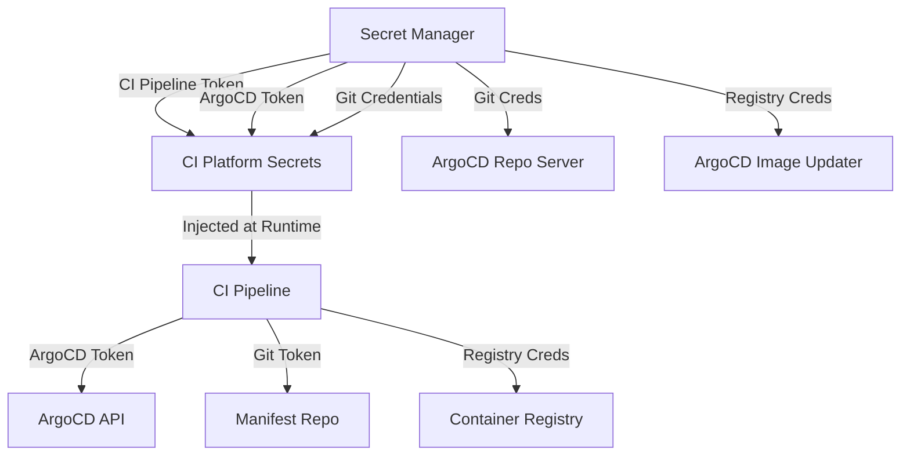

# How to Handle CI/CD Secrets for ArgoCD Integration

Author: [nawazdhandala](https://github.com/nawazdhandala)

Tags: ArgoCD, GitOps, Kubernetes, CI/CD, Security

Description: Learn how to securely manage CI/CD secrets for ArgoCD integration including API tokens, Git credentials, and registry passwords across GitHub Actions, GitLab CI, and Jenkins pipelines.

---

Integrating CI/CD pipelines with ArgoCD requires several secrets: ArgoCD API tokens, Git credentials for manifest repositories, container registry passwords, and more. Mishandling these secrets leads to security vulnerabilities. This guide covers best practices for managing every type of secret in the CI/CD to ArgoCD workflow.

## Types of Secrets in the ArgoCD CI/CD Workflow

A typical pipeline needs these secrets:

| Secret | Purpose | Where Used |
|--------|---------|------------|
| ArgoCD API Token | Authenticate CLI/API calls | CI pipeline deploy step |
| Git Token | Push to manifest repository | CI pipeline manifest update step |
| Registry Credentials | Push container images | CI pipeline build step |
| Webhook Secret | Verify webhook payloads | ArgoCD server |
| Cluster Credentials | Direct kubectl access | CI pipeline verification step |



## Managing ArgoCD API Tokens

### Creating Scoped Tokens

Always create dedicated, least-privilege tokens for CI/CD:

```bash
# Create a dedicated CI account
kubectl patch configmap argocd-cm -n argocd --type merge -p '{
  "data": {
    "accounts.ci-deploy": "apiKey"
  }
}'

# Set minimal RBAC - only sync and get for specific apps
kubectl patch configmap argocd-rbac-cm -n argocd --type merge -p '{
  "data": {
    "policy.csv": "p, ci-deploy, applications, sync, default/myapp-*, allow\np, ci-deploy, applications, get, default/myapp-*, allow\n"
  }
}'

# Generate the token
TOKEN=$(argocd account generate-token --account ci-deploy)
echo "Store this token securely: $TOKEN"
```

### Token Rotation

Rotate tokens regularly. Here is a script that generates a new token and updates CI secrets:

```bash
#!/bin/bash
# rotate-argocd-token.sh - Rotate CI/CD ArgoCD token
set -e

ACCOUNT="ci-deploy"

# Generate new token
NEW_TOKEN=$(argocd account generate-token --account $ACCOUNT)

# Update GitHub Actions secret
gh secret set ARGOCD_TOKEN --body "$NEW_TOKEN" --repo my-org/my-app

# Update GitLab CI variable
# curl -X PUT "https://gitlab.com/api/v4/projects/$PROJECT_ID/variables/ARGOCD_TOKEN" \
#   -H "PRIVATE-TOKEN: $GITLAB_TOKEN" \
#   -F "value=$NEW_TOKEN"

echo "Token rotated successfully"
```

### Using Project Tokens for Better Isolation

For multi-team environments, use project-scoped tokens:

```bash
# Create a role within the project
argocd proj role create production ci-deployer

# Add specific permissions
argocd proj role add-policy production ci-deployer \
  --action sync --permission allow --object "myapp-*"
argocd proj role add-policy production ci-deployer \
  --action get --permission allow --object "myapp-*"

# Generate a project-scoped token
argocd proj role create-token production ci-deployer --expires-in 720h
```

## Managing Git Credentials

### GitHub Personal Access Tokens

For pushing to manifest repositories:

```bash
# Create a fine-grained PAT with only repository contents write access
# Store it in your CI system's secret manager
gh secret set GH_MANIFEST_TOKEN --body "ghp_xxxxxxxxxxxx" --repo my-org/my-app
```

### GitHub App Authentication

GitHub Apps provide better security than personal access tokens:

```yaml
# GitHub Actions - Using a GitHub App for Git operations
- name: Generate token from GitHub App
  id: app-token
  uses: actions/create-github-app-token@v1
  with:
    app-id: ${{ vars.APP_ID }}
    private-key: ${{ secrets.APP_PRIVATE_KEY }}
    repositories: k8s-manifests

- name: Update manifests
  run: |
    git clone https://x-access-token:${{ steps.app-token.outputs.token }}@github.com/my-org/k8s-manifests.git
    # ... update manifests and push
```

### Deploy Keys for GitLab

```yaml
# GitLab CI - Using deploy keys
variables:
  GIT_SSH_COMMAND: "ssh -o StrictHostKeyChecking=no -i $SSH_PRIVATE_KEY_FILE"

deploy:
  script:
    - eval $(ssh-agent -s)
    - echo "$MANIFEST_REPO_SSH_KEY" | ssh-add -
    - git clone git@gitlab.com:my-org/k8s-manifests.git
    # ... update manifests and push
```

## CI Platform-Specific Secret Management

### GitHub Actions

```yaml
# Use GitHub Environments for production secrets
jobs:
  deploy-production:
    runs-on: ubuntu-latest
    environment: production  # Requires approval + has its own secrets
    steps:
      - name: Deploy
        env:
          ARGOCD_SERVER: ${{ secrets.ARGOCD_SERVER }}
          ARGOCD_AUTH_TOKEN: ${{ secrets.ARGOCD_TOKEN }}
          GH_TOKEN: ${{ secrets.MANIFEST_REPO_TOKEN }}
        run: |
          # Secrets are masked in logs automatically
          ./scripts/deploy.sh
```

### GitLab CI

```yaml
# Use protected and masked variables
# Settings > CI/CD > Variables:
# - ARGOCD_TOKEN (protected, masked)
# - ARGOCD_SERVER (protected)
# - MANIFEST_REPO_TOKEN (protected, masked)

deploy:
  stage: deploy
  only:
    - main  # Protected variables only available on protected branches
  script:
    - argocd app sync my-app --auth-token $ARGOCD_TOKEN --server $ARGOCD_SERVER --grpc-web
```

### Jenkins

```groovy
pipeline {
    agent any
    stages {
        stage('Deploy') {
            steps {
                // Use Jenkins Credentials Plugin
                withCredentials([
                    string(credentialsId: 'argocd-token', variable: 'ARGOCD_AUTH_TOKEN'),
                    string(credentialsId: 'argocd-server', variable: 'ARGOCD_SERVER'),
                    string(credentialsId: 'github-token', variable: 'GH_TOKEN')
                ]) {
                    sh '''
                        export ARGOCD_OPTS="--grpc-web"
                        argocd app sync my-app
                    '''
                }
            }
        }
    }
}
```

## Using External Secret Managers

For enhanced security, pull CI/CD secrets from external secret managers instead of storing them in the CI platform.

### AWS Secrets Manager

```yaml
# GitHub Actions
- name: Get ArgoCD token from AWS Secrets Manager
  uses: aws-actions/aws-secretsmanager-get-secrets@v2
  with:
    secret-ids: |
      ARGOCD_TOKEN,arn:aws:secretsmanager:us-east-1:123456789012:secret:argocd/ci-token

- name: Deploy
  run: |
    argocd app sync my-app --grpc-web
```

### HashiCorp Vault

```yaml
# GitHub Actions with Vault
- name: Get secrets from Vault
  uses: hashicorp/vault-action@v3
  with:
    url: https://vault.example.com
    method: jwt
    role: ci-deploy
    secrets: |
      secret/data/argocd/ci token | ARGOCD_AUTH_TOKEN;
      secret/data/github/manifest-repo token | GH_TOKEN;

- name: Deploy
  run: |
    argocd app sync my-app --grpc-web
```

## Preventing Secret Leaks

### Audit Pipeline Logs

Ensure secrets are not printed in pipeline logs:

```bash
# Bad - this might leak the token in error messages
argocd app sync my-app --auth-token $ARGOCD_TOKEN

# Better - use environment variable (CLI reads it automatically)
export ARGOCD_AUTH_TOKEN="$TOKEN"
argocd app sync my-app

# Always redirect sensitive output
argocd account generate-token --account ci > /dev/null 2>&1
```

### Use .gitignore for Local Development

```
# .gitignore
.env
.argocd-token
kubeconfig
*.pem
*.key
```

### Scan for Secrets in CI

```yaml
# Add a pre-push secret scan step
- name: Scan for secrets
  uses: trufflesecurity/trufflehog@v3
  with:
    extra_args: --only-verified --fail
```

## Secret Architecture Diagram

Here is how secrets should flow in a well-designed CI/CD to ArgoCD integration:



## Best Practices Summary

1. **Principle of least privilege** - Every secret should have the minimum permissions needed. CI tokens should only be able to sync specific applications.

2. **Rotate regularly** - Set up automated rotation for all tokens on a 30-to-90-day cycle.

3. **Use environment isolation** - Separate secrets for dev, staging, and production. Never share production credentials with development pipelines.

4. **Prefer external secret managers** - Use Vault, AWS Secrets Manager, or similar tools rather than storing secrets directly in CI platforms.

5. **Monitor and audit** - Track when secrets are accessed and by whom. For ArgoCD-specific monitoring, see [how to configure ArgoCD audit logging](https://oneuptime.com/blog/post/2026-01-25-rbac-policies-argocd/view).

6. **Never commit secrets to Git** - Use secret scanning tools to prevent accidental commits.

Proper secret management is the foundation of a secure CI/CD to ArgoCD integration. Take the time to set it up correctly, and your deployment pipeline will be both automated and secure.
