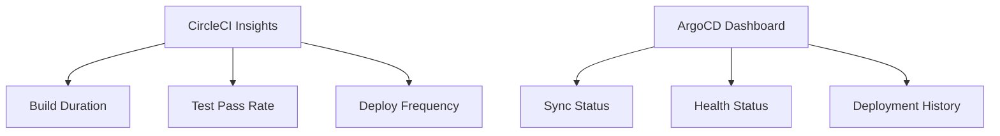

# How to Create a Complete CircleCI + ArgoCD Pipeline

Author: [nawazdhandala](https://github.com/nawazdhandala)

Tags: ArgoCD, GitOps, Kubernetes, CircleCI, CI/CD

Description: Learn how to build a complete CI/CD pipeline using CircleCI for continuous integration with ArgoCD for GitOps-based continuous deployment to Kubernetes clusters.

---

CircleCI is a cloud-native CI platform known for its speed and flexibility. Pairing it with ArgoCD creates a pipeline where CircleCI handles the fast, parallelized build and test steps, and ArgoCD takes care of the declarative Kubernetes deployment. The result is a clean separation of concerns with clear handoff between CI and CD.

This guide walks through building a production-ready CircleCI + ArgoCD pipeline.

## Architecture

CircleCI runs in the cloud (or on self-hosted runners). ArgoCD runs in your Kubernetes cluster. The deployment Git repository connects them:


## CircleCI Configuration

Here is the complete `.circleci/config.yml`:

```yaml
# .circleci/config.yml
version: 2.1

orbs:
  docker: circleci/docker@2.5.0

executors:
  node-executor:
    docker:
      - image: cimg/node:20.11
    resource_class: medium

  docker-executor:
    docker:
      - image: cimg/base:2024.01
    resource_class: medium

parameters:
  image-name:
    type: string
    default: ghcr.io/myorg/api-service

jobs:
  test:
    executor: node-executor
    parallelism: 4
    steps:
      - checkout
      - restore_cache:
          keys:
            - npm-deps-{{ checksum "package-lock.json" }}
            - npm-deps-
      - run:
          name: Install dependencies
          command: npm ci
      - save_cache:
          key: npm-deps-{{ checksum "package-lock.json" }}
          paths:
            - node_modules
      - run:
          name: Run tests
          command: |
            # Split tests across parallel containers
            TESTFILES=$(circleci tests glob "tests/**/*.test.js" | circleci tests split --split-by=timings)
            npx jest $TESTFILES --ci --reporters=jest-junit
          environment:
            JEST_JUNIT_OUTPUT_DIR: ./test-results
      - store_test_results:
          path: ./test-results
      - store_artifacts:
          path: ./test-results

  lint:
    executor: node-executor
    steps:
      - checkout
      - restore_cache:
          keys:
            - npm-deps-{{ checksum "package-lock.json" }}
      - run:
          name: Run linter
          command: npm run lint

  security-scan:
    executor: node-executor
    steps:
      - checkout
      - run:
          name: Run security audit
          command: npm audit --audit-level=high

  build-and-push:
    executor: docker-executor
    steps:
      - checkout
      - setup_remote_docker:
          version: 24.0
          docker_layer_caching: true
      - run:
          name: Build and push Docker image
          command: |
            SHORT_SHA=$(echo $CIRCLE_SHA1 | cut -c1-7)

            echo $GHCR_TOKEN | docker login ghcr.io -u $GHCR_USER --password-stdin

            docker build \
              -t << pipeline.parameters.image-name >>:${SHORT_SHA} \
              -t << pipeline.parameters.image-name >>:latest \
              .

            docker push << pipeline.parameters.image-name >>:${SHORT_SHA}
            docker push << pipeline.parameters.image-name >>:latest

            # Save the tag for downstream jobs
            echo "export IMAGE_TAG=${SHORT_SHA}" >> $BASH_ENV

  update-deployment:
    executor: docker-executor
    steps:
      - run:
          name: Update deployment manifests
          command: |
            SHORT_SHA=$(echo $CIRCLE_SHA1 | cut -c1-7)

            # Install Git
            sudo apt-get update && sudo apt-get install -y git

            # Configure SSH for deployment repo access
            mkdir -p ~/.ssh
            echo "$DEPLOY_SSH_KEY" | base64 -d > ~/.ssh/id_rsa
            chmod 600 ~/.ssh/id_rsa
            ssh-keyscan github.com >> ~/.ssh/known_hosts

            # Clone and update deployment repo
            git clone git@github.com:myorg/k8s-deployments.git
            cd k8s-deployments

            sed -i "s|image: << pipeline.parameters.image-name >>:.*|image: << pipeline.parameters.image-name >>:${SHORT_SHA}|" \
                apps/api-service/deployment.yaml

            git config user.name "CircleCI"
            git config user.email "ci@circleci.com"
            git add .
            git commit -m "Deploy api-service ${SHORT_SHA}

            CircleCI Build: ${CIRCLE_BUILD_URL}
            Commit: ${CIRCLE_SHA1}"
            git push origin main

workflows:
  build-test-deploy:
    jobs:
      # Test jobs run in parallel
      - test
      - lint
      - security-scan

      # Build after tests pass
      - build-and-push:
          requires:
            - test
            - lint
          filters:
            branches:
              only: main

      # Update deployment repo after image is pushed
      - update-deployment:
          requires:
            - build-and-push
          filters:
            branches:
              only: main
```

## ArgoCD Application

```yaml
# argocd/api-service-app.yaml
apiVersion: argoproj.io/v1alpha1
kind: Application
metadata:
  name: api-service
  namespace: argocd
spec:
  project: applications
  source:
    repoURL: https://github.com/myorg/k8s-deployments.git
    path: apps/api-service
    targetRevision: main
  destination:
    server: https://kubernetes.default.svc
    namespace: production
  syncPolicy:
    automated:
      selfHeal: true
      prune: true
    retry:
      limit: 3
      backoff:
        duration: 5s
        factor: 2
        maxDuration: 3m
```

## Multi-Environment Workflow

Extend the CircleCI workflow for staging and production with approval gates:

```yaml
workflows:
  build-test-deploy:
    jobs:
      - test
      - lint
      - security-scan

      - build-and-push:
          requires:
            - test
            - lint
          filters:
            branches:
              only: main

      # Deploy to staging automatically
      - update-deployment:
          name: deploy-staging
          requires:
            - build-and-push
          environment: staging

      # Wait for manual approval before production
      - hold-production:
          type: approval
          requires:
            - deploy-staging

      # Deploy to production after approval
      - update-deployment:
          name: deploy-production
          requires:
            - hold-production
          environment: production
```

Parameterize the update-deployment job for environments:

```yaml
  update-deployment:
    executor: docker-executor
    parameters:
      environment:
        type: string
        default: production
    steps:
      - run:
          name: Update << parameters.environment >> deployment
          command: |
            SHORT_SHA=$(echo $CIRCLE_SHA1 | cut -c1-7)

            git clone git@github.com:myorg/k8s-deployments.git
            cd k8s-deployments

            # Update environment-specific overlay
            cd apps/api-service/overlays/<< parameters.environment >>
            kustomize edit set image \
              "<< pipeline.parameters.image-name >>=<< pipeline.parameters.image-name >>:${SHORT_SHA}"

            cd /home/circleci/project/k8s-deployments
            git add .
            git commit -m "Deploy api-service ${SHORT_SHA} to << parameters.environment >>"
            git push origin main
```

## CircleCI Orb for ArgoCD Integration

Create a reusable CircleCI orb for the ArgoCD deployment step:

```yaml
# orbs/argocd-deploy/orb.yml
version: 2.1

description: Deploy to ArgoCD via GitOps manifest update

commands:
  update-manifest:
    parameters:
      deployment-repo:
        type: string
      image-name:
        type: string
      deployment-path:
        type: string
      ssh-key-env:
        type: env_var_name
        default: DEPLOY_SSH_KEY
    steps:
      - run:
          name: Update deployment manifest for ArgoCD
          command: |
            SHORT_SHA=$(echo $CIRCLE_SHA1 | cut -c1-7)

            mkdir -p ~/.ssh
            echo "${<< parameters.ssh-key-env >>}" | base64 -d > ~/.ssh/id_rsa
            chmod 600 ~/.ssh/id_rsa
            ssh-keyscan github.com >> ~/.ssh/known_hosts

            git clone << parameters.deployment-repo >> /tmp/deploy
            cd /tmp/deploy

            sed -i "s|image: << parameters.image-name >>:.*|image: << parameters.image-name >>:${SHORT_SHA}|" \
                << parameters.deployment-path >>/deployment.yaml

            git config user.name "CircleCI"
            git config user.email "ci@circleci.com"
            git add .
            git commit -m "Deploy $(basename << parameters.image-name >>) ${SHORT_SHA}"
            git push origin main
```

Usage in any project:

```yaml
version: 2.1

orbs:
  argocd: myorg/argocd-deploy@1.0.0

jobs:
  deploy:
    docker:
      - image: cimg/base:2024.01
    steps:
      - argocd/update-manifest:
          deployment-repo: git@github.com:myorg/k8s-deployments.git
          image-name: ghcr.io/myorg/api-service
          deployment-path: apps/api-service
```

## Caching for Faster Builds

CircleCI's caching and parallelism make builds fast. Here are the key optimizations:

```yaml
jobs:
  build-and-push:
    executor: docker-executor
    steps:
      - checkout

      # Use Docker layer caching for faster builds
      - setup_remote_docker:
          version: 24.0
          docker_layer_caching: true

      # Cache intermediate build layers
      - restore_cache:
          keys:
            - docker-layers-{{ checksum "Dockerfile" }}

      - run:
          name: Build with cache
          command: |
            docker build \
              --cache-from << pipeline.parameters.image-name >>:latest \
              --build-arg BUILDKIT_INLINE_CACHE=1 \
              -t << pipeline.parameters.image-name >>:$(echo $CIRCLE_SHA1 | cut -c1-7) \
              .
```

## Notifications

Configure CircleCI to send Slack notifications about the pipeline status:

```yaml
orbs:
  slack: circleci/slack@4.12.5

jobs:
  update-deployment:
    steps:
      # ... deployment steps ...
      - slack/notify:
          event: pass
          template: basic_success_1
          channel: deployments
      - slack/notify:
          event: fail
          template: basic_fail_1
          channel: deployments
```

## Pipeline Insights Dashboard

CircleCI provides pipeline insights out of the box. Combined with ArgoCD's application status, you get full visibility:



## Summary

CircleCI + ArgoCD creates a fast, reliable CI/CD pipeline. CircleCI's parallelism and caching make builds quick, while ArgoCD's GitOps model makes deployments safe and reversible. The CircleCI orb pattern lets you standardize the ArgoCD integration across all your projects. Every deployment is traceable from the CircleCI build to the Git commit to the ArgoCD sync.
