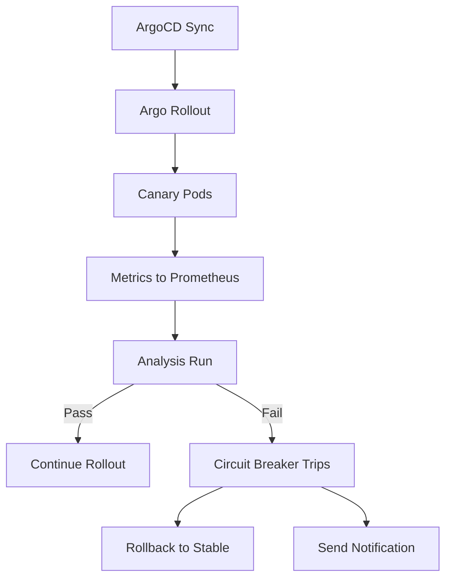

# How to Implement Circuit Breaker for Deployments with ArgoCD

Author: [nawazdhandala](https://github.com/nawazdhandala)

Tags: ArgoCD, GitOps, Kubernetes, Circuit Breaker, Deployments

Description: Learn how to implement circuit breaker patterns for Kubernetes deployments with ArgoCD to automatically halt rollouts when error thresholds are exceeded.

---

In electrical engineering, a circuit breaker trips to prevent damage when current exceeds safe levels. The same pattern applies to deployments - when error rates spike during a rollout, you want an automatic mechanism to stop the deployment and protect your users. ArgoCD combined with Argo Rollouts and Prometheus gives you a deployment circuit breaker that triggers automatically based on real-time metrics.

This guide covers implementing deployment circuit breakers that halt, rollback, or pause deployments when things go wrong.

## The Problem

Without a circuit breaker, a bad deployment follows this pattern:

1. New version is deployed
2. Error rates start climbing
3. Someone notices (maybe from alerts, maybe from customer complaints)
4. Manual investigation begins
5. Manual rollback is initiated
6. Users experience degraded service for 10 to 30 minutes

With a deployment circuit breaker:

1. New version starts rolling out
2. Error rates start climbing
3. Circuit breaker trips automatically (within 2 to 5 minutes)
4. Traffic is routed back to the stable version
5. Team is notified
6. Users experience minimal or no impact

## Architecture



## Step 1: Define the Circuit Breaker Analysis

Create an AnalysisTemplate that acts as your circuit breaker:

```yaml
# circuit-breaker-analysis.yaml
apiVersion: argoproj.io/v1alpha1
kind: AnalysisTemplate
metadata:
  name: deployment-circuit-breaker
spec:
  args:
    - name: service-name
    - name: namespace
    - name: error-threshold
      value: "0.05"  # 5% error rate trips the breaker
    - name: latency-threshold-ms
      value: "2000"  # 2 second p99 trips the breaker
  metrics:
    # Check 1: Error rate
    - name: error-rate-breaker
      interval: 1m
      failureCondition: result[0] >= asFloat(args.error-threshold)
      failureLimit: 2  # Trip after 2 consecutive failures
      provider:
        prometheus:
          address: http://prometheus.monitoring:9090
          query: |
            sum(rate(http_requests_total{
              namespace="{{args.namespace}}",
              service="{{args.service-name}}",
              code=~"5.."
            }[2m])) /
            sum(rate(http_requests_total{
              namespace="{{args.namespace}}",
              service="{{args.service-name}}"
            }[2m]))

    # Check 2: Latency spike
    - name: latency-breaker
      interval: 1m
      failureCondition: result[0] >= asFloat(args.latency-threshold-ms)
      failureLimit: 2
      provider:
        prometheus:
          address: http://prometheus.monitoring:9090
          query: |
            histogram_quantile(0.99,
              sum(rate(http_request_duration_seconds_bucket{
                namespace="{{args.namespace}}",
                service="{{args.service-name}}"
              }[2m])) by (le)
            ) * 1000

    # Check 3: Pod crash loop
    - name: crash-loop-breaker
      interval: 1m
      failureCondition: result[0] > 0
      failureLimit: 1  # Trip immediately on crash loops
      provider:
        prometheus:
          address: http://prometheus.monitoring:9090
          query: |
            sum(increase(kube_pod_container_status_restarts_total{
              namespace="{{args.namespace}}",
              container="{{args.service-name}}"
            }[3m]))

    # Check 4: OOM kills
    - name: oom-breaker
      interval: 1m
      failureCondition: result[0] > 0
      failureLimit: 1  # Trip immediately on OOM
      provider:
        prometheus:
          address: http://prometheus.monitoring:9090
          query: |
            sum(increase(kube_pod_container_status_last_terminated_reason{
              namespace="{{args.namespace}}",
              container="{{args.service-name}}",
              reason="OOMKilled"
            }[3m]))
```

This template checks four conditions, any one of which can trip the circuit breaker:

1. **Error rate** exceeds threshold for 2 consecutive minutes
2. **P99 latency** exceeds threshold for 2 consecutive minutes
3. **Pod crash loops** detected - trips immediately
4. **OOM kills** detected - trips immediately

## Step 2: Apply the Circuit Breaker to a Rollout

```yaml
# rollout-with-circuit-breaker.yaml
apiVersion: argoproj.io/v1alpha1
kind: Rollout
metadata:
  name: payment-service
  annotations:
    notifications.argoproj.io/subscribe.on-rollout-aborted.slack: critical-alerts
    notifications.argoproj.io/subscribe.on-analysis-run-failed.slack: deployment-alerts
spec:
  replicas: 6
  strategy:
    canary:
      canaryService: payment-service-canary
      stableService: payment-service-stable
      analysis:
        templates:
          - templateName: deployment-circuit-breaker
        startingStep: 0  # Start monitoring immediately
        args:
          - name: service-name
            value: payment-service
          - name: namespace
            value: payments
          - name: error-threshold
            value: "0.02"  # 2% for payment service (stricter)
          - name: latency-threshold-ms
            value: "1000"  # 1 second for payment service
      steps:
        - setWeight: 5
        - pause: { duration: 3m }
        - setWeight: 20
        - pause: { duration: 5m }
        - setWeight: 50
        - pause: { duration: 5m }
        - setWeight: 100
      maxSurge: "20%"
      maxUnavailable: 0
      abortScaleDownDelaySeconds: 30
      trafficRouting:
        nginx:
          stableIngress: payment-service-ingress
  template:
    metadata:
      labels:
        app: payment-service
    spec:
      containers:
        - name: payment
          image: myregistry/payment-service:v3.1.0
          ports:
            - containerPort: 8080
```

The `startingStep: 0` means the circuit breaker analysis starts running as soon as the first canary pod receives traffic.

## Step 3: Background Analysis for Running Services

You can also run circuit breaker analysis on services that are not currently being deployed. This catches issues from infrastructure changes, dependency failures, or configuration drift:

```yaml
# background-circuit-breaker.yaml
apiVersion: argoproj.io/v1alpha1
kind: Rollout
metadata:
  name: payment-service
spec:
  strategy:
    canary:
      analysis:
        templates:
          - templateName: deployment-circuit-breaker
        args:
          - name: service-name
            value: payment-service
          - name: namespace
            value: payments
      # Background analysis runs continuously, not just during deployments
      steps:
        - setWeight: 100
```

## Step 4: Multi-Service Circuit Breaker

For deployments that affect multiple services, create a composite analysis:

```yaml
# composite-circuit-breaker.yaml
apiVersion: argoproj.io/v1alpha1
kind: AnalysisTemplate
metadata:
  name: composite-circuit-breaker
spec:
  args:
    - name: namespace
  metrics:
    - name: overall-error-rate
      interval: 1m
      failureCondition: result[0] >= 0.05
      failureLimit: 2
      provider:
        prometheus:
          address: http://prometheus.monitoring:9090
          query: |
            sum(rate(http_requests_total{
              namespace="{{args.namespace}}",
              code=~"5.."
            }[2m])) /
            sum(rate(http_requests_total{
              namespace="{{args.namespace}}"
            }[2m]))

    - name: dependency-health
      interval: 1m
      failureCondition: result[0] < 1
      failureLimit: 3
      provider:
        prometheus:
          address: http://prometheus.monitoring:9090
          query: |
            min(up{
              namespace="{{args.namespace}}",
              job=~".*-service"
            })
```

## Step 5: Manual Circuit Breaker Override

Sometimes you need to manually trip or reset the circuit breaker. Use ArgoCD annotations:

```bash
# Manually abort a rollout (trip the circuit breaker)
kubectl argo rollouts abort payment-service -n payments

# Resume a paused rollout (reset the circuit breaker)
kubectl argo rollouts retry payment-service -n payments

# Promote canary to stable (override the circuit breaker)
kubectl argo rollouts promote payment-service -n payments
```

## Step 6: Notification Configuration

Set up notifications so the team knows when the circuit breaker trips:

```yaml
# argocd-notifications-cm
apiVersion: v1
kind: ConfigMap
metadata:
  name: argocd-notifications-cm
  namespace: argocd
data:
  template.circuit-breaker-tripped: |
    message: |
      Circuit breaker tripped for {{.app.metadata.name}}!
      Analysis failed: {{range .app.status.operationState.syncResult.resources}}
      {{.name}}: {{.status}}
      {{end}}
    slack:
      attachments: |
        [{
          "color": "#FF0000",
          "title": "Deployment Circuit Breaker Tripped",
          "text": "Rollout {{.app.metadata.name}} was automatically rolled back",
          "fields": [
            {"title": "Application", "value": "{{.app.metadata.name}}", "short": true},
            {"title": "Namespace", "value": "{{.app.spec.destination.namespace}}", "short": true}
          ]
        }]
```

## Circuit Breaker Tuning

The key parameters to tune are:

| Parameter | Conservative | Moderate | Aggressive |
|-----------|-------------|----------|------------|
| Error threshold | 1% | 5% | 10% |
| Latency threshold | 500ms | 2000ms | 5000ms |
| Failure limit | 1 | 2 | 3 |
| Check interval | 30s | 1m | 2m |

Start conservative and relax thresholds as you gain confidence in your metrics and deployment process.

## Best Practices

1. **Start with crash loop and OOM detection** - These are the most reliable signals and should trip the breaker immediately.

2. **Use different thresholds per service** - Payment services need stricter thresholds than internal admin tools.

3. **Account for metric lag** - Prometheus scrape intervals add latency. Set check intervals longer than your scrape interval.

4. **Test your circuit breaker** - Periodically deploy a known-bad version in staging to verify the breaker trips correctly.

5. **Alert on circuit breaker trips** - Every trip should trigger a notification so the team can investigate.

6. **Monitor circuit breaker false positives** - If the breaker trips too often on good deployments, your thresholds are too tight.

A deployment circuit breaker with ArgoCD turns reactive incident response into proactive protection. Instead of relying on humans to notice and respond to problems, the system automatically protects itself.
