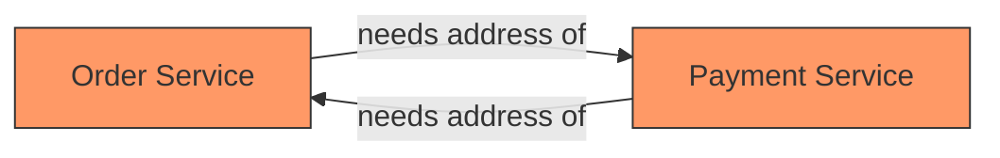

# How to Handle Circular Dependencies in ArgoCD Sync Waves

Author: [nawazdhandala](https://github.com/nawazdhandala)

Tags: ArgoCD, GitOps, Kubernetes, Sync Waves, Troubleshooting

Description: Learn how to identify and resolve circular dependencies in ArgoCD sync waves, where two resources each depend on the other, using practical strategies like decoupling, init containers.

---

Circular dependencies happen when Resource A needs Resource B to exist before it can deploy, and Resource B needs Resource A to exist before it can deploy. Neither can go first. Sync waves cannot solve this directly because you cannot assign a lower wave to both resources simultaneously. This guide covers how to identify circular dependencies and the practical strategies to break them.

## Identifying Circular Dependencies

Circular dependencies in Kubernetes manifests usually fall into a few categories.

The first is mutual service discovery. Service A needs to know Service B's address at startup, and Service B needs to know Service A's address at startup. Both reference each other through environment variables or ConfigMaps.



The second is operator-and-webhook dependencies. An operator installs a ValidatingWebhookConfiguration that validates its own CRDs. But the webhook needs the operator running to serve validation requests. If the webhook is installed before the operator is ready, CRD creation fails because the webhook endpoint is unavailable.

The third is cross-namespace RBAC. A service account in namespace A needs a RoleBinding in namespace B, but the RoleBinding references a ServiceAccount that exists in namespace A, which does not exist until namespace A is created.

## Strategy 1: Decouple with Kubernetes Service DNS

The most common circular dependency is service discovery. Service A and B reference each other. The fix is to rely on Kubernetes DNS rather than requiring the other service to exist at deployment time.

Kubernetes Services can be created before the Deployment that backs them. A Service with no matching pods simply returns no endpoints. The DNS record for the service exists as soon as the Service resource is created.

```yaml
# Wave -1: Create Services first (DNS records registered immediately)
apiVersion: v1
kind: Service
metadata:
  name: order-service
  namespace: production
  annotations:
    argocd.argoproj.io/sync-wave: "-1"
spec:
  selector:
    app: order-service
  ports:
    - port: 8080
---
apiVersion: v1
kind: Service
metadata:
  name: payment-service
  namespace: production
  annotations:
    argocd.argoproj.io/sync-wave: "-1"
spec:
  selector:
    app: payment-service
  ports:
    - port: 8080
---
# Wave 0: Deploy both services. Each can resolve the other via DNS.
apiVersion: apps/v1
kind: Deployment
metadata:
  name: order-service
  namespace: production
  annotations:
    argocd.argoproj.io/sync-wave: "0"
spec:
  replicas: 2
  selector:
    matchLabels:
      app: order-service
  template:
    metadata:
      labels:
        app: order-service
    spec:
      containers:
        - name: app
          image: myregistry/order-service:v1.0.0
          env:
            - name: PAYMENT_SERVICE_URL
              # DNS resolves even before payment pods are ready
              value: "http://payment-service.production.svc.cluster.local:8080"
---
apiVersion: apps/v1
kind: Deployment
metadata:
  name: payment-service
  namespace: production
  annotations:
    argocd.argoproj.io/sync-wave: "0"
spec:
  replicas: 2
  selector:
    matchLabels:
      app: payment-service
  template:
    metadata:
      labels:
        app: payment-service
    spec:
      containers:
        - name: app
          image: myregistry/payment-service:v1.0.0
          env:
            - name: ORDER_SERVICE_URL
              value: "http://order-service.production.svc.cluster.local:8080"
```

By creating Services in wave -1 and Deployments in wave 0, both pods can start with valid DNS entries. The services will not have endpoints until the pods are ready, but the DNS resolution works. The application code should handle transient connection failures with retries.

## Strategy 2: Init Containers for Readiness Waiting

When one service truly needs the other to be running before it can start, use an init container that waits for the dependency.

```yaml
apiVersion: apps/v1
kind: Deployment
metadata:
  name: order-service
  namespace: production
  annotations:
    argocd.argoproj.io/sync-wave: "0"
spec:
  replicas: 2
  selector:
    matchLabels:
      app: order-service
  template:
    metadata:
      labels:
        app: order-service
    spec:
      initContainers:
        - name: wait-for-payment
          image: busybox:1.36
          command:
            - sh
            - -c
            - |
              echo "Waiting for payment-service to be available..."
              until nslookup payment-service.production.svc.cluster.local; do
                echo "Still waiting..."
                sleep 2
              done
              echo "payment-service DNS is available"
      containers:
        - name: app
          image: myregistry/order-service:v1.0.0
          env:
            - name: PAYMENT_SERVICE_URL
              value: "http://payment-service.production.svc.cluster.local:8080"
```

With this approach, both Deployments can be in the same sync wave. The init container blocks until the dependency is resolvable. This does not technically break the circular dependency but it gracefully handles the startup order.

## Strategy 3: Split Into Separate Applications

When circular dependencies are between different subsystems, break them into separate ArgoCD Applications. Use sync waves at the Application level to control ordering.

```yaml
# app-of-apps.yaml
apiVersion: argoproj.io/v1alpha1
kind: Application
metadata:
  name: infrastructure
  namespace: argocd
  annotations:
    argocd.argoproj.io/sync-wave: "-1"
spec:
  project: default
  source:
    repoURL: https://github.com/myorg/infra.git
    targetRevision: main
    path: base-infrastructure/
  destination:
    server: https://kubernetes.default.svc
---
apiVersion: argoproj.io/v1alpha1
kind: Application
metadata:
  name: platform-services
  namespace: argocd
  annotations:
    argocd.argoproj.io/sync-wave: "0"
spec:
  project: default
  source:
    repoURL: https://github.com/myorg/infra.git
    targetRevision: main
    path: platform-services/
  destination:
    server: https://kubernetes.default.svc
---
apiVersion: argoproj.io/v1alpha1
kind: Application
metadata:
  name: application-workloads
  namespace: argocd
  annotations:
    argocd.argoproj.io/sync-wave: "1"
spec:
  project: default
  source:
    repoURL: https://github.com/myorg/apps.git
    targetRevision: main
    path: workloads/
  destination:
    server: https://kubernetes.default.svc
```

Each Application syncs independently, and the app-of-apps pattern with sync waves ensures they deploy in order.

## Strategy 4: Break the Webhook Circular Dependency

The operator-webhook circular dependency is particularly nasty. The operator's webhook needs to be running to validate resources, but the operator itself is a resource that might be validated by its own webhook.

The solution is to deploy the operator without the webhook first, then add the webhook.

```yaml
# Wave -1: Deploy the operator without webhook validation
apiVersion: apps/v1
kind: Deployment
metadata:
  name: cert-manager
  namespace: cert-manager
  annotations:
    argocd.argoproj.io/sync-wave: "-1"
spec:
  replicas: 1
  selector:
    matchLabels:
      app: cert-manager
  template:
    metadata:
      labels:
        app: cert-manager
    spec:
      containers:
        - name: cert-manager
          image: quay.io/jetstack/cert-manager-controller:v1.13.0
          args:
            - --v=2
---
# Wave 0: Add the webhook after the operator is running
apiVersion: admissionregistration.k8s.io/v1
kind: ValidatingWebhookConfiguration
metadata:
  name: cert-manager-webhook
  annotations:
    argocd.argoproj.io/sync-wave: "0"
webhooks:
  - name: webhook.cert-manager.io
    clientConfig:
      service:
        name: cert-manager-webhook
        namespace: cert-manager
        path: /validate
    rules:
      - apiGroups: ["cert-manager.io"]
        apiVersions: ["v1"]
        operations: ["CREATE", "UPDATE"]
        resources: ["certificates", "issuers"]
    failurePolicy: Fail
    sideEffects: None
    admissionReviewVersions: ["v1"]
```

Another option is to set `failurePolicy: Ignore` on the webhook temporarily, which allows resources to be created even when the webhook endpoint is unavailable. Then update it to `failurePolicy: Fail` once the operator is running. However, this creates a window where invalid resources could be created.

## Strategy 5: Use Replace Sync Strategy for Stuck Resources

Sometimes a circular dependency causes a sync to get stuck. Resources created in a previous sync attempt might block the current sync. The `Replace` sync option can help by deleting and recreating stuck resources.

```yaml
apiVersion: argoproj.io/v1alpha1
kind: Application
metadata:
  name: my-app
  namespace: argocd
spec:
  project: default
  source:
    repoURL: https://github.com/myorg/app.git
    targetRevision: main
    path: manifests/
  destination:
    server: https://kubernetes.default.svc
    namespace: production
  syncPolicy:
    syncOptions:
      - Replace=true  # Delete and recreate instead of apply
```

Use this sparingly. Replace causes downtime because resources are deleted before being recreated.

## General Rules for Avoiding Circular Dependencies

Design your Kubernetes manifests with a clear dependency tree. Resources should flow in one direction: infrastructure, then platform, then application.

Build applications that tolerate missing dependencies at startup. Use retries, circuit breakers, and readiness probes. If your app crashes because another service is not available, that is an application architecture problem, not just a deployment problem.

Keep webhook configurations separate from the resources they validate. Deploy the controller first, then the webhook.

Use Kubernetes DNS for service discovery instead of hardcoding IPs or requiring services to be running at deploy time.

When all else fails, split the circular dependency across multiple ArgoCD Applications. Each application can sync independently, and you can manually control the ordering through sync waves on the Application resources.

For background on sync waves, see the [ArgoCD sync waves guide](https://oneuptime.com/blog/post/2026-01-27-argocd-sync-waves/view). For debugging sync failures related to these issues, check the [ArgoCD sync debugging guide](https://oneuptime.com/blog/post/2026-02-02-argocd-sync-hooks/view).
