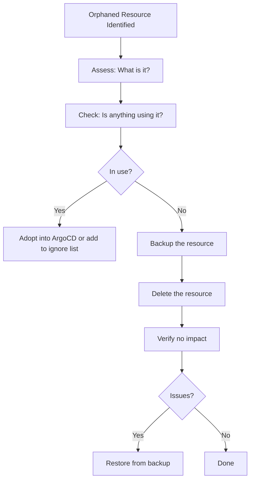

# How to Clean Up Orphaned Resources Safely in ArgoCD

Author: [nawazdhandala](https://github.com/nawazdhandala)

Tags: ArgoCD, GitOps, Kubernetes, Resource Management, Cleanup

Description: Learn safe procedures for cleaning up orphaned Kubernetes resources identified by ArgoCD, including assessment, backup, deletion strategies, and prevention.

---

You have enabled orphaned resource monitoring, tuned your ignore lists, and now you have a clear report of genuinely orphaned resources. The next step is cleanup. But deleting resources from a running cluster requires caution. A "orphaned" ConfigMap might be referenced by a running Pod. An old Secret might contain credentials that are still in use by a non-ArgoCD-managed process. Deleting the wrong resource can cause outages.

This guide walks you through a safe, methodical cleanup process for orphaned resources.

## The Safe Cleanup Process

Follow this process for every orphaned resource:



## Step 1: Get the Orphaned Resource List

Start by getting the full list of orphaned resources:

```bash
# Get orphaned resources for a project
argocd proj get production -o json | \
  jq -r '.status.orphanedResources[] | "\(.group)/\(.kind)/\(.name) in \(.namespace)"'
```

Organize them by category for systematic cleanup:

```bash
# Group by kind
argocd proj get production -o json | \
  jq -r '[.status.orphanedResources[] | .kind] | group_by(.) | .[] | "\(.[0]) (count: \(length))"'
```

## Step 2: Assess Each Resource

Before deleting anything, understand what the resource is and why it exists.

### Check Resource Details

```bash
# Get full resource details
kubectl get configmap debug-config -n production -o yaml

# Check resource age
kubectl get configmap debug-config -n production -o jsonpath='{.metadata.creationTimestamp}'

# Check who created it
kubectl get configmap debug-config -n production -o jsonpath='{.metadata.managedFields[0].manager}'

# Check for owner references (means something manages it)
kubectl get configmap debug-config -n production -o jsonpath='{.metadata.ownerReferences}'
```

### Check if the Resource Has Owner References

Resources with owner references are managed by a parent resource and will be garbage collected when the parent is deleted. They should generally be in your ignore list:

```bash
# Find orphaned resources WITH owner references (should be ignored, not deleted)
for resource in $(argocd proj get production -o json | jq -r '.status.orphanedResources[] | "\(.kind)/\(.name)"'); do
  kind=$(echo $resource | cut -d/ -f1)
  name=$(echo $resource | cut -d/ -f2)
  owners=$(kubectl get $kind $name -n production -o jsonpath='{.metadata.ownerReferences}' 2>/dev/null)
  if [ -n "$owners" ] && [ "$owners" != "null" ]; then
    echo "HAS OWNER: $resource -> $owners"
  fi
done
```

## Step 3: Check if Anything Uses the Resource

### ConfigMaps and Secrets

Check if any Pod, Deployment, or other workload references the ConfigMap or Secret:

```bash
RESOURCE_NAME="debug-config"
NAMESPACE="production"

# Check if any Pod mounts this ConfigMap
kubectl get pods -n $NAMESPACE -o json | \
  jq -r ".items[] | select(
    .spec.volumes[]? | select(
      .configMap.name == \"$RESOURCE_NAME\"
    )
  ) | .metadata.name"

# Check if any Pod uses it as an env source
kubectl get pods -n $NAMESPACE -o json | \
  jq -r ".items[] | select(
    .spec.containers[].envFrom[]? | select(
      .configMapRef.name == \"$RESOURCE_NAME\"
    )
  ) | .metadata.name"

# Check if any Pod uses individual keys from it
kubectl get pods -n $NAMESPACE -o json | \
  jq -r ".items[] | select(
    .spec.containers[].env[]? | select(
      .valueFrom.configMapKeyRef.name == \"$RESOURCE_NAME\"
    )
  ) | .metadata.name"
```

### Services

Check if the Service has active endpoints and receives traffic:

```bash
# Check endpoints
kubectl get endpoints my-service -n production

# Check if any Ingress references this Service
kubectl get ingress -n production -o json | \
  jq -r ".items[] | select(
    .spec.rules[].http.paths[].backend.service.name == \"my-service\"
  ) | .metadata.name"
```

### PersistentVolumeClaims

Check if any Pod uses the PVC:

```bash
PVC_NAME="old-data"
NAMESPACE="production"

kubectl get pods -n $NAMESPACE -o json | \
  jq -r ".items[] | select(
    .spec.volumes[]? | select(
      .persistentVolumeClaim.claimName == \"$PVC_NAME\"
    )
  ) | .metadata.name"
```

### Deployments and StatefulSets

Check if they have running Pods:

```bash
kubectl get deployment test-app -n production -o jsonpath='{.status.readyReplicas}'
```

## Step 4: Backup Before Deletion

Always backup resources before deleting them. This gives you a recovery path:

```bash
# Create a backup directory
mkdir -p /tmp/orphan-backups/$(date +%Y-%m-%d)

# Backup individual resources
kubectl get configmap debug-config -n production -o yaml > \
  /tmp/orphan-backups/$(date +%Y-%m-%d)/configmap-debug-config.yaml

kubectl get secret old-api-key -n production -o yaml > \
  /tmp/orphan-backups/$(date +%Y-%m-%d)/secret-old-api-key.yaml

# Backup all orphaned resources at once
for resource in $(argocd proj get production -o json | \
  jq -r '.status.orphanedResources[] | "\(.kind)/\(.name)"'); do
  kind=$(echo $resource | cut -d/ -f1)
  name=$(echo $resource | cut -d/ -f2)
  filename=$(echo "${kind}-${name}" | tr '[:upper:]' '[:lower:]')
  kubectl get $kind $name -n production -o yaml > \
    "/tmp/orphan-backups/$(date +%Y-%m-%d)/${filename}.yaml" 2>/dev/null
  echo "Backed up: $resource"
done
```

## Step 5: Delete Orphaned Resources

### Deleting Individual Resources

```bash
# Delete with confirmation prompt
kubectl delete configmap debug-config -n production

# Delete with a grace period
kubectl delete deployment test-app -n production --grace-period=60

# Dry-run first to see what would happen
kubectl delete configmap debug-config -n production --dry-run=client
```

### Batch Deletion by Type

```bash
# Delete all orphaned ConfigMaps (after backing up)
argocd proj get production -o json | \
  jq -r '.status.orphanedResources[] | select(.kind == "ConfigMap") | .name' | \
  xargs -I {} kubectl delete configmap {} -n production
```

### Scripted Safe Deletion

```bash
#!/bin/bash
# safe-delete-orphans.sh

NAMESPACE="production"
PROJECT="production"
BACKUP_DIR="/tmp/orphan-backups/$(date +%Y-%m-%d)"
mkdir -p $BACKUP_DIR

echo "=== Orphaned Resource Cleanup ==="
echo "Project: $PROJECT"
echo "Namespace: $NAMESPACE"
echo "Backup directory: $BACKUP_DIR"
echo ""

# Get orphaned resources
argocd proj get $PROJECT -o json | \
  jq -r '.status.orphanedResources[] | "\(.kind) \(.name)"' | \
  while read kind name; do
    echo "Processing: $kind/$name"

    # Backup
    filename=$(echo "${kind}-${name}" | tr '[:upper:]' '[:lower:]')
    kubectl get $kind $name -n $NAMESPACE -o yaml > "$BACKUP_DIR/${filename}.yaml" 2>/dev/null

    # Check age
    age=$(kubectl get $kind $name -n $NAMESPACE -o jsonpath='{.metadata.creationTimestamp}')
    echo "  Created: $age"

    # Prompt for deletion
    read -p "  Delete $kind/$name? (y/n): " confirm
    if [ "$confirm" = "y" ]; then
      kubectl delete $kind $name -n $NAMESPACE
      echo "  Deleted."
    else
      echo "  Skipped."
    fi
    echo ""
  done
```

## Step 6: Verify No Impact

After deleting resources, verify that nothing broke:

```bash
# Check for new pod errors
kubectl get pods -n production | grep -v Running | grep -v Completed

# Check for events indicating problems
kubectl events -n production --types=Warning

# Check ArgoCD application health
argocd app list -o json | \
  jq '.[] | select(.spec.destination.namespace == "production") | {name: .metadata.name, health: .status.health.status, sync: .status.sync.status}'

# Monitor for a few minutes
watch -n 10 'kubectl get pods -n production | grep -v Running | grep -v Completed'
```

## Step 7: Restore if Needed

If something broke after deletion:

```bash
# Restore a single resource
kubectl apply -f /tmp/orphan-backups/2026-02-26/configmap-debug-config.yaml

# Restore all backups
kubectl apply -f /tmp/orphan-backups/2026-02-26/
```

## Adopting Orphans into ArgoCD

Sometimes an orphaned resource is legitimate and should be managed by ArgoCD. Instead of deleting it, add it to an ArgoCD application:

### Option 1: Add to Existing Application's Git Repo

Copy the resource manifest to the appropriate directory in Git and commit:

```bash
# Get the manifest
kubectl get configmap app-config -n production -o yaml > /tmp/configmap.yaml

# Clean up runtime fields
kubectl get configmap app-config -n production -o yaml | \
  kubectl neat > manifests/configmap-app-config.yaml

# Commit and push
git add manifests/configmap-app-config.yaml
git commit -m "Adopt orphaned ConfigMap into ArgoCD management"
git push
```

### Option 2: Create a New ArgoCD Application

For resources that do not fit into existing applications:

```yaml
apiVersion: argoproj.io/v1alpha1
kind: Application
metadata:
  name: cluster-configs
  namespace: argocd
spec:
  project: production
  source:
    repoURL: https://github.com/myorg/cluster-configs.git
    targetRevision: main
    path: production
  destination:
    server: https://kubernetes.default.svc
    namespace: production
  syncPolicy:
    automated:
      selfHeal: true
```

## Preventing Future Orphans

### Enforce GitOps Workflow

Use admission webhooks to prevent manual resource creation:

```yaml
# OPA Gatekeeper policy to require ArgoCD labels
apiVersion: templates.gatekeeper.sh/v1
kind: ConstraintTemplate
metadata:
  name: requireargolabel
spec:
  crd:
    spec:
      names:
        kind: RequireArgoLabel
  targets:
    - target: admission.k8s.gatekeeper.sh
      rego: |
        package requireargolabel
        violation[{"msg": msg}] {
          not input.review.object.metadata.labels["app.kubernetes.io/instance"]
          msg := "All resources must be managed by ArgoCD. Add app.kubernetes.io/instance label."
        }
```

### Enable Prune on Applications

Ensure ArgoCD cleans up resources when they are removed from Git:

```yaml
syncPolicy:
  automated:
    prune: true
    selfHeal: true
```

### Use Application Finalizers

Finalizers ensure all resources are deleted when an ArgoCD application is deleted:

```yaml
metadata:
  finalizers:
    - resources-finalizer.argocd.argoproj.io
```

## Best Practices

1. **Never delete without backup** - Always export the resource YAML before deletion
2. **Check dependencies first** - Verify nothing references the resource
3. **Delete in small batches** - Clean up a few resources at a time, verify, then continue
4. **Prioritize by risk** - Delete low-risk resources (old Events, completed Jobs) first
5. **Schedule regular cleanup** - Monthly or quarterly cleanup sessions prevent accumulation
6. **Automate the assessment** - Build scripts that check for references before flagging for deletion
7. **Adopt when appropriate** - If a resource is needed, bring it under ArgoCD management rather than leaving it orphaned

For more on orphaned resource monitoring, see [How to Enable Orphaned Resource Monitoring](https://oneuptime.com/blog/post/2026-02-26-argocd-orphaned-resource-monitoring/view) and [How to Configure Orphaned Resource Warnings](https://oneuptime.com/blog/post/2026-02-26-argocd-orphaned-resource-warnings/view).
