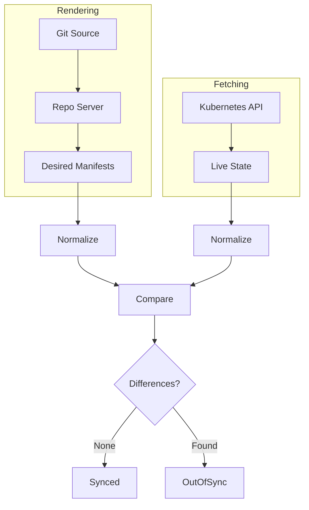

# How to Use Client-Side Diff in ArgoCD

Author: [nawazdhandala](https://github.com/nawazdhandala)

Tags: ArgoCD, GitOps, Kubernetes, Diff Strategy, Troubleshooting

Description: Learn how ArgoCD client-side diff works, when to use it, and how to configure normalization to reduce false OutOfSync detections in your applications.

---

Client-side diff is ArgoCD's original and default diff strategy. It computes the difference between your desired state (from Git) and the live state (from the cluster) entirely within ArgoCD's processes, without involving the Kubernetes API server. While server-side diff is becoming the recommended approach, client-side diff remains relevant for older clusters and provides important control over diff normalization.

## How Client-Side Diff Works

When ArgoCD uses client-side diff, the comparison happens in these steps:

1. **Manifest rendering**: The repo server renders manifests from your Git source (Helm template, Kustomize build, or plain YAML)
2. **State fetching**: The application controller fetches the live resource state from the Kubernetes API
3. **Normalization**: Both the desired and live states are normalized to remove known runtime fields
4. **Comparison**: The normalized states are compared field by field
5. **Result**: Any remaining differences mean the application is OutOfSync



## When Client-Side Diff Is Appropriate

Client-side diff works well in these scenarios:

- **Kubernetes versions before 1.22** where server-side apply is not GA
- **Simple manifests** that do not trigger complex defaulting
- **Strict control** over exactly what ArgoCD considers a diff
- **Restricted API server access** where dry-run requests are not allowed
- **Legacy configurations** with extensive `ignoreDifferences` that work reliably

## Understanding Normalization

Normalization is the key to making client-side diff work. ArgoCD removes known runtime fields before comparison so they do not cause false diffs.

### Built-in Normalizations

ArgoCD automatically normalizes:

- `metadata.resourceVersion`
- `metadata.uid`
- `metadata.selfLink`
- `metadata.creationTimestamp`
- `metadata.generation`
- `metadata.managedFields`
- `status` (for most resources)
- `metadata.annotations["kubectl.kubernetes.io/last-applied-configuration"]`

These fields are set by the Kubernetes API server at runtime and should never be in your Git manifests.

### Custom Normalization

For fields that ArgoCD does not automatically normalize, you configure `ignoreDifferences`:

```yaml
apiVersion: argoproj.io/v1alpha1
kind: Application
metadata:
  name: my-app
  namespace: argocd
spec:
  ignoreDifferences:
    # Ignore deployment revision annotation
    - group: apps
      kind: Deployment
      jsonPointers:
        - /metadata/annotations/deployment.kubernetes.io~1revision

    # Ignore generated fields on Services
    - group: ""
      kind: Service
      jsonPointers:
        - /spec/clusterIP
        - /spec/clusterIPs

    # Ignore HPA-managed replicas
    - group: apps
      kind: Deployment
      jsonPointers:
        - /spec/replicas
```

## Common False Diff Scenarios and Fixes

### Scenario 1: Webhook-Injected Sidecars

Admission webhooks (like Istio, Linkerd, Vault Agent) inject containers and volumes:

```yaml
ignoreDifferences:
  - group: apps
    kind: Deployment
    jqPathExpressions:
      # Ignore Istio-injected sidecar
      - '.spec.template.spec.containers[] | select(.name == "istio-proxy")'
      # Ignore injected init containers
      - '.spec.template.spec.initContainers[] | select(.name == "istio-init")'
      # Ignore injected volumes
      - '.spec.template.spec.volumes[] | select(.name | startswith("istio"))'
```

### Scenario 2: Default Values Added by API Server

When you omit optional fields, the API server fills them in:

```yaml
ignoreDifferences:
  - group: apps
    kind: Deployment
    jsonPointers:
      - /spec/revisionHistoryLimit
      - /spec/progressDeadlineSeconds
      - /spec/template/spec/terminationGracePeriodSeconds
      - /spec/template/spec/dnsPolicy
      - /spec/template/spec/securityContext
```

### Scenario 3: Operator-Managed Fields

When a Kubernetes operator modifies resources it manages:

```yaml
ignoreDifferences:
  # Cert-manager adds status and metadata to Certificate resources
  - group: cert-manager.io
    kind: Certificate
    jsonPointers:
      - /status

  # External Secrets Operator modifies the Secret data
  - group: ""
    kind: Secret
    name: my-external-secret
    jsonPointers:
      - /data
```

### Scenario 4: Service with Generated ClusterIP

```yaml
ignoreDifferences:
  - group: ""
    kind: Service
    jsonPointers:
      - /spec/clusterIP
      - /spec/clusterIPs
      - /spec/sessionAffinity
```

## System-Level Diff Customization

Instead of configuring ignoreDifferences per application, set system-wide defaults in the `argocd-cm` ConfigMap:

```yaml
apiVersion: v1
kind: ConfigMap
metadata:
  name: argocd-cm
  namespace: argocd
data:
  # Ignore specific fields for all resources of a type
  resource.customizations.ignoreDifferences.all: |
    managedFields:
      - manager: kube-controller-manager
      - manager: rancher
    jsonPointers:
      - /metadata/annotations/kubectl.kubernetes.io~1last-applied-configuration

  resource.customizations.ignoreDifferences.apps_Deployment: |
    jsonPointers:
      - /spec/replicas
    jqPathExpressions:
      - '.spec.template.spec.containers[]?.resources'

  resource.customizations.ignoreDifferences.admissionregistration.k8s.io_MutatingWebhookConfiguration: |
    jqPathExpressions:
      - '.webhooks[]?.clientConfig.caBundle'
```

## Understanding JSON Pointers vs JQ Expressions

Client-side diff supports two methods for specifying fields to ignore.

### JSON Pointers (RFC 6901)

Simple path-based syntax for pointing to specific fields:

```yaml
jsonPointers:
  - /spec/replicas                           # Direct field
  - /metadata/annotations/my.annotation      # Nested field
  - /spec/template/spec/containers/0/image   # Array index
  - /metadata/annotations/deployment.kubernetes.io~1revision  # Escaped slash
```

JSON pointers are straightforward but cannot express conditional logic.

### JQ Path Expressions

JQ expressions offer more flexibility:

```yaml
jqPathExpressions:
  # Ignore a specific container by name
  - '.spec.template.spec.containers[] | select(.name == "sidecar")'

  # Ignore all annotations matching a pattern
  - '.metadata.annotations | to_entries[] | select(.key | startswith("example.com/"))'

  # Ignore specific environment variables
  - '.spec.template.spec.containers[].env[] | select(.name == "GENERATED_VAR")'
```

JQ expressions are powerful for conditional ignoring but are harder to debug.

## Debugging Client-Side Diff

When client-side diff produces unexpected results:

```bash
# View the full diff output
argocd app diff my-app

# View the diff in JSON format for easier parsing
argocd app diff my-app --local /path/to/manifests

# Check the normalized desired state
argocd app manifests my-app --source git

# Check the normalized live state
argocd app manifests my-app --source live
```

You can also compare manifests manually:

```bash
# Export desired state
argocd app manifests my-app --source git > desired.yaml

# Export live state
argocd app manifests my-app --source live > live.yaml

# Compare
diff desired.yaml live.yaml
```

## Performance Considerations

Client-side diff is generally faster than server-side diff because it does not make additional API server requests. The diff computation happens in the application controller's memory:

- **Memory**: The controller holds both desired and live states in memory during comparison
- **CPU**: Normalization and comparison are CPU-intensive for applications with many resources
- **Network**: Fetching live state requires API server requests, but no dry-run apply requests

For applications with hundreds of resources, client-side diff is faster than server-side diff.

## Combining Client-Side Diff with RespectIgnoreDifferences

The `RespectIgnoreDifferences` sync option prevents ArgoCD from overwriting fields that are configured in `ignoreDifferences`:

```yaml
apiVersion: argoproj.io/v1alpha1
kind: Application
metadata:
  name: my-app
  namespace: argocd
spec:
  ignoreDifferences:
    - group: apps
      kind: Deployment
      jsonPointers:
        - /spec/replicas
  syncPolicy:
    syncOptions:
      - RespectIgnoreDifferences=true
```

Without this option, syncing the application would revert the ignored fields to the Git values. With it, ArgoCD leaves those fields as-is during sync.

## Best Practices for Client-Side Diff

1. **Start minimal**: Only add ignoreDifferences for fields that actually cause problems
2. **Use system-level defaults**: Configure common ignores globally instead of per-application
3. **Prefer jsonPointers**: They are simpler and easier to understand than JQ expressions
4. **Document your ignores**: Add comments explaining why each field is ignored
5. **Review periodically**: Some ignores may become unnecessary as your manifests evolve
6. **Consider server-side diff**: If you find yourself adding many ignoreDifferences, server-side diff might be a better approach

Client-side diff gives you explicit control over what ArgoCD considers a difference. While it requires more configuration than server-side diff, it remains a reliable choice when you need predictable, Kubernetes-version-independent diff behavior. For a comparison of both strategies, see [choosing the right diff strategy](https://oneuptime.com/blog/post/2026-02-26-argocd-choose-right-diff-strategy/view).
