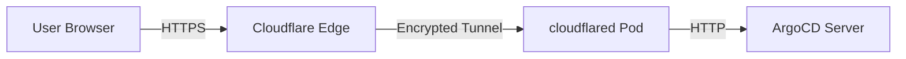

# How to Configure ArgoCD with Cloudflare Tunnel

Author: [nawazdhandala](https://github.com/nawazdhandala)

Tags: ArgoCD, GitOps, Kubernetes, Cloudflare, Networking

Description: Expose ArgoCD securely through Cloudflare Tunnel without opening inbound ports, with Zero Trust access policies and automatic TLS encryption.

---

Cloudflare Tunnel (formerly Argo Tunnel) lets you expose ArgoCD to the internet without opening any inbound ports on your firewall or load balancer. The tunnel creates an outbound-only connection from your cluster to Cloudflare's edge network, and Cloudflare handles TLS, DDoS protection, and access control. This is one of the most secure ways to expose ArgoCD, especially for teams that want to avoid managing ingress controllers and certificates.

## How Cloudflare Tunnel Works

Instead of the traditional model where incoming traffic reaches your cluster through an ingress:



The `cloudflared` daemon runs inside your cluster and establishes an outbound connection to Cloudflare. No inbound ports, no load balancer, no ingress controller needed. Cloudflare routes traffic from your domain through the tunnel to ArgoCD.

## Prerequisites

- A Kubernetes cluster with ArgoCD installed
- A Cloudflare account (free tier works)
- A domain name managed by Cloudflare DNS
- `cloudflared` CLI installed locally (for initial setup)

## Step 1: Create the Tunnel

Create a Cloudflare Tunnel from your local machine:

```bash
# Login to Cloudflare
cloudflared tunnel login

# Create a new tunnel
cloudflared tunnel create argocd-tunnel

# This outputs a tunnel ID and creates a credentials file
# Note the tunnel ID: xxxxxxxx-xxxx-xxxx-xxxx-xxxxxxxxxxxx
```

## Step 2: Create DNS Record

Route your domain to the tunnel:

```bash
# Create a DNS CNAME record pointing to the tunnel
cloudflared tunnel route dns argocd-tunnel argocd.yourcompany.com
```

This creates a CNAME record: `argocd.yourcompany.com -> <tunnel-id>.cfargotunnel.com`

## Step 3: Create Kubernetes Secret

Store the tunnel credentials in your cluster:

```bash
# The credentials file was created at ~/.cloudflared/<tunnel-id>.json
kubectl create secret generic cloudflare-tunnel-credentials \
  --namespace argocd \
  --from-file=credentials.json=$HOME/.cloudflared/<tunnel-id>.json
```

## Step 4: Deploy cloudflared in the Cluster

Create a ConfigMap for the tunnel configuration:

```yaml
apiVersion: v1
kind: ConfigMap
metadata:
  name: cloudflare-tunnel-config
  namespace: argocd
data:
  config.yaml: |
    tunnel: <your-tunnel-id>
    credentials-file: /etc/cloudflared/credentials.json
    # No TLS verification needed since ArgoCD is in insecure mode
    no-tls-verify: true
    ingress:
      - hostname: argocd.yourcompany.com
        service: http://argocd-server.argocd.svc.cluster.local:80
      # Catch-all rule (required)
      - service: http_status:404
```

Deploy cloudflared as a Deployment:

```yaml
apiVersion: apps/v1
kind: Deployment
metadata:
  name: cloudflared
  namespace: argocd
  labels:
    app: cloudflared
spec:
  replicas: 2
  selector:
    matchLabels:
      app: cloudflared
  template:
    metadata:
      labels:
        app: cloudflared
    spec:
      containers:
        - name: cloudflared
          image: cloudflare/cloudflared:latest
          args:
            - tunnel
            - --config
            - /etc/cloudflared/config.yaml
            - run
          volumeMounts:
            - name: config
              mountPath: /etc/cloudflared/config.yaml
              subPath: config.yaml
              readOnly: true
            - name: credentials
              mountPath: /etc/cloudflared/credentials.json
              subPath: credentials.json
              readOnly: true
          resources:
            requests:
              cpu: 50m
              memory: 64Mi
            limits:
              cpu: 200m
              memory: 128Mi
          livenessProbe:
            httpGet:
              path: /ready
              port: 2000
            initialDelaySeconds: 10
            periodSeconds: 10
      volumes:
        - name: config
          configMap:
            name: cloudflare-tunnel-config
        - name: credentials
          secret:
            secretName: cloudflare-tunnel-credentials
```

## Step 5: Configure ArgoCD

Set ArgoCD to insecure mode since cloudflared connects over HTTP inside the cluster:

```yaml
apiVersion: v1
kind: ConfigMap
metadata:
  name: argocd-cmd-params-cm
  namespace: argocd
data:
  server.insecure: "true"
```

Set the ArgoCD external URL:

```yaml
apiVersion: v1
kind: ConfigMap
metadata:
  name: argocd-cm
  namespace: argocd
data:
  url: https://argocd.yourcompany.com
```

```bash
kubectl apply -f argocd-cmd-params-cm.yaml
kubectl apply -f argocd-cm.yaml
kubectl rollout restart deployment argocd-server -n argocd
```

## Step 6: Add Cloudflare Access (Zero Trust)

Cloudflare Access adds an authentication layer in front of ArgoCD. Users must authenticate through Cloudflare before reaching ArgoCD:

```bash
# Using the Cloudflare dashboard:
# 1. Go to Zero Trust > Access > Applications
# 2. Create a new Self-hosted application
# 3. Set the application domain: argocd.yourcompany.com
# 4. Configure access policies
```

Or using the Cloudflare API:

```bash
# Create an Access application
curl -X POST "https://api.cloudflare.com/client/v4/accounts/<account-id>/access/apps" \
  -H "Authorization: Bearer <api-token>" \
  -H "Content-Type: application/json" \
  --data '{
    "name": "ArgoCD",
    "domain": "argocd.yourcompany.com",
    "type": "self_hosted",
    "session_duration": "24h",
    "policies": [
      {
        "name": "Allow team",
        "decision": "allow",
        "include": [
          {
            "email_domain": {
              "domain": "yourcompany.com"
            }
          }
        ]
      }
    ]
  }'
```

## Handling gRPC for CLI Access

The ArgoCD CLI uses gRPC, which Cloudflare Tunnel supports. Configure the CLI to use `--grpc-web`:

```bash
# Login through the tunnel
argocd login argocd.yourcompany.com --grpc-web

# If using Cloudflare Access, you may need to use a service token
argocd login argocd.yourcompany.com \
  --grpc-web \
  --header "CF-Access-Client-Id: <service-token-id>" \
  --header "CF-Access-Client-Secret: <service-token-secret>"
```

Create a Cloudflare Access service token for CI/CD:

```bash
# In the Cloudflare dashboard:
# Zero Trust > Access > Service Auth > Service Tokens
# Create a new service token and note the ID and secret
```

## Managing the Tunnel with GitOps

You can manage the Cloudflare Tunnel configuration through ArgoCD itself (a bit meta, but it works):

```yaml
# Store tunnel config in your GitOps repo
# repo/argocd-tunnel/config.yaml
apiVersion: v1
kind: ConfigMap
metadata:
  name: cloudflare-tunnel-config
  namespace: argocd
data:
  config.yaml: |
    tunnel: <tunnel-id>
    credentials-file: /etc/cloudflared/credentials.json
    ingress:
      - hostname: argocd.yourcompany.com
        service: http://argocd-server.argocd.svc.cluster.local:80
      - service: http_status:404
```

## Verifying the Setup

```bash
# Check cloudflared pods
kubectl get pods -n argocd -l app=cloudflared

# Check cloudflared logs
kubectl logs -n argocd -l app=cloudflared

# Check tunnel status in Cloudflare dashboard
cloudflared tunnel info argocd-tunnel

# Test access
curl -I https://argocd.yourcompany.com

# Test CLI
argocd login argocd.yourcompany.com --grpc-web
```

## Troubleshooting

**Tunnel Not Connecting**: Check cloudflared logs and verify the credentials secret is mounted correctly:

```bash
kubectl logs -n argocd -l app=cloudflared
kubectl exec -n argocd deploy/cloudflared -- ls /etc/cloudflared/
```

**502 Bad Gateway**: cloudflared cannot reach the ArgoCD server. Verify the service URL in the config:

```bash
kubectl exec -n argocd deploy/cloudflared -- curl -s http://argocd-server.argocd.svc.cluster.local:80/healthz
```

**Cloudflare Access Blocking CLI**: Create a service token and pass the headers with the CLI command. Or create a bypass policy for the API paths used by the CLI.

**DNS Not Resolving**: Verify the CNAME record was created:

```bash
dig argocd.yourcompany.com CNAME
```

For alternative networking approaches, see [ArgoCD with Nginx Ingress](https://oneuptime.com/blog/post/2026-02-26-argocd-nginx-ingress/view) and [ArgoCD with custom domain](https://oneuptime.com/blog/post/2026-02-26-argocd-custom-domain/view).
