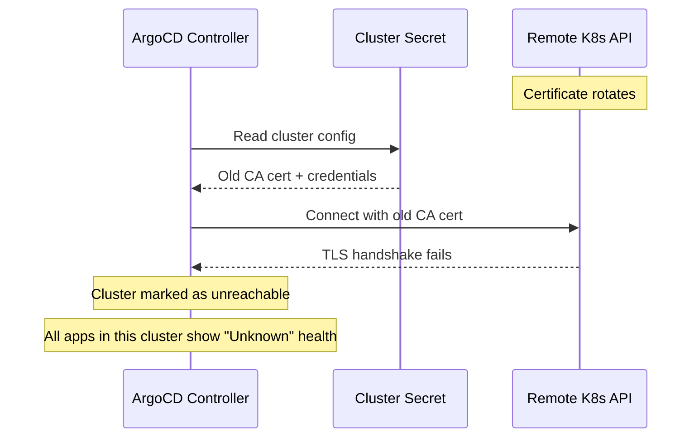

# How to Handle Cluster Certificate Rotation in ArgoCD

Author: [nawazdhandala](https://github.com/nawazdhandala)

Tags: ArgoCD, GitOps, Kubernetes, TLS, Security

Description: Learn how to handle Kubernetes cluster certificate rotation in ArgoCD without breaking GitOps workflows, including automated detection and credential updates.

---

Kubernetes clusters use TLS certificates for API server authentication, and these certificates expire. When they rotate, ArgoCD loses the ability to connect to managed clusters unless you update the stored credentials. Certificate rotation is one of the most common causes of unexpected ArgoCD cluster disconnections, and handling it properly is essential for production stability.

## How ArgoCD Stores Cluster Credentials

When you add a cluster to ArgoCD, it stores the connection details in a Kubernetes Secret in the argocd namespace. This secret includes the API server URL, authentication credentials, and the CA certificate used to verify the cluster's TLS certificate.

```bash
# View the cluster secret
kubectl get secret -n argocd -l argocd.argoproj.io/secret-type=cluster

# Inspect a specific cluster secret
kubectl get secret cluster-10.1.0.1-2834907534 -n argocd -o yaml
```

The secret structure looks like this:

```yaml
apiVersion: v1
kind: Secret
metadata:
  name: cluster-10.1.0.1-2834907534
  namespace: argocd
  labels:
    argocd.argoproj.io/secret-type: cluster
type: Opaque
data:
  # Base64-encoded values
  name: cHJvZHVjdGlvbi1jbHVzdGVy
  server: aHR0cHM6Ly8xMC4xLjAuMTo2NDQz
  config: eyJ0bHNDbGllbnRDb25maWciOnsiY2FEYXRhIjoiLi4uIn19
```

The `config` field contains the CA certificate (caData) and authentication credentials. When the cluster's CA certificate rotates, the caData in this secret becomes invalid.

## What Happens During Certificate Rotation



## Detecting Certificate Rotation Issues

ArgoCD will show clear symptoms when cluster certificates have rotated:

```bash
# Check cluster connection status
argocd cluster list

# Look for errors like:
# "x509: certificate signed by unknown authority"
# "x509: certificate has expired or is not yet valid"

# Check ArgoCD controller logs for certificate errors
kubectl logs -n argocd deployment/argocd-application-controller | \
  grep -i "x509\|certificate\|tls"
```

Applications in the affected cluster will show:

```
HEALTH: Unknown
SYNC: Unknown
MESSAGE: "failed to get cluster info: x509: certificate signed by unknown authority"
```

## Manual Certificate Update

When you detect a certificate rotation, update the cluster secret manually:

```bash
# Step 1: Get the new CA certificate from the target cluster
# From the target cluster's kubeconfig
kubectl config view --raw -o jsonpath='{.clusters[0].cluster.certificate-authority-data}' \
  --kubeconfig=/path/to/target-kubeconfig

# Step 2: Update the ArgoCD cluster secret
# First, get the current config
kubectl get secret cluster-production -n argocd \
  -o jsonpath='{.data.config}' | base64 -d > /tmp/cluster-config.json

# Step 3: Edit the config to update caData
# Replace the caData value with the new CA certificate

# Step 4: Apply the updated secret
kubectl patch secret cluster-production -n argocd \
  --type='json' \
  -p="[{\"op\": \"replace\", \"path\": \"/data/config\", \"value\": \"$(cat /tmp/cluster-config.json | base64 -w0)\"}]"
```

Or remove and re-add the cluster:

```bash
# Remove the old cluster
argocd cluster rm https://target-api-server:6443

# Re-add with fresh credentials
argocd cluster add target-cluster-context \
  --name production \
  --kubeconfig /path/to/updated-kubeconfig
```

## Automated Certificate Rotation Handling

### Approach 1: CronJob to Update Cluster Credentials

Create a CronJob that periodically fetches fresh certificates and updates ArgoCD:

```yaml
apiVersion: batch/v1
kind: CronJob
metadata:
  name: argocd-cert-updater
  namespace: argocd
spec:
  # Run daily to check for certificate changes
  schedule: "0 2 * * *"
  jobTemplate:
    spec:
      template:
        spec:
          serviceAccountName: argocd-cert-updater
          containers:
            - name: cert-updater
              image: bitnami/kubectl:latest
              command:
                - /bin/bash
                - -c
                - |
                  #!/bin/bash
                  set -e

                  # List all cluster secrets
                  SECRETS=$(kubectl get secrets -n argocd \
                    -l argocd.argoproj.io/secret-type=cluster \
                    -o jsonpath='{.items[*].metadata.name}')

                  for SECRET in $SECRETS; do
                    SERVER=$(kubectl get secret "$SECRET" -n argocd \
                      -o jsonpath='{.data.server}' | base64 -d)

                    echo "Checking cluster: $SERVER"

                    # Get current config
                    CONFIG=$(kubectl get secret "$SECRET" -n argocd \
                      -o jsonpath='{.data.config}' | base64 -d)

                    # Try to connect with current certs
                    CA_DATA=$(echo "$CONFIG" | jq -r '.tlsClientConfig.caData // empty')

                    if [ -n "$CA_DATA" ]; then
                      echo "$CA_DATA" | base64 -d > /tmp/ca.crt
                      if ! curl -s --cacert /tmp/ca.crt "$SERVER/healthz" > /dev/null 2>&1; then
                        echo "Certificate validation failed for $SERVER"
                        echo "Fetching new certificate..."

                        # Fetch the actual server certificate
                        NEW_CA=$(echo | openssl s_client -connect "${SERVER#https://}" \
                          -servername "${SERVER#https://}" 2>/dev/null | \
                          openssl x509 -outform PEM | base64 -w0)

                        if [ -n "$NEW_CA" ]; then
                          # Update the config with new CA
                          NEW_CONFIG=$(echo "$CONFIG" | \
                            jq --arg ca "$NEW_CA" '.tlsClientConfig.caData = $ca')

                          # Update the secret
                          kubectl patch secret "$SECRET" -n argocd \
                            --type='json' \
                            -p="[{\"op\":\"replace\",\"path\":\"/data/config\",\"value\":\"$(echo "$NEW_CONFIG" | base64 -w0)\"}]"

                          echo "Updated certificate for $SERVER"
                        fi
                      else
                        echo "Certificate valid for $SERVER"
                      fi
                    fi
                  done
          restartPolicy: OnFailure
```

Create the required RBAC:

```yaml
apiVersion: v1
kind: ServiceAccount
metadata:
  name: argocd-cert-updater
  namespace: argocd
---
apiVersion: rbac.authorization.k8s.io/v1
kind: Role
metadata:
  name: argocd-cert-updater
  namespace: argocd
rules:
  - apiGroups: [""]
    resources: ["secrets"]
    verbs: ["get", "list", "patch"]
    resourceNames: []  # Allow access to all secrets in argocd namespace
---
apiVersion: rbac.authorization.k8s.io/v1
kind: RoleBinding
metadata:
  name: argocd-cert-updater
  namespace: argocd
subjects:
  - kind: ServiceAccount
    name: argocd-cert-updater
    namespace: argocd
roleRef:
  kind: Role
  name: argocd-cert-updater
  apiGroup: rbac.authorization.k8s.io
```

### Approach 2: Use Token-Based Auth Instead of Certificates

Avoid the certificate rotation problem entirely by using service account tokens instead of client certificates:

```yaml
apiVersion: v1
kind: Secret
metadata:
  name: production-cluster
  namespace: argocd
  labels:
    argocd.argoproj.io/secret-type: cluster
stringData:
  server: "https://production-api:6443"
  name: "production"
  config: |
    {
      "bearerToken": "eyJhbGciOiJSUzI1NiIsInR5cCI6IkpXVCJ9...",
      "tlsClientConfig": {
        "insecure": false,
        "caData": "LS0tLS1CRUdJTi..."
      }
    }
```

You still need the CA certificate, but service account tokens are easier to rotate than client certificates.

### Approach 3: IAM-Based Authentication (Cloud Providers)

For EKS, GKE, and AKS, use cloud IAM instead of certificates. These never expire in the same way:

```yaml
# EKS with IRSA (IAM Roles for Service Accounts)
apiVersion: v1
kind: Secret
metadata:
  name: eks-production
  namespace: argocd
  labels:
    argocd.argoproj.io/secret-type: cluster
stringData:
  server: "https://ABCDEF1234.gr7.us-east-1.eks.amazonaws.com"
  name: "eks-production"
  config: |
    {
      "awsAuthConfig": {
        "clusterName": "production",
        "roleARN": "arn:aws:iam::123456789:role/argocd-manager"
      },
      "tlsClientConfig": {
        "insecure": false,
        "caData": "LS0tLS1CRUdJTi..."
      }
    }
```

With IAM-based auth, ArgoCD generates temporary credentials automatically, so there is nothing to rotate on the authentication side. You still need the CA certificate, but EKS CA certificates have a 10-year validity period.

## Monitoring Certificate Expiry

Proactively monitor certificates before they expire:

```bash
#!/bin/bash
# check-cluster-certs.sh
# Run this as a CronJob or monitoring script

SECRETS=$(kubectl get secrets -n argocd \
  -l argocd.argoproj.io/secret-type=cluster \
  -o jsonpath='{.items[*].metadata.name}')

for SECRET in $SECRETS; do
  SERVER=$(kubectl get secret "$SECRET" -n argocd \
    -o jsonpath='{.data.server}' | base64 -d)

  # Get the server certificate expiry
  EXPIRY=$(echo | openssl s_client -connect "${SERVER#https://}" 2>/dev/null | \
    openssl x509 -noout -enddate 2>/dev/null | cut -d= -f2)

  if [ -n "$EXPIRY" ]; then
    EXPIRY_EPOCH=$(date -d "$EXPIRY" +%s)
    NOW_EPOCH=$(date +%s)
    DAYS_LEFT=$(( (EXPIRY_EPOCH - NOW_EPOCH) / 86400 ))

    echo "Cluster $SERVER: Certificate expires in $DAYS_LEFT days ($EXPIRY)"

    if [ "$DAYS_LEFT" -lt 30 ]; then
      echo "WARNING: Certificate for $SERVER expires in less than 30 days!"
    fi
  fi
done
```

## Best Practices for Certificate Management

1. **Use IAM-based authentication** for cloud-managed clusters whenever possible
2. **Monitor certificate expiry** with at least 30 days warning
3. **Automate certificate updates** using CronJobs or external automation
4. **Test certificate rotation** in staging before it happens in production
5. **Keep the insecure flag as false** - never bypass TLS verification in production
6. **Document your rotation procedures** so on-call engineers can handle failures quickly

Certificate rotation does not have to be a crisis. With proper automation and monitoring through tools like [OneUptime](https://oneuptime.com), you can handle rotations gracefully and keep your GitOps pipeline running without interruption.
