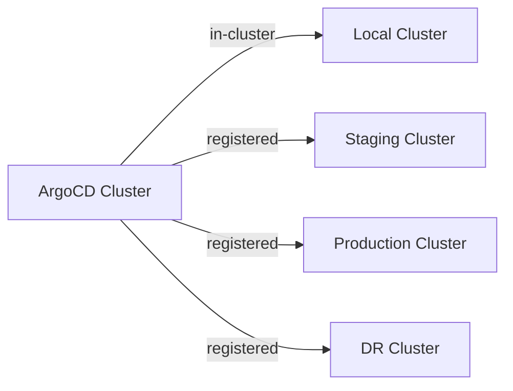

# How to Use argocd cluster Commands for Cluster Management

Author: [nawazdhandala](https://github.com/nawazdhandala)

Tags: ArgoCD, GitOps, Kubernetes, CLI, Multi-Cluster

Description: A complete guide to argocd cluster commands for adding, configuring, monitoring, and managing remote Kubernetes clusters in ArgoCD multi-cluster deployments.

---

ArgoCD can deploy to any number of Kubernetes clusters. The `argocd cluster` command family manages these cluster connections - adding remote clusters, configuring authentication, monitoring cluster health, and removing clusters when they are decommissioned. This is the foundation of multi-cluster GitOps.

## Understanding Cluster Registration

When you install ArgoCD, it automatically has access to the cluster it is running on (the "in-cluster" connection). To deploy to additional clusters, you need to register them. The registration process creates a ServiceAccount in the target cluster and stores the credentials in ArgoCD.



## Listing Clusters

```bash
# List all registered clusters
argocd cluster list

# Output:
# SERVER                          NAME              VERSION  STATUS      MESSAGE
# https://kubernetes.default.svc  in-cluster        1.28     Successful
# https://staging.example.com     staging-cluster   1.28     Successful
# https://prod.example.com        production        1.29     Successful
```

## Adding a Cluster

### Basic Cluster Addition

The simplest way to add a cluster uses your current kubeconfig context:

```bash
# Add the cluster from a specific kubeconfig context
argocd cluster add my-context-name

# This will:
# 1. Create a ServiceAccount 'argocd-manager' in the target cluster
# 2. Create a ClusterRoleBinding for that ServiceAccount
# 3. Store the ServiceAccount token in ArgoCD
```

### With a Custom Name

```bash
# Add with a friendly name
argocd cluster add my-context-name --name production-us-east
```

### Namespace-Scoped

By default, ArgoCD gets cluster-admin access. To restrict to specific namespaces:

```bash
# Add with namespace restrictions
argocd cluster add my-context-name \
  --name staging \
  --namespace team-a \
  --namespace team-b \
  --namespace shared-services
```

### With Custom Service Account

```bash
# Use a pre-existing service account instead of creating one
argocd cluster add my-context-name \
  --name production \
  --service-account argocd-deployer \
  --system-namespace kube-system
```

### Skip Cluster Confirmation

```bash
argocd cluster add my-context-name --name staging -y
```

## Getting Cluster Details

```bash
# Get details for a specific cluster
argocd cluster get https://staging.example.com

# Get by name
argocd cluster get production

# JSON output for scripting
argocd cluster get https://staging.example.com -o json
```

The output includes:
- Server URL
- Name
- Connection status
- Kubernetes version
- Cluster configuration (labels, annotations)

## Rotating Cluster Credentials

When cluster credentials expire or need rotation:

```bash
# Rotate credentials for a cluster
argocd cluster rotate-auth my-context-name
```

This recreates the ServiceAccount token in the target cluster and updates it in ArgoCD.

## Modifying Cluster Configuration

### Adding Labels

```bash
# Add labels to a cluster for use with ApplicationSet cluster generators
argocd cluster set https://staging.example.com \
  --label environment=staging \
  --label region=us-east-1 \
  --label tier=non-production
```

Labels are critical for ApplicationSet cluster generators:

```yaml
apiVersion: argoproj.io/v1alpha1
kind: ApplicationSet
metadata:
  name: deploy-to-all-staging
spec:
  generators:
    - clusters:
        selector:
          matchLabels:
            environment: staging
  template:
    # ... deploys to every cluster labeled environment=staging
```

### Adding Annotations

```bash
argocd cluster set https://staging.example.com \
  --annotation team=platform \
  --annotation cost-center=eng-42
```

### Modifying Namespaces

```bash
# Update the namespaces a cluster connection is scoped to
argocd cluster set https://staging.example.com \
  --namespace team-a \
  --namespace team-b
```

## Removing a Cluster

```bash
# Remove a cluster
argocd cluster rm https://staging.example.com

# This also cleans up the ServiceAccount in the target cluster
```

**Important**: Removing a cluster does not delete applications targeting that cluster. Those applications will show as unable to connect. Remove or migrate applications before removing the cluster.

## Adding EKS Clusters

EKS requires special handling because it uses IAM authentication:

```bash
# First, ensure your kubeconfig has the EKS context
aws eks update-kubeconfig --name my-eks-cluster --region us-east-1

# Then add it to ArgoCD
argocd cluster add arn:aws:eks:us-east-1:123456789012:cluster/my-eks-cluster \
  --name eks-production
```

For IRSA (IAM Roles for Service Accounts) setup, you will need additional configuration. See the ArgoCD documentation for EKS-specific IAM policies.

## Adding GKE Clusters

```bash
# Get GKE credentials
gcloud container clusters get-credentials my-gke-cluster --region us-central1

# Add to ArgoCD
argocd cluster add gke_my-project_us-central1_my-gke-cluster \
  --name gke-production
```

## Adding AKS Clusters

```bash
# Get AKS credentials
az aks get-credentials --resource-group my-rg --name my-aks-cluster

# Add to ArgoCD
argocd cluster add my-aks-cluster \
  --name aks-production
```

## Multi-Cluster Setup Script

```bash
#!/bin/bash
# setup-clusters.sh - Register multiple clusters with ArgoCD

declare -A CLUSTERS=(
  ["staging-us"]="staging-us-context"
  ["staging-eu"]="staging-eu-context"
  ["prod-us"]="prod-us-context"
  ["prod-eu"]="prod-eu-context"
)

declare -A CLUSTER_LABELS=(
  ["staging-us"]="environment=staging,region=us-east-1"
  ["staging-eu"]="environment=staging,region=eu-west-1"
  ["prod-us"]="environment=production,region=us-east-1"
  ["prod-eu"]="environment=production,region=eu-west-1"
)

for name in "${!CLUSTERS[@]}"; do
  context="${CLUSTERS[$name]}"
  echo "Adding cluster: $name (context: $context)"

  # Add the cluster
  argocd cluster add "$context" --name "$name" -y

  # Apply labels
  IFS=',' read -ra LABELS <<< "${CLUSTER_LABELS[$name]}"
  LABEL_ARGS=""
  for label in "${LABELS[@]}"; do
    LABEL_ARGS="$LABEL_ARGS --label $label"
  done

  SERVER=$(argocd cluster list -o json | jq -r ".[] | select(.name == \"$name\") | .server")
  argocd cluster set "$SERVER" $LABEL_ARGS

  echo "  Added and labeled: $name"
done

echo ""
echo "=== Registered Clusters ==="
argocd cluster list
```

## Cluster Health Monitoring

```bash
#!/bin/bash
# check-clusters.sh - Monitor cluster health

echo "=== Cluster Health Check ==="
echo ""

argocd cluster list -o json | jq -r '.[] | "\(.name)\t\(.server)\t\(.connectionState.status)\t\(.connectionState.message // "OK")"' | \
  column -t -s $'\t' -N "NAME,SERVER,STATUS,MESSAGE"

echo ""

# Alert on unhealthy clusters
UNHEALTHY=$(argocd cluster list -o json | jq '[.[] | select(.connectionState.status != "Successful")] | length')

if [ "$UNHEALTHY" -gt 0 ]; then
  echo "WARNING: $UNHEALTHY cluster(s) have connection issues!"
  argocd cluster list -o json | jq -r '.[] | select(.connectionState.status != "Successful") | "  \(.name): \(.connectionState.message)"'
  exit 1
else
  echo "All clusters are healthy."
fi
```

## Troubleshooting Cluster Connections

### Connection Refused

```bash
# Check the cluster endpoint is reachable
kubectl --context my-context cluster-info

# Check the ArgoCD service account exists in the target cluster
kubectl --context my-context get serviceaccount argocd-manager -n kube-system

# Check the token is valid
kubectl --context my-context get secret -n kube-system | grep argocd-manager
```

### Permission Denied

```bash
# Check the ClusterRoleBinding
kubectl --context my-context get clusterrolebinding argocd-manager-role

# Check what permissions the service account has
kubectl --context my-context auth can-i --list --as system:serviceaccount:kube-system:argocd-manager
```

### Certificate Issues

```bash
# If the cluster uses a custom CA
argocd cert add-tls my-cluster.example.com --from /path/to/ca.crt

# Or skip TLS verification (development only)
argocd cluster add my-context --name dev-cluster --insecure
```

### Reconnecting a Cluster

```bash
# If credentials are expired, remove and re-add
argocd cluster rm https://staging.example.com
argocd cluster add staging-context --name staging-cluster
```

## Cluster Information Query

```bash
#!/bin/bash
# cluster-info.sh - Get detailed cluster information

for cluster in $(argocd cluster list -o json | jq -r '.[].server'); do
  DATA=$(argocd cluster get "$cluster" -o json)

  NAME=$(echo "$DATA" | jq -r '.name')
  VERSION=$(echo "$DATA" | jq -r '.serverVersion')
  STATUS=$(echo "$DATA" | jq -r '.connectionState.status')
  LABELS=$(echo "$DATA" | jq -r '.labels // {} | to_entries | map("\(.key)=\(.value)") | join(", ")')

  echo "Cluster: $NAME"
  echo "  Server:  $cluster"
  echo "  Version: $VERSION"
  echo "  Status:  $STATUS"
  echo "  Labels:  ${LABELS:-none}"
  echo ""
done
```

## Summary

The `argocd cluster` command family is your toolkit for multi-cluster GitOps management. Use it to register clusters with appropriate authentication, label them for ApplicationSet generators, monitor their health, and rotate credentials when needed. For production setups, implement regular health checks on cluster connections and set up credential rotation procedures to prevent authentication failures.
