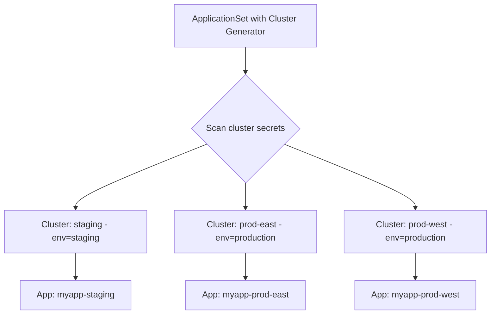

# How to Use Cluster Generators in ApplicationSets

Author: [nawazdhandala](https://github.com/nawazdhandala)

Tags: ArgoCD, GitOps, Kubernetes, ApplicationSets, Multi-Cluster

Description: Learn how to use ArgoCD ApplicationSet cluster generators to automatically deploy applications across multiple Kubernetes clusters based on cluster labels.

---

The cluster generator is one of the most powerful features in ArgoCD ApplicationSets. It automatically discovers registered clusters and generates Applications for each one that matches your criteria. When you add a new cluster with the right labels, applications are automatically deployed to it. When you remove a cluster, its applications are automatically cleaned up.

This guide covers the cluster generator in depth, from basic usage to advanced patterns with matrix and merge generators.

## How the Cluster Generator Works

The cluster generator queries ArgoCD's cluster registry (the Secrets with `argocd.argoproj.io/secret-type: cluster` label) and creates one Application per matching cluster:



## Basic Cluster Generator

Deploy an application to every registered cluster:

```yaml
apiVersion: argoproj.io/v1alpha1
kind: ApplicationSet
metadata:
  name: logging-agent
  namespace: argocd
spec:
  generators:
    - clusters: {}  # Match ALL clusters
  template:
    metadata:
      name: 'logging-{{name}}'
    spec:
      project: infrastructure
      source:
        repoURL: https://github.com/your-org/platform.git
        targetRevision: main
        path: logging
      destination:
        server: '{{server}}'
        namespace: logging
      syncPolicy:
        automated:
          selfHeal: true
          prune: true
        syncOptions:
          - CreateNamespace=true
```

## Available Template Variables

The cluster generator provides these variables for templates:

| Variable | Description | Example |
|----------|-------------|---------|
| `{{name}}` | Cluster name | `production-east` |
| `{{server}}` | Cluster API server URL | `https://prod.k8s.example.com` |
| `{{metadata.labels.KEY}}` | Any label on the cluster secret | `production` |
| `{{metadata.annotations.KEY}}` | Any annotation | `platform-team` |

## Filtering with Label Selectors

### Match specific labels

```yaml
generators:
  - clusters:
      selector:
        matchLabels:
          environment: production
          tier: critical
```

### Match with expressions

```yaml
generators:
  - clusters:
      selector:
        matchExpressions:
          # Production or staging
          - key: environment
            operator: In
            values:
              - production
              - staging

          # Not sandbox clusters
          - key: tier
            operator: NotIn
            values:
              - sandbox

          # Must have a region label
          - key: region
            operator: Exists
```

### Exclude the in-cluster ArgoCD

The local cluster (`https://kubernetes.default.svc`) is automatically included. To exclude it:

```yaml
generators:
  - clusters:
      selector:
        matchExpressions:
          - key: environment
            operator: Exists  # Only clusters with environment label
```

Since the in-cluster secret typically does not have custom labels, this effectively excludes it.

## Adding Custom Values

Add extra values to the generator output:

```yaml
generators:
  - clusters:
      selector:
        matchLabels:
          environment: production
      values:
        # Custom values available in templates
        replicaCount: "3"
        logLevel: "warn"
        ingressClass: "nginx-external"
```

Use them in templates:

```yaml
template:
  spec:
    source:
      helm:
        parameters:
          - name: replicaCount
            value: '{{values.replicaCount}}'
          - name: logging.level
            value: '{{values.logLevel}}'
          - name: ingress.className
            value: '{{values.ingressClass}}'
```

## Pattern 1: Environment-Based Deployment

Deploy different configurations per environment:

```yaml
apiVersion: argoproj.io/v1alpha1
kind: ApplicationSet
metadata:
  name: api-service
  namespace: argocd
spec:
  generators:
    - clusters:
        selector:
          matchLabels:
            environment: staging
        values:
          overlay: staging
          replicas: "1"
    - clusters:
        selector:
          matchLabels:
            environment: production
        values:
          overlay: production
          replicas: "3"
  template:
    metadata:
      name: 'api-{{name}}'
    spec:
      project: services
      source:
        repoURL: https://github.com/your-org/api-service.git
        targetRevision: main
        path: 'overlays/{{values.overlay}}'
      destination:
        server: '{{server}}'
        namespace: api-service
```

## Pattern 2: Region-Specific Configuration

Use cluster labels to select region-specific Helm values:

```yaml
apiVersion: argoproj.io/v1alpha1
kind: ApplicationSet
metadata:
  name: cdn-config
  namespace: argocd
spec:
  generators:
    - clusters:
        selector:
          matchLabels:
            environment: production
  template:
    metadata:
      name: 'cdn-{{name}}'
    spec:
      source:
        repoURL: https://github.com/your-org/cdn-service.git
        targetRevision: main
        path: chart
        helm:
          valueFiles:
            - values.yaml
            - 'values-{{metadata.labels.region}}.yaml'
      destination:
        server: '{{server}}'
        namespace: cdn
```

With values files per region:

```
chart/
  values.yaml
  values-us-east-1.yaml
  values-us-west-2.yaml
  values-eu-west-1.yaml
```

## Pattern 3: Platform Services to All Clusters

Deploy infrastructure services to every cluster:

```yaml
apiVersion: argoproj.io/v1alpha1
kind: ApplicationSet
metadata:
  name: platform-services
  namespace: argocd
spec:
  generators:
    - clusters:
        selector:
          matchExpressions:
            - key: environment
              operator: Exists
  template:
    metadata:
      name: 'platform-{{name}}'
    spec:
      project: infrastructure
      source:
        repoURL: https://github.com/your-org/platform.git
        targetRevision: main
        path: platform-bundle
      destination:
        server: '{{server}}'
        namespace: platform
      syncPolicy:
        automated:
          selfHeal: true
```

## Pattern 4: Matrix with Cluster Generator

Combine cluster generator with other generators:

```yaml
apiVersion: argoproj.io/v1alpha1
kind: ApplicationSet
metadata:
  name: multi-service-multi-cluster
  namespace: argocd
spec:
  generators:
    - matrix:
        generators:
          # All production clusters
          - clusters:
              selector:
                matchLabels:
                  environment: production
          # All services
          - git:
              repoURL: https://github.com/your-org/services.git
              revision: main
              directories:
                - path: services/*
  template:
    metadata:
      name: '{{path.basename}}-{{name}}'
    spec:
      project: services
      source:
        repoURL: https://github.com/your-org/services.git
        targetRevision: main
        path: '{{path}}/overlays/production'
      destination:
        server: '{{server}}'
        namespace: '{{path.basename}}'
```

This generates applications for every service in every production cluster. If you have 5 services and 3 production clusters, it creates 15 applications automatically.

## Pattern 5: Merge Generator for Cluster-Specific Overrides

Use the merge generator to provide cluster-specific settings:

```yaml
apiVersion: argoproj.io/v1alpha1
kind: ApplicationSet
metadata:
  name: ingress-controller
  namespace: argocd
spec:
  generators:
    - merge:
        mergeKeys:
          - server
        generators:
          # Base: all production clusters
          - clusters:
              selector:
                matchLabels:
                  environment: production
              values:
                loadBalancerType: "NLB"
                ingressReplicas: "2"

          # Override: specific cluster customization
          - list:
              elements:
                - server: https://prod-east.k8s.example.com
                  values.loadBalancerType: "ALB"
                  values.ingressReplicas: "4"
                - server: https://prod-west.k8s.example.com
                  values.ingressReplicas: "3"
  template:
    metadata:
      name: 'ingress-{{name}}'
    spec:
      source:
        repoURL: https://github.com/your-org/platform.git
        path: ingress-nginx
        helm:
          parameters:
            - name: controller.service.type
              value: '{{values.loadBalancerType}}'
            - name: controller.replicas
              value: '{{values.ingressReplicas}}'
      destination:
        server: '{{server}}'
        namespace: ingress-nginx
```

## Automatic Cluster Discovery

The beauty of the cluster generator is automatic discovery. When you add a new cluster with the right labels:

```bash
# Add a new production cluster
kubectl apply -f - <<EOF
apiVersion: v1
kind: Secret
metadata:
  name: production-asia-cluster
  namespace: argocd
  labels:
    argocd.argoproj.io/secret-type: cluster
    environment: production
    region: ap-southeast-1
type: Opaque
stringData:
  name: production-asia
  server: "https://prod-asia.k8s.example.com"
  config: '{"bearerToken": "...", "tlsClientConfig": {"insecure": false, "caData": "..."}}'
EOF
```

All ApplicationSets targeting `environment: production` automatically generate new Applications for this cluster. No manual intervention needed.

## Handling the In-Cluster (Local) Cluster

ArgoCD always has the local cluster registered as `https://kubernetes.default.svc` with the name `in-cluster`. To include it in cluster generators:

```bash
# Add labels to the in-cluster secret
kubectl label secret -n argocd \
  -l argocd.argoproj.io/secret-type=cluster \
  --field-selector metadata.name=in-cluster-secret \
  environment=management
```

Or find and label it:

```bash
# Find the in-cluster secret
kubectl get secrets -n argocd \
  -l argocd.argoproj.io/secret-type=cluster \
  -o json | jq -r '.items[] | select(.data.server | @base64d == "https://kubernetes.default.svc") | .metadata.name'
```

## Summary

The cluster generator is the key to scalable multi-cluster management in ArgoCD. By labeling your cluster secrets with environment, region, provider, and other organizational labels, you enable ApplicationSets to automatically target the right clusters. Combined with matrix and merge generators, you can build sophisticated deployment patterns that scale from a handful to hundreds of clusters. The best part is that adding or removing a cluster automatically adjusts your deployments - true declarative infrastructure management. For labeling strategies, see our guide on [labeling and annotating clusters in ArgoCD](https://oneuptime.com/blog/post/2026-02-26-argocd-label-annotate-clusters/view).
