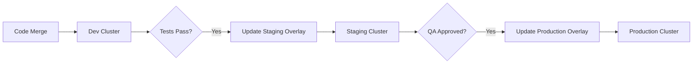

# How to Implement the Cluster-per-Environment Pattern

Author: [nawazdhandala](https://github.com/nawazdhandala)

Tags: ArgoCD, GitOps, Kubernetes, Multi-Cluster, Environments

Description: Learn how to implement the cluster-per-environment pattern in ArgoCD where each environment (dev, staging, production) gets its own dedicated Kubernetes cluster.

---

The cluster-per-environment pattern is one of the most common ways to organize multi-environment deployments with ArgoCD. Instead of sharing a single cluster across dev, staging, and production, each environment gets its own cluster. This gives you the strongest isolation guarantees and maps naturally to how many organizations already manage their infrastructure. Here is how to implement it properly.

## Why Cluster-per-Environment

The appeal is clear:

- **Strong isolation** - A runaway process in dev cannot take down production
- **Independent scaling** - Each environment can be sized appropriately
- **Separate upgrade schedules** - You can test Kubernetes upgrades on staging first
- **Compliance** - Easier to meet regulatory requirements when production is physically separate
- **Different configurations** - Production can have different network policies, resource quotas, and admission controllers

The trade-off is cost and management complexity. You need to manage multiple clusters, which means more infrastructure to maintain.

## Registering Clusters with ArgoCD

First, register each environment's cluster with ArgoCD. ArgoCD needs credentials to deploy to external clusters:

```bash
# Add staging cluster
argocd cluster add staging-context \
  --name staging \
  --label env=staging \
  --label region=us-east-1

# Add production cluster
argocd cluster add production-context \
  --name production \
  --label env=production \
  --label region=us-east-1

# Verify clusters
argocd cluster list
```

The `--label` flags are important. You will use these labels with ApplicationSets to target specific clusters.

## Repository Structure

Organize your config repo to reflect the per-environment approach:

```
gitops-config/
├── base/                          # Shared base manifests
│   ├── frontend/
│   │   ├── deployment.yaml
│   │   ├── service.yaml
│   │   └── kustomization.yaml
│   ├── backend/
│   │   ├── deployment.yaml
│   │   ├── service.yaml
│   │   └── kustomization.yaml
│   └── database/
│       ├── statefulset.yaml
│       ├── service.yaml
│       └── kustomization.yaml
├── overlays/                      # Per-environment overrides
│   ├── development/
│   │   ├── kustomization.yaml
│   │   ├── replicas-patch.yaml
│   │   └── resource-limits-patch.yaml
│   ├── staging/
│   │   ├── kustomization.yaml
│   │   ├── replicas-patch.yaml
│   │   └── resource-limits-patch.yaml
│   └── production/
│       ├── kustomization.yaml
│       ├── replicas-patch.yaml
│       ├── resource-limits-patch.yaml
│       └── hpa.yaml
└── apps/                          # ArgoCD Application definitions
    ├── development.yaml
    ├── staging.yaml
    └── production.yaml
```

## Kustomize Overlays Per Environment

Each environment overlay customizes the base for its needs.

Base deployment:

```yaml
# base/frontend/deployment.yaml
apiVersion: apps/v1
kind: Deployment
metadata:
  name: frontend
spec:
  replicas: 1
  selector:
    matchLabels:
      app: frontend
  template:
    metadata:
      labels:
        app: frontend
    spec:
      containers:
        - name: frontend
          image: org/frontend:latest
          ports:
            - containerPort: 8080
          resources:
            requests:
              cpu: 100m
              memory: 128Mi
```

Development overlay:

```yaml
# overlays/development/kustomization.yaml
apiVersion: kustomize.config.k8s.io/v1beta1
kind: Kustomization
resources:
  - ../../base/frontend
  - ../../base/backend
namespace: development
patches:
  - path: replicas-patch.yaml
  - path: resource-limits-patch.yaml
```

```yaml
# overlays/development/replicas-patch.yaml
apiVersion: apps/v1
kind: Deployment
metadata:
  name: frontend
spec:
  replicas: 1
---
apiVersion: apps/v1
kind: Deployment
metadata:
  name: backend
spec:
  replicas: 1
```

Production overlay:

```yaml
# overlays/production/kustomization.yaml
apiVersion: kustomize.config.k8s.io/v1beta1
kind: Kustomization
resources:
  - ../../base/frontend
  - ../../base/backend
  - ../../base/database
  - hpa.yaml
namespace: production
patches:
  - path: replicas-patch.yaml
  - path: resource-limits-patch.yaml
```

```yaml
# overlays/production/replicas-patch.yaml
apiVersion: apps/v1
kind: Deployment
metadata:
  name: frontend
spec:
  replicas: 3
---
apiVersion: apps/v1
kind: Deployment
metadata:
  name: backend
spec:
  replicas: 5
```

## ArgoCD Application Definitions

### Manual Application Per Environment

```yaml
# apps/development.yaml
apiVersion: argoproj.io/v1alpha1
kind: Application
metadata:
  name: myapp-development
  namespace: argocd
  labels:
    env: development
spec:
  project: development
  source:
    repoURL: https://github.com/org/gitops-config.git
    targetRevision: main
    path: overlays/development
  destination:
    server: https://kubernetes.default.svc  # In-cluster for dev
    namespace: development
  syncPolicy:
    automated:
      selfHeal: true
      prune: true
    syncOptions:
      - CreateNamespace=true
```

```yaml
# apps/production.yaml
apiVersion: argoproj.io/v1alpha1
kind: Application
metadata:
  name: myapp-production
  namespace: argocd
  labels:
    env: production
spec:
  project: production
  source:
    repoURL: https://github.com/org/gitops-config.git
    targetRevision: main
    path: overlays/production
  destination:
    server: https://production-cluster.example.com
    namespace: production
  syncPolicy:
    automated:
      selfHeal: true
      prune: false  # Safer for production
    syncOptions:
      - CreateNamespace=true
```

### Using ApplicationSets for Automation

ApplicationSets can automatically create Applications for each cluster:

```yaml
apiVersion: argoproj.io/v1alpha1
kind: ApplicationSet
metadata:
  name: myapp-per-cluster
  namespace: argocd
spec:
  generators:
    - clusters:
        selector:
          matchExpressions:
            - key: env
              operator: In
              values:
                - development
                - staging
                - production
  template:
    metadata:
      name: 'myapp-{{metadata.labels.env}}'
    spec:
      project: '{{metadata.labels.env}}'
      source:
        repoURL: https://github.com/org/gitops-config.git
        targetRevision: main
        path: 'overlays/{{metadata.labels.env}}'
      destination:
        server: '{{server}}'
        namespace: '{{metadata.labels.env}}'
      syncPolicy:
        automated:
          selfHeal: true
          prune: true
        syncOptions:
          - CreateNamespace=true
```

This creates one Application per registered cluster, using the cluster's `env` label to determine which overlay to use.

## AppProjects for Environment Isolation

Create separate AppProjects to enforce boundaries:

```yaml
apiVersion: argoproj.io/v1alpha1
kind: AppProject
metadata:
  name: production
  namespace: argocd
spec:
  description: Production environment
  sourceRepos:
    - https://github.com/org/gitops-config.git
  destinations:
    - namespace: production
      server: https://production-cluster.example.com
    - namespace: production-*
      server: https://production-cluster.example.com
  # Only allow specific resources in production
  namespaceResourceWhitelist:
    - group: apps
      kind: Deployment
    - group: ""
      kind: Service
    - group: ""
      kind: ConfigMap
    - group: ""
      kind: Secret
    - group: networking.k8s.io
      kind: Ingress
  # Deny cluster-scoped resources
  clusterResourceWhitelist: []
  roles:
    - name: deployer
      description: Can sync production apps
      policies:
        - p, proj:production:deployer, applications, sync, production/*, allow
        - p, proj:production:deployer, applications, get, production/*, allow
      groups:
        - production-deployers
```

## Promotion Flow

A typical promotion flow with cluster-per-environment:



Promotion is handled by updating the image tag or overlay in Git:

```bash
# Promote to staging: update the image tag in staging overlay
cd overlays/staging
kustomize edit set image org/frontend=org/frontend:v1.2.3
git add . && git commit -m "Promote frontend v1.2.3 to staging"
git push

# After staging validation, promote to production
cd overlays/production
kustomize edit set image org/frontend=org/frontend:v1.2.3
git add . && git commit -m "Promote frontend v1.2.3 to production"
git push
```

## Sync Windows for Production Safety

Restrict when production can be synced:

```yaml
apiVersion: argoproj.io/v1alpha1
kind: AppProject
metadata:
  name: production
spec:
  syncWindows:
    # Allow syncs only during business hours on weekdays
    - kind: allow
      schedule: "0 9 * * 1-5"
      duration: 8h
      applications:
        - "*"
    # Block syncs during weekends
    - kind: deny
      schedule: "0 0 * * 0,6"
      duration: 24h
      applications:
        - "*"
    # Allow emergency syncs with manual override
    - kind: allow
      schedule: "* * * * *"
      duration: 24h
      manualSync: true
      applications:
        - "*"
```

## Monitoring Across Clusters

When using cluster-per-environment, monitor ArgoCD's view of all clusters:

```bash
# Check all applications across all environments
argocd app list

# Filter by environment label
argocd app list -l env=production

# Check cluster connectivity
argocd cluster list

# Get health summary per cluster
argocd app list -o json | jq '[.[] | {name, health: .status.health.status, sync: .status.sync.status}] | group_by(.health) | map({health: .[0].health, count: length})'
```

For more on multi-cluster management, check our guide on [ArgoCD multi-cluster management](https://oneuptime.com/blog/post/2026-02-02-argocd-multi-cluster/view) and [multi-cluster ApplicationSets](https://oneuptime.com/blog/post/2026-02-09-multi-cluster-argocd-applicationsets/view).
