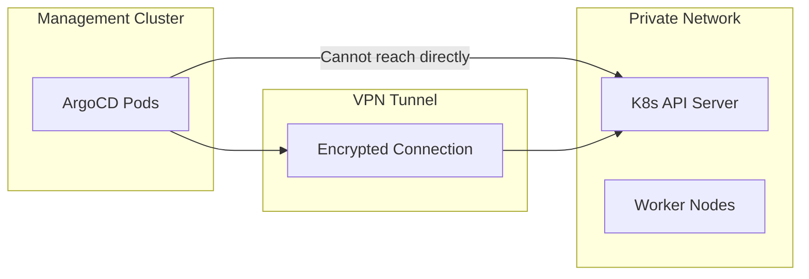

# How to Configure ArgoCD for Clusters Behind VPNs

Author: [nawazdhandala](https://github.com/nawazdhandala)

Tags: ArgoCD, GitOps, Kubernetes, VPN, Networking

Description: Learn how to configure ArgoCD to manage Kubernetes clusters that sit behind VPN tunnels, including WireGuard, OpenVPN, and cloud-native VPN solutions.

---

Many organizations run Kubernetes clusters in private networks accessible only through VPN connections. When ArgoCD needs to manage these clusters, you must ensure the ArgoCD control plane can establish and maintain reliable connections through the VPN. This guide covers practical approaches to connecting ArgoCD to VPN-protected clusters.

## The Challenge

Clusters behind VPNs typically have private API server endpoints that are not reachable from the public internet. ArgoCD, running in a management cluster, needs a network path to these private endpoints. The challenge is making this work reliably in an automated, containerized environment where traditional VPN client installations do not apply.



## Approach 1: VPN Gateway at the Network Level

The cleanest approach is handling VPN connectivity at the infrastructure level rather than inside Kubernetes. This means ArgoCD pods do not need to know about the VPN at all - the network just works.

### Site-to-Site VPN with AWS

Use AWS Site-to-Site VPN to connect your management VPC to the remote network:

```bash
# Create a Customer Gateway (represents the remote VPN endpoint)
aws ec2 create-customer-gateway \
  --type ipsec.1 \
  --public-ip 203.0.113.1 \
  --bgp-asn 65000

# Create a Virtual Private Gateway
aws ec2 create-vpn-gateway \
  --type ipsec.1

# Attach to the management VPC
aws ec2 attach-vpn-gateway \
  --vpn-gateway-id vgw-123456 \
  --vpc-id vpc-management

# Create the VPN connection
aws ec2 create-vpn-connection \
  --type ipsec.1 \
  --customer-gateway-id cgw-123456 \
  --vpn-gateway-id vgw-123456 \
  --options '{"StaticRoutesOnly": false}'

# Add routes to the management VPC route table
aws ec2 create-route \
  --route-table-id rtb-management \
  --destination-cidr-block 172.16.0.0/16 \
  --gateway-id vgw-123456
```

### Azure VPN Gateway

For clusters behind Azure VPN:

```bash
# Create VPN Gateway in management VNET
az network vnet-gateway create \
  --name argocd-vpn-gateway \
  --resource-group mgmt-rg \
  --vnet mgmt-vnet \
  --gateway-type Vpn \
  --vpn-type RouteBased \
  --sku VpnGw2

# Create local network gateway (represents remote network)
az network local-gateway create \
  --name remote-cluster-gateway \
  --resource-group mgmt-rg \
  --gateway-ip-address 203.0.113.1 \
  --local-address-prefixes 172.16.0.0/16

# Create the VPN connection
az network vpn-connection create \
  --name argocd-to-remote \
  --resource-group mgmt-rg \
  --vnet-gateway1 argocd-vpn-gateway \
  --local-gateway2 remote-cluster-gateway \
  --shared-key "your-preshared-key"
```

## Approach 2: WireGuard Sidecar

When infrastructure-level VPN is not possible, you can run a WireGuard sidecar container alongside ArgoCD to establish the VPN tunnel. This approach works well for point-to-point connections.

First, create a WireGuard configuration as a Secret:

```yaml
apiVersion: v1
kind: Secret
metadata:
  name: wireguard-config
  namespace: argocd
stringData:
  wg0.conf: |
    [Interface]
    PrivateKey = YOUR_PRIVATE_KEY_HERE
    Address = 10.10.0.2/32

    [Peer]
    PublicKey = REMOTE_SERVER_PUBLIC_KEY
    Endpoint = vpn.example.com:51820
    AllowedIPs = 172.16.0.0/16
    PersistentKeepalive = 25
```

Then patch the ArgoCD application controller deployment to include a WireGuard sidecar:

```yaml
# argocd-controller-wireguard-patch.yaml
apiVersion: apps/v1
kind: Deployment
metadata:
  name: argocd-application-controller
  namespace: argocd
spec:
  template:
    spec:
      # Required for WireGuard to create network interfaces
      initContainers:
        - name: wireguard-init
          image: linuxserver/wireguard:latest
          command:
            - /bin/sh
            - -c
            - |
              # Copy WireGuard config
              cp /etc/wireguard-secret/wg0.conf /etc/wireguard/wg0.conf
              chmod 600 /etc/wireguard/wg0.conf
          volumeMounts:
            - name: wireguard-config
              mountPath: /etc/wireguard-secret
              readOnly: true
            - name: wireguard-run
              mountPath: /etc/wireguard
          securityContext:
            capabilities:
              add: ["NET_ADMIN", "SYS_MODULE"]
      containers:
        - name: wireguard
          image: linuxserver/wireguard:latest
          command:
            - /bin/sh
            - -c
            - |
              wg-quick up wg0
              # Keep the container running and monitor the tunnel
              while true; do
                if ! wg show wg0 > /dev/null 2>&1; then
                  echo "WireGuard tunnel down, restarting..."
                  wg-quick down wg0 || true
                  wg-quick up wg0
                fi
                sleep 30
              done
          volumeMounts:
            - name: wireguard-run
              mountPath: /etc/wireguard
          securityContext:
            capabilities:
              add: ["NET_ADMIN", "SYS_MODULE"]
            privileged: true
      volumes:
        - name: wireguard-config
          secret:
            secretName: wireguard-config
        - name: wireguard-run
          emptyDir: {}
```

Apply the patch:

```bash
kubectl patch deployment argocd-application-controller \
  -n argocd \
  --type strategic \
  --patch-file argocd-controller-wireguard-patch.yaml
```

## Approach 3: SSH Tunnel as Sidecar

For environments where WireGuard is not available, an SSH tunnel provides a simpler alternative:

```yaml
apiVersion: v1
kind: Secret
metadata:
  name: ssh-tunnel-key
  namespace: argocd
data:
  id_rsa: <base64-encoded-private-key>
  known_hosts: <base64-encoded-known-hosts>
---
apiVersion: apps/v1
kind: Deployment
metadata:
  name: argocd-application-controller
  namespace: argocd
spec:
  template:
    spec:
      containers:
        - name: ssh-tunnel
          image: alpine/socat:latest
          command:
            - /bin/sh
            - -c
            - |
              apk add --no-cache openssh-client
              # Create SSH tunnel forwarding local port to remote API server
              ssh -N -L 0.0.0.0:6443:172.16.1.10:6443 \
                -o StrictHostKeyChecking=yes \
                -o UserKnownHostsFile=/ssh/known_hosts \
                -o ServerAliveInterval=30 \
                -o ServerAliveCountMax=3 \
                -i /ssh/id_rsa \
                tunnel-user@bastion.example.com
          ports:
            - containerPort: 6443
          volumeMounts:
            - name: ssh-key
              mountPath: /ssh
              readOnly: true
      volumes:
        - name: ssh-key
          secret:
            secretName: ssh-tunnel-key
            defaultMode: 0400
```

When using this approach, configure the cluster in ArgoCD to point to localhost:

```yaml
apiVersion: v1
kind: Secret
metadata:
  name: remote-vpn-cluster
  namespace: argocd
  labels:
    argocd.argoproj.io/secret-type: cluster
stringData:
  server: "https://localhost:6443"
  name: "remote-vpn-cluster"
  config: |
    {
      "tlsClientConfig": {
        "caData": "base64-ca-cert",
        "insecure": false
      },
      "bearerToken": "service-account-token"
    }
```

## Approach 4: Submariner for Cross-Cluster Connectivity

Submariner provides Kubernetes-native cross-cluster networking. It creates encrypted tunnels between clusters automatically:

```bash
# Install Submariner broker on the management cluster
subctl deploy-broker --kubeconfig management-kubeconfig

# Join the management cluster
subctl join broker-info.subm \
  --kubeconfig management-kubeconfig \
  --clusterid management

# Join the remote cluster (needs VPN access for initial setup only)
subctl join broker-info.subm \
  --kubeconfig remote-kubeconfig \
  --clusterid remote-cluster
```

After Submariner is set up, services can be exported and accessed across clusters, and the Kubernetes API servers become reachable through the Submariner tunnel.

## DNS Configuration for VPN Clusters

VPN-protected clusters often use private DNS that is not resolvable from outside the VPN. Configure DNS forwarding:

```yaml
# CoreDNS ConfigMap for forwarding private DNS zones
apiVersion: v1
kind: ConfigMap
metadata:
  name: coredns
  namespace: kube-system
data:
  Corefile: |
    .:53 {
        errors
        health
        kubernetes cluster.local in-addr.arpa ip6.arpa {
           pods insecure
           fallthrough in-addr.arpa ip6.arpa
        }
        forward . /etc/resolv.conf
        cache 30
        loop
        reload
        loadbalance
    }
    # Forward queries for the remote private zone through VPN DNS
    remote.internal:53 {
        forward . 172.16.0.2
        cache 30
    }
```

## Health Checking VPN Connections

Set up monitoring to detect VPN failures before they impact deployments:

```yaml
# CronJob to check VPN tunnel health
apiVersion: batch/v1
kind: CronJob
metadata:
  name: vpn-health-check
  namespace: argocd
spec:
  schedule: "*/5 * * * *"
  jobTemplate:
    spec:
      template:
        spec:
          containers:
            - name: health-check
              image: curlimages/curl:latest
              command:
                - /bin/sh
                - -c
                - |
                  # Check each VPN-protected cluster API server
                  CLUSTERS="172.16.1.10:6443 172.16.2.10:6443"
                  for CLUSTER in $CLUSTERS; do
                    if ! curl -sk --connect-timeout 5 \
                      "https://$CLUSTER/healthz" > /dev/null 2>&1; then
                      echo "ALERT: Cannot reach cluster $CLUSTER through VPN"
                      # Send alert to monitoring system
                      curl -X POST https://oneuptime.com/api/alert \
                        -d "{\"message\": \"VPN tunnel to $CLUSTER is down\"}"
                    fi
                  done
          restartPolicy: OnFailure
```

## Common Issues and Solutions

**VPN tunnel drops**: Set PersistentKeepalive in WireGuard configs or use SSH ServerAliveInterval. Infrastructure-level VPNs usually handle keepalives automatically.

**MTU problems**: VPN tunnels reduce the effective MTU. If you see fragmentation issues, set MTU explicitly in the WireGuard config (typically 1420 for WireGuard, 1400 for IPSec).

**Split DNS resolution**: Use CoreDNS conditional forwarding to resolve private hostnames through the VPN DNS server while keeping public DNS resolution normal.

**Sidecar container restarts**: Use liveness probes on the VPN sidecar to detect tunnel failures and trigger automatic restarts. This is more reliable than manual monitoring.

Connecting ArgoCD to VPN-protected clusters requires careful network planning. Infrastructure-level VPNs are the most reliable option, followed by WireGuard sidecars for more targeted connectivity. Whichever approach you choose, always implement health monitoring to catch connectivity issues early. For comprehensive cluster monitoring, see our guide on [monitoring ArgoCD component health](https://oneuptime.com/blog/post/2026-02-26-argocd-monitor-component-health/view).
