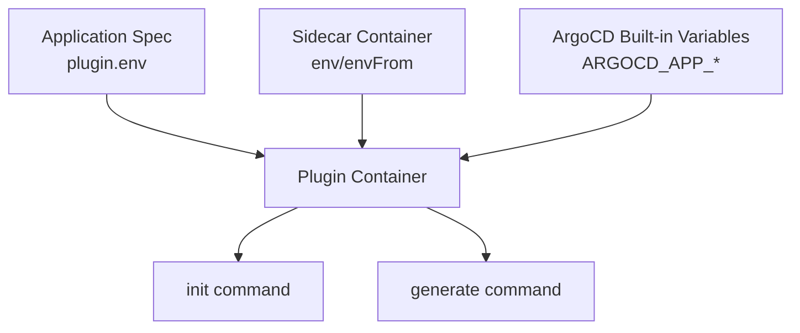

# How to Pass Environment Variables to CMP Plugins in ArgoCD

Author: [nawazdhandala](https://github.com/nawazdhandala)

Tags: ArgoCD, GitOps, Kubernetes, Config Management Plugins, Environment Variables

Description: Learn how to pass environment variables to ArgoCD Config Management Plugins from application specs, secrets, and ConfigMaps for dynamic configuration.

---

Config Management Plugins in ArgoCD often need external configuration to work properly. Maybe your plugin needs to know which environment to target, what API endpoint to call, or which feature flags to enable. Environment variables are the primary mechanism for passing this configuration from ArgoCD applications to CMP sidecar plugins, and getting them right is crucial for flexible, reusable plugins.

This guide covers every way to pass environment variables to CMP plugins, from simple inline values to dynamic references from Kubernetes secrets and ConfigMaps.

## How Environment Variables Flow to Plugins

When ArgoCD invokes a CMP plugin, environment variables come from three sources:



1. **Application-level env**: Defined in the Application spec under `source.plugin.env`
2. **Container-level env**: Defined in the sidecar container spec
3. **ArgoCD built-in variables**: Automatically injected by ArgoCD

## Application-Level Environment Variables

The most common approach is setting environment variables in the Application spec. These are specific to each application and override container-level variables:

```yaml
apiVersion: argoproj.io/v1alpha1
kind: Application
metadata:
  name: my-app-production
  namespace: argocd
spec:
  project: default
  source:
    repoURL: https://github.com/myorg/configs.git
    targetRevision: main
    path: apps/my-app
    plugin:
      name: my-custom-plugin
      env:
        # Simple string values
        - name: ENVIRONMENT
          value: "production"
        - name: REGION
          value: "us-east-1"
        - name: REPLICA_COUNT
          value: "5"
        - name: FEATURE_FLAGS
          value: "enable-caching,enable-metrics"
        # Boolean-style flags
        - name: ENABLE_DEBUG
          value: "false"
        - name: INCLUDE_CRDS
          value: "true"
  destination:
    server: https://kubernetes.default.svc
    namespace: my-app
```

Your plugin reads these in the generate command:

```yaml
# plugin.yaml
apiVersion: argoproj.io/v1alpha1
kind: ConfigManagementPlugin
metadata:
  name: my-custom-plugin
spec:
  generate:
    command: [sh, -c]
    args:
      - |
        set -euo pipefail

        # Use environment variables with defaults
        ENV=${ENVIRONMENT:-staging}
        REGION=${REGION:-us-west-2}
        REPLICAS=${REPLICA_COUNT:-3}
        DEBUG=${ENABLE_DEBUG:-false}

        echo "Generating manifests for $ENV in $REGION"

        # Use variables in your rendering logic
        helm template my-app . \
          --set environment="$ENV" \
          --set region="$REGION" \
          --set replicaCount="$REPLICAS"
```

## ArgoCD Built-in Variables

ArgoCD automatically provides these environment variables to every CMP plugin invocation:

```bash
# Application metadata
ARGOCD_APP_NAME          # Name of the ArgoCD application
ARGOCD_APP_NAMESPACE     # Namespace of the ArgoCD application resource
ARGOCD_APP_REVISION      # Git commit SHA being rendered

# Source information
ARGOCD_APP_SOURCE_PATH        # Path within the Git repo
ARGOCD_APP_SOURCE_REPO_URL    # Git repository URL
ARGOCD_APP_SOURCE_TARGET_REVISION  # Branch/tag/commit being tracked

# Destination information
ARGOCD_ENV_APP_DESTINATION_SERVER    # Target cluster URL
ARGOCD_ENV_APP_DESTINATION_NAMESPACE # Target namespace
```

These are invaluable for writing plugins that adapt automatically:

```yaml
generate:
  command: [sh, -c]
  args:
    - |
      # Use built-in variables for context-aware generation
      echo "Rendering for app: $ARGOCD_APP_NAME"
      echo "Target namespace: ${ARGOCD_APP_NAMESPACE}"
      echo "Git revision: $ARGOCD_APP_REVISION"

      # Use the app name as the Helm release name
      helm template "$ARGOCD_APP_NAME" . \
        --namespace "${ARGOCD_APP_NAMESPACE:-default}" \
        -f values.yaml
```

## Container-Level Environment Variables

For configuration that is the same across all applications using a plugin, set environment variables directly on the sidecar container:

```yaml
apiVersion: apps/v1
kind: Deployment
metadata:
  name: argocd-repo-server
  namespace: argocd
spec:
  template:
    spec:
      containers:
        - name: my-custom-plugin
          image: my-registry/argocd-cmp:v1.0
          env:
            # Static values shared by all applications
            - name: HELM_CACHE_HOME
              value: /tmp/helm-cache
            - name: PLUGIN_LOG_LEVEL
              value: "info"

            # Reference from ConfigMap
            - name: DEFAULT_REGISTRY
              valueFrom:
                configMapKeyRef:
                  name: plugin-config
                  key: default-registry

            # Reference from Secret
            - name: PRIVATE_REGISTRY_TOKEN
              valueFrom:
                secretKeyRef:
                  name: plugin-secrets
                  key: registry-token

            # Reference from field
            - name: POD_NAME
              valueFrom:
                fieldRef:
                  fieldPath: metadata.name

          # Load all keys from a ConfigMap as env vars
          envFrom:
            - configMapRef:
                name: plugin-defaults
            - secretRef:
                name: plugin-credentials
```

### Creating the ConfigMap and Secret

```bash
# Create a ConfigMap with plugin defaults
kubectl create configmap plugin-defaults \
  -n argocd \
  --from-literal=DEFAULT_TIMEOUT=120 \
  --from-literal=DEFAULT_WORKERS=4 \
  --from-literal=CACHE_ENABLED=true

# Create a Secret with sensitive values
kubectl create secret generic plugin-credentials \
  -n argocd \
  --from-literal=API_KEY=sk-live-xxxxx \
  --from-literal=WEBHOOK_SECRET=whsec-xxxxx
```

## Precedence and Override Rules

When the same variable is defined in multiple places, the precedence is:

1. **Application-level env** (highest priority)
2. **Container-level env**
3. **Container-level envFrom**

This means application-specific values always override container defaults:

```yaml
# Container level sets a default
env:
  - name: ENVIRONMENT
    value: "staging"

# Application level overrides it
# In the Application spec:
plugin:
  env:
    - name: ENVIRONMENT
      value: "production"  # This wins
```

## Practical Pattern: Multi-Environment Plugin

Here is a complete example of a plugin that uses environment variables to generate environment-specific manifests:

```yaml
# plugin.yaml
apiVersion: argoproj.io/v1alpha1
kind: ConfigManagementPlugin
metadata:
  name: env-aware-helm
spec:
  init:
    command: [sh, -c]
    args:
      - |
        helm dependency build . 2>/dev/null || true
  generate:
    command: [sh, -c]
    args:
      - |
        set -euo pipefail

        # Required variables
        if [ -z "${ENVIRONMENT:-}" ]; then
          echo "Error: ENVIRONMENT variable is required" >&2
          exit 1
        fi

        # Build values file chain
        VALUES_ARGS="-f values.yaml"

        # Add environment-specific values
        if [ -f "values-${ENVIRONMENT}.yaml" ]; then
          VALUES_ARGS="$VALUES_ARGS -f values-${ENVIRONMENT}.yaml"
        fi

        # Add region-specific values
        if [ -n "${REGION:-}" ] && [ -f "values-${REGION}.yaml" ]; then
          VALUES_ARGS="$VALUES_ARGS -f values-${REGION}.yaml"
        fi

        # Set dynamic overrides from env vars
        SET_ARGS=""
        [ -n "${REPLICA_COUNT:-}" ] && SET_ARGS="$SET_ARGS --set replicaCount=$REPLICA_COUNT"
        [ -n "${IMAGE_TAG:-}" ] && SET_ARGS="$SET_ARGS --set image.tag=$IMAGE_TAG"
        [ -n "${DOMAIN:-}" ] && SET_ARGS="$SET_ARGS --set ingress.host=$DOMAIN"

        helm template "$ARGOCD_APP_NAME" . \
          --namespace "${ARGOCD_APP_NAMESPACE:-default}" \
          $VALUES_ARGS \
          $SET_ARGS \
          --include-crds
```

Then create applications for each environment:

```yaml
# Production application
apiVersion: argoproj.io/v1alpha1
kind: Application
metadata:
  name: my-app-production
spec:
  source:
    plugin:
      name: env-aware-helm
      env:
        - name: ENVIRONMENT
          value: "production"
        - name: REGION
          value: "us-east-1"
        - name: REPLICA_COUNT
          value: "10"
        - name: IMAGE_TAG
          value: "v2.1.0"
        - name: DOMAIN
          value: "app.example.com"
---
# Staging application
apiVersion: argoproj.io/v1alpha1
kind: Application
metadata:
  name: my-app-staging
spec:
  source:
    plugin:
      name: env-aware-helm
      env:
        - name: ENVIRONMENT
          value: "staging"
        - name: REGION
          value: "us-west-2"
        - name: REPLICA_COUNT
          value: "2"
        - name: IMAGE_TAG
          value: "v2.2.0-rc1"
        - name: DOMAIN
          value: "staging.example.com"
```

## Security Considerations

Be careful with sensitive values in Application-level env variables. They are stored in the Application resource and visible to anyone with read access to ArgoCD applications. For secrets:

- Use container-level `secretKeyRef` for values that should not be visible in Application specs
- Use `envFrom` with a Secret reference for bulk credential injection
- Never log environment variable values in your plugin output

```yaml
# Good: sensitive values from Kubernetes secrets
env:
  - name: API_TOKEN
    valueFrom:
      secretKeyRef:
        name: plugin-secrets
        key: api-token

# Bad: sensitive values in Application spec (visible in UI and API)
plugin:
  env:
    - name: API_TOKEN
      value: "sk-live-xxxxx"  # Don't do this
```

## Debugging Environment Variables

To see what variables your plugin receives, temporarily add logging to your generate command:

```yaml
generate:
  command: [sh, -c]
  args:
    - |
      # Debug: print all env vars to stderr (visible in logs)
      env | sort | grep -E "ARGOCD_|ENVIRONMENT|REGION" >&2

      # Your actual generation logic
      helm template ...
```

Then check the sidecar logs:

```bash
kubectl logs deployment/argocd-repo-server \
  -n argocd \
  -c my-custom-plugin \
  --tail=50
```

## Summary

Environment variables are the main way to pass configuration to CMP plugins in ArgoCD. Use application-level env for per-app settings, container-level env for shared defaults and secrets, and take advantage of ArgoCD's built-in variables for context-aware generation. The precedence rules let you set sensible defaults at the container level while allowing individual applications to override them as needed.
