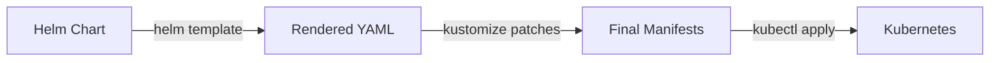

# How to Combine Kustomize and Helm in ArgoCD

Author: [nawazdhandala](https://github.com/nawazdhandala)

Tags: ArgoCD, GitOps, Kubernetes, Kustomize, Helm

Description: Learn how to combine Kustomize and Helm in ArgoCD using multi-source applications, Helm post-renderers, and Kustomize helmCharts for flexible configuration management.

---

Helm gives you templating and packaging. Kustomize gives you patch-based customization without templates. Using them together in ArgoCD means you can deploy a vendor's Helm chart and then apply organization-specific patches on top - adding sidecars, injecting labels, modifying resource limits, or any other customization the chart's values do not expose.

ArgoCD supports several patterns for combining these tools. This guide covers multi-source applications, Kustomize's built-in Helm inflation, and post-rendering approaches.

## Why Combine Them

Helm charts expose configuration through values files, but they cannot anticipate every customization. When you need to:

- Add a sidecar container that the chart does not support
- Inject custom annotations on specific resources
- Modify a field the chart does not expose as a value
- Apply organization-wide patches across all deployments

You need Kustomize on top of Helm output.



## Approach 1: ArgoCD Multi-Source Applications

ArgoCD 2.6+ supports multi-source applications that combine different source types. This is the cleanest way to use Helm with Kustomize:

```yaml
apiVersion: argoproj.io/v1alpha1
kind: Application
metadata:
  name: ingress-nginx-custom
  namespace: argocd
spec:
  project: default
  sources:
    # First source: Helm chart
    - repoURL: https://kubernetes.github.io/ingress-nginx
      chart: ingress-nginx
      targetRevision: 4.8.3
      helm:
        valueFiles:
          - $values/apps/ingress-nginx/values.yaml
    # Second source: Values file from a Git repo
    - repoURL: https://github.com/myorg/k8s-configs.git
      targetRevision: main
      ref: values
  destination:
    server: https://kubernetes.default.svc
    namespace: ingress-nginx
```

To add Kustomize patches on top, use a multi-source setup where the Kustomize source references the Helm output:

```yaml
apiVersion: argoproj.io/v1alpha1
kind: Application
metadata:
  name: cert-manager-custom
  namespace: argocd
spec:
  project: default
  sources:
    # Helm chart source
    - repoURL: https://charts.jetstack.io
      chart: cert-manager
      targetRevision: 1.13.3
      helm:
        values: |
          installCRDs: true
          replicaCount: 2
    # Kustomize overlay that patches the Helm output
    - repoURL: https://github.com/myorg/k8s-configs.git
      targetRevision: main
      path: patches/cert-manager
      kustomize:
        commonAnnotations:
          custom.myorg.com/team: platform
  destination:
    server: https://kubernetes.default.svc
    namespace: cert-manager
```

## Approach 2: Kustomize helmCharts Field

Kustomize 4.1.0+ can inflate Helm charts natively using the `helmCharts` field:

```yaml
# apps/ingress-nginx/kustomization.yaml
apiVersion: kustomize.config.k8s.io/v1beta1
kind: Kustomization

helmCharts:
  - name: ingress-nginx
    repo: https://kubernetes.github.io/ingress-nginx
    version: 4.8.3
    releaseName: ingress-nginx
    namespace: ingress-nginx
    valuesFile: values.yaml
    # Or inline values:
    valuesInline:
      controller:
        replicaCount: 2

# Apply Kustomize patches on top of the Helm output
patches:
  - path: add-sidecar.yaml
    target:
      kind: Deployment
      name: ingress-nginx-controller

commonAnnotations:
  managed-by: argocd-kustomize
```

The sidecar patch:

```yaml
# apps/ingress-nginx/add-sidecar.yaml
apiVersion: apps/v1
kind: Deployment
metadata:
  name: ingress-nginx-controller
spec:
  template:
    spec:
      containers:
        - name: log-forwarder
          image: fluent/fluent-bit:2.2
          resources:
            requests:
              cpu: 10m
              memory: 32Mi
```

For this to work in ArgoCD, enable the Helm flag:

```yaml
# argocd-cm ConfigMap
data:
  kustomize.buildOptions: "--enable-helm"
```

The ArgoCD Application is a standard Kustomize application:

```yaml
apiVersion: argoproj.io/v1alpha1
kind: Application
metadata:
  name: ingress-nginx
  namespace: argocd
spec:
  source:
    repoURL: https://github.com/myorg/k8s-configs.git
    targetRevision: main
    path: apps/ingress-nginx
  destination:
    server: https://kubernetes.default.svc
    namespace: ingress-nginx
```

## Approach 3: Helm Post-Renderer with Kustomize

Helm's `--post-renderer` flag pipes rendered output through an external command. You can use Kustomize as the post-renderer:

Create a post-renderer script:

```bash
#!/bin/bash
# post-render.sh
# Takes rendered Helm output on stdin, applies Kustomize patches, writes to stdout

cat > /tmp/helm-output.yaml

# Create a temporary kustomization that uses the Helm output
mkdir -p /tmp/kustomize-work
cp /tmp/helm-output.yaml /tmp/kustomize-work/resources.yaml
cat > /tmp/kustomize-work/kustomization.yaml << EOF
resources:
  - resources.yaml
patches:
  - path: /path/to/patches/add-labels.yaml
    target:
      kind: Deployment
commonAnnotations:
  post-rendered: "true"
EOF

kustomize build /tmp/kustomize-work
```

This approach works for local Helm usage but is harder to integrate with ArgoCD because ArgoCD does not use `helm install` directly. Use the helmCharts approach or multi-source approach instead.

## Practical Example: Customizing a Third-Party Chart

Let us say you deploy the Prometheus stack but need to add custom annotations and a sidecar to the Grafana deployment. The Helm chart does not expose these options.

Directory structure:

```
apps/prometheus-stack/
  kustomization.yaml
  values.yaml
  grafana-sidecar-patch.yaml
  grafana-annotations-patch.yaml
```

```yaml
# apps/prometheus-stack/kustomization.yaml
apiVersion: kustomize.config.k8s.io/v1beta1
kind: Kustomization

helmCharts:
  - name: kube-prometheus-stack
    repo: https://prometheus-community.github.io/helm-charts
    version: 55.5.0
    releaseName: monitoring
    namespace: monitoring
    valuesFile: values.yaml

patches:
  # Add a log-shipping sidecar to Grafana
  - path: grafana-sidecar-patch.yaml
    target:
      kind: Deployment
      name: monitoring-grafana

  # Add custom annotations to all Deployments
  - path: grafana-annotations-patch.yaml
    target:
      kind: Deployment
```

```yaml
# apps/prometheus-stack/grafana-sidecar-patch.yaml
apiVersion: apps/v1
kind: Deployment
metadata:
  name: monitoring-grafana
spec:
  template:
    spec:
      containers:
        - name: audit-logger
          image: myorg/audit-logger:1.0.0
          env:
            - name: LOG_DESTINATION
              value: "https://logs.myorg.com"
```

## Version Considerations

The helmCharts approach requires:
- Kustomize 4.1.0+ in ArgoCD
- The `--enable-helm` build option enabled
- Helm binary available in the repo server (ArgoCD includes it by default)

If your ArgoCD ships with an older Kustomize, use multi-source applications instead.

## Troubleshooting

**"unable to inflate chart"** - The Helm repository is not accessible from the ArgoCD repo server. Check network policies and repo server DNS resolution.

**"unknown field helmCharts"** - Kustomize version is too old. Upgrade Kustomize or use multi-source applications.

**"--enable-helm not recognized"** - Kustomize version is too old for the Helm inflator. Check `kustomize version` in the repo server.

**Patches not applying** - The target selector in the patch must match the resource name as rendered by Helm (including the release name prefix). Check rendered names with `helm template`.

For more on multi-source applications, see our [ArgoCD multi-source Helm and Kustomize guide](https://oneuptime.com/blog/post/2026-02-09-argocd-multi-source-helm-kustomize/view).
