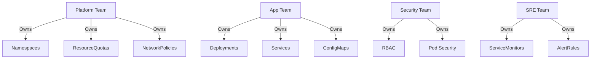

# How to Combine Multiple Git Repos as Application Sources in ArgoCD

Author: [nawazdhandala](https://github.com/nawazdhandala)

Tags: ArgoCD, GitOps, Kubernetes, Multi-Source, Repository Management

Description: Learn how to combine Kubernetes manifests from multiple Git repositories into a single ArgoCD application using multi-source configuration for cross-team deployments.

---

In real organizations, Kubernetes configuration rarely lives in a single Git repository. Platform teams maintain shared infrastructure configs, application teams own their service manifests, and security teams manage policies - each in their own repo. ArgoCD's multi-source feature lets you combine manifests from all these repositories into a single application, creating a unified deployment without forcing everyone into the same repo.

## The Multi-Repo Reality

Consider a typical enterprise setup:

- **Platform repo** (`platform-infra`): NetworkPolicies, ResourceQuotas, PriorityClasses
- **App repo** (`payment-service`): Deployment, Service, ConfigMap, HPA
- **Security repo** (`security-policies`): OPA policies, PodSecurityPolicies, RBAC rules
- **Monitoring repo** (`observability-config`): ServiceMonitors, PrometheusRules, dashboards

Each team manages their repository independently with their own release cadence. Before multi-source, you needed four separate ArgoCD Applications and had to coordinate their syncs. Now, you can combine them.

## Basic Multi-Git Configuration

```yaml
# payment-service-full.yaml - Combines manifests from four repos
apiVersion: argoproj.io/v1alpha1
kind: Application
metadata:
  name: payment-service
  namespace: argocd
spec:
  project: default
  sources:
    # Platform team's shared infrastructure
    - repoURL: https://github.com/your-org/platform-infra.git
      targetRevision: v3.2.0  # Pinned to a stable release
      path: namespaces/payments

    # Application team's service manifests
    - repoURL: https://github.com/your-org/payment-service.git
      targetRevision: main
      path: deploy/kubernetes

    # Security team's policies for this namespace
    - repoURL: https://github.com/your-org/security-policies.git
      targetRevision: main
      path: policies/payments

    # Observability team's monitoring config
    - repoURL: https://github.com/your-org/observability-config.git
      targetRevision: main
      path: services/payment-service

  destination:
    server: https://kubernetes.default.svc
    namespace: payments
  syncPolicy:
    automated:
      prune: true
      selfHeal: true
```

## Independent Version Tracking

Each source can track a different branch, tag, or commit. This is a major advantage - teams can release independently:

```yaml
sources:
  # Platform infra pinned to a release tag
  # Only updates when platform team cuts a new release
  - repoURL: https://github.com/your-org/platform-infra.git
    targetRevision: v3.2.0
    path: namespaces/payments

  # App team tracks their main branch for continuous delivery
  - repoURL: https://github.com/your-org/payment-service.git
    targetRevision: main
    path: deploy/kubernetes

  # Security policies pinned to a specific commit
  # Changes only after security team audits
  - repoURL: https://github.com/your-org/security-policies.git
    targetRevision: a1b2c3d4
    path: policies/payments

  # Monitoring tracks a release branch
  - repoURL: https://github.com/your-org/observability-config.git
    targetRevision: release/2024-q1
    path: services/payment-service
```

## Repository Structure Recommendations

For multi-repo setups, each repository should have a consistent internal structure:

### Platform Infrastructure Repo

```
platform-infra/
  namespaces/
    payments/
      namespace.yaml
      resourcequota.yaml
      limitrange.yaml
      networkpolicy-default.yaml
    orders/
      namespace.yaml
      resourcequota.yaml
      limitrange.yaml
  cluster/
    priority-classes.yaml
    storage-classes.yaml
```

### Application Repo

```
payment-service/
  src/               # Application source code
  deploy/
    kubernetes/
      deployment.yaml
      service.yaml
      configmap.yaml
      hpa.yaml
      ingress.yaml
  Dockerfile
```

### Security Policies Repo

```
security-policies/
  policies/
    payments/
      pod-security.yaml
      network-policy-ingress.yaml
      rbac.yaml
    orders/
      pod-security.yaml
      network-policy-ingress.yaml
      rbac.yaml
  global/
    cluster-roles.yaml
    image-policies.yaml
```

### Observability Config Repo

```
observability-config/
  services/
    payment-service/
      servicemonitor.yaml
      prometheusrule.yaml
      grafana-dashboard.yaml
    orders-service/
      servicemonitor.yaml
      prometheusrule.yaml
```

## Handling Resource Conflicts Between Repos

When multiple repos might define the same resource, you need a clear ownership model. ArgoCD will apply the last source's version of a conflicting resource, but this behavior is fragile and should be avoided.

Establish clear boundaries:



If there is a legitimate need for two teams to touch the same resource, consider using Kustomize patches in a coordinating layer instead of raw multi-source.

## Using Sync Waves Across Repos

Resources from different repos can use sync waves to control ordering:

```yaml
# From platform-infra repo: namespace.yaml (wave -2)
apiVersion: v1
kind: Namespace
metadata:
  name: payments
  annotations:
    argocd.argoproj.io/sync-wave: "-2"
```

```yaml
# From security-policies repo: rbac.yaml (wave -1)
apiVersion: rbac.authorization.k8s.io/v1
kind: RoleBinding
metadata:
  name: payment-service-binding
  namespace: payments
  annotations:
    argocd.argoproj.io/sync-wave: "-1"
```

```yaml
# From payment-service repo: deployment.yaml (wave 0, default)
apiVersion: apps/v1
kind: Deployment
metadata:
  name: payment-api
  namespace: payments
```

```yaml
# From observability-config repo: servicemonitor.yaml (wave 1)
apiVersion: monitoring.coreos.com/v1
kind: ServiceMonitor
metadata:
  name: payment-api
  namespace: payments
  annotations:
    argocd.argoproj.io/sync-wave: "1"
```

ArgoCD merges all resources and applies them in wave order regardless of which source they came from.

## Authentication for Multiple Repos

Each repository in a multi-source Application must be registered with ArgoCD. Add repository credentials for each:

```bash
# Add each repository to ArgoCD
argocd repo add https://github.com/your-org/platform-infra.git \
  --ssh-private-key-path ~/.ssh/id_rsa

argocd repo add https://github.com/your-org/payment-service.git \
  --ssh-private-key-path ~/.ssh/id_rsa

argocd repo add https://github.com/your-org/security-policies.git \
  --ssh-private-key-path ~/.ssh/id_rsa

argocd repo add https://github.com/your-org/observability-config.git \
  --ssh-private-key-path ~/.ssh/id_rsa
```

Or use credential templates for repos that share the same authentication:

```yaml
# Repository credential template - applies to all repos under your-org
apiVersion: v1
kind: Secret
metadata:
  name: github-creds
  namespace: argocd
  labels:
    argocd.argoproj.io/secret-type: repo-creds
type: Opaque
stringData:
  type: git
  url: https://github.com/your-org
  password: ghp_your_github_token
  username: not-used
```

## Monitoring Multi-Repo Sync Status

```bash
# Check overall application health
argocd app get payment-service

# View all resources grouped by source
argocd app resources payment-service

# Check which source caused an OutOfSync
argocd app diff payment-service

# Force a refresh when a source repo change is not detected
argocd app get payment-service --hard-refresh
```

## Webhook Configuration for Multiple Repos

For fast sync detection, configure webhooks on each source repository to notify ArgoCD of changes:

```bash
# Each repo needs its own webhook pointing to ArgoCD
# GitHub webhook URL: https://argocd.example.com/api/webhook
# Content type: application/json
# Events: Push events
```

Without webhooks, ArgoCD relies on polling (default: every 3 minutes) to detect changes, which can delay syncs.

## When to Use Multi-Source vs Separate Applications

Multi-source is best when resources from different repos must be deployed together as one unit. Use separate applications when:

- Components have independent release cycles and should sync independently
- Different teams need separate health status views
- You want fine-grained access control at the application level
- Components target different namespaces or clusters

## Best Practices

**Define clear ownership** - Each resource type should be owned by exactly one repository. Overlap creates confusion and conflicts.

**Pin platform sources** - Infrastructure and security repos should be pinned to release tags, not tracking `HEAD`. Application repos can track branches for faster delivery.

**Use consistent labeling** - Apply labels that identify the source repository so you can trace resources back to their origin:

```yaml
metadata:
  labels:
    config-source: platform-infra
```

**Document the multi-source architecture** - Create a diagram showing which repos contribute to which applications. This helps new team members understand the deployment topology.

For more on multi-source patterns, see our guides on [using multiple sources](https://oneuptime.com/blog/post/2026-02-26-argocd-multiple-sources-single-application/view) and [handling conflicts between multiple sources](https://oneuptime.com/blog/post/2026-02-26-argocd-conflicts-multiple-sources/view).
