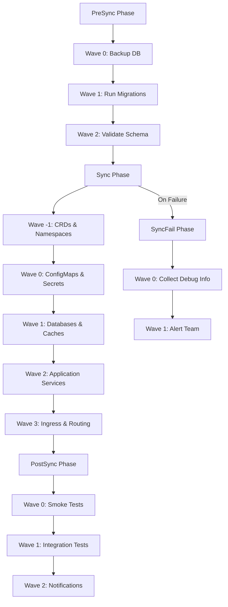

# How to Combine Sync Waves and Hooks for Complex Deployments

Author: [nawazdhandala](https://github.com/nawazdhandala)

Tags: ArgoCD, GitOps, Kubernetes, Sync Waves, Deployment Orchestration

Description: Learn how to combine ArgoCD sync waves and hooks to orchestrate complex multi-phase deployments with ordered resource creation and lifecycle tasks.

---

Real-world deployments are rarely simple. You need to back up the database, run migrations, deploy infrastructure, roll out the application, run smoke tests, and notify your team - all in the right order. ArgoCD's sync waves and hooks are two separate features that become extremely powerful when combined.

Sync waves control the order of resource deployment within each sync phase. Hooks run special tasks at phase boundaries (PreSync, PostSync, SyncFail). Together, they let you build deployment pipelines that handle every aspect of a complex release.

## The Combined Model

Here is how waves and hooks work together across the sync lifecycle:



## Complete Deployment Example

Let me walk through a real-world example of deploying a web application with a database, cache, and external integrations.

### PreSync Phase: Preparation

```yaml
# PreSync Wave 0: Back up the database before anything else
apiVersion: batch/v1
kind: Job
metadata:
  name: backup-db
  annotations:
    argocd.argoproj.io/hook: PreSync
    argocd.argoproj.io/sync-wave: "0"
    argocd.argoproj.io/hook-delete-policy: HookSucceeded, BeforeHookCreation
spec:
  template:
    spec:
      containers:
        - name: backup
          image: postgres:15
          command:
            - /bin/sh
            - -c
            - |
              TIMESTAMP=$(date +%Y%m%d_%H%M%S)
              echo "Backing up database..."
              pg_dump -h $DB_HOST -U $DB_USER -d $DB_NAME \
                -F c -f /backup/pre-deploy-${TIMESTAMP}.dump
              echo "Backup complete: pre-deploy-${TIMESTAMP}"
          env:
            - name: DB_HOST
              valueFrom:
                secretKeyRef:
                  name: db-creds
                  key: host
            - name: DB_USER
              valueFrom:
                secretKeyRef:
                  name: db-creds
                  key: user
            - name: DB_NAME
              valueFrom:
                secretKeyRef:
                  name: db-creds
                  key: name
            - name: PGPASSWORD
              valueFrom:
                secretKeyRef:
                  name: db-creds
                  key: password
          volumeMounts:
            - name: backup-vol
              mountPath: /backup
      volumes:
        - name: backup-vol
          persistentVolumeClaim:
            claimName: db-backups
      restartPolicy: Never
  backoffLimit: 1
  activeDeadlineSeconds: 300
---
# PreSync Wave 1: Run database migrations (after backup completes)
apiVersion: batch/v1
kind: Job
metadata:
  name: db-migrate
  annotations:
    argocd.argoproj.io/hook: PreSync
    argocd.argoproj.io/sync-wave: "1"
    argocd.argoproj.io/hook-delete-policy: HookSucceeded, BeforeHookCreation
spec:
  template:
    spec:
      containers:
        - name: migrate
          image: myorg/api:latest
          command: ["python", "manage.py", "migrate", "--no-input"]
          env:
            - name: DATABASE_URL
              valueFrom:
                secretKeyRef:
                  name: db-creds
                  key: url
      restartPolicy: Never
  backoffLimit: 3
  activeDeadlineSeconds: 300
---
# PreSync Wave 2: Validate the migration succeeded
apiVersion: batch/v1
kind: Job
metadata:
  name: validate-schema
  annotations:
    argocd.argoproj.io/hook: PreSync
    argocd.argoproj.io/sync-wave: "2"
    argocd.argoproj.io/hook-delete-policy: HookSucceeded, BeforeHookCreation
spec:
  template:
    spec:
      containers:
        - name: validate
          image: myorg/api:latest
          command:
            - /bin/sh
            - -c
            - |
              echo "Validating schema..."
              python manage.py check --database default
              echo "Schema validation passed"
          env:
            - name: DATABASE_URL
              valueFrom:
                secretKeyRef:
                  name: db-creds
                  key: url
      restartPolicy: Never
  backoffLimit: 1
  activeDeadlineSeconds: 60
```

### Sync Phase: Infrastructure and Application

```yaml
# Sync Wave -1: Namespace (if using CreateNamespace=false for control)
apiVersion: v1
kind: Namespace
metadata:
  name: my-app
  annotations:
    argocd.argoproj.io/sync-wave: "-1"
  labels:
    app: my-app
---
# Sync Wave 0: Configuration
apiVersion: v1
kind: ConfigMap
metadata:
  name: app-config
  namespace: my-app
  # No sync-wave annotation = default wave 0
data:
  LOG_LEVEL: "info"
  CACHE_TTL: "300"
  FEATURE_FLAGS: '{"new-dashboard": true}'
---
apiVersion: v1
kind: Secret
metadata:
  name: app-secrets
  namespace: my-app
type: Opaque
stringData:
  JWT_SECRET: "your-jwt-secret"
---
# Sync Wave 1: Infrastructure services
apiVersion: apps/v1
kind: Deployment
metadata:
  name: redis
  namespace: my-app
  annotations:
    argocd.argoproj.io/sync-wave: "1"
spec:
  replicas: 1
  selector:
    matchLabels:
      app: redis
  template:
    metadata:
      labels:
        app: redis
    spec:
      containers:
        - name: redis
          image: redis:7-alpine
          ports:
            - containerPort: 6379
          resources:
            requests:
              cpu: 100m
              memory: 128Mi
---
apiVersion: v1
kind: Service
metadata:
  name: redis
  namespace: my-app
  annotations:
    argocd.argoproj.io/sync-wave: "1"
spec:
  selector:
    app: redis
  ports:
    - port: 6379
---
# Sync Wave 2: Application services
apiVersion: apps/v1
kind: Deployment
metadata:
  name: api
  namespace: my-app
  annotations:
    argocd.argoproj.io/sync-wave: "2"
spec:
  replicas: 3
  selector:
    matchLabels:
      app: api
  template:
    metadata:
      labels:
        app: api
    spec:
      containers:
        - name: api
          image: myorg/api:latest
          ports:
            - containerPort: 8080
          env:
            - name: DATABASE_URL
              valueFrom:
                secretKeyRef:
                  name: db-creds
                  key: url
            - name: REDIS_URL
              value: "redis://redis:6379"
            - name: JWT_SECRET
              valueFrom:
                secretKeyRef:
                  name: app-secrets
                  key: JWT_SECRET
          envFrom:
            - configMapRef:
                name: app-config
          readinessProbe:
            httpGet:
              path: /health
              port: 8080
            initialDelaySeconds: 10
            periodSeconds: 5
          resources:
            requests:
              cpu: 200m
              memory: 256Mi
---
apiVersion: v1
kind: Service
metadata:
  name: api
  namespace: my-app
  annotations:
    argocd.argoproj.io/sync-wave: "2"
spec:
  selector:
    app: api
  ports:
    - port: 8080
---
apiVersion: apps/v1
kind: Deployment
metadata:
  name: frontend
  namespace: my-app
  annotations:
    argocd.argoproj.io/sync-wave: "2"
spec:
  replicas: 2
  selector:
    matchLabels:
      app: frontend
  template:
    metadata:
      labels:
        app: frontend
    spec:
      containers:
        - name: frontend
          image: myorg/frontend:latest
          ports:
            - containerPort: 3000
          env:
            - name: API_URL
              value: "http://api:8080"
---
# Sync Wave 3: Ingress (after services are ready)
apiVersion: networking.k8s.io/v1
kind: Ingress
metadata:
  name: app-ingress
  namespace: my-app
  annotations:
    argocd.argoproj.io/sync-wave: "3"
    nginx.ingress.kubernetes.io/rewrite-target: /
spec:
  ingressClassName: nginx
  rules:
    - host: app.example.com
      http:
        paths:
          - path: /api
            pathType: Prefix
            backend:
              service:
                name: api
                port:
                  number: 8080
          - path: /
            pathType: Prefix
            backend:
              service:
                name: frontend
                port:
                  number: 3000
```

### PostSync Phase: Verification and Notification

```yaml
# PostSync Wave 0: Smoke tests
apiVersion: batch/v1
kind: Job
metadata:
  name: smoke-test
  annotations:
    argocd.argoproj.io/hook: PostSync
    argocd.argoproj.io/sync-wave: "0"
    argocd.argoproj.io/hook-delete-policy: BeforeHookCreation
spec:
  template:
    spec:
      containers:
        - name: test
          image: curlimages/curl:latest
          command:
            - /bin/sh
            - -c
            - |
              echo "Running smoke tests..."

              # Wait for service readiness
              for i in $(seq 1 30); do
                curl -sf http://api.my-app.svc:8080/health && break
                sleep 2
              done

              # Test API
              curl -sf http://api.my-app.svc:8080/health || { echo "FAIL: API health"; exit 1; }
              curl -sf http://api.my-app.svc:8080/api/v1/status || { echo "FAIL: API status"; exit 1; }

              # Test Frontend
              curl -sf http://frontend.my-app.svc:3000/ || { echo "FAIL: Frontend"; exit 1; }

              echo "All smoke tests passed"
      restartPolicy: Never
  backoffLimit: 2
  activeDeadlineSeconds: 120
---
# PostSync Wave 1: Notify team
apiVersion: batch/v1
kind: Job
metadata:
  name: deploy-notify
  annotations:
    argocd.argoproj.io/hook: PostSync
    argocd.argoproj.io/sync-wave: "1"
    argocd.argoproj.io/hook-delete-policy: HookSucceeded, HookFailed
spec:
  template:
    spec:
      containers:
        - name: notify
          image: curlimages/curl:latest
          command:
            - /bin/sh
            - -c
            - |
              curl -sf -X POST "$SLACK_WEBHOOK" \
                -H 'Content-Type: application/json' \
                -d "{
                  \"text\": \"Deployment complete for my-app. All smoke tests passed.\"
                }" || true
              exit 0
          env:
            - name: SLACK_WEBHOOK
              valueFrom:
                secretKeyRef:
                  name: slack-webhook
                  key: url
      restartPolicy: Never
  backoffLimit: 0
```

### SyncFail Phase: Error Handling

```yaml
# SyncFail Wave 0: Collect debug info
apiVersion: batch/v1
kind: Job
metadata:
  name: fail-debug
  annotations:
    argocd.argoproj.io/hook: SyncFail
    argocd.argoproj.io/sync-wave: "0"
    argocd.argoproj.io/hook-delete-policy: BeforeHookCreation
spec:
  template:
    spec:
      serviceAccountName: debug-sa
      containers:
        - name: debug
          image: bitnami/kubectl:latest
          command:
            - /bin/sh
            - -c
            - |
              echo "=== Collecting debug information ==="
              echo "=== Pod Status ==="
              kubectl get pods -n my-app -o wide
              echo "=== Events ==="
              kubectl get events -n my-app --sort-by='.lastTimestamp' | tail -20
              echo "=== Debug info collected ==="
      restartPolicy: Never
  backoffLimit: 0
  activeDeadlineSeconds: 30
---
# SyncFail Wave 1: Alert team
apiVersion: batch/v1
kind: Job
metadata:
  name: fail-alert
  annotations:
    argocd.argoproj.io/hook: SyncFail
    argocd.argoproj.io/sync-wave: "1"
    argocd.argoproj.io/hook-delete-policy: HookSucceeded, HookFailed
spec:
  template:
    spec:
      containers:
        - name: alert
          image: curlimages/curl:latest
          command:
            - /bin/sh
            - -c
            - |
              curl -sf -X POST "$SLACK_WEBHOOK" \
                -H 'Content-Type: application/json' \
                -d '{"text":":x: SYNC FAILED for my-app in production. Check ArgoCD for details."}' || true
              exit 0
          env:
            - name: SLACK_WEBHOOK
              valueFrom:
                secretKeyRef:
                  name: slack-webhook
                  key: url
      restartPolicy: Never
  backoffLimit: 0
```

## Execution Flow Summary

Here is the complete execution order for a successful deployment:

1. **PreSync Wave 0**: Database backup runs and completes
2. **PreSync Wave 1**: Database migration runs and completes
3. **PreSync Wave 2**: Schema validation runs and completes
4. **Sync Wave -1**: Namespace is created
5. **Sync Wave 0**: ConfigMaps and Secrets are applied
6. **Sync Wave 1**: Redis is deployed and becomes healthy
7. **Sync Wave 2**: API and Frontend are deployed and become healthy
8. **Sync Wave 3**: Ingress is applied
9. **PostSync Wave 0**: Smoke tests run and pass
10. **PostSync Wave 1**: Slack notification is sent

If any step fails, execution stops at that point. If it fails during or after step 4, the SyncFail hooks run.

## Design Principles

### Keep Hooks Fast

Each hook adds time to the deployment. A deployment with 5 hooks, each taking 30 seconds, adds 2.5 minutes to every sync. Keep hooks focused and fast.

### Make Hooks Idempotent

Hooks might run multiple times if syncs are retried. Design them to be safe to re-run:
- Migrations should use versioned migration tools (Alembic, Flyway) that skip already-applied migrations
- Notifications should be informational, not transactional
- Cleanup tasks should use `--ignore-not-found`

### Use Appropriate Delete Policies

- Critical hooks (migrations): `HookSucceeded, BeforeHookCreation`
- Verification hooks (smoke tests): `BeforeHookCreation`
- Non-critical hooks (notifications): `HookSucceeded, HookFailed`
- Debug hooks (SyncFail): `BeforeHookCreation`

### Test the Pipeline

Before deploying to production, test your complete wave and hook setup in a staging environment:

```bash
# Dry run to see the sync plan
argocd app sync my-app --dry-run

# Sync with verbose output
argocd app sync my-app --watch
```

## Common Pitfalls

**Hooks depending on Sync resources**: PreSync hooks cannot depend on resources that are created during the Sync phase. If your migration hook needs a ConfigMap that is part of the Sync phase, move the ConfigMap to a PreSync hook with an earlier wave.

**Wave deadlocks**: If two resources in different waves depend on each other, the deployment will hang. Resource A in wave 1 waits for Resource B in wave 2, but wave 2 never starts because wave 1 is not healthy.

**Hook resource naming**: Use static names with `BeforeHookCreation` or unique names with `HookSucceeded`. Do not use static names without a delete policy - the second sync will fail with a naming conflict.

## Summary

Combining sync waves and hooks lets you build complete deployment pipelines within ArgoCD. PreSync hooks prepare the environment, sync waves order resource creation, PostSync hooks verify the deployment, and SyncFail hooks handle errors. The key to success is keeping hooks fast and idempotent, using appropriate wave numbers to express dependencies, and choosing the right delete policies for each hook type.
