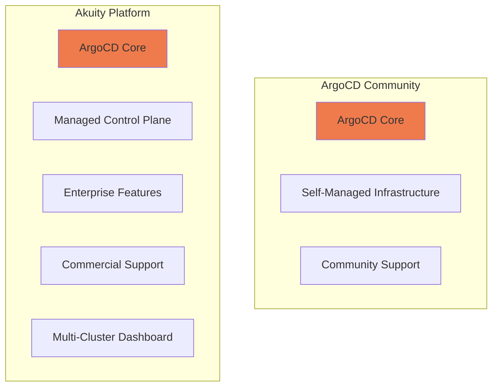

# ArgoCD Community vs ArgoCD Enterprise (Akuity): When to Upgrade

Author: [nawazdhandala](https://github.com/nawazdhandala)

Tags: ArgoCD, GitOps, Kubernetes, Akuity, Enterprise

Description: Compare ArgoCD open source with the Akuity Platform enterprise offering to understand when upgrading to the commercial version makes sense for your organization.

---

The Akuity Platform is the enterprise version of ArgoCD, built by the same team that created and maintains the open source project. Founded by Hong Wang and Jesse Suen (ArgoCD's original creators at Intuit), Akuity provides a managed ArgoCD experience with enterprise features that go beyond what the community edition offers. This article helps you evaluate whether the open source version meets your needs or if upgrading to the Akuity Platform is worth the investment.

## Understanding the Relationship

Akuity is not a fork of ArgoCD. The Akuity Platform runs the same ArgoCD you already know, but as a managed service with additional enterprise capabilities. Your ArgoCD Application manifests, Projects, and configurations work identically on both.



## Feature Comparison

### What You Get with ArgoCD Community

The open source ArgoCD provides a complete GitOps deployment solution.

```yaml
# Everything in ArgoCD community is fully functional
apiVersion: argoproj.io/v1alpha1
kind: Application
metadata:
  name: production-app
  namespace: argocd
spec:
  project: default
  source:
    repoURL: https://github.com/org/gitops.git
    path: apps/production
    targetRevision: main
  destination:
    server: https://kubernetes.default.svc
    namespace: production
  syncPolicy:
    automated:
      prune: true
      selfHeal: true
```

Community features include:
- Full GitOps sync engine
- Web UI with resource tree and diff views
- Multi-cluster management
- Helm, Kustomize, and plain YAML support
- ApplicationSets for templating
- SSO through Dex
- Project-based RBAC
- Sync windows and hooks
- Notification engine
- Config Management Plugins

### What Akuity Adds

The Akuity Platform adds capabilities focused on operations, scale, and enterprise requirements.

**Managed Control Plane.** Akuity runs the ArgoCD control plane (API server, repo server, controllers) as a managed service. The agent running in your cluster only needs outbound connectivity to the Akuity control plane.

```bash
# Akuity installation - lightweight agent in your cluster
# No need to manage ArgoCD server, repo-server, or controllers
akuity agent install \
  --instance-id my-instance \
  --cluster-name production
```

Compare this to self-managed ArgoCD where you handle:

```bash
# Self-managed: you operate all components
kubectl get pods -n argocd
# argocd-server-xxx           (you manage this)
# argocd-repo-server-xxx      (you manage this)
# argocd-application-controller-xxx  (you manage this)
# argocd-redis-xxx            (you manage this)
# argocd-dex-server-xxx       (you manage this)
```

**Multi-Instance Management.** Akuity provides a unified dashboard for managing multiple ArgoCD instances across different environments and teams.

**Enhanced Security.**
- SOC 2 Type II compliance
- Encrypted secrets at rest and in transit
- Network isolation between tenants
- Vulnerability scanning of managed components

**Enterprise SSO.** While community ArgoCD uses Dex, Akuity integrates directly with enterprise identity providers without the Dex intermediary.

**Advanced RBAC.** Akuity extends ArgoCD's RBAC with organization-level and instance-level permissions, making it easier to manage access at scale.

**SLA-Backed Support.** Commercial support with defined response times, direct access to ArgoCD core maintainers, and escalation paths.

## Operational Differences

### Upgrades

**Community ArgoCD:**

```bash
# You manage upgrades yourself
# 1. Read release notes
# 2. Test in staging
# 3. Plan maintenance window
# 4. Execute upgrade
helm upgrade argocd argo/argo-cd -n argocd \
  --version 6.5.0 \
  -f values.yaml

# 5. Verify all components are healthy
kubectl rollout status deployment/argocd-server -n argocd
kubectl rollout status deployment/argocd-repo-server -n argocd
kubectl rollout status statefulset/argocd-application-controller -n argocd

# 6. Test applications
argocd app list
```

**Akuity Platform:**

Upgrades are handled by Akuity. You receive notifications about upcoming upgrades and can schedule them for your preferred maintenance window. The agent in your cluster updates automatically.

### Scaling

**Community ArgoCD** requires manual tuning as you grow.

```yaml
# Scaling self-managed ArgoCD for 1000+ applications
# controller-values.yaml
controller:
  replicas: 3
  env:
    - name: ARGOCD_CONTROLLER_REPLICAS
      value: "3"
  resources:
    requests:
      cpu: 2000m
      memory: 4Gi

repoServer:
  replicas: 3
  resources:
    requests:
      cpu: 1000m
      memory: 2Gi

server:
  replicas: 3
  resources:
    requests:
      cpu: 500m
      memory: 1Gi

redis:
  resources:
    requests:
      cpu: 500m
      memory: 1Gi
```

**Akuity Platform** handles scaling of the control plane automatically. As your application count grows, Akuity scales the managed components without your intervention.

### Monitoring

**Community ArgoCD** - you build your own monitoring.

```yaml
# You need to set up Prometheus ServiceMonitor
apiVersion: monitoring.coreos.com/v1
kind: ServiceMonitor
metadata:
  name: argocd-metrics
spec:
  selector:
    matchLabels:
      app.kubernetes.io/part-of: argocd
  endpoints:
    - port: metrics

# Plus Grafana dashboards
# Plus alerting rules
# Plus log aggregation
```

**Akuity Platform** - monitoring and health checks are built into the managed service. You get dashboards and alerts without additional setup.

### High Availability

**Community ArgoCD HA** requires careful configuration.

```bash
# HA installation
kubectl apply -n argocd -f https://raw.githubusercontent.com/argoproj/argo-cd/stable/manifests/ha/install.yaml

# Plus you need:
# - Multiple replicas of each component
# - Redis HA (Sentinel or Redis Cluster)
# - Load balancer for API server
# - PodDisruptionBudgets
# - Anti-affinity rules
```

**Akuity Platform** provides HA for the control plane by default. The managed service is designed for high availability without additional configuration.

## Cost Analysis

### Community ArgoCD Total Cost

```text
Infrastructure costs (per month):
  3x controller pods (2 CPU, 4Gi): ~$150
  3x repo-server pods (1 CPU, 2Gi): ~$75
  3x server pods (0.5 CPU, 1Gi): ~$40
  Redis HA: ~$50
  Load balancer: ~$20
  Total infrastructure: ~$335/month

Operational costs:
  Platform engineer time (20% of FTE): ~$3,000/month
  On-call rotation share: ~$500/month
  Total operational: ~$3,500/month

Total: ~$3,835/month
```

### Akuity Platform Cost

```text
Akuity subscription: Varies by tier
  Starter: Free (limited features)
  Pro: Starting at ~$500/month
  Enterprise: Custom pricing

Infrastructure costs:
  Agent pods (lightweight): ~$50/month

Reduced operational costs:
  Platform engineer time (5% of FTE): ~$750/month

Total (Pro): ~$1,300/month
Total (Enterprise): Higher but includes support, SLA
```

The cost comparison favors Akuity for smaller teams without dedicated platform engineers, and community ArgoCD for larger organizations that already have platform engineering expertise.

## Migration Path

Moving from community ArgoCD to Akuity is straightforward since both run the same ArgoCD core.

```bash
# Export your existing ArgoCD configuration
kubectl get applications -n argocd -o yaml > apps-backup.yaml
kubectl get appprojects -n argocd -o yaml > projects-backup.yaml
kubectl get configmap argocd-cm -n argocd -o yaml > config-backup.yaml

# Import into Akuity instance
# Akuity provides migration tools and documentation
```

Your Application manifests, AppProjects, and RBAC policies transfer directly.

## When to Stay with Community ArgoCD

- Your team has strong Kubernetes operations expertise
- You need maximum customization and control
- You are running a small to medium deployment (under 200 apps)
- Budget is constrained and you have engineering capacity
- You need to run in air-gapped or restricted network environments
- You prefer to avoid any vendor dependency

## When to Upgrade to Akuity

- You want to reduce operational overhead for ArgoCD management
- You need commercial support with SLAs
- You are scaling beyond what your team can comfortably manage
- You need SOC 2 compliance for your deployment infrastructure
- You have multiple teams needing separate ArgoCD instances
- You want managed upgrades and security patches

Both options are solid choices. The community edition is production-ready and used by thousands of organizations. The Akuity Platform reduces operational burden and adds enterprise guardrails. Choose based on your team's capacity, compliance requirements, and budget priorities.
