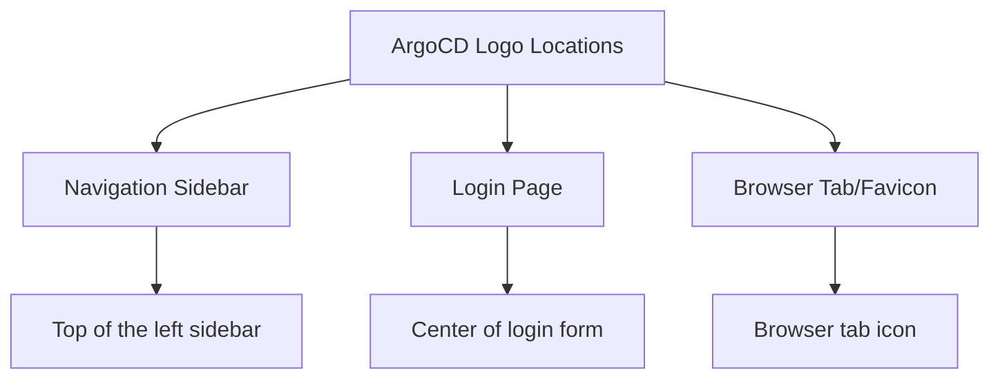

# How to Add Company Logo to ArgoCD

Author: [nawazdhandala](https://github.com/nawazdhandala)

Tags: ArgoCD, GitOps, Kubernetes, UI Customization, Branding

Description: Learn how to replace the default ArgoCD logo with your company logo in the navigation bar and login page, making the UI feel like part of your internal tooling.

---

Adding your company logo to ArgoCD is one of the simplest branding changes you can make, and it goes a long way toward making ArgoCD feel like an integrated part of your internal tooling rather than a third-party product. This guide covers how to replace the ArgoCD logo in the navigation sidebar, the login page, and the browser favicon.

## Understanding Where Logos Appear

The ArgoCD UI displays its logo in several locations:



Each location requires a slightly different approach to customize.

## Method 1: Replace the Logo with Custom CSS

The easiest method is to use the `ui.cssurl` feature to override the logo image with CSS:

```yaml
apiVersion: v1
kind: ConfigMap
metadata:
  name: argocd-cm
  namespace: argocd
data:
  ui.cssurl: "./custom/custom.css"
```

Create the CSS file:

```css
/* Replace the ArgoCD logo in the navigation sidebar */
.nav-bar__logo img {
  content: url('https://cdn.example.com/company-logo-white.svg') !important;
  max-height: 32px !important;
  width: auto !important;
}

/* Replace the ArgoCD logo on the login page */
.login__logo img {
  content: url('https://cdn.example.com/company-logo-dark.svg') !important;
  max-height: 48px !important;
  width: auto !important;
}

/* Hide the "Argo CD" text next to the logo if desired */
.nav-bar__logo span {
  display: none !important;
}

/* Or replace the text */
.nav-bar__logo span {
  font-size: 0 !important;  /* Hide original text */
}

.nav-bar__logo span::after {
  content: "MyCompany DevOps";
  font-size: 16px !important;
  font-weight: 600 !important;
  color: #ffffff !important;
}
```

### Logo Image Requirements

For best results, your logo should meet these specifications:

| Location | Recommended Format | Recommended Size | Background |
|----------|-------------------|------------------|------------|
| Sidebar | SVG or PNG | 32px height | Transparent (white logo for dark sidebar) |
| Login page | SVG or PNG | 48px height | Transparent (dark logo for light background) |
| Favicon | ICO or PNG | 32x32px or 16x16px | Transparent |

SVG is preferred because it scales cleanly at any resolution.

## Method 2: Mount a Custom Logo File

Instead of referencing an external URL, you can mount your logo directly into the ArgoCD server pod:

```yaml
# Step 1: Create a ConfigMap with the logo as binary data
apiVersion: v1
kind: ConfigMap
metadata:
  name: argocd-custom-logo
  namespace: argocd
binaryData:
  logo.svg: <base64-encoded-svg-content>
```

Generate the base64 content:

```bash
# Encode your SVG logo to base64
cat company-logo.svg | base64 | tr -d '\n' > logo-base64.txt
```

```yaml
# Step 2: Mount the logo into the ArgoCD server
apiVersion: apps/v1
kind: Deployment
metadata:
  name: argocd-server
  namespace: argocd
spec:
  template:
    spec:
      containers:
        - name: argocd-server
          volumeMounts:
            - name: custom-logo
              mountPath: /shared/app/custom/logo
            - name: custom-css
              mountPath: /shared/app/custom/css
      volumes:
        - name: custom-logo
          configMap:
            name: argocd-custom-logo
        - name: custom-css
          configMap:
            name: argocd-custom-css
```

```css
/* Reference the mounted logo in your CSS */
.nav-bar__logo img {
  content: url('./custom/logo/logo.svg') !important;
  max-height: 32px !important;
}

.login__logo img {
  content: url('./custom/logo/logo.svg') !important;
  max-height: 48px !important;
}
```

### Helm Configuration

For Helm-based deployments:

```yaml
# values.yaml
server:
  config:
    ui.cssurl: "./custom/css/custom.css"

  volumes:
    - name: custom-logo
      configMap:
        name: argocd-custom-logo
    - name: custom-css
      configMap:
        name: argocd-custom-css

  volumeMounts:
    - name: custom-logo
      mountPath: /shared/app/custom/logo
    - name: custom-css
      mountPath: /shared/app/custom/css
```

## Method 3: Replace the Logo Using the ArgoCD Custom Styles Extension

For a cleaner approach, you can use ArgoCD's support for custom static files:

```yaml
# Mount custom assets directly
apiVersion: apps/v1
kind: Deployment
metadata:
  name: argocd-server
  namespace: argocd
spec:
  template:
    spec:
      initContainers:
        - name: copy-custom-assets
          image: busybox
          command: ['sh', '-c', 'cp /custom-assets/* /shared/app/custom/']
          volumeMounts:
            - name: custom-assets-source
              mountPath: /custom-assets
            - name: custom-assets
              mountPath: /shared/app/custom
      containers:
        - name: argocd-server
          volumeMounts:
            - name: custom-assets
              mountPath: /shared/app/custom
      volumes:
        - name: custom-assets-source
          configMap:
            name: argocd-custom-assets
        - name: custom-assets
          emptyDir: {}
```

## Replacing the Favicon

The browser tab favicon requires a different approach since it is referenced in the HTML, not CSS:

### Using CSS to Override the Favicon

While you cannot directly change the favicon with CSS, you can use a JavaScript approach via an extension, or simply host the favicon and configure it through custom CSS that injects it:

```css
/* This is a workaround - inject favicon using CSS */
head link[rel="icon"] {
  /* CSS cannot modify HTML attributes */
  /* Use the server-level approach instead */
}
```

For the favicon, the most reliable approach is to mount a custom `favicon.ico` and replace the default:

```yaml
# Create ConfigMap with favicon
apiVersion: v1
kind: ConfigMap
metadata:
  name: argocd-custom-favicon
  namespace: argocd
binaryData:
  favicon.ico: <base64-encoded-ico-content>
```

Mount it to override the default favicon path:

```yaml
volumeMounts:
  - name: custom-favicon
    mountPath: /shared/app/favicon.ico
    subPath: favicon.ico
volumes:
  - name: custom-favicon
    configMap:
      name: argocd-custom-favicon
```

## Adding a Logo and Company Name Together

A common pattern is to show both a logo and company name in the sidebar:

```css
/* Logo and company name in sidebar */
.nav-bar__logo {
  display: flex !important;
  align-items: center !important;
  gap: 8px !important;
  padding: 12px 16px !important;
}

.nav-bar__logo img {
  content: url('https://cdn.example.com/company-icon-white.svg') !important;
  max-height: 28px !important;
  width: 28px !important;
}

.nav-bar__logo span {
  font-size: 0 !important;
}

.nav-bar__logo span::after {
  content: "Acme Corp\A DevOps Portal";
  white-space: pre-line;
  font-size: 13px !important;
  line-height: 1.3 !important;
  color: rgba(255, 255, 255, 0.9) !important;
}
```

## Complete Branding Configuration

Here is a full example that replaces the logo, changes the sidebar color, and updates the login page:

```css
/* === Navigation Sidebar === */
.nav-bar {
  background-color: #0a1929 !important;
}

.nav-bar__logo img {
  content: url('https://cdn.example.com/logo-white.svg') !important;
  max-height: 30px !important;
}

.nav-bar__logo span {
  font-size: 0 !important;
}

.nav-bar__logo span::after {
  content: "MyCompany";
  font-size: 16px !important;
  font-weight: 700 !important;
  color: #ffffff !important;
  margin-left: 8px !important;
}

/* === Login Page === */
.login {
  background: linear-gradient(135deg, #0a1929 0%, #1a237e 100%) !important;
}

.login__logo img {
  content: url('https://cdn.example.com/logo-full-white.svg') !important;
  max-height: 60px !important;
}

.login__text {
  font-size: 0 !important;
}

.login__text::after {
  content: "Welcome to MyCompany DevOps Portal";
  font-size: 18px !important;
  color: #ffffff !important;
  display: block !important;
  margin-top: 12px !important;
}

.login__box {
  background-color: rgba(255, 255, 255, 0.95) !important;
  border-radius: 12px !important;
  box-shadow: 0 12px 40px rgba(0, 0, 0, 0.3) !important;
  padding: 32px !important;
}
```

## Verifying Your Changes

After applying the configuration:

```bash
# Apply the ConfigMap changes
kubectl apply -f argocd-cm.yaml -n argocd

# If you changed volume mounts, restart the server
kubectl rollout restart deployment argocd-server -n argocd

# Verify the CSS URL is set
kubectl get cm argocd-cm -n argocd -o jsonpath='{.data.ui\.cssurl}'
```

Open the ArgoCD UI in a browser and perform a hard refresh (Ctrl+Shift+R or Cmd+Shift+R) to clear cached assets.

## Troubleshooting

**Logo not appearing**: Check that the image URL is accessible from the browser (not just from within the cluster). Open the image URL directly in a new tab.

**Logo distorted**: Make sure you set both `max-height` and `width: auto` to maintain the aspect ratio.

**Different logos for dark/light themes**: Use CSS media queries or theme-specific selectors:

```css
/* Light theme logo */
.nav-bar__logo img {
  content: url('https://cdn.example.com/logo-dark.svg') !important;
}

/* Dark theme logo */
body.theme-dark .nav-bar__logo img {
  content: url('https://cdn.example.com/logo-white.svg') !important;
}
```

## Conclusion

Adding your company logo to ArgoCD creates a more professional and integrated experience for your team. The CSS-based approach is the simplest and most maintainable, while the volume mount approach works better for air-gapped environments. Whichever method you choose, keep your logos in SVG format for the best quality across different screen sizes and resolutions.
