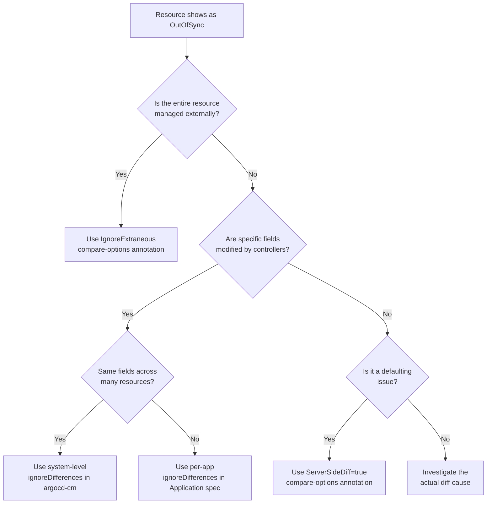

# How to Use argocd.argoproj.io/compare-options Annotation

Author: [nawazdhandala](https://github.com/nawazdhandala)

Tags: ArgoCD, GitOps, Kubernetes, Annotations, Diff Configuration

Description: Learn how to use the argocd.argoproj.io/compare-options annotation to customize how ArgoCD compares live and desired state for specific resources.

---

ArgoCD continuously compares the desired state in Git with the live state in your cluster. Sometimes this comparison produces false positives - resources show as OutOfSync when nothing meaningful has changed. The `argocd.argoproj.io/compare-options` annotation gives you per-resource control over how ArgoCD performs this comparison, letting you suppress noise without disabling comparison entirely.

## Understanding the Compare Process

Before diving into the annotation, it helps to understand what ArgoCD does during comparison. Every reconciliation cycle, ArgoCD:

1. Fetches the desired manifests from your Git repository
2. Fetches the live state from the Kubernetes API
3. Normalizes both states (removing server-generated fields)
4. Computes a diff between the two

The `compare-options` annotation lets you modify step 3 and 4 for individual resources.

## The compare-options Annotation Syntax

The annotation is placed directly on resources in your Git manifests:

```yaml
apiVersion: apps/v1
kind: Deployment
metadata:
  name: my-app
  annotations:
    argocd.argoproj.io/compare-options: IgnoreExtraneous
```

The annotation accepts the following values:

- `IgnoreExtraneous` - Tell ArgoCD this resource is "extra" and should not affect sync status
- `ServerSideDiff=true` - Use server-side diff for this specific resource

You can combine multiple options with a comma separator.

## Using IgnoreExtraneous

The `IgnoreExtraneous` option is the most commonly used value. When applied to a resource, ArgoCD will still track and display the resource, but it will not count it toward the application's sync status. The resource can differ from the desired state without causing an OutOfSync status.

This is incredibly useful for resources that are managed by controllers or operators that modify the resource after creation.

```yaml
# A ConfigMap that gets modified by an operator after creation
apiVersion: v1
kind: ConfigMap
metadata:
  name: operator-managed-config
  annotations:
    argocd.argoproj.io/compare-options: IgnoreExtraneous
data:
  initial-key: initial-value
  # The operator will add more keys here at runtime
```

### Real-World Use Cases for IgnoreExtraneous

**HorizontalPodAutoscaler replicas**: HPA modifies the replica count on Deployments. If you have a desired state in Git with `replicas: 3` but HPA scales it to 5, ArgoCD will report OutOfSync. You have a few options, but if the HPA-managed resource should be truly hands-off:

```yaml
apiVersion: autoscaling/v2
kind: HorizontalPodAutoscaler
metadata:
  name: my-app-hpa
  annotations:
    argocd.argoproj.io/compare-options: IgnoreExtraneous
spec:
  scaleTargetRef:
    apiVersion: apps/v1
    kind: Deployment
    name: my-app
  minReplicas: 2
  maxReplicas: 10
  metrics:
    - type: Resource
      resource:
        name: cpu
        target:
          type: Utilization
          averageUtilization: 70
```

**Cert-manager managed secrets**: cert-manager creates and rotates TLS secrets. These secrets will constantly differ from what is in Git:

```yaml
apiVersion: v1
kind: Secret
metadata:
  name: my-tls-cert
  annotations:
    argocd.argoproj.io/compare-options: IgnoreExtraneous
type: kubernetes.io/tls
data: {}
```

**Operator-created resources**: Many operators create child resources that mutate frequently:

```yaml
apiVersion: v1
kind: Service
metadata:
  name: operator-created-svc
  annotations:
    argocd.argoproj.io/compare-options: IgnoreExtraneous
spec:
  selector:
    app: my-app
  ports:
    - port: 80
```

## Using ServerSideDiff

Server-side diff delegates the comparison to the Kubernetes API server using server-side apply dry-run. This can produce more accurate diffs because the API server knows about defaulting, validation, and field ownership.

```yaml
apiVersion: apps/v1
kind: Deployment
metadata:
  name: my-app
  annotations:
    argocd.argoproj.io/compare-options: ServerSideDiff=true
spec:
  replicas: 3
  selector:
    matchLabels:
      app: my-app
  template:
    metadata:
      labels:
        app: my-app
    spec:
      containers:
        - name: app
          image: my-app:v1.0
          # Server-side diff will correctly handle
          # defaulted fields like imagePullPolicy
```

Server-side diff is especially useful when you see phantom diffs caused by:

- Default values added by the API server (like `imagePullPolicy: Always`)
- Mutating webhooks that inject sidecars or modify resource specs
- Fields that only exist in the live state due to controller reconciliation

## Combining compare-options with ignoreDifferences

The `compare-options` annotation works at the resource level, while `ignoreDifferences` in the Application spec works at the field level. You can use both together for maximum control:

```yaml
# Application spec with ignoreDifferences
apiVersion: argoproj.io/v1alpha1
kind: Application
metadata:
  name: my-app
spec:
  ignoreDifferences:
    - group: apps
      kind: Deployment
      jsonPointers:
        - /spec/replicas
  source:
    repoURL: https://github.com/my-org/manifests.git
    path: apps/my-app
    targetRevision: HEAD
  destination:
    server: https://kubernetes.default.svc
    namespace: default
```

And in the actual resource manifest:

```yaml
# Resource with compare-options for a specific resource
apiVersion: v1
kind: ConfigMap
metadata:
  name: dynamic-config
  annotations:
    argocd.argoproj.io/compare-options: IgnoreExtraneous
data:
  static-key: static-value
```

The key difference: `ignoreDifferences` ignores specific fields but still compares other fields. `IgnoreExtraneous` removes the resource from sync status calculation entirely.

## Decision Flow for Choosing the Right Approach

Here is a flow to help you decide which mechanism to use:



## System-Level Compare Options

You can also set default compare options at the system level in the `argocd-cm` ConfigMap, rather than annotating every individual resource:

```yaml
apiVersion: v1
kind: ConfigMap
metadata:
  name: argocd-cm
  namespace: argocd
data:
  # Enable server-side diff globally
  controller.diff.server.side: "true"
```

Per-resource annotations will override these global settings when both are present.

## Practical Example: Full Application Setup

Here is a complete example showing how to use compare-options in a real application:

```yaml
# deployment.yaml - standard resource, no special options
apiVersion: apps/v1
kind: Deployment
metadata:
  name: web-app
spec:
  replicas: 3
  selector:
    matchLabels:
      app: web-app
  template:
    metadata:
      labels:
        app: web-app
    spec:
      containers:
        - name: web
          image: web-app:v2.1.0
          ports:
            - containerPort: 8080
---
# hpa.yaml - operator-managed, ignore from sync status
apiVersion: autoscaling/v2
kind: HorizontalPodAutoscaler
metadata:
  name: web-app-hpa
  annotations:
    argocd.argoproj.io/compare-options: IgnoreExtraneous
spec:
  scaleTargetRef:
    apiVersion: apps/v1
    kind: Deployment
    name: web-app
  minReplicas: 3
  maxReplicas: 20
---
# webhook-injected-deployment.yaml - use server-side diff
apiVersion: apps/v1
kind: Deployment
metadata:
  name: istio-app
  annotations:
    argocd.argoproj.io/compare-options: ServerSideDiff=true
spec:
  replicas: 2
  selector:
    matchLabels:
      app: istio-app
  template:
    metadata:
      labels:
        app: istio-app
    spec:
      containers:
        - name: app
          image: istio-app:v1.0
```

## Debugging Compare Issues

When compare-options are not working as expected, check these things:

```bash
# View the full diff ArgoCD sees
argocd app diff my-app

# Check if the annotation is correctly applied in the live state
kubectl get deployment my-app -o jsonpath='{.metadata.annotations}' | jq .

# Force a hard refresh to recompute the diff
argocd app get my-app --hard-refresh
```

## Summary

The `argocd.argoproj.io/compare-options` annotation is your tool for fine-tuning how ArgoCD handles comparison at the individual resource level. Use `IgnoreExtraneous` when a resource should be excluded from sync status entirely, and `ServerSideDiff=true` when you need the API server to handle the comparison for more accurate results. Combined with `ignoreDifferences` in the Application spec, you have a complete toolkit for eliminating false OutOfSync signals and keeping your ArgoCD dashboard clean and actionable.
