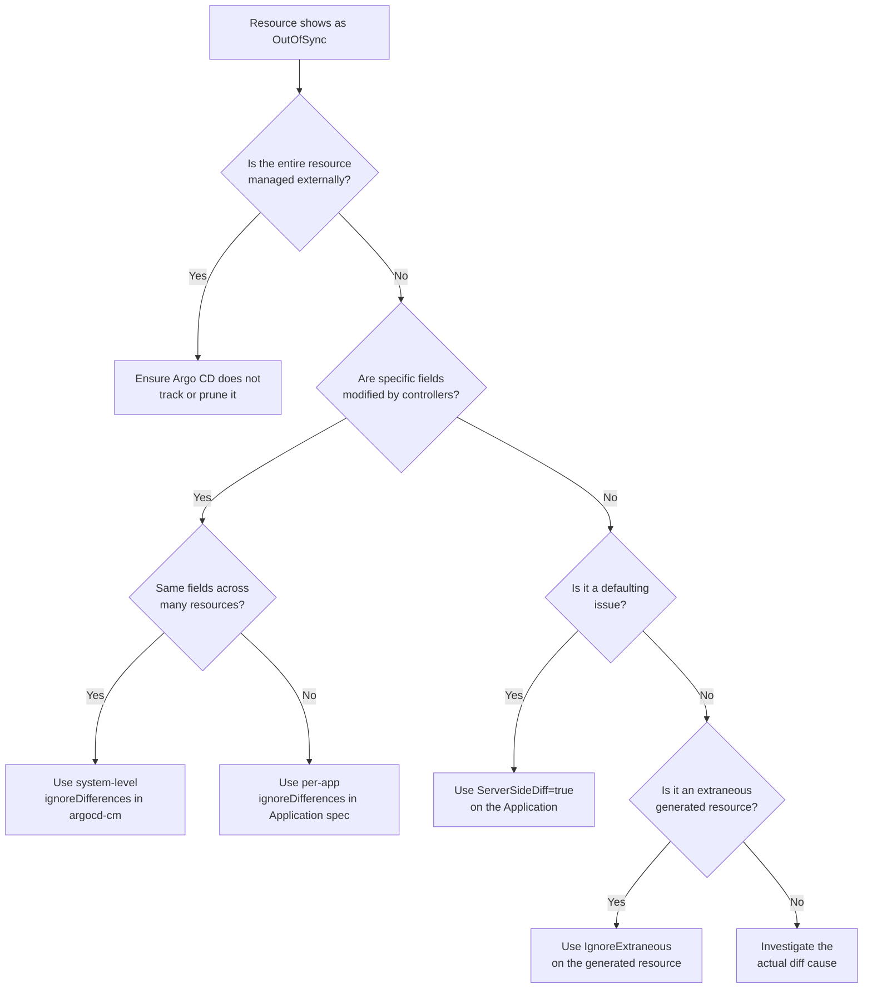

# How to Use argocd.argoproj.io/compare-options Annotation

Author: [nawazdhandala](https://github.com/nawazdhandala)

Tags: ArgoCD, GitOps, Kubernetes, Annotation, Diff Configuration

Description: Learn how to use the argocd.argoproj.io/compare-options annotation to customize how ArgoCD compares live and desired state for specific resources.

---

ArgoCD continuously compares the desired state in Git with the live state in your cluster. Sometimes this comparison produces false positives - resources show as OutOfSync when nothing meaningful has changed. The `argocd.argoproj.io/compare-options` annotation gives you control over specific comparison behaviors, letting you suppress noise without disabling comparison entirely.

## Understanding the Compare Process

Before diving into the annotation, it helps to understand what ArgoCD does during comparison. Every reconciliation cycle, ArgoCD:

1. Fetches the desired manifests from your Git repository
2. Fetches the live state from the Kubernetes API
3. Normalizes both states (removing server-generated fields)
4. Computes a diff between the two

The `compare-options` annotation can modify specific parts of this process, depending on where the annotation is used.

## The compare-options Annotation Syntax

The annotation can be placed directly on resources in your Git manifests for `IgnoreExtraneous`:

```yaml
apiVersion: apps/v1
kind: Deployment
metadata:
  name: my-app
  annotations:
    argocd.argoproj.io/compare-options: IgnoreExtraneous
```

The annotation accepts the following values:

- `IgnoreExtraneous` - Tell ArgoCD this resource is "extra" and should not affect sync status
- `ServerSideDiff=true` - Use server-side diff for an Argo CD Application

When multiple compare options apply to the same target, you can combine them with a comma separator.

## Using IgnoreExtraneous

The `IgnoreExtraneous` option is the most commonly used resource-level value. When applied to a resource, ArgoCD will still track and display the resource, but it will not count an extraneous instance of that resource toward the application's sync status. This is most useful for resources generated by tools, such as Kustomize-generated ConfigMaps and Secrets whose names change when their contents change.

This is incredibly useful for generated resources that would otherwise appear as extra resources requiring pruning.

```yaml
# A Kustomize-generated ConfigMap that may leave old hashed versions behind
apiVersion: kustomize.config.k8s.io/v1beta1
kind: Kustomization
configMapGenerator:
  - name: operator-managed-config
    literals:
      - initial-key=initial-value
generatorOptions:
  annotations:
    argocd.argoproj.io/compare-options: IgnoreExtraneous
```

### Real-World Use Cases for IgnoreExtraneous

**Kustomize-generated ConfigMaps and Secrets**: Kustomize can generate resources with content hashes in their names. Annotating the generated resources keeps old generated instances from affecting the application's sync status while they are waiting to be pruned:

```yaml
configMapGenerator:
  - name: my-map
    literals:
      - foo=bar
generatorOptions:
  annotations:
    argocd.argoproj.io/compare-options: IgnoreExtraneous
kind: Kustomization
```

**Generated TLS secrets**: If a tool generates TLS Secret manifests as part of your desired state, the generated Secret can carry the annotation. A Kubernetes TLS Secret should include the `tls.crt` and `tls.key` keys:

```yaml
apiVersion: v1
kind: Secret
metadata:
  name: my-tls-cert
  annotations:
    argocd.argoproj.io/compare-options: IgnoreExtraneous
type: kubernetes.io/tls
data:
  tls.crt: LS0tLS1CRUdJTiBDRVJUSUZJQ0FURS0tLS0tCg==
  tls.key: LS0tLS1CRUdJTiBQUklWQVRFIEtFWS0tLS0tCg==
```

**Operator-created resources**: Many operators create child resources that should not be managed by ArgoCD. `IgnoreExtraneous` can help only if those generated resources carry the annotation, for example through an operator template field:

```yaml
apiVersion: v1
kind: Service
metadata:
  name: operator-created-svc
  annotations:
    argocd.argoproj.io/compare-options: IgnoreExtraneous
spec:
  selector:
    app: my-app
  ports:
    - port: 80
```

## Using ServerSideDiff

Server-side diff delegates the comparison to the Kubernetes API server using server-side apply dry-run. This can produce more accurate diffs because the API server knows about defaulting and validation.

```yaml
apiVersion: argoproj.io/v1alpha1
kind: Application
metadata:
  name: my-app
  annotations:
    argocd.argoproj.io/compare-options: ServerSideDiff=true
spec:
  project: default
  source:
    repoURL: https://github.com/my-org/manifests.git
    path: apps/my-app
    targetRevision: HEAD
  destination:
    server: https://kubernetes.default.svc
    namespace: default
```

Server-side diff is especially useful when you see phantom diffs caused by:

- Default values added by the API server
- Validation and defaulting behavior that is only available from the API server
- Mutating webhooks, if you also enable `IncludeMutationWebhook=true`

## Combining compare-options with ignoreDifferences

The `IgnoreExtraneous` compare option works at the resource level, while `ignoreDifferences` in the Application spec works at the field level. Application-level compare options such as `ServerSideDiff=true` can also be used alongside `ignoreDifferences` for maximum control:

```yaml
# Application spec with ignoreDifferences
apiVersion: argoproj.io/v1alpha1
kind: Application
metadata:
  name: my-app
  annotations:
    argocd.argoproj.io/compare-options: ServerSideDiff=true
spec:
  project: default
  ignoreDifferences:
    - group: apps
      kind: Deployment
      jsonPointers:
        - /spec/replicas
  source:
    repoURL: https://github.com/my-org/manifests.git
    path: apps/my-app
    targetRevision: HEAD
  destination:
    server: https://kubernetes.default.svc
    namespace: default
```

And in the actual resource manifest:

```yaml
# Resource with compare-options for a specific resource
apiVersion: v1
kind: ConfigMap
metadata:
  name: dynamic-config
  annotations:
    argocd.argoproj.io/compare-options: IgnoreExtraneous
data:
  static-key: static-value
```

The key difference: `ignoreDifferences` ignores specific fields but still compares other fields. `IgnoreExtraneous` removes extraneous resources from sync status calculation.

## Decision Flow for Choosing the Right Approach

Here is a flow to help you decide which mechanism to use:


```mermaid
graph TD
    A[Resource shows as OutOfSync] --> B{Is the entire resource<br/>managed externally?}
    B -->|Yes| C[Ensure Argo CD does not<br/>track or prune it]
    B -->|No| D{Are specific fields<br/>modified by controllers?}
    D -->|Yes| E{Same fields across<br/>many resources?}
    E -->|Yes| F[Use system-level<br/>ignoreDifferences in argocd-cm]
    E -->|No| G[Use per-app<br/>ignoreDifferences in Application spec]
    D -->|No| H{Is it a defaulting<br/>issue?}
    H -->|Yes| I[Use ServerSideDiff=true<br/>on the Application]
    H -->|No| J{Is it an extraneous<br/>generated resource?}
    J -->|Yes| K[Use IgnoreExtraneous<br/>on the generated resource]
    J -->|No| L[Investigate the<br/>actual diff cause]
```

## System-Level Compare Options

You can also enable server-side diff at the system level in the `argocd-cmd-params-cm` ConfigMap, rather than annotating every individual Application:

```yaml
apiVersion: v1
kind: ConfigMap
metadata:
  name: argocd-cmd-params-cm
  namespace: argocd
data:
  # Enable server-side diff globally
  controller.diff.server.side: "true"
```

After changing this setting, restart the `argocd-application-controller`. If server-side diff is enabled globally, you can disable it for a specific Application with `argocd.argoproj.io/compare-options: ServerSideDiff=false`.

## Practical Example: Full Application Setup

Here is a complete example showing how to use compare-options in a real application:

```yaml
# deployment.yaml - standard resource, no special options
apiVersion: apps/v1
kind: Deployment
metadata:
  name: web-app
spec:
  replicas: 3
  selector:
    matchLabels:
      app: web-app
  template:
    metadata:
      labels:
        app: web-app
    spec:
      containers:
        - name: web
          image: web-app:v2.1.0
          ports:
            - containerPort: 8080
---
# kustomization.yaml - generated resources carry IgnoreExtraneous
apiVersion: kustomize.config.k8s.io/v1beta1
kind: Kustomization
resources:
  - deployment.yaml
configMapGenerator:
  - name: web-app-config
    literals:
      - log-level=info
generatorOptions:
  annotations:
    argocd.argoproj.io/compare-options: IgnoreExtraneous
---
# application.yaml - use server-side diff for this Application
apiVersion: argoproj.io/v1alpha1
kind: Application
metadata:
  name: web-app
  annotations:
    argocd.argoproj.io/compare-options: ServerSideDiff=true,IncludeMutationWebhook=true
spec:
  project: default
  source:
    repoURL: https://github.com/my-org/manifests.git
    path: apps/web-app
    targetRevision: HEAD
  destination:
    server: https://kubernetes.default.svc
    namespace: default
```

## Debugging Compare Issues

When compare-options are not working as expected, check these things:

```bash
# View the full diff ArgoCD sees
argocd app diff my-app

# Check if the annotation is correctly applied in the live state
kubectl get deployment my-app -o json | jq '.metadata.annotations'

# Force a hard refresh to recompute the diff
argocd app get my-app --hard-refresh
```

## Summary

The `argocd.argoproj.io/compare-options` annotation is your tool for fine-tuning how ArgoCD handles comparison. Use `IgnoreExtraneous` when an extraneous generated resource should be excluded from sync status, and `ServerSideDiff=true` on an Application when you need the API server to handle the comparison for more accurate results. Combined with `ignoreDifferences` in the Application spec, you have a complete toolkit for eliminating false OutOfSync signals and keeping your ArgoCD dashboard clean and actionable.
