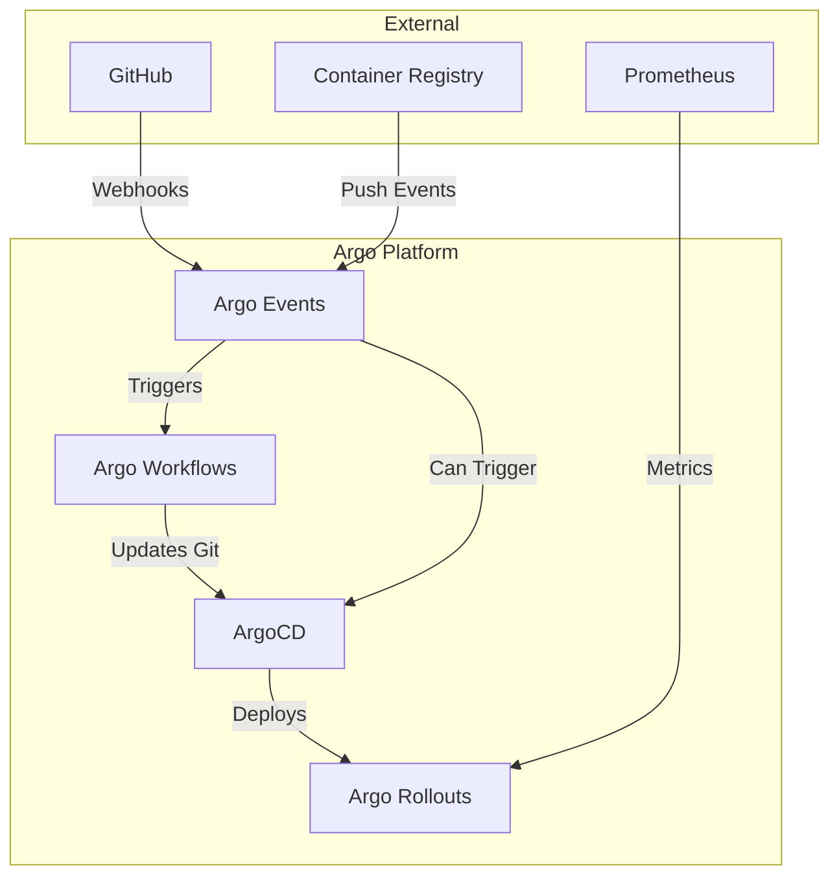

# How to Set Up a Complete Argo Platform (CD + Rollouts + Workflows + Events)

Author: [nawazdhandala](https://github.com/nawazdhandala)

Tags: ArgoCD, GitOps, Kubernetes, Argo Workflows, Argo Rollouts

Description: Learn how to set up the complete Argo ecosystem with ArgoCD, Argo Rollouts, Argo Workflows, and Argo Events working together as a unified Kubernetes-native platform.

---

The Argo project is not a single tool. It is a family of four Kubernetes-native projects that, when combined, give you a complete platform for CI/CD, progressive delivery, workflow automation, and event-driven architecture. Most teams start with ArgoCD and gradually adopt the other components. This guide shows you how to set up all four together.

## The Four Argo Projects

Each project handles a different concern:

- **ArgoCD**: Continuous deployment through GitOps. Syncs Kubernetes manifests from Git to your cluster.
- **Argo Rollouts**: Progressive delivery with canary, blue-green, and analysis-driven releases.
- **Argo Workflows**: Kubernetes-native workflow engine for CI pipelines, data processing, and batch jobs.
- **Argo Events**: Event-driven automation connecting external events to Kubernetes actions.



## Installing the Complete Platform

Start by creating namespaces for each component:

```bash
# Create all namespaces
kubectl create namespace argocd
kubectl create namespace argo-rollouts
kubectl create namespace argo
kubectl create namespace argo-events
```

### Install ArgoCD

```bash
# Install ArgoCD
kubectl apply -n argocd -f https://raw.githubusercontent.com/argoproj/argo-cd/stable/manifests/install.yaml

# Wait for pods to be ready
kubectl wait --for=condition=ready pod -l app.kubernetes.io/name=argocd-server -n argocd --timeout=300s

# Get the initial admin password
kubectl -n argocd get secret argocd-initial-admin-secret -o jsonpath="{.data.password}" | base64 -d
```

### Install Argo Rollouts

```bash
# Install Argo Rollouts controller
kubectl apply -n argo-rollouts -f https://github.com/argoproj/argo-rollouts/releases/latest/download/install.yaml

# Verify
kubectl get pods -n argo-rollouts
```

### Install Argo Workflows

```bash
# Install Argo Workflows
kubectl apply -n argo -f https://github.com/argoproj/argo-workflows/releases/latest/download/install.yaml

# Patch the workflow controller to use the correct executor
kubectl patch configmap workflow-controller-configmap -n argo --type merge -p '{
  "data": {
    "containerRuntimeExecutor": "emissary"
  }
}'

# Verify
kubectl get pods -n argo
```

### Install Argo Events

```bash
# Install Argo Events
kubectl apply -f https://raw.githubusercontent.com/argoproj/argo-events/stable/manifests/install.yaml -n argo-events

# Install validation webhook
kubectl apply -f https://raw.githubusercontent.com/argoproj/argo-events/stable/manifests/install-validating-webhook.yaml -n argo-events

# Set up EventBus
cat <<EOF | kubectl apply -f -
apiVersion: argoproj.io/v1alpha1
kind: EventBus
metadata:
  name: default
  namespace: argo-events
spec:
  nats:
    native:
      replicas: 3
      auth: token
EOF

# Verify
kubectl get pods -n argo-events
```

## Connecting the Components

### RBAC Setup

Each component needs permissions to interact with the others. Create a shared service account:

```yaml
# argo-platform-rbac.yaml
apiVersion: v1
kind: ServiceAccount
metadata:
  name: argo-platform-sa
  namespace: argo-events
---
apiVersion: rbac.authorization.k8s.io/v1
kind: ClusterRole
metadata:
  name: argo-platform-role
rules:
  # Argo Workflows permissions
  - apiGroups: ["argoproj.io"]
    resources: ["workflows", "workflowtemplates", "cronworkflows"]
    verbs: ["create", "get", "list", "watch", "update", "patch", "delete"]
  # ArgoCD permissions
  - apiGroups: ["argoproj.io"]
    resources: ["applications"]
    verbs: ["get", "list", "watch", "update", "patch"]
  # Argo Rollouts permissions
  - apiGroups: ["argoproj.io"]
    resources: ["rollouts", "analysisruns", "analysistemplates"]
    verbs: ["get", "list", "watch"]
  # Standard Kubernetes resources
  - apiGroups: [""]
    resources: ["pods", "services", "configmaps", "secrets"]
    verbs: ["get", "list", "watch", "create", "update", "patch"]
---
apiVersion: rbac.authorization.k8s.io/v1
kind: ClusterRoleBinding
metadata:
  name: argo-platform-binding
subjects:
  - kind: ServiceAccount
    name: argo-platform-sa
    namespace: argo-events
roleRef:
  kind: ClusterRole
  name: argo-platform-role
  apiGroup: rbac.authorization.k8s.io
```

### End-to-End Pipeline Configuration

Here is a complete pipeline that uses all four components. The flow is:

1. Developer pushes code to GitHub
2. Argo Events receives the webhook
3. Argo Events triggers an Argo Workflow for CI
4. The Workflow builds, tests, and updates the GitOps repo
5. ArgoCD detects the Git change and syncs
6. Argo Rollouts performs a canary deployment with analysis

**Step 1: EventSource for GitHub webhooks**

```yaml
# platform/eventsource.yaml
apiVersion: argoproj.io/v1alpha1
kind: EventSource
metadata:
  name: github
  namespace: argo-events
spec:
  service:
    ports:
      - port: 12000
        targetPort: 12000
  github:
    app-repo:
      repositories:
        - owner: myorg
          names:
            - myapp
      events:
        - push
      webhook:
        endpoint: /push
        port: "12000"
        method: POST
      webhookSecret:
        name: github-secret
        key: token
      apiToken:
        name: github-token
        key: token
      active: true
      contentType: json
```

**Step 2: Sensor that triggers Argo Workflow**

```yaml
# platform/sensor.yaml
apiVersion: argoproj.io/v1alpha1
kind: Sensor
metadata:
  name: ci-trigger
  namespace: argo-events
spec:
  dependencies:
    - name: push-event
      eventSourceName: github
      eventName: app-repo
      filters:
        data:
          - path: body.ref
            type: string
            value:
              - "refs/heads/main"
  triggers:
    - template:
        name: trigger-ci
        argoWorkflow:
          operation: submit
          source:
            resource:
              apiVersion: argoproj.io/v1alpha1
              kind: Workflow
              metadata:
                generateName: ci-
                namespace: argo
              spec:
                workflowTemplateRef:
                  name: ci-pipeline
          parameters:
            - src:
                dependencyName: push-event
                dataKey: body.after
              dest: spec.arguments.parameters.0.value
```

**Step 3: WorkflowTemplate for CI**

```yaml
# platform/ci-workflow.yaml
apiVersion: argoproj.io/v1alpha1
kind: WorkflowTemplate
metadata:
  name: ci-pipeline
  namespace: argo
spec:
  entrypoint: pipeline
  arguments:
    parameters:
      - name: commit-sha
  serviceAccountName: argo-platform-sa
  templates:
    - name: pipeline
      dag:
        tasks:
          - name: build
            template: build-image
          - name: test
            template: run-tests
            dependencies: [build]
          - name: update-manifests
            template: update-gitops
            dependencies: [test]

    - name: build-image
      container:
        image: gcr.io/kaniko-project/executor:latest
        args:
          - --dockerfile=Dockerfile
          - "--destination=registry.example.com/myapp:{{workflow.parameters.commit-sha}}"

    - name: run-tests
      container:
        image: registry.example.com/myapp:{{workflow.parameters.commit-sha}}
        command: [npm, test]

    - name: update-gitops
      container:
        image: alpine/git:latest
        command: [sh, -c]
        args:
          - |
            git clone https://github.com/myorg/gitops /repo
            cd /repo
            # Update the image tag
            sed -i "s|image: registry.example.com/myapp:.*|image: registry.example.com/myapp:{{workflow.parameters.commit-sha}}|" \
              apps/myapp/rollout.yaml
            git add . && git commit -m "Deploy {{workflow.parameters.commit-sha}}" && git push
```

**Step 4: ArgoCD Application**

```yaml
# platform/argocd-app.yaml
apiVersion: argoproj.io/v1alpha1
kind: Application
metadata:
  name: myapp
  namespace: argocd
spec:
  project: default
  source:
    repoURL: https://github.com/myorg/gitops
    targetRevision: main
    path: apps/myapp
  destination:
    server: https://kubernetes.default.svc
    namespace: production
  syncPolicy:
    automated:
      prune: true
      selfHeal: true
```

**Step 5: Argo Rollout with Analysis**

```yaml
# gitops/apps/myapp/rollout.yaml
apiVersion: argoproj.io/v1alpha1
kind: Rollout
metadata:
  name: myapp
spec:
  replicas: 5
  selector:
    matchLabels:
      app: myapp
  template:
    metadata:
      labels:
        app: myapp
    spec:
      containers:
        - name: myapp
          image: registry.example.com/myapp:latest
          ports:
            - containerPort: 8080
  strategy:
    canary:
      steps:
        - setWeight: 10
        - pause: { duration: 3m }
        - setWeight: 30
        - pause: { duration: 3m }
        - setWeight: 60
        - pause: { duration: 3m }
      analysis:
        templates:
          - templateName: success-rate
        startingStep: 1
      canaryService: myapp-canary
      stableService: myapp-stable
```

## Managing the Platform with ArgoCD (App of Apps)

Use ArgoCD's App of Apps pattern to manage the entire Argo platform through GitOps:

```yaml
# platform-app.yaml
apiVersion: argoproj.io/v1alpha1
kind: Application
metadata:
  name: argo-platform
  namespace: argocd
spec:
  project: default
  source:
    repoURL: https://github.com/myorg/platform
    targetRevision: main
    path: platform
  destination:
    server: https://kubernetes.default.svc
  syncPolicy:
    automated:
      prune: true
      selfHeal: true
```

This single Application manages all the EventSources, Sensors, WorkflowTemplates, and Applications in your platform directory.

## Shared Configuration

All Argo projects read configuration from ConfigMaps and Secrets. Centralize shared settings:

```yaml
# shared-config.yaml
apiVersion: v1
kind: ConfigMap
metadata:
  name: argo-platform-config
  namespace: argo-events
data:
  argocd-server: "argocd-server.argocd.svc.cluster.local"
  argo-server: "argo-server.argo.svc.cluster.local"
  container-registry: "registry.example.com"
  gitops-repo: "https://github.com/myorg/gitops"
```

## Monitoring the Platform

Each Argo component exposes Prometheus metrics. Set up dashboards that show the complete pipeline:

```yaml
# platform-monitoring.yaml
apiVersion: monitoring.coreos.com/v1
kind: ServiceMonitor
metadata:
  name: argo-platform-metrics
spec:
  selector:
    matchExpressions:
      - key: app.kubernetes.io/part-of
        operator: In
        values:
          - argocd
          - argo-rollouts
          - argo-workflows
          - argo-events
  endpoints:
    - port: metrics
      interval: 30s
```

Key metrics across the platform:

- **Argo Events**: Events received, events processed, sensor processing time
- **Argo Workflows**: Workflow duration, success rate, queue depth
- **ArgoCD**: Sync duration, sync failures, application health
- **Argo Rollouts**: Rollout duration, analysis pass/fail, rollback count

## Summary

Running the complete Argo platform gives you a fully Kubernetes-native CI/CD system. Argo Events catches external triggers, Argo Workflows handles CI, ArgoCD manages deployment through GitOps, and Argo Rollouts ensures safe progressive delivery. Each component does one thing well, and they communicate through standard Kubernetes resources and Git. For individual component deep dives, see our guides on [Argo Workflows with ArgoCD](https://oneuptime.com/blog/post/2026-02-26-argocd-argo-workflows-ci-cd/view), [Argo Events with ArgoCD](https://oneuptime.com/blog/post/2026-02-26-argocd-argo-events-deployments/view), and [Argo Rollouts with ArgoCD](https://oneuptime.com/blog/post/2026-02-26-argocd-argo-rollouts-progressive-delivery/view).
