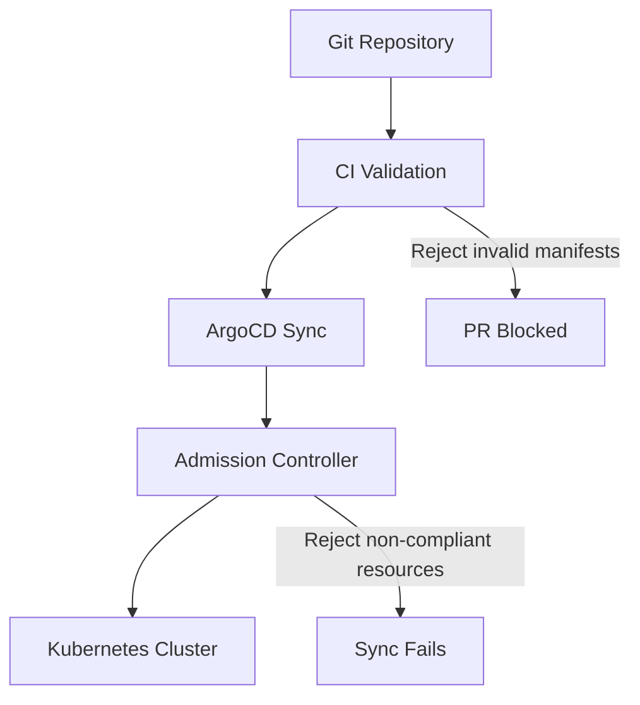

# How to Implement Compliance as Code with ArgoCD

Author: [nawazdhandala](https://github.com/nawazdhandala)

Tags: ArgoCD, GitOps, Kubernetes, Compliance, Policy Enforcement

Description: Learn how to implement compliance as code with ArgoCD by integrating policy engines like OPA Gatekeeper and Kyverno, enforcing security standards, and automating compliance checks.

---

Compliance as code means expressing your organization's security, regulatory, and operational requirements as machine-enforceable policies. Instead of a compliance checklist in a spreadsheet, you write policies that are automatically validated against every deployment. ArgoCD and GitOps make this practical because every change goes through Git and can be checked before it reaches your cluster.

This guide shows you how to implement compliance as code with ArgoCD using policy engines, admission controllers, and automated validation.

## The Compliance as Code Stack

A typical compliance-as-code setup with ArgoCD involves three layers:



1. **Pre-merge validation:** Policies checked in CI before changes merge to the config repo
2. **ArgoCD sync-time:** ArgoCD applies manifests that pass admission control
3. **Runtime enforcement:** Admission controllers reject non-compliant resources at the API server level

## Setting Up OPA Gatekeeper with ArgoCD

OPA Gatekeeper is a policy engine that acts as a Kubernetes admission controller. Deploy it with ArgoCD:

```yaml
apiVersion: argoproj.io/v1alpha1
kind: Application
metadata:
  name: gatekeeper
  namespace: argocd
  annotations:
    argocd.argoproj.io/sync-wave: "-2"
spec:
  project: default
  source:
    repoURL: https://open-policy-agent.github.io/gatekeeper/charts
    chart: gatekeeper
    targetRevision: 3.15.1
    helm:
      values: |
        replicas: 3
        audit:
          replicas: 1
        resources:
          requests:
            cpu: 100m
            memory: 256Mi
  destination:
    server: https://kubernetes.default.svc
    namespace: gatekeeper-system
  syncPolicy:
    automated:
      prune: true
      selfHeal: true
    syncOptions:
      - CreateNamespace=true
```

### Define Constraint Templates

Constraint Templates define the policy logic. Deploy them with ArgoCD:

```yaml
# Require resource limits on all containers
apiVersion: templates.gatekeeper.sh/v1
kind: ConstraintTemplate
metadata:
  name: k8srequiredresources
  annotations:
    argocd.argoproj.io/sync-wave: "-1"
spec:
  crd:
    spec:
      names:
        kind: K8sRequiredResources
  targets:
    - target: admission.k8s.gatekeeper.sh
      rego: |
        package k8srequiredresources

        violation[{"msg": msg}] {
          container := input.review.object.spec.containers[_]
          not container.resources.limits
          msg := sprintf("Container %v must have resource limits", [container.name])
        }

        violation[{"msg": msg}] {
          container := input.review.object.spec.containers[_]
          not container.resources.requests
          msg := sprintf("Container %v must have resource requests", [container.name])
        }
```

### Apply Constraints

Constraints bind templates to specific resources:

```yaml
# Enforce resource limits in production namespaces
apiVersion: constraints.gatekeeper.sh/v1beta1
kind: K8sRequiredResources
metadata:
  name: require-resource-limits-production
spec:
  match:
    kinds:
      - apiGroups: ["apps"]
        kinds: ["Deployment", "StatefulSet"]
    namespaces:
      - "production-*"
  enforcementAction: deny
```

## Setting Up Kyverno with ArgoCD

Kyverno is an alternative policy engine that uses Kubernetes-native YAML for policies instead of Rego:

```yaml
apiVersion: argoproj.io/v1alpha1
kind: Application
metadata:
  name: kyverno
  namespace: argocd
  annotations:
    argocd.argoproj.io/sync-wave: "-2"
spec:
  project: default
  source:
    repoURL: https://kyverno.github.io/kyverno
    chart: kyverno
    targetRevision: 3.1.4
  destination:
    server: https://kubernetes.default.svc
    namespace: kyverno
  syncPolicy:
    automated:
      prune: true
      selfHeal: true
    syncOptions:
      - CreateNamespace=true
```

### Kyverno Policy Examples

```yaml
# Require labels on all deployments
apiVersion: kyverno.io/v1
kind: ClusterPolicy
metadata:
  name: require-labels
  annotations:
    argocd.argoproj.io/sync-wave: "-1"
spec:
  validationFailureAction: Enforce
  rules:
    - name: check-required-labels
      match:
        any:
          - resources:
              kinds:
                - Deployment
                - StatefulSet
      validate:
        message: "The labels 'app.kubernetes.io/name', 'app.kubernetes.io/version', and 'app.kubernetes.io/managed-by' are required."
        pattern:
          metadata:
            labels:
              app.kubernetes.io/name: "?*"
              app.kubernetes.io/version: "?*"
              app.kubernetes.io/managed-by: "?*"

---
# Disallow privileged containers
apiVersion: kyverno.io/v1
kind: ClusterPolicy
metadata:
  name: disallow-privileged
spec:
  validationFailureAction: Enforce
  rules:
    - name: deny-privileged
      match:
        any:
          - resources:
              kinds:
                - Pod
      validate:
        message: "Privileged containers are not allowed."
        pattern:
          spec:
            containers:
              - securityContext:
                  privileged: "false"

---
# Require non-root containers
apiVersion: kyverno.io/v1
kind: ClusterPolicy
metadata:
  name: require-non-root
spec:
  validationFailureAction: Enforce
  rules:
    - name: require-run-as-non-root
      match:
        any:
          - resources:
              kinds:
                - Pod
      validate:
        message: "Containers must run as non-root."
        pattern:
          spec:
            securityContext:
              runAsNonRoot: true
```

## Pre-Merge Policy Validation in CI

Catching policy violations before they reach ArgoCD saves time and reduces failed syncs. Add policy validation to your CI pipeline:

### Using Kyverno CLI

```yaml
# .github/workflows/validate-policies.yaml
name: Validate Compliance
on:
  pull_request:
    branches: [main]

jobs:
  validate:
    runs-on: ubuntu-latest
    steps:
      - uses: actions/checkout@v4

      - name: Install Kyverno CLI
        run: |
          curl -LO https://github.com/kyverno/kyverno/releases/download/v1.11.4/kyverno-cli_v1.11.4_linux_x86_64.tar.gz
          tar -xzf kyverno-cli_v1.11.4_linux_x86_64.tar.gz
          sudo mv kyverno /usr/local/bin/

      - name: Validate manifests against policies
        run: |
          # Build all manifests
          for overlay in apps/*/overlays/*/; do
            echo "Validating $overlay"
            kustomize build "$overlay" > /tmp/manifests.yaml

            # Apply policies
            kyverno apply policies/ \
              --resource /tmp/manifests.yaml \
              --detailed-results
          done
```

### Using Conftest (OPA)

```yaml
- name: Validate with Conftest
  run: |
    for overlay in apps/*/overlays/*/; do
      kustomize build "$overlay" | conftest test - \
        --policy policies/ \
        --output json
    done
```

Example Conftest policy in Rego:

```rego
# policies/security.rego
package main

deny[msg] {
  input.kind == "Deployment"
  container := input.spec.template.spec.containers[_]
  not container.securityContext.readOnlyRootFilesystem
  msg := sprintf("Container %s must have readOnlyRootFilesystem set to true", [container.name])
}

deny[msg] {
  input.kind == "Deployment"
  container := input.spec.template.spec.containers[_]
  contains(container.image, ":latest")
  msg := sprintf("Container %s must not use :latest tag", [container.name])
}

deny[msg] {
  input.kind == "Deployment"
  not input.spec.template.spec.securityContext.runAsNonRoot
  msg := "Deployment must specify runAsNonRoot: true"
}
```

## Managing Policies with GitOps

Policies themselves should be managed through GitOps:

```text
config-repo/
  policies/
    security/
      disallow-privileged.yaml
      require-non-root.yaml
      require-readonly-rootfs.yaml
    networking/
      require-network-policy.yaml
      disallow-nodeport.yaml
    resources/
      require-resource-limits.yaml
      require-resource-requests.yaml
    labels/
      require-standard-labels.yaml
```

Create an ArgoCD Application for policies:

```yaml
apiVersion: argoproj.io/v1alpha1
kind: Application
metadata:
  name: cluster-policies
  namespace: argocd
spec:
  project: default
  source:
    repoURL: https://github.com/myorg/config-repo.git
    targetRevision: main
    path: policies
  destination:
    server: https://kubernetes.default.svc
  syncPolicy:
    automated:
      prune: true
      selfHeal: true
```

## Handling Compliance Exceptions

Not every workload can meet every policy. Handle exceptions explicitly:

```yaml
# Kyverno exception
apiVersion: kyverno.io/v2alpha1
kind: PolicyException
metadata:
  name: allow-privileged-monitoring
  namespace: monitoring
spec:
  exceptions:
    - policyName: disallow-privileged
      ruleNames:
        - deny-privileged
  match:
    any:
      - resources:
          namespaces:
            - monitoring
          names:
            - node-exporter*
```

Store exceptions in Git alongside your policies so they are auditable:

```text
policies/
  exceptions/
    monitoring-privileged-exception.yaml
    legacy-app-root-exception.yaml
```

## Compliance Reporting

Generate compliance reports showing policy adherence across your cluster:

```bash
# Gatekeeper audit results
kubectl get k8srequiredresources -o json | \
  jq '.items[].status.violations'

# Kyverno policy reports
kubectl get policyreport -A -o json | \
  jq '.items[] | {namespace: .metadata.namespace, pass: (.results | map(select(.result == "pass")) | length), fail: (.results | map(select(.result == "fail")) | length)}'
```

## Summary

Compliance as code with ArgoCD turns regulatory requirements from manual checklists into automated, enforceable policies. Deploy policy engines like Kyverno or OPA Gatekeeper through ArgoCD, validate manifests in CI before merge, and manage policies themselves through GitOps. This creates a fully auditable, automated compliance pipeline where every policy change and every exception is tracked in Git and enforced at the cluster level.
