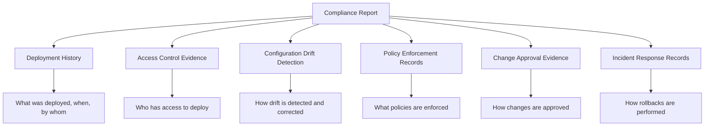

# How to Generate Compliance Reports from ArgoCD

Author: [nawazdhandala](https://github.com/nawazdhandala)

Tags: ArgoCD, GitOps, Kubernetes, Compliance, Reporting

Description: Learn how to generate compliance reports from ArgoCD data covering deployment history, configuration drift, access control, and policy enforcement for audits.

---

Compliance audits require evidence. You need to prove that your deployments follow approved processes, that configuration drift is detected and corrected, that access controls are enforced, and that policies are not bypassed. ArgoCD captures most of this data, but extracting it into auditor-friendly reports requires some work.

In this guide, I will show you how to build compliance reports from ArgoCD that cover the most common audit requirements across SOC 2, PCI-DSS, HIPAA, and ISO 27001 frameworks.

## What Auditors Want to See

Regardless of the specific framework, auditors consistently ask for the same types of evidence from deployment systems.


```mermaid
flowchart TD
    A[Compliance Report] --> B[Deployment History]
    A --> C[Access Control Evidence]
    A --> D[Configuration Drift Detection]
    A --> E[Policy Enforcement Records]
    A --> F[Change Approval Evidence]
    A --> G[Incident Response Records]
    B --> B1[What was deployed, when, by whom]
    C --> C1[Who has access to deploy]
    D --> D1[How drift is detected and corrected]
    E --> E1[What policies are enforced]
    F --> F1[How changes are approved]
    G --> G1[How rollbacks are performed]
```

## Report 1: Deployment History Report

This report shows all deployments within a given time period.

```bash
#!/bin/bash
# generate-deployment-report.sh

# Usage: ./generate-deployment-report.sh 2026-01-01 2026-02-01

START_DATE="$1"
END_DATE="$2"
OUTPUT_FILE="deployment-report-${START_DATE}-to-${END_DATE}.json"
GENERATED_AT=$(date -u +%Y-%m-%dT%H:%M:%SZ)

echo "Generating deployment report for $START_DATE to $END_DATE"

# Get each application and read deployment history from its status
argocd app list -o json | jq -r '.[].metadata.name' | while IFS= read -r APP; do
  argocd app get "$APP" -o json 2>/dev/null | jq -c \
    --arg start "${START_DATE}T00:00:00Z" \
    --arg end "${END_DATE}T00:00:00Z" \
    --arg app "$APP" \
    '. as $application |
      .status.history[]? |
      select(.deployedAt >= $start and .deployedAt < $end) |
      {
        application: $app,
        revision: .revision,
        deployed_at: .deployedAt,
        id: .id,
        source: (.source // $application.spec.source // null),
        sources: (.sources // $application.spec.sources // null)
      }'
done | jq -s \
  --arg start "$START_DATE" \
  --arg end "$END_DATE" \
  --arg generated_at "$GENERATED_AT" \
  '{
    report_type: "deployment_history",
    period: {start: $start, end: $end},
    generated_at: $generated_at,
    deployments: .
  }' > "$OUTPUT_FILE"

echo "Report saved to $OUTPUT_FILE"
```

## Report 2: Access Control Report

Document who has access to ArgoCD and what they can do.

```bash
#!/bin/bash
# generate-access-report.sh

echo "=== ArgoCD Access Control Report ==="
echo "Generated: $(date -u)"
echo ""

# Get RBAC policies
echo "=== RBAC Policies ==="
kubectl get configmap argocd-rbac-cm -n argocd -o jsonpath='{.data.policy\.csv}'
echo ""

# Get SSO configuration (without secrets)
echo "=== SSO Configuration ==="
kubectl get configmap argocd-cm -n argocd -o json | \
  jq '{
    oidc_config: .data["oidc.config"] // "not configured",
    dex_config: (if .data["dex.config"] then "configured" else "not configured" end)
  }'
echo ""

# Get ArgoCD accounts (local accounts)
echo "=== Local Accounts ==="
kubectl get configmap argocd-cm -n argocd -o json | \
  jq '.data as $data | [$data | to_entries[] | select(.key | test("^accounts\\.[^.]+$")) | .key as $key | {
    account: ($key | ltrimstr("accounts.")),
    capabilities: .value,
    enabled: ($data["\($key).enabled"] // "true")
  }]'
echo ""

# Get project-level access restrictions
echo "=== Project Access Restrictions ==="
argocd proj list -o json | jq '.[] | {
  name: .metadata.name,
  source_repos: .spec.sourceRepos,
  destinations: .spec.destinations,
  roles: [.spec.roles[]? | {name: .name, policies: .policies}]
}'
```

## Report 3: Configuration Drift Report

Show that ArgoCD detects and corrects configuration drift.

```bash
#!/bin/bash
# generate-drift-report.sh

echo "=== Configuration Drift Report ==="
echo "Generated: $(date -u)"
echo ""

# Get current sync status for all applications
echo "=== Current Sync Status ==="
argocd app list -o json | jq '.[] | {
  application: .metadata.name,
  sync_status: .status.sync.status,
  health_status: .status.health.status,
  auto_sync: (.spec.syncPolicy.automated != null),
  self_heal: (.spec.syncPolicy.automated.selfHeal // false),
  auto_prune: (.spec.syncPolicy.automated.prune // false),
  last_synced: .status.operationState.finishedAt
}'

echo ""
echo "=== Applications Out of Sync ==="
argocd app list -o json | jq '[.[] | select(.status.sync.status == "OutOfSync") | {
  application: .metadata.name,
  namespace: .spec.destination.namespace,
  sync_status: .status.sync.status,
  diff_count: ((.status.resources // []) | map(select(.status == "OutOfSync")) | length)
}]'

echo ""
echo "=== Self-Healing Configuration ==="
argocd app list -o json | jq '.[] | {
  application: .metadata.name,
  self_heal_enabled: (.spec.syncPolicy.automated.selfHeal // false)
}' | jq -s 'group_by(.self_heal_enabled) | map({
  self_heal: .[0].self_heal_enabled,
  count: length,
  applications: [.[].application]
})'
```

## Report 4: Policy Enforcement Report

If you use Kyverno, generate policy compliance reports. Gatekeeper exposes similar audit results through constraint status and metrics.

```bash
#!/bin/bash
# generate-policy-report.sh

echo "=== Policy Enforcement Report ==="
echo "Generated: $(date -u)"
echo ""

# Kyverno policy reports
echo "=== Kyverno Policy Results ==="
kubectl get policyreport --all-namespaces -o json | jq '.items[] | {
  namespace: .metadata.namespace,
  summary: .summary,
  violations: [.results[]? | select(.result == "fail") | {
    policy: .policy,
    rule: .rule,
    resource: .resources[0],
    message: .message
  }]
}'

echo ""
echo "=== Cluster-Wide Policy Status ==="
kubectl get clusterpolicyreport -o json | jq '.items[] | {
  name: .metadata.name,
  summary: .summary
}'

echo ""
echo "=== Active Policies ==="
kubectl get clusterpolicy -o json | jq '.items[] | {
  name: .metadata.name,
  background: .spec.background,
  rules_count: (.spec.rules | length),
  validation_rules: [.spec.rules[]? | select(.validate) | {
    name: .name,
    failure_action: (.validate.failureAction // "not set")
  }]
}'
```

## Automating Report Generation with ArgoCD CronJobs

Deploy a CronJob through ArgoCD that generates compliance reports on a schedule.

```yaml
# compliance-reporter.yaml
apiVersion: batch/v1
kind: CronJob
metadata:
  name: compliance-report-generator
  namespace: compliance
spec:
  schedule: "0 6 1 * *"  # First of every month at 6 AM
  jobTemplate:
    spec:
      template:
        spec:
          serviceAccountName: compliance-reporter
          containers:
            - name: reporter
              image: myorg/compliance-reporter:latest
              command:
                - /bin/sh
                - -c
                - |
                  # Calculate date range
                  END_DATE=$(date -u +%Y-%m-%d)
                  START_DATE=$(date -u -d "1 month ago" +%Y-%m-%d)

                  # Generate all reports
                  ./generate-deployment-report.sh "$START_DATE" "$END_DATE"
                  mv "deployment-report-${START_DATE}-to-${END_DATE}.json" /reports/
                  ./generate-access-report.sh > "/reports/access-report-${START_DATE}-to-${END_DATE}.txt"
                  ./generate-drift-report.sh > "/reports/drift-report-${START_DATE}-to-${END_DATE}.txt"
                  ./generate-policy-report.sh > "/reports/policy-report-${START_DATE}-to-${END_DATE}.txt"

                  # Combine into a single compliance package
                  tar czf "/reports/compliance-${START_DATE}-${END_DATE}.tar.gz" \
                    -C /reports \
                    "deployment-report-${START_DATE}-to-${END_DATE}.json" \
                    "access-report-${START_DATE}-to-${END_DATE}.txt" \
                    "drift-report-${START_DATE}-to-${END_DATE}.txt" \
                    "policy-report-${START_DATE}-to-${END_DATE}.txt"

                  # Upload to S3
                  aws s3 cp "/reports/compliance-${START_DATE}-${END_DATE}.tar.gz" \
                    "s3://compliance-reports/monthly/"

                  # Send notification
                  curl -X POST "$SLACK_WEBHOOK" \
                    -H "Content-Type: application/json" \
                    -d "{\"text\": \"Monthly compliance report generated for ${START_DATE} to ${END_DATE}\"}"
              volumeMounts:
                - name: reports
                  mountPath: /reports
          volumes:
            - name: reports
              emptyDir: {}
          restartPolicy: OnFailure
```

## Creating a Compliance Dashboard in Grafana

Build a real-time compliance dashboard using ArgoCD metrics.

```yaml
# Key Prometheus queries for compliance dashboards

# Sync success rate (should be > 95%)
# sum(increase(argocd_app_sync_total{phase="Succeeded"}[30d])) /
#   sum(increase(argocd_app_sync_total[30d])) * 100

# Healthy applications
# count(argocd_app_info{health_status="Healthy"})

# Applications currently out of sync
# count(argocd_app_info{sync_status="OutOfSync"})

# Average sync duration over 30 days
# sum(increase(argocd_app_sync_duration_seconds_total[30d])) /
#   sum(increase(argocd_app_sync_total[30d]))

# Current audited policy violations
# sum(gatekeeper_violations) by (enforcement_action)
```

## Report Formats for Different Audiences

Tailor your reports to the audience.

For **auditors**, provide JSON or CSV exports with full detail, timestamp precision, and correlation IDs that map to source control commits.

For **management**, provide summary dashboards showing compliance percentages, trend lines, and exception counts.

For **engineering teams**, provide detailed drift reports showing which applications diverge from their desired state and which policy violations need attention.

## Conclusion

Generating compliance reports from ArgoCD is about extracting and formatting data that ArgoCD already collects. Deployment history comes from app history, access control evidence comes from RBAC configuration, drift detection comes from sync status, and policy enforcement comes from Kyverno or Gatekeeper reports. Automate report generation with CronJobs managed by ArgoCD, and you will always be audit-ready. The GitOps model means your compliance evidence is inherently version-controlled and tamper-evident, which is exactly what auditors want to see.
