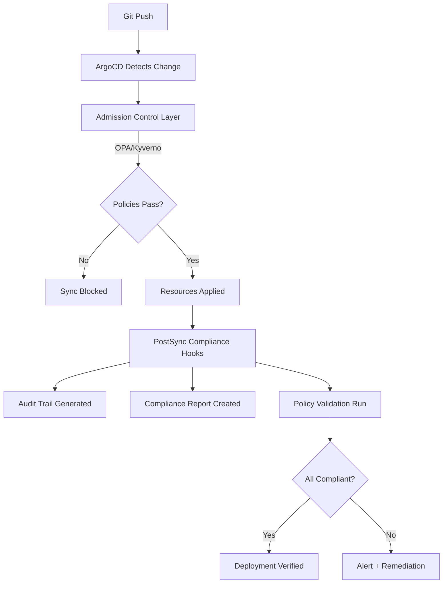

# How to Implement Compliance Testing in ArgoCD Pipeline

Author: [nawazdhandala](https://github.com/nawazdhandala)

Tags: ArgoCD, GitOps, Kubernetes, Compliance, Policy

Description: Learn how to implement automated compliance testing in your ArgoCD deployment pipeline using OPA Gatekeeper, Kyverno, and custom policy checks to meet regulatory requirements.

---

Compliance is not optional. Whether you are dealing with SOC 2, PCI DSS, HIPAA, or internal security policies, every deployment needs to meet your compliance requirements. The problem is that manual compliance checks do not scale - and they always happen too late. By embedding compliance testing directly into your ArgoCD pipeline, you catch violations at deploy time instead of during the next audit.

This guide shows you how to implement automated compliance testing in ArgoCD using policy engines, custom checks, and PostSync validation hooks.

## The Compliance Testing Strategy

Compliance in a GitOps pipeline works at two levels:



**Prevention layer**: Admission controllers (OPA Gatekeeper, Kyverno) block non-compliant resources before they reach the cluster.

**Verification layer**: PostSync hooks validate the deployed state against compliance requirements and generate audit trails.

Both layers are necessary. Prevention catches known issues. Verification catches everything else.

## Setting Up OPA Gatekeeper Policies

OPA Gatekeeper enforces policies at admission time. ArgoCD syncs will fail if resources violate these policies:

```yaml
# Constraint Template: require labels
apiVersion: templates.gatekeeper.sh/v1
kind: ConstraintTemplate
metadata:
  name: k8srequiredlabels
spec:
  crd:
    spec:
      names:
        kind: K8sRequiredLabels
      validation:
        openAPIV3Schema:
          type: object
          properties:
            labels:
              type: array
              items:
                type: string
  targets:
    - target: admission.k8s.gatekeeper.sh
      rego: |
        package k8srequiredlabels

        violation[{"msg": msg, "details": {"missing_labels": missing}}] {
          provided := {label | input.review.object.metadata.labels[label]}
          required := {label | label := input.parameters.labels[_]}
          missing := required - provided
          count(missing) > 0
          msg := sprintf("Missing required labels: %v", [missing])
        }
---
# Constraint: all deployments must have compliance labels
apiVersion: constraints.gatekeeper.sh/v1beta1
kind: K8sRequiredLabels
metadata:
  name: deployment-must-have-compliance-labels
spec:
  match:
    kinds:
      - apiGroups: ["apps"]
        kinds: ["Deployment"]
  parameters:
    labels:
      - "app.kubernetes.io/name"
      - "app.kubernetes.io/version"
      - "compliance/data-classification"
      - "compliance/owner"
```

Additional policies for common compliance requirements:

```yaml
# Constraint Template: no latest tag
apiVersion: templates.gatekeeper.sh/v1
kind: ConstraintTemplate
metadata:
  name: k8sdisallowedtags
spec:
  crd:
    spec:
      names:
        kind: K8sDisallowedTags
      validation:
        openAPIV3Schema:
          type: object
          properties:
            tags:
              type: array
              items:
                type: string
  targets:
    - target: admission.k8s.gatekeeper.sh
      rego: |
        package k8sdisallowedtags

        violation[{"msg": msg}] {
          container := input.review.object.spec.template.spec.containers[_]
          tag := split(container.image, ":")[1]
          disallowed := input.parameters.tags[_]
          tag == disallowed
          msg := sprintf("Container %v uses disallowed tag: %v", [container.name, tag])
        }

        violation[{"msg": msg}] {
          container := input.review.object.spec.template.spec.containers[_]
          not contains(container.image, ":")
          msg := sprintf("Container %v has no tag (defaults to latest)", [container.name])
        }
---
apiVersion: constraints.gatekeeper.sh/v1beta1
kind: K8sDisallowedTags
metadata:
  name: no-latest-tag
spec:
  match:
    kinds:
      - apiGroups: ["apps"]
        kinds: ["Deployment", "StatefulSet"]
  parameters:
    tags: ["latest"]
```

## PostSync Compliance Verification

Even with admission controllers, you need post-deployment verification to generate audit evidence and catch drift:

```yaml
apiVersion: batch/v1
kind: Job
metadata:
  name: compliance-check
  annotations:
    argocd.argoproj.io/hook: PostSync
    argocd.argoproj.io/hook-delete-policy: BeforeHookCreation,HookSucceeded
spec:
  backoffLimit: 0
  activeDeadlineSeconds: 300
  template:
    spec:
      restartPolicy: Never
      serviceAccountName: compliance-checker
      containers:
        - name: compliance
          image: bitnami/kubectl:1.29
          command:
            - sh
            - -c
            - |
              NAMESPACE=${NAMESPACE:-default}
              FAILURES=0
              REPORT=""

              add_result() {
                local check=$1 status=$2 detail=$3
                REPORT="$REPORT\n$status | $check | $detail"
                if [ "$status" = "FAIL" ]; then
                  FAILURES=$((FAILURES + 1))
                fi
              }

              echo "=== Compliance Verification ==="
              echo "Namespace: $NAMESPACE"
              echo "Timestamp: $(date -u +%Y-%m-%dT%H:%M:%SZ)"
              echo ""

              # CHECK 1: All pods have resource limits
              pods_no_limits=$(kubectl get pods -n "$NAMESPACE" -o json | \
                python3 -c "
              import json, sys
              data = json.load(sys.stdin)
              for pod in data['items']:
                for c in pod['spec'].get('containers', []):
                  limits = c.get('resources', {}).get('limits', {})
                  if not limits.get('cpu') or not limits.get('memory'):
                    print(f\"{pod['metadata']['name']}/{c['name']}\")
              ")

              if [ -n "$pods_no_limits" ]; then
                add_result "Resource limits on all containers" "FAIL" \
                  "Missing limits: $pods_no_limits"
              else
                add_result "Resource limits on all containers" "PASS" ""
              fi

              # CHECK 2: No containers running as root
              root_containers=$(kubectl get pods -n "$NAMESPACE" -o json | \
                python3 -c "
              import json, sys
              data = json.load(sys.stdin)
              for pod in data['items']:
                for c in pod['spec'].get('containers', []):
                  sc = c.get('securityContext', {})
                  psc = pod['spec'].get('securityContext', {})
                  if sc.get('runAsUser') == 0 or \
                     (not sc.get('runAsNonRoot') and not psc.get('runAsNonRoot')):
                    print(f\"{pod['metadata']['name']}/{c['name']}\")
              ")

              if [ -n "$root_containers" ]; then
                add_result "No root containers" "FAIL" \
                  "Running as root: $root_containers"
              else
                add_result "No root containers" "PASS" ""
              fi

              # CHECK 3: All images from approved registry
              APPROVED_REGISTRY="myregistry.io"
              unapproved=$(kubectl get pods -n "$NAMESPACE" -o json | \
                python3 -c "
              import json, sys
              registry = '$APPROVED_REGISTRY'
              data = json.load(sys.stdin)
              for pod in data['items']:
                for c in pod['spec'].get('containers', []):
                  if not c['image'].startswith(registry):
                    print(f\"{c['image']}\")
              " | sort -u)

              if [ -n "$unapproved" ]; then
                add_result "Images from approved registry" "FAIL" \
                  "Unapproved images: $unapproved"
              else
                add_result "Images from approved registry" "PASS" ""
              fi

              # CHECK 4: Network policies exist
              netpol_count=$(kubectl get networkpolicies -n "$NAMESPACE" \
                --no-headers 2>/dev/null | wc -l | tr -d ' ')
              if [ "$netpol_count" -eq 0 ]; then
                add_result "Network policies present" "FAIL" \
                  "No NetworkPolicies found"
              else
                add_result "Network policies present" "PASS" \
                  "$netpol_count policies"
              fi

              # CHECK 5: Pod Disruption Budgets exist for deployments
              deploy_count=$(kubectl get deployments -n "$NAMESPACE" \
                --no-headers | wc -l | tr -d ' ')
              pdb_count=$(kubectl get pdb -n "$NAMESPACE" \
                --no-headers 2>/dev/null | wc -l | tr -d ' ')
              if [ "$deploy_count" -gt 0 ] && [ "$pdb_count" -eq 0 ]; then
                add_result "PodDisruptionBudgets defined" "FAIL" \
                  "$deploy_count deployments, 0 PDBs"
              else
                add_result "PodDisruptionBudgets defined" "PASS" \
                  "$pdb_count PDBs for $deploy_count deployments"
              fi

              # Print report
              echo ""
              echo "Status | Check | Detail"
              echo "-------|-------|-------"
              echo -e "$REPORT"
              echo ""

              if [ "$FAILURES" -gt 0 ]; then
                echo "COMPLIANCE CHECK FAILED: $FAILURES violation(s) found"
                exit 1
              fi

              echo "All compliance checks passed"
          env:
            - name: NAMESPACE
              valueFrom:
                fieldRef:
                  fieldPath: metadata.namespace
```

## Generating Audit Trail

For regulatory compliance, you need an immutable audit trail of every deployment and its compliance state:

```yaml
apiVersion: batch/v1
kind: Job
metadata:
  name: compliance-audit-log
  annotations:
    argocd.argoproj.io/hook: PostSync
    argocd.argoproj.io/sync-wave: "2"
    argocd.argoproj.io/hook-delete-policy: BeforeHookCreation,HookSucceeded
spec:
  backoffLimit: 0
  template:
    spec:
      restartPolicy: Never
      serviceAccountName: compliance-checker
      containers:
        - name: audit
          image: bitnami/kubectl:1.29
          command:
            - sh
            - -c
            - |
              NAMESPACE=${NAMESPACE:-default}
              TIMESTAMP=$(date -u +%Y-%m-%dT%H:%M:%SZ)

              # Collect deployment state
              DEPLOYMENTS=$(kubectl get deployments -n "$NAMESPACE" \
                -o json)

              # Build audit record
              AUDIT_RECORD=$(python3 -c "
              import json, sys

              deployments = json.loads('''$DEPLOYMENTS''')
              record = {
                'timestamp': '$TIMESTAMP',
                'namespace': '$NAMESPACE',
                'deployments': []
              }

              for d in deployments.get('items', []):
                dep = {
                  'name': d['metadata']['name'],
                  'replicas': d['spec'].get('replicas', 0),
                  'images': [c['image'] for c in d['spec']['template']['spec']['containers']],
                  'labels': d['metadata'].get('labels', {})
                }
                record['deployments'].append(dep)

              print(json.dumps(record, indent=2))
              ")

              echo "$AUDIT_RECORD"

              # Send to audit log storage
              curl -X POST "$AUDIT_LOG_URL/api/v1/audit" \
                -H "Authorization: Bearer $AUDIT_TOKEN" \
                -H "Content-Type: application/json" \
                -d "$AUDIT_RECORD"
          env:
            - name: NAMESPACE
              valueFrom:
                fieldRef:
                  fieldPath: metadata.namespace
            - name: AUDIT_LOG_URL
              value: "https://audit.internal.company.com"
            - name: AUDIT_TOKEN
              valueFrom:
                secretKeyRef:
                  name: audit-credentials
                  key: token
```

## Using Kyverno as an Alternative to Gatekeeper

If you prefer Kyverno, compliance policies look like standard Kubernetes resources:

```yaml
apiVersion: kyverno.io/v1
kind: ClusterPolicy
metadata:
  name: require-resource-limits
spec:
  validationFailureAction: Enforce
  rules:
    - name: check-resource-limits
      match:
        any:
          - resources:
              kinds:
                - Deployment
                - StatefulSet
      validate:
        message: "All containers must have CPU and memory limits"
        pattern:
          spec:
            template:
              spec:
                containers:
                  - resources:
                      limits:
                        memory: "?*"
                        cpu: "?*"
---
apiVersion: kyverno.io/v1
kind: ClusterPolicy
metadata:
  name: require-read-only-root
spec:
  validationFailureAction: Enforce
  rules:
    - name: check-readonly-root
      match:
        any:
          - resources:
              kinds:
                - Deployment
      validate:
        message: "Containers must use readOnlyRootFilesystem"
        pattern:
          spec:
            template:
              spec:
                containers:
                  - securityContext:
                      readOnlyRootFilesystem: true
```

## Compliance Dashboard Integration

Track compliance state over time by integrating with a dashboard. OneUptime provides monitoring capabilities that help you track deployment compliance metrics and alert when violations are detected.

For more on securing your ArgoCD pipeline, see our guide on [security scanning as PostSync hooks](https://oneuptime.com/blog/post/2026-02-26-argocd-security-scanning-postsync-hook/view).

## Best Practices

1. **Start with warnings, then enforce** - Use `validationFailureAction: Audit` initially, then switch to `Enforce` once teams have adapted.
2. **Version your policies** - Keep compliance policies in Git alongside application manifests.
3. **Automate exceptions** - Provide a documented process for temporary policy exemptions.
4. **Generate audit evidence automatically** - Every deployment should produce compliance documentation without manual effort.
5. **Test policies in staging first** - Broken compliance policies can block all deployments.
6. **Map policies to frameworks** - Tag policies with their regulatory source (SOC 2 CC6.1, PCI DSS 2.2, etc.).
7. **Review and update regularly** - Compliance requirements change. Schedule quarterly policy reviews.

Automated compliance testing in ArgoCD turns compliance from a quarterly audit burden into a continuous, automated process. Every deployment is verified, every violation is caught at deploy time, and your audit trail writes itself.
