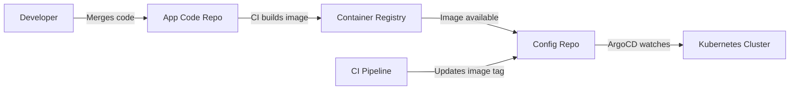

# How to Implement the Config Repo Pattern

Author: [nawazdhandala](https://github.com/nawazdhandala)

Tags: ArgoCD, GitOps, Kubernetes, Repository Strategy, DevOps

Description: Learn how to implement the config repo pattern with ArgoCD by separating application source code from deployment configuration in dedicated repositories.

---

The config repo pattern is a foundational GitOps practice where you separate your application source code from your deployment configuration. Your application code lives in one repository, and all the Kubernetes manifests, Helm values, and Kustomize overlays live in a separate "config repo." This separation is what makes GitOps with ArgoCD work cleanly in practice.

## Why Separate Config from Code

When deployment configuration lives alongside application code, you run into problems:

- **Every config change triggers a full CI build** - Changing a replica count should not rebuild your Docker image
- **Different review requirements** - Code changes need developer review, config changes might need SRE review
- **Different commit frequencies** - Config changes happen more often (scaling, feature flags, secrets rotation) than code changes
- **ArgoCD watches the entire repo** - Any commit to the code repo would trigger ArgoCD reconciliation even if the config did not change
- **Access control conflicts** - Developers need write access to the code repo, but you might want to restrict who can change production config

## The Pattern



The flow is:

1. Developer merges code to the application repo
2. CI pipeline builds and pushes a container image
3. CI pipeline (or Image Updater) updates the image tag in the config repo
4. ArgoCD detects the config change and syncs

## Application Code Repository

The app code repo contains only what is needed to build and test the application:

```
my-app/
├── src/
│   └── main.py
├── tests/
│   └── test_main.py
├── Dockerfile
├── requirements.txt
└── .github/
    └── workflows/
        └── build.yaml
```

The CI pipeline in this repo builds and pushes the image:

```yaml
# .github/workflows/build.yaml
name: Build and Push
on:
  push:
    branches: [main]

jobs:
  build:
    runs-on: ubuntu-latest
    steps:
      - uses: actions/checkout@v4

      - name: Build and push Docker image
        run: |
          docker build -t org/my-app:${{ github.sha }} .
          docker push org/my-app:${{ github.sha }}

      - name: Update config repo
        run: |
          # Clone the config repo
          git clone https://x-access-token:${{ secrets.CONFIG_REPO_TOKEN }}@github.com/org/my-app-config.git
          cd my-app-config

          # Update the image tag
          cd overlays/staging
          kustomize edit set image org/my-app=org/my-app:${{ github.sha }}

          # Commit and push
          git config user.name "CI Bot"
          git config user.email "ci@example.com"
          git add .
          git commit -m "Update my-app image to ${{ github.sha }}"
          git push
```

## Config Repository Structure

The config repo contains all deployment configuration:

```
my-app-config/
├── base/
│   ├── deployment.yaml
│   ├── service.yaml
│   ├── configmap.yaml
│   ├── hpa.yaml
│   └── kustomization.yaml
├── overlays/
│   ├── dev/
│   │   ├── kustomization.yaml
│   │   └── patches/
│   │       ├── replicas.yaml
│   │       └── resources.yaml
│   ├── staging/
│   │   ├── kustomization.yaml
│   │   └── patches/
│   │       ├── replicas.yaml
│   │       └── resources.yaml
│   └── production/
│       ├── kustomization.yaml
│       └── patches/
│           ├── replicas.yaml
│           ├── resources.yaml
│           └── pdb.yaml
└── argocd/
    ├── application-dev.yaml
    ├── application-staging.yaml
    └── application-production.yaml
```

## Base Manifests

```yaml
# base/deployment.yaml
apiVersion: apps/v1
kind: Deployment
metadata:
  name: my-app
  labels:
    app: my-app
spec:
  selector:
    matchLabels:
      app: my-app
  template:
    metadata:
      labels:
        app: my-app
    spec:
      containers:
        - name: my-app
          image: org/my-app:latest
          ports:
            - containerPort: 8080
          env:
            - name: LOG_LEVEL
              valueFrom:
                configMapKeyRef:
                  name: my-app-config
                  key: LOG_LEVEL
          readinessProbe:
            httpGet:
              path: /healthz
              port: 8080
            initialDelaySeconds: 5
          livenessProbe:
            httpGet:
              path: /healthz
              port: 8080
            initialDelaySeconds: 15
```

```yaml
# base/kustomization.yaml
apiVersion: kustomize.config.k8s.io/v1beta1
kind: Kustomization
resources:
  - deployment.yaml
  - service.yaml
  - configmap.yaml
```

## Environment Overlays

```yaml
# overlays/production/kustomization.yaml
apiVersion: kustomize.config.k8s.io/v1beta1
kind: Kustomization
namespace: production
resources:
  - ../../base
  - patches/pdb.yaml
patches:
  - path: patches/replicas.yaml
  - path: patches/resources.yaml
images:
  - name: org/my-app
    newTag: v1.2.3
```

```yaml
# overlays/production/patches/resources.yaml
apiVersion: apps/v1
kind: Deployment
metadata:
  name: my-app
spec:
  template:
    spec:
      containers:
        - name: my-app
          resources:
            requests:
              cpu: 500m
              memory: 512Mi
            limits:
              cpu: "1"
              memory: 1Gi
```

```yaml
# overlays/production/patches/pdb.yaml
apiVersion: policy/v1
kind: PodDisruptionBudget
metadata:
  name: my-app-pdb
spec:
  minAvailable: 1
  selector:
    matchLabels:
      app: my-app
```

## ArgoCD Application

```yaml
# argocd/application-production.yaml
apiVersion: argoproj.io/v1alpha1
kind: Application
metadata:
  name: my-app-production
  namespace: argocd
spec:
  project: default
  source:
    repoURL: https://github.com/org/my-app-config.git
    targetRevision: main
    path: overlays/production
  destination:
    server: https://production-cluster.example.com
    namespace: production
  syncPolicy:
    automated:
      selfHeal: true
      prune: true
    syncOptions:
      - CreateNamespace=true
```

## Automated Image Updates

Instead of having CI update the config repo, you can use ArgoCD Image Updater:

```yaml
apiVersion: argoproj.io/v1alpha1
kind: Application
metadata:
  name: my-app-staging
  namespace: argocd
  annotations:
    # Tell Image Updater to watch for new images
    argocd-image-updater.argoproj.io/image-list: myapp=org/my-app
    argocd-image-updater.argoproj.io/myapp.update-strategy: latest
    argocd-image-updater.argoproj.io/myapp.allow-tags: "regexp:^[0-9a-f]{7,40}$"
    argocd-image-updater.argoproj.io/write-back-method: git
    argocd-image-updater.argoproj.io/write-back-target: kustomization
spec:
  project: default
  source:
    repoURL: https://github.com/org/my-app-config.git
    targetRevision: main
    path: overlays/staging
  destination:
    server: https://kubernetes.default.svc
    namespace: staging
```

For production, use a semver-based strategy:

```yaml
annotations:
  argocd-image-updater.argoproj.io/image-list: myapp=org/my-app
  argocd-image-updater.argoproj.io/myapp.update-strategy: semver
  argocd-image-updater.argoproj.io/myapp.allow-tags: "regexp:^v[0-9]+\\.[0-9]+\\.[0-9]+$"
```

## Promotion Workflow

With the config repo pattern, promotion is clean:

```bash
# After CI updates the staging overlay with a new image tag,
# and staging has been validated, promote to production:

cd my-app-config
git checkout main

# Update the production overlay
cd overlays/production
kustomize edit set image org/my-app=org/my-app:v1.3.0

git add .
git commit -m "Release my-app v1.3.0 to production"
git push
```

Or use pull requests for controlled promotion:

```bash
# Create a promotion PR
git checkout -b promote/v1.3.0
cd overlays/production
kustomize edit set image org/my-app=org/my-app:v1.3.0
git add .
git commit -m "Promote my-app v1.3.0 to production"
git push -u origin promote/v1.3.0
gh pr create --title "Promote my-app v1.3.0 to production" --body "Staging validation complete"
```

## Drift Detection

One benefit of the config repo pattern is easy drift detection. Compare what is in Git vs what is deployed:

```bash
# Check sync status
argocd app get my-app-production

# See the full diff
argocd app diff my-app-production

# History of deployments (from Git log)
cd my-app-config
git log --oneline overlays/production/
```

## Multiple Services, One Config Repo vs Many

You can put multiple services in one config repo:

```
multi-service-config/
├── services/
│   ├── api/
│   │   ├── base/
│   │   └── overlays/
│   ├── worker/
│   │   ├── base/
│   │   └── overlays/
│   └── frontend/
│       ├── base/
│       └── overlays/
```

Or keep one config repo per service. The choice depends on how tightly coupled the services are. For microservices owned by different teams, per-service config repos give better autonomy. For a monolith or tightly coupled services, a shared config repo reduces coordination overhead.

## Best Practices

1. **Never store secrets in the config repo** - Use Sealed Secrets, External Secrets Operator, or Vault
2. **Tag releases** - Use Git tags in the config repo for easy rollback references
3. **Automate image updates** - Use ArgoCD Image Updater or CI pipelines
4. **Require PRs for production** - Protect the main branch of the config repo
5. **Keep the config repo lean** - Only deployment-related files, no application code

For more on managing private repositories with ArgoCD, see our guide on [ArgoCD private repos](https://oneuptime.com/blog/post/2026-02-02-argocd-private-repos/view) and [ArgoCD Image Updater](https://oneuptime.com/blog/post/2026-01-27-argocd-image-updater/view).
