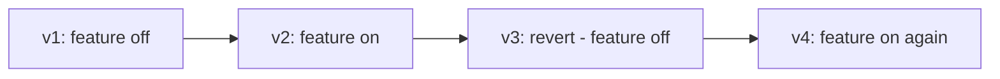

# How to Manage ConfigMaps for Feature Toggles with ArgoCD

Author: [nawazdhandala](https://github.com/nawazdhandala)

Tags: ArgoCD, GitOps, Kubernetes, Feature Flag, ConfigMap

Description: Learn how to use Kubernetes ConfigMaps as a lightweight feature toggle system managed through ArgoCD GitOps workflows with environment promotion and rollback.

---

Not every team needs a full-featured flag platform. Kubernetes ConfigMaps provide a lightweight way to implement feature toggles that your applications can read at runtime. When managed through ArgoCD, ConfigMap-based toggles give you version control, review processes, and automatic deployment - all without introducing additional infrastructure.

This guide covers building a practical feature toggle system using ConfigMaps and ArgoCD.

## Why ConfigMaps for Feature Toggles

ConfigMaps are built into Kubernetes. Every cluster has them, every SDK supports them, and every team understands them. For teams that need basic feature toggles without the complexity of a dedicated platform, ConfigMaps are the right choice.

The tradeoffs compared to a dedicated feature flag service:

- No UI for non-technical users (flags change through Git)
- No user-level targeting (flags apply to all users or none)
- No real-time streaming (requires pod restart or file watch)
- But: zero additional infrastructure, zero cost, full GitOps support

## Basic Feature Toggle ConfigMap

Start with a simple JSON-based toggle configuration:

```yaml
# toggles/production/feature-toggles.yaml

apiVersion: v1
kind: ConfigMap
metadata:
  name: feature-toggles
  namespace: production
  labels:
    app.kubernetes.io/managed-by: argocd
    config-type: feature-toggles
data:
  toggles.json: |
    {
      "features": {
        "new-dashboard": {
          "enabled": true,
          "description": "New dashboard UI with real-time charts"
        },
        "v2-api": {
          "enabled": false,
          "description": "Version 2 API endpoints"
        },
        "dark-mode": {
          "enabled": true,
          "description": "Dark mode theme option"
        },
        "ai-suggestions": {
          "enabled": false,
          "description": "AI-powered search suggestions",
          "rollout-date": "2026-03-15"
        },
        "export-csv": {
          "enabled": true,
          "description": "CSV export functionality"
        }
      }
    }
```

## ArgoCD Application for Toggles

Manage toggles as a separate ArgoCD Application for independent lifecycle management:

```yaml
# feature-toggles-app.yaml
apiVersion: argoproj.io/v1alpha1
kind: Application
metadata:
  name: feature-toggles
  namespace: argocd
spec:
  project: applications
  source:
    repoURL: https://github.com/myorg/k8s-config.git
    path: toggles/production
    targetRevision: main
  destination:
    server: https://kubernetes.default.svc
    namespace: production
  syncPolicy:
    automated:
      selfHeal: true  # Revert unauthorized manual changes
      prune: true
```

## Mounting Toggles in Applications

There are two approaches to consuming ConfigMap toggles: environment variables and volume mounts.

Volume mount approach (supports hot-reloading):

```yaml
# apps/web-app/deployment.yaml
apiVersion: apps/v1
kind: Deployment
metadata:
  name: web-app
  namespace: production
spec:
  selector:
    matchLabels:
      app: web-app
  template:
    metadata:
      labels:
        app: web-app
    spec:
      containers:
        - name: web-app
          image: ghcr.io/myorg/web-app:v3.0.0
          volumeMounts:
            - name: toggles
              mountPath: /etc/toggles
              readOnly: true
          env:
            - name: TOGGLE_FILE_PATH
              value: /etc/toggles/toggles.json
      volumes:
        - name: toggles
          configMap:
            name: feature-toggles
```

When using volume mounts, Kubernetes automatically updates the file when the ConfigMap changes. The delay depends on the kubelet sync period and ConfigMap cache propagation, so your application should tolerate eventual updates. Your application can reload the file when it changes:

```python
# Example Python toggle reader with reload-on-change
import json
import os

class ToggleManager:
    def __init__(self, toggle_path):
        self.toggle_path = toggle_path
        self.toggles = {}
        self.last_mtime = None
        self._load_toggles()

    def _load_toggles(self):
        with open(self.toggle_path, 'r') as f:
            data = json.load(f)
            self.toggles = data.get('features', {})
        self.last_mtime = os.path.getmtime(self.toggle_path)

    def _reload_if_changed(self):
        current_mtime = os.path.getmtime(self.toggle_path)
        if current_mtime != self.last_mtime:
            self._load_toggles()

    def is_enabled(self, feature_name):
        self._reload_if_changed()
        feature = self.toggles.get(feature_name, {})
        return feature.get('enabled', False)

# Usage
toggles = ToggleManager('/etc/toggles/toggles.json')
if toggles.is_enabled('new-dashboard'):
    render_new_dashboard()
else:
    render_classic_dashboard()
```

Environment variable approach (requires pod restart):

```yaml
apiVersion: apps/v1
kind: Deployment
metadata:
  name: web-app
spec:
  selector:
    matchLabels:
      app: web-app
  template:
    metadata:
      labels:
        app: web-app
    spec:
      containers:
        - name: web-app
          image: ghcr.io/myorg/web-app:v3.0.0
          env:
            - name: FEATURE_NEW_DASHBOARD
              valueFrom:
                configMapKeyRef:
                  name: feature-toggles-env
                  key: FEATURE_NEW_DASHBOARD
            - name: FEATURE_V2_API
              valueFrom:
                configMapKeyRef:
                  name: feature-toggles-env
                  key: FEATURE_V2_API
```

With the corresponding ConfigMap:

```yaml
# toggles/production/feature-toggles-env.yaml
apiVersion: v1
kind: ConfigMap
metadata:
  name: feature-toggles-env
  namespace: production
data:
  FEATURE_NEW_DASHBOARD: "true"
  FEATURE_V2_API: "false"
  FEATURE_DARK_MODE: "true"
  FEATURE_AI_SUGGESTIONS: "false"
```

## Triggering Pod Restarts on Toggle Changes

For environment variable-based toggles, you need to restart pods when the ConfigMap changes. Use a checksum annotation:

```yaml
apiVersion: apps/v1
kind: Deployment
metadata:
  name: web-app
  namespace: production
spec:
  selector:
    matchLabels:
      app: web-app
  template:
    metadata:
      labels:
        app: web-app
      annotations:
        # This hash changes when the ConfigMap changes
        checksum/toggles: "sha256-of-configmap-content"
    spec:
      containers:
        - name: web-app
          image: ghcr.io/myorg/web-app:v3.0.0
```

If you use Helm with ArgoCD, the hash is computed automatically:

```yaml
# In Helm template
spec:
  template:
    metadata:
      annotations:
        checksum/toggles: {{ include (print $.Template.BasePath "/feature-toggles-env.yaml") . | sha256sum }}
```

## Environment Promotion

Promote toggles across environments using Kustomize overlays:

```yaml
# toggles/base/feature-toggles.yaml
apiVersion: v1
kind: ConfigMap
metadata:
  name: feature-toggles
data:
  toggles.json: |
    {
      "features": {
        "new-dashboard": {
          "enabled": false
        },
        "v2-api": {
          "enabled": false
        }
      }
    }
```

```yaml
# toggles/overlays/dev/kustomization.yaml
apiVersion: kustomize.config.k8s.io/v1beta1
kind: Kustomization
resources:
  - ../../base
patches:
  - target:
      kind: ConfigMap
      name: feature-toggles
    patch: |
      - op: replace
        path: /data/toggles.json
        value: |
          {
            "features": {
              "new-dashboard": {
                "enabled": true
              },
              "v2-api": {
                "enabled": true
              }
            }
          }
```

```yaml
# toggles/overlays/production/kustomization.yaml
apiVersion: kustomize.config.k8s.io/v1beta1
kind: Kustomization
resources:
  - ../../base
patches:
  - target:
      kind: ConfigMap
      name: feature-toggles
    patch: |
      - op: replace
        path: /data/toggles.json
        value: |
          {
            "features": {
              "new-dashboard": {
                "enabled": true
              },
              "v2-api": {
                "enabled": false
              }
            }
          }
```

## ApplicationSet for Multi-Environment Toggles

Use an ApplicationSet to deploy toggles to all environments:

```yaml
# feature-toggles-appset.yaml
apiVersion: argoproj.io/v1alpha1
kind: ApplicationSet
metadata:
  name: feature-toggles
  namespace: argocd
spec:
  generators:
    - list:
        elements:
          - env: dev
            cluster: https://dev-cluster.example.com
          - env: staging
            cluster: https://staging-cluster.example.com
          - env: production
            cluster: https://kubernetes.default.svc
  template:
    metadata:
      name: "feature-toggles-{{env}}"
    spec:
      project: applications
      source:
        repoURL: https://github.com/myorg/k8s-config.git
        path: "toggles/overlays/{{env}}"
        targetRevision: main
      destination:
        server: "{{cluster}}"
        namespace: "{{env}}"
      syncPolicy:
        automated:
          selfHeal: true
```

## Toggle Validation

Validate toggle JSON in CI before ArgoCD applies it:

```yaml
# .github/workflows/validate-toggles.yaml
name: Validate feature toggles

on:
  pull_request:
    paths:
      - "toggles/**"

jobs:
  validate:
    runs-on: ubuntu-latest
    steps:
      - uses: actions/checkout@v4
      - uses: actions/setup-python@v5
        with:
          python-version: "3.11"
      - run: pip install pyyaml
      - run: |
          python3 - <<'PY'
          import json
          import sys
          from pathlib import Path

          import yaml

          validated = 0
          for path in Path("toggles").rglob("*.yaml"):
              for doc in yaml.safe_load_all(path.read_text()):
                  if not doc or doc.get("kind") != "ConfigMap":
                      continue

                  toggle_json = doc.get("data", {}).get("toggles.json")
                  if toggle_json is None:
                      continue

                  try:
                      data = json.loads(toggle_json)
                  except json.JSONDecodeError as e:
                      print(f"ERROR: Invalid JSON in {path}: {e}")
                      sys.exit(1)

                  features = data.get("features", {})
                  for name, config in features.items():
                      if "enabled" not in config:
                          print(f"ERROR: Feature '{name}' missing 'enabled' field in {path}")
                          sys.exit(1)
                      if not isinstance(config["enabled"], bool):
                          print(f"ERROR: Feature '{name}' enabled must be boolean in {path}")
                          sys.exit(1)

                  validated += len(features)

          print(f"Validated {validated} feature toggles successfully")
          PY
```

## Rollback Workflow

Rolling back a toggle is a simple git revert:

```bash
# Revert the last toggle change
git revert HEAD
git push origin main

# ArgoCD automatically syncs the reverted ConfigMap
```

The toggle history is preserved in Git:


```mermaid
graph LR
    A[v1: feature off] --> B[v2: feature on]
    B --> C[v3: revert - feature off]
    C --> D[v4: feature on again]
```

## Summary

ConfigMap-based feature toggles managed through ArgoCD provide a zero-infrastructure feature flag system. Your toggles are version-controlled in Git, reviewed through pull requests, automatically deployed by ArgoCD, and protected from unauthorized changes by self-heal. While this approach lacks the sophisticated targeting and analytics of dedicated platforms, it covers the majority of feature toggle use cases with nothing more than standard Kubernetes resources.
