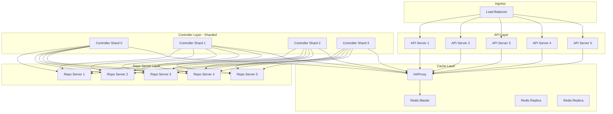

# How to Configure ArgoCD for 1000+ Applications

Author: [nawazdhandala](https://github.com/nawazdhandala)

Tags: ArgoCD, GitOps, Kubernetes, Scaling, Enterprise

Description: A comprehensive guide to configuring ArgoCD for managing over 1000 applications, covering controller sharding, resource tuning, caching strategies, and architectural decisions.

---

Managing 1000+ applications with ArgoCD is achievable but requires deliberate configuration. The default settings are designed for small to medium deployments. At large scale, every component needs tuning - the controller needs sharding, the repo server needs horizontal scaling, Redis needs HA mode, and operational parameters need careful adjustment. This guide provides a complete configuration for running ArgoCD at enterprise scale.

## Architecture for 1000+ Applications

At this scale, you need a distributed ArgoCD architecture:



## Complete Helm Configuration

Here is the full Helm values file for 1000+ applications:

```yaml
# argocd-enterprise-values.yaml

global:
  topologySpreadConstraints:
    - maxSkew: 1
      topologyKey: kubernetes.io/hostname
      whenUnsatisfiable: DoNotSchedule

# Application Controller - Sharded across 4 replicas
controller:
  replicas: 4
  resources:
    requests:
      cpu: "2"
      memory: 4Gi
    limits:
      cpu: "4"
      memory: 12Gi
  env:
    - name: ARGOCD_CONTROLLER_REPLICAS
      value: "4"
  pdb:
    enabled: true
    minAvailable: 2
  metrics:
    enabled: true
    serviceMonitor:
      enabled: true

# API Server - Horizontally scaled with autoscaling
server:
  replicas: 5
  autoscaling:
    enabled: true
    minReplicas: 5
    maxReplicas: 10
    targetCPUUtilizationPercentage: 60
  resources:
    requests:
      cpu: 500m
      memory: 512Mi
    limits:
      cpu: "2"
      memory: 1Gi
  pdb:
    enabled: true
    minAvailable: 3
  metrics:
    enabled: true
    serviceMonitor:
      enabled: true

# Repo Server - Scaled for parallel manifest generation
repoServer:
  replicas: 5
  autoscaling:
    enabled: true
    minReplicas: 5
    maxReplicas: 12
    targetCPUUtilizationPercentage: 60
  resources:
    requests:
      cpu: "1"
      memory: 1Gi
    limits:
      cpu: "4"
      memory: 4Gi
  pdb:
    enabled: true
    minAvailable: 3
  volumes:
    - name: tmp
      emptyDir:
        medium: Memory
        sizeLimit: 4Gi
  volumeMounts:
    - name: tmp
      mountPath: /tmp
  metrics:
    enabled: true
    serviceMonitor:
      enabled: true

# Redis HA
redis:
  enabled: false
redis-ha:
  enabled: true
  replicas: 3
  haproxy:
    enabled: true
    replicas: 3
  redis:
    resources:
      requests:
        cpu: "1"
        memory: 1Gi
      limits:
        cpu: "2"
        memory: 2Gi
    config:
      maxmemory: 1gb
      maxmemory-policy: allkeys-lru
      save: ""
  persistentVolume:
    enabled: false  # Cache can be rebuilt

# ApplicationSet Controller
applicationSet:
  replicas: 2
  resources:
    requests:
      cpu: 500m
      memory: 512Mi
    limits:
      cpu: "1"
      memory: 1Gi

# Notifications Controller
notifications:
  resources:
    requests:
      cpu: 200m
      memory: 256Mi
    limits:
      cpu: 500m
      memory: 512Mi

# Performance tuning
configs:
  params:
    # Controller parallelism
    controller.status.processors: "100"
    controller.operation.processors: "50"

    # Kubernetes API rate limiting
    controller.k8s.client.config.qps: "100"
    controller.k8s.client.config.burst: "200"

    # Repo server settings
    reposerver.parallelism.limit: "20"
    controller.repo.server.timeout.seconds: "300"

    # Enable dynamic cluster distribution
    controller.dynamic.cluster.distribution.enabled: "true"

    # Enable server-side diff for better performance
    controller.diff.server.side: "true"

    # Repo cache
    reposerver.repo.cache.expiration: "24h"

    # API server performance
    server.enable.gzip: "true"
```

## Controller Sharding Configuration

With 4 controller shards, clusters are distributed automatically. Verify the distribution:

```bash
# Check shard assignments
for i in 0 1 2 3; do
  echo "=== Controller $i ==="
  kubectl logs argocd-application-controller-$i -n argocd | \
    grep "Cluster" | head -5
done
```

For manual shard assignment based on cluster importance:

```yaml
# Assign production clusters to dedicated shards
apiVersion: v1
kind: Secret
metadata:
  name: prod-cluster-1
  namespace: argocd
  labels:
    argocd.argoproj.io/secret-type: cluster
  annotations:
    argocd.argoproj.io/shard: "0"  # Dedicated shard for production
stringData:
  server: "https://prod-1-api:6443"
  name: "production-1"
  config: |
    {"bearerToken": "..."}
```

## Optimize Reconciliation Frequency

For 1000+ applications, the default reconciliation interval may cause excessive load. Tune it:

```yaml
apiVersion: v1
kind: ConfigMap
metadata:
  name: argocd-cm
  namespace: argocd
data:
  # Increase reconciliation timeout (default 180s)
  timeout.reconciliation: "300s"

  # Reduce hard refresh frequency
  timeout.hard.reconciliation: "0"  # Disable hard reconciliation
```

The reconciliation timeout controls how often ArgoCD re-checks each application even when no Git changes are detected. For 1000+ applications, setting this to 300 seconds (5 minutes) significantly reduces load.

## Use Webhooks Instead of Polling

At scale, polling Git repositories for changes is expensive. Use webhooks for instant notification:

```yaml
apiVersion: v1
kind: ConfigMap
metadata:
  name: argocd-cm
  namespace: argocd
data:
  # Configure webhook secret
  webhook.github.secret: "your-webhook-secret"
```

Configure webhooks in each Git repository to notify ArgoCD of changes:

```bash
# GitHub webhook URL
https://argocd.example.com/api/webhook

# Events to send: push events only
```

With webhooks, ArgoCD only reconciles applications when their Git source actually changes, instead of polling every 3 minutes.

## ApplicationSet for Bulk Management

At 1000+ applications, managing each Application manifest individually is impractical. Use ApplicationSets:

```yaml
apiVersion: argoproj.io/v1alpha1
kind: ApplicationSet
metadata:
  name: microservices
  namespace: argocd
spec:
  goTemplate: true
  goTemplateOptions: ["missingkey=error"]
  generators:
    - git:
        repoURL: https://github.com/myorg/app-config
        revision: main
        directories:
          - path: "apps/*"
  template:
    metadata:
      name: '{{.path.basename}}'
    spec:
      project: default
      source:
        repoURL: https://github.com/myorg/app-config
        targetRevision: main
        path: '{{.path.path}}'
      destination:
        server: https://kubernetes.default.svc
        namespace: '{{.path.basename}}'
      syncPolicy:
        automated:
          prune: true
          selfHeal: true
```

## Resource Ignore Rules

Reduce reconciliation load by ignoring frequently-changing fields that do not represent drift:

```yaml
apiVersion: v1
kind: ConfigMap
metadata:
  name: argocd-cm
  namespace: argocd
data:
  resource.customizations.ignoreDifferences.all: |
    managedFieldsManagers:
      - kube-controller-manager
      - kube-scheduler
    jsonPointers:
      - /status
  resource.customizations.ignoreDifferences.apps_Deployment: |
    jsonPointers:
      - /spec/replicas
    jqPathExpressions:
      - .spec.template.metadata.annotations."kubectl.kubernetes.io/restartedAt"
```

## Monitor at Scale

Create specific alerts for large-scale deployments:

```yaml
groups:
  - name: argocd-scale
    rules:
      - alert: ArgocdReconciliationBacklog
        expr: |
          sum(argocd_app_info{sync_status="Unknown"}) > 50
        for: 10m
        labels:
          severity: warning
        annotations:
          summary: "Over 50 applications in Unknown sync status"

      - alert: ArgocdControllerShardImbalance
        expr: |
          max(argocd_cluster_api_resources_total) by (shard)
          /
          min(argocd_cluster_api_resources_total) by (shard)
          > 3
        for: 30m
        labels:
          severity: warning
        annotations:
          summary: "Significant imbalance between controller shards"
```

## Infrastructure Requirements

For 1000+ applications, plan your infrastructure:

| Component | Minimum Nodes | Node Size | Notes |
|---|---|---|---|
| Controller | 4 nodes | 4 CPU, 16GB RAM | One shard per node |
| API + Repo | 5 nodes | 4 CPU, 8GB RAM | Shared with other workloads |
| Redis | 3 nodes | 2 CPU, 4GB RAM | Dedicated for cache |

Total minimum: approximately 12 nodes for ArgoCD infrastructure alone, though these can be shared with other workloads if using proper resource requests and limits.

Running ArgoCD at 1000+ applications is a production reality for many organizations. The key is sharding the controller, scaling the repo server, using webhooks instead of polling, and monitoring everything. For detailed monitoring setup, see our guide on [monitoring ArgoCD component health](https://oneuptime.com/blog/post/2026-02-26-argocd-monitor-component-health/view).
