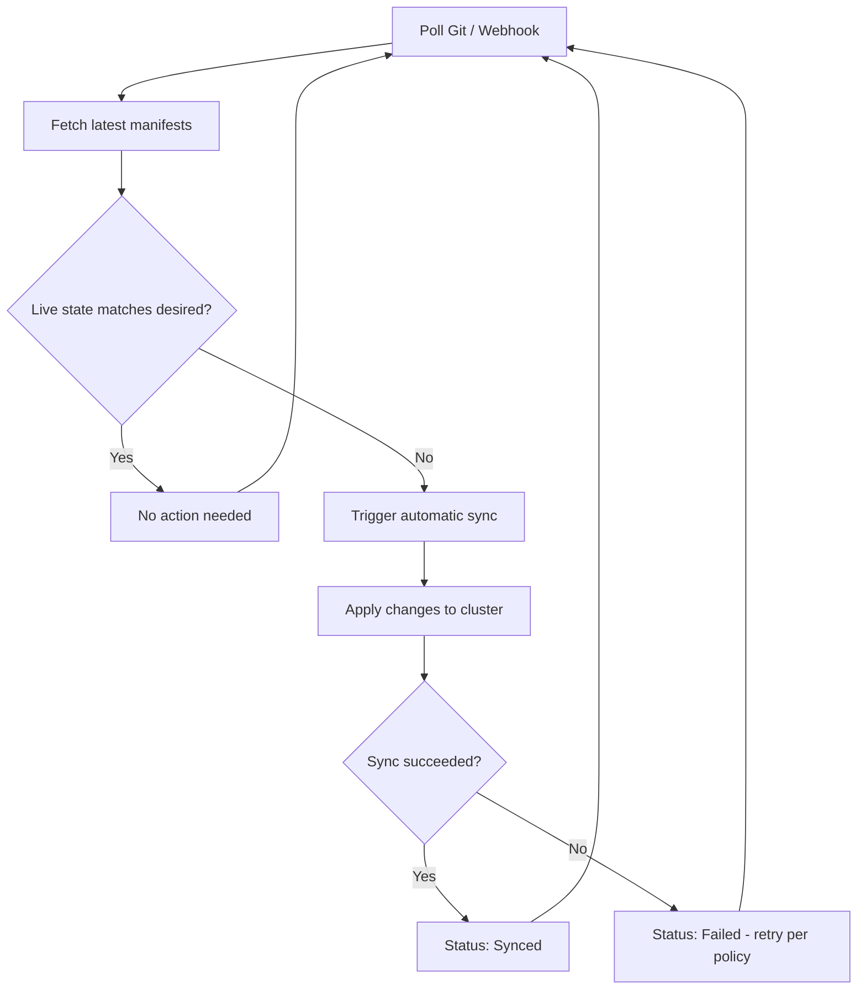

# How to Configure Auto-Sync in ArgoCD

Author: [nawazdhandala](https://github.com/nawazdhandala)

Tags: ArgoCD, GitOps, Kubernetes, Continuous Delivery

Description: Complete guide to configuring ArgoCD automated sync policies including enabling auto-sync, understanding its behavior, configuring options, and production best practices.

---

Auto-sync is what makes ArgoCD a true continuous delivery tool. When enabled, ArgoCD automatically applies changes from Git to your cluster without manual intervention. Push a commit, and within minutes your cluster reflects the new state. But auto-sync has nuances that trip up teams who enable it without understanding the details. This guide covers everything you need to know about configuring auto-sync properly.

## What Auto-Sync Does

When auto-sync is enabled, ArgoCD continuously compares the desired state (from Git) with the live state (in the cluster). If they differ, ArgoCD automatically triggers a sync to bring the cluster in line with Git.

The comparison loop runs:
- Every 3 minutes (default polling interval)
- Immediately after a webhook notification from Git
- After a manual refresh



## Enabling Auto-Sync

### Declaratively in YAML

```yaml
apiVersion: argoproj.io/v1alpha1
kind: Application
metadata:
  name: my-app
  namespace: argocd
spec:
  project: default
  source:
    repoURL: https://github.com/myorg/manifests.git
    targetRevision: main
    path: apps/my-app
  destination:
    server: https://kubernetes.default.svc
    namespace: my-app
  syncPolicy:
    automated: {}  # Enable auto-sync with defaults
```

The minimal `automated: {}` enables auto-sync without pruning or self-healing.

### Via CLI

```bash
# Enable auto-sync on an existing application
argocd app set my-app --sync-policy automated

# Disable auto-sync
argocd app set my-app --sync-policy none
```

### Via the UI

1. Open the application in the ArgoCD UI
2. Click **App Details** (or the details panel)
3. Under Sync Policy, click **Enable Auto-Sync**

## Auto-Sync Options

### Basic Auto-Sync (No Prune, No Self-Heal)

```yaml
syncPolicy:
  automated: {}
```

With just `automated: {}`, ArgoCD will:
- Automatically apply new or changed resources when Git changes
- NOT delete resources that were removed from Git
- NOT revert manual changes made directly to the cluster

This is the safest starting point but leaves gaps in GitOps compliance.

### Auto-Sync with Pruning

```yaml
syncPolicy:
  automated:
    prune: true
```

With `prune: true`, ArgoCD will also delete resources that no longer exist in Git. This is important for true GitOps because removing a resource definition from Git should remove it from the cluster.

Without pruning, old resources accumulate in the cluster like digital debris.

### Auto-Sync with Self-Healing

```yaml
syncPolicy:
  automated:
    selfHeal: true
```

With `selfHeal: true`, ArgoCD will revert any manual changes made to cluster resources that differ from Git. If someone runs `kubectl edit` to change a Deployment's replica count, ArgoCD will change it back.

This enforces Git as the single source of truth and prevents configuration drift.

### Full Auto-Sync (Recommended for GitOps)

```yaml
syncPolicy:
  automated:
    prune: true
    selfHeal: true
```

This is the full GitOps experience:
- New commits are automatically applied
- Removed resources are automatically pruned
- Manual changes are automatically reverted

### Allow Empty

```yaml
syncPolicy:
  automated:
    prune: true
    selfHeal: true
    allowEmpty: false  # default
```

The `allowEmpty` field controls whether ArgoCD will sync when the source produces zero manifests. The default is `false`, which prevents accidental deletion of all resources if your manifest generation breaks and returns nothing.

Set to `true` only if you intentionally want to support syncing an empty application.

## Sync Options with Auto-Sync

Sync options modify how auto-sync behaves:

```yaml
syncPolicy:
  automated:
    prune: true
    selfHeal: true
  syncOptions:
    - CreateNamespace=true         # Create target namespace if missing
    - PruneLast=true               # Prune after all other resources sync
    - ApplyOutOfSyncOnly=true      # Only apply changed resources
    - ServerSideApply=true         # Use server-side apply
    - PrunePropagationPolicy=foreground  # Wait for dependents before deleting
```

## Configuring Retry Policy

If an auto-sync fails, the retry policy controls how ArgoCD retries:

```yaml
syncPolicy:
  automated:
    prune: true
    selfHeal: true
  retry:
    limit: 5           # Max retry attempts (use -1 for unlimited)
    backoff:
      duration: 5s     # Initial backoff
      factor: 2        # Multiply by this each retry
      maxDuration: 3m  # Maximum backoff between retries
```

With this configuration, retries happen at: 5s, 10s, 20s, 40s, 80s (capped at 3m).

Without a retry policy, failed auto-syncs are not retried automatically. ArgoCD will only try again on the next Git poll cycle (every 3 minutes).

## Webhook Configuration for Faster Syncs

The default 3-minute polling interval means it can take up to 3 minutes for changes to be detected. Configure webhooks for near-instant sync:

### GitHub Webhook

In your GitHub repository settings, add a webhook:
- **Payload URL**: `https://argocd.example.com/api/webhook`
- **Content type**: `application/json`
- **Secret**: (configure in ArgoCD)
- **Events**: Just the push event

### Configuring the Webhook Secret in ArgoCD

```yaml
# In argocd-secret
apiVersion: v1
kind: Secret
metadata:
  name: argocd-secret
  namespace: argocd
data:
  # Base64 encoded webhook secret
  webhook.github.secret: <base64-encoded-secret>
```

With webhooks, ArgoCD receives push events immediately and triggers a refresh, typically syncing within seconds of a push.

## Monitoring Auto-Sync Behavior

### Check Auto-Sync Status

```bash
# See the sync policy and recent operations
argocd app get my-app

# Example output showing auto-sync is active:
# Sync Policy:  Automated (Prune)
# Sync Status:  Synced to main (abc1234)
```

### Watch Auto-Sync in Action

```bash
# Watch the application for changes
argocd app get my-app -w

# Or watch with kubectl
kubectl get application my-app -n argocd -w
```

### ArgoCD Metrics

ArgoCD exposes Prometheus metrics for monitoring auto-sync:

```
# Number of sync operations
argocd_app_sync_total

# Sync duration
argocd_app_reconcile_duration_seconds

# Application health status
argocd_app_health_status
```

## Common Auto-Sync Pitfalls

### 1. Infinite Sync Loops

If a Kubernetes controller modifies resources after ArgoCD syncs them (like an HPA changing replica counts), auto-sync with self-heal will create a loop:

```
ArgoCD syncs replicas=3 -> HPA scales to replicas=5 ->
ArgoCD detects drift -> ArgoCD syncs replicas=3 -> HPA scales again -> ...
```

Fix this with `ignoreDifferences`:

```yaml
spec:
  ignoreDifferences:
    - group: apps
      kind: Deployment
      jsonPointers:
        - /spec/replicas
```

### 2. Auto-Sync Does Not Trigger

If auto-sync seems stuck:
- Verify the sync policy: `argocd app get my-app`
- Check if sync windows are blocking: syncs may be denied during certain time windows
- Hard refresh: `argocd app get my-app --hard-refresh`
- Check ArgoCD controller logs for errors

### 3. Prune Deletes Unintended Resources

If pruning deletes resources you want to keep, check:
- Is the resource tracked by ArgoCD? (Check tracking labels)
- Was the resource removed from Git accidentally?
- Use `argocd.argoproj.io/compare-options: IgnoreExtraneous` annotation on resources you want ArgoCD to ignore

## Production Recommendations

1. **Start without auto-sync** - Enable it after you are confident in your manifest structure
2. **Enable prune gradually** - First enable auto-sync without prune, then add prune after verifying the application works
3. **Always enable self-heal in production** - Prevents configuration drift
4. **Configure retry policies** - Transient failures should not require manual intervention
5. **Set up webhooks** - 3-minute polling delay is too slow for most teams
6. **Use sync windows** - Restrict auto-sync during off-hours or maintenance windows
7. **Monitor sync metrics** - Alert on repeated sync failures

Auto-sync is the feature that transforms ArgoCD from a deployment tool into a continuous delivery platform. When configured correctly with pruning, self-healing, retry policies, and proper ignore rules, it keeps your cluster in sync with Git around the clock without human intervention.
