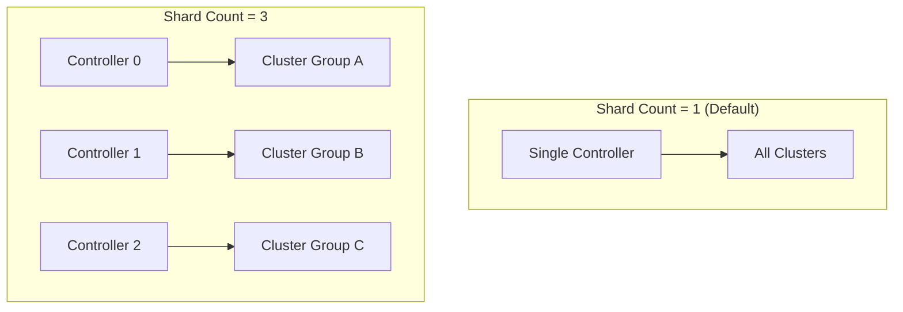

# How to Configure Controller Shard Count in ArgoCD

Author: [nawazdhandala](https://github.com/nawazdhandala)

Tags: ArgoCD, GitOps, Kubernetes, Scaling, Performance

Description: Learn how to configure and tune the ArgoCD application controller shard count for optimal performance based on your cluster count and workload size.

---

The ArgoCD application controller shard count determines how many controller replicas share the workload of reconciling your applications and clusters. Setting this correctly is one of the most important tuning decisions for ArgoCD at scale. Too few shards and your controllers are overloaded. Too many and you waste resources. This guide helps you find the right number and configure it properly.

## What Is the Shard Count?

The shard count is simply the number of application controller replicas that ArgoCD runs. Each shard (replica) is responsible for a subset of the managed clusters. When you set the shard count to 3, ArgoCD distributes your clusters across 3 controller pods.



By default, ArgoCD runs with a shard count of 1, meaning a single controller handles everything.

## When to Increase the Shard Count

Here are the signals that tell you it is time to increase the shard count:

1. **High memory usage** - The controller pod consistently uses more than 70% of its memory limit
2. **Slow reconciliation** - The `argocd_app_reconcile` metric shows p95 latencies above 10 seconds
3. **Work queue depth growing** - The `workqueue_depth` metric is consistently above 0
4. **Application count** - You have more than 300 to 500 applications per cluster
5. **Cluster count** - You manage more than 20 to 30 clusters

Check these metrics with:

```bash
# Check controller memory usage
kubectl top pod -n argocd -l app.kubernetes.io/name=argocd-application-controller

# Check if the controller is falling behind
kubectl logs -n argocd deployment/argocd-application-controller \
  --tail=100 | grep -c "Reconciliation took"
```

## Configuring the Shard Count

There are two places where the shard count needs to be set, and they must match.

### The StatefulSet Replicas

The StatefulSet `replicas` field controls how many controller pods actually run:

```yaml
apiVersion: apps/v1
kind: StatefulSet
metadata:
  name: argocd-application-controller
  namespace: argocd
spec:
  replicas: 3  # This is the actual shard count
  serviceName: argocd-application-controller
  selector:
    matchLabels:
      app.kubernetes.io/name: argocd-application-controller
  template:
    metadata:
      labels:
        app.kubernetes.io/name: argocd-application-controller
    spec:
      containers:
        - name: argocd-application-controller
          image: quay.io/argoproj/argocd:v2.12.0
          command:
            - argocd-application-controller
          env:
            - name: ARGOCD_CONTROLLER_REPLICAS
              value: "3"  # Must match spec.replicas
```

### The Environment Variable

The `ARGOCD_CONTROLLER_REPLICAS` environment variable tells each controller pod the total number of shards. This is critical because each pod uses this value to calculate which clusters it owns:

```text
my_clusters = clusters where hash(cluster) % ARGOCD_CONTROLLER_REPLICAS == my_pod_ordinal
```

If these two values do not match, you get undefined behavior. Some clusters may be managed by multiple controllers (causing conflicts) or no controller at all (causing them to appear as Unknown).

### Using Helm

If you install ArgoCD with Helm, set the shard count in your values file:

```yaml
# values.yaml for argo-cd Helm chart
controller:
  replicas: 3
  env:
    - name: ARGOCD_CONTROLLER_REPLICAS
      value: "3"
  # Use StatefulSet instead of Deployment
  statefulset:
    enabled: true
```

### Using Kustomize

For Kustomize-based installations:

```yaml
# kustomization.yaml
apiVersion: kustomize.config.k8s.io/v1beta1
kind: Kustomization

resources:
  - https://raw.githubusercontent.com/argoproj/argo-cd/v2.12.0/manifests/ha/install.yaml

patches:
  - target:
      kind: StatefulSet
      name: argocd-application-controller
    patch: |
      - op: replace
        path: /spec/replicas
        value: 3
      - op: replace
        path: /spec/template/spec/containers/0/env/0/value
        value: "3"
```

## Sizing Guidelines

Here is a practical sizing table based on real-world deployments:

| Clusters | Applications | Recommended Shards | Memory per Shard |
|----------|-------------|-------------------|-----------------|
| 1 to 10 | Up to 200 | 1 | 1 to 2 GB |
| 10 to 30 | 200 to 1000 | 2 to 3 | 2 to 4 GB |
| 30 to 60 | 1000 to 3000 | 3 to 5 | 4 to 8 GB |
| 60 to 100 | 3000 to 5000 | 5 to 8 | 4 to 8 GB |
| 100+ | 5000+ | 8+ | 8+ GB |

These are starting points. The actual requirements depend heavily on:

- **Resource types watched** - CRDs add to the cache size
- **Reconciliation interval** - Default is 3 minutes; shorter intervals need more CPU
- **Manifest size** - Large manifests consume more memory during diff calculations
- **Number of managed resources per app** - Apps with hundreds of resources are heavier

## Changing the Shard Count

When you need to change the shard count, follow this process:

```bash
# Step 1: Update the environment variable first
kubectl set env statefulset/argocd-application-controller \
  -n argocd ARGOCD_CONTROLLER_REPLICAS=4

# Step 2: Scale the StatefulSet
kubectl scale statefulset argocd-application-controller \
  -n argocd --replicas=4

# Step 3: Wait for all pods to be ready
kubectl rollout status statefulset/argocd-application-controller \
  -n argocd --timeout=300s

# Step 4: Verify cluster distribution
kubectl get secrets -n argocd \
  -l argocd.argoproj.io/secret-type=cluster \
  -o jsonpath='{range .items[*]}{.metadata.name}: {.metadata.annotations.argocd\.argoproj\.io/shard}{"\n"}{end}'
```

### Scaling Down Safely

When reducing the shard count, clusters assigned to removed shards get redistributed. Be cautious:

```bash
# Check which clusters are on the shard you are removing
# If you are going from 4 to 3 shards, check shard 3
kubectl get secrets -n argocd \
  -l argocd.argoproj.io/secret-type=cluster \
  -o json | jq '.items[] | select(.metadata.annotations["argocd.argoproj.io/shard"] == "3") | .metadata.name'

# Scale down
kubectl set env statefulset/argocd-application-controller \
  -n argocd ARGOCD_CONTROLLER_REPLICAS=3
kubectl scale statefulset argocd-application-controller \
  -n argocd --replicas=3
```

## Monitoring Shard Performance

After configuring the shard count, set up monitoring to validate your choice:

```yaml
# Grafana dashboard query examples

# CPU usage per shard
sum(rate(container_cpu_usage_seconds_total{
  container="argocd-application-controller"
}[5m])) by (pod)

# Memory per shard
container_memory_working_set_bytes{
  container="argocd-application-controller"
} / 1024 / 1024 / 1024

# Reconciliation queue depth per shard
workqueue_depth{
  name="app_reconciliation_queue"
}
```

Set alerts for:

- **Memory above 80%** of the pod limit - time to add more shards or increase limits
- **Reconciliation p95 above 30s** - the shard is overloaded
- **Queue depth consistently above 10** - the shard cannot keep up

## Common Mistakes

**Mismatched replica count and environment variable** - This is the most common issue. Always update both values together.

**Starting too high** - Running 10 shards for 5 clusters wastes resources and adds unnecessary complexity. Start small and scale up based on data.

**Not using a StatefulSet** - Sharding requires stable pod identities. A Deployment with multiple replicas will not work correctly because pods do not have predictable ordinals.

**Forgetting the headless service** - StatefulSets need a headless service for DNS resolution between pods.

Getting the shard count right is an iterative process. Start with the sizing guidelines, deploy, monitor, and adjust. The key metrics to watch are memory usage, reconciliation latency, and queue depth. When any of these consistently exceed healthy thresholds, it is time to add another shard.
