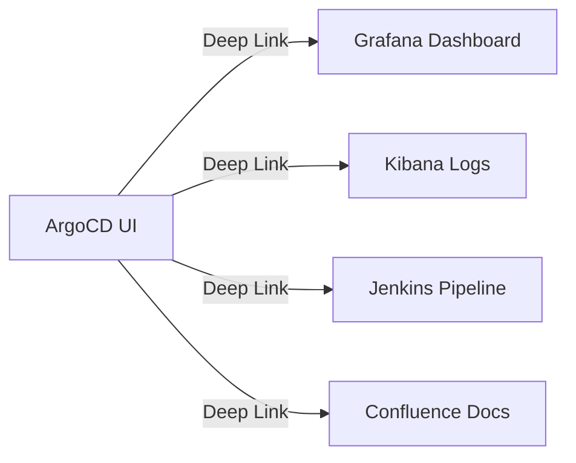

# How to Configure Deep Links in ArgoCD

Author: [nawazdhandala](https://github.com/nawazdhandala)

Tags: ArgoCD, GitOps, Kubernetes, UI Customization, Productivity

Description: Learn how to configure deep links in ArgoCD to create clickable shortcuts from your applications and resources to external tools like monitoring dashboards, documentation, and CI/CD pipelines.

---

ArgoCD deep links let you add custom clickable links to applications, resources, and projects in the ArgoCD UI. These links can point to external tools like Grafana dashboards, logging systems, CI/CD pipelines, or documentation pages. The links are dynamically generated using template variables from the resource context, making them context-aware and useful.

This guide covers how to set up deep links for different resource types and use template expressions to build dynamic URLs.

## What Are Deep Links?

Deep links appear as clickable buttons or links in the ArgoCD UI, attached to specific resources. When a user clicks a deep link, it opens the configured URL in a new browser tab. The URL can include template variables that get resolved at render time based on the resource's metadata.

For example, you could add a deep link that takes you from a Deployment resource in ArgoCD directly to its Grafana dashboard, with the namespace and deployment name already filled in.



## Deep Link Configuration Location

Deep links are configured in the `argocd-cm` ConfigMap under specific keys depending on where you want the links to appear:

| Key | Where Links Appear |
|-----|-------------------|
| `resource.links` | On individual resources in the resource tree |
| `application.links` | On the application overview page |
| `project.links` | On the project page |

## Configuring Resource-Level Deep Links

Resource links appear on individual Kubernetes resources (Deployments, Services, Pods, etc.) in the resource tree view.

```yaml
apiVersion: v1
kind: ConfigMap
metadata:
  name: argocd-cm
  namespace: argocd
data:
  resource.links: |
    - url: https://grafana.example.com/d/k8s-pods?var-namespace={{.metadata.namespace}}&var-pod={{.metadata.name}}
      title: Grafana Pod Dashboard
      description: View pod metrics in Grafana
      icon.class: "fa fa-chart-line"
      if: kind == "Pod"

    - url: https://grafana.example.com/d/k8s-deployments?var-namespace={{.metadata.namespace}}&var-deployment={{.metadata.name}}
      title: Grafana Deployment Dashboard
      description: View deployment metrics in Grafana
      icon.class: "fa fa-chart-bar"
      if: kind == "Deployment"

    - url: https://kibana.example.com/app/discover#/?_a=(query:(query_string:(query:'kubernetes.namespace:"{{.metadata.namespace}}" AND kubernetes.pod_name:"{{.metadata.name}}"')))
      title: View Logs in Kibana
      description: View pod logs in Kibana
      icon.class: "fa fa-file-alt"
      if: kind == "Pod"
```

### Template Variables

Deep link URLs support Go template syntax. The available variables depend on the link type:

**For resource links**, you have access to the full resource manifest:

- `{{.metadata.name}}` - Resource name
- `{{.metadata.namespace}}` - Resource namespace
- `{{.metadata.labels.app}}` - Any label value
- `{{.metadata.annotations.team}}` - Any annotation value
- `{{.kind}}` - Resource kind (Pod, Deployment, etc.)
- `{{.spec.replicas}}` - Any spec field

### Conditional Display

The `if` field uses CEL (Common Expression Language) to control when a link is displayed:

```yaml
resource.links: |
  # Only show for Deployments
  - url: https://example.com/deploy/{{.metadata.name}}
    title: Deploy Dashboard
    if: kind == "Deployment"

  # Only show for resources in production namespace
  - url: https://example.com/prod/{{.metadata.name}}
    title: Production Monitor
    if: metadata.namespace == "production"

  # Only show for resources with a specific label
  - url: https://example.com/team/{{.metadata.labels.team}}
    title: Team Dashboard
    if: metadata.labels.team != nil
```

## Configuring Application-Level Deep Links

Application links appear on the application overview page and have access to application-level metadata:

```yaml
apiVersion: v1
kind: ConfigMap
metadata:
  name: argocd-cm
  namespace: argocd
data:
  application.links: |
    - url: https://grafana.example.com/d/argocd-app?var-app={{.metadata.name}}
      title: Application Dashboard
      description: View application metrics
      icon.class: "fa fa-chart-area"

    - url: https://github.com/my-org/{{.spec.source.repoURL | call .regex "([^/]+)\\.git$" | index 0}}/tree/{{.spec.source.targetRevision}}/{{.spec.source.path}}
      title: View Source in GitHub
      description: Open the Git source for this application
      icon.class: "fa fa-code-branch"

    - url: https://argocd.example.com/applications/{{.metadata.name}}?resource=
      title: Resource List
      description: View all resources
      icon.class: "fa fa-list"
```

For application links, the template context includes the full Application resource spec:

- `{{.metadata.name}}` - Application name
- `{{.spec.source.repoURL}}` - Git repository URL
- `{{.spec.source.path}}` - Path within the repository
- `{{.spec.source.targetRevision}}` - Branch, tag, or commit
- `{{.spec.destination.server}}` - Target cluster
- `{{.spec.destination.namespace}}` - Target namespace
- `{{.spec.project}}` - ArgoCD project name

## Configuring Project-Level Deep Links

Project links appear on the project page:

```yaml
apiVersion: v1
kind: ConfigMap
metadata:
  name: argocd-cm
  namespace: argocd
data:
  project.links: |
    - url: https://confluence.example.com/spaces/devops/pages?label=project-{{.metadata.name}}
      title: Project Documentation
      description: View project docs in Confluence
      icon.class: "fa fa-book"

    - url: https://jira.example.com/projects/{{.metadata.name | upper}}/board
      title: Jira Board
      description: View project Jira board
      icon.class: "fa fa-tasks"
```

## Complete Example: Multi-Tool Integration

Here is a comprehensive configuration that links ArgoCD to multiple external tools:

```yaml
apiVersion: v1
kind: ConfigMap
metadata:
  name: argocd-cm
  namespace: argocd
data:
  exec.enabled: "true"

  resource.links: |
    # Grafana - Pod metrics
    - url: https://grafana.example.com/d/pod-metrics?var-namespace={{.metadata.namespace}}&var-pod={{.metadata.name}}
      title: Pod Metrics
      icon.class: "fa fa-chart-line"
      if: kind == "Pod"

    # Grafana - Deployment metrics
    - url: https://grafana.example.com/d/deployment-metrics?var-namespace={{.metadata.namespace}}&var-deployment={{.metadata.name}}
      title: Deployment Metrics
      icon.class: "fa fa-chart-bar"
      if: kind == "Deployment"

    # Loki - Pod logs
    - url: https://grafana.example.com/explore?left={"queries":[{"expr":"{namespace=\"{{.metadata.namespace}}\",pod=\"{{.metadata.name}}\"}"}]}
      title: View Logs
      icon.class: "fa fa-scroll"
      if: kind == "Pod"

    # Kubernetes Dashboard
    - url: https://k8s-dashboard.example.com/#/pod/{{.metadata.namespace}}/{{.metadata.name}}
      title: K8s Dashboard
      icon.class: "fa fa-server"
      if: kind == "Pod"

  application.links: |
    # GitHub repository
    - url: {{.spec.source.repoURL | replace ".git" "" | replace "git@github.com:" "https://github.com/"}}/tree/{{.spec.source.targetRevision}}/{{.spec.source.path}}
      title: Git Source
      icon.class: "fa fa-code-branch"

    # CI/CD Pipeline
    - url: https://github.com/my-org/my-repo/actions?query=workflow:deploy+branch:{{.spec.source.targetRevision}}
      title: CI Pipeline
      icon.class: "fa fa-cogs"

    # OneUptime monitoring
    - url: https://oneuptime.com/dashboard/project/monitors?search={{.metadata.name}}
      title: OneUptime Status
      icon.class: "fa fa-heartbeat"

  project.links: |
    # Team documentation
    - url: https://wiki.example.com/projects/{{.metadata.name}}
      title: Documentation
      icon.class: "fa fa-book"
```

## Using Icons

Deep links support Font Awesome icon classes. Common useful icons:

- `fa fa-chart-line` - Line chart (metrics)
- `fa fa-chart-bar` - Bar chart (dashboards)
- `fa fa-scroll` - Scroll (logs)
- `fa fa-code-branch` - Branch (Git)
- `fa fa-cogs` - Gears (CI/CD)
- `fa fa-book` - Book (documentation)
- `fa fa-bug` - Bug (issue tracker)
- `fa fa-heartbeat` - Heartbeat (monitoring)
- `fa fa-server` - Server (infrastructure)
- `fa fa-shield-alt` - Shield (security)

## Applying and Testing

After updating the ConfigMap, the changes take effect without restarting ArgoCD:

```bash
# Apply the ConfigMap
kubectl apply -f argocd-cm.yaml -n argocd

# Verify the configuration
kubectl get configmap argocd-cm -n argocd -o yaml | grep -A 50 "resource.links"
```

Open the ArgoCD UI, navigate to an application, and click on a resource in the tree. You should see the configured deep links as clickable buttons.

## Troubleshooting

**Links not showing**: Check that the `if` condition matches the resource. Test by removing the `if` clause temporarily.

**Template errors**: If a template variable resolves to empty, the link may not render or may have a broken URL. Use safe defaults where possible.

**URL encoding issues**: Special characters in template values may break URLs. ArgoCD does not automatically URL-encode template output.

## Conclusion

Deep links transform ArgoCD from a standalone deployment tool into a central hub that connects to your entire DevOps ecosystem. By configuring context-aware links to monitoring dashboards, logging systems, CI/CD pipelines, and documentation, you reduce context-switching and help your team find the information they need faster. For specific deep link configurations for monitoring tools, check our guide on [creating deep links to external monitoring tools](https://oneuptime.com/blog/post/2026-02-26-argocd-deep-links-monitoring-tools/view).
