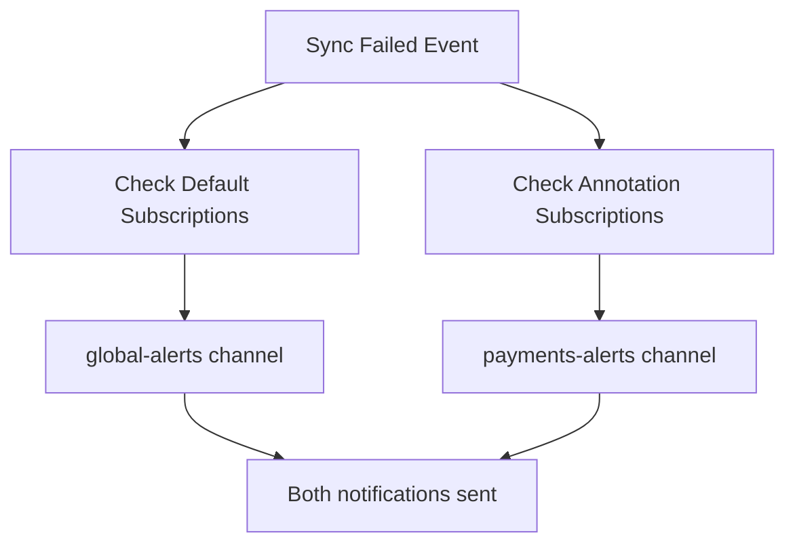

# How to Configure Default Notification Subscriptions in ArgoCD

Author: [nawazdhandala](https://github.com/nawazdhandala)

Tags: ArgoCD, GitOps, Kubernetes, Notifications

Description: Learn how to configure default notification subscriptions in ArgoCD that automatically apply to all applications, reducing annotation overhead and ensuring consistent alerting across your cluster.

---

When you manage dozens or hundreds of applications in ArgoCD, adding notification annotations to each one becomes tedious and error-prone. Default subscriptions solve this by defining notification rules that automatically apply to all applications - or to applications matching specific criteria. This guide covers how to configure, scope, and manage default notification subscriptions in ArgoCD.

## What Are Default Subscriptions?

Default subscriptions are notification rules defined in the `argocd-notifications-cm` ConfigMap rather than on individual Application annotations. They apply globally to all applications managed by ArgoCD, or to applications matching label selectors. This means you do not need to annotate every application - the default subscriptions handle baseline notification routing automatically.

## Configuring Global Default Subscriptions

Define default subscriptions in the `argocd-notifications-cm` ConfigMap using the `defaultTriggers` and `subscriptions` fields:

```yaml
apiVersion: v1
kind: ConfigMap
metadata:
  name: argocd-notifications-cm
  namespace: argocd
data:
  # Define which triggers fire by default for all subscriptions
  defaultTriggers: |
    - on-sync-succeeded
    - on-sync-failed
    - on-health-degraded

  # Define default subscriptions that apply to all applications
  subscriptions: |
    - recipients:
        - slack:global-deployments
      triggers:
        - on-sync-succeeded
        - on-sync-failed
    - recipients:
        - slack:global-alerts
        - email:sre-team@company.com
      triggers:
        - on-sync-failed
        - on-health-degraded
    - recipients:
        - webhook:audit-log
      triggers:
        - on-sync-succeeded
        - on-sync-failed
        - on-health-degraded
        - on-deployed
```

With this configuration, every application in ArgoCD will:
- Send sync success and failure notifications to `#global-deployments` on Slack
- Send sync failures and health degradation alerts to both `#global-alerts` on Slack and the SRE team email
- Send all events to the audit-log webhook

## Scoping Default Subscriptions with Selectors

You can narrow default subscriptions to applications matching specific labels using selectors:

```yaml
apiVersion: v1
kind: ConfigMap
metadata:
  name: argocd-notifications-cm
  namespace: argocd
data:
  subscriptions: |
    # All production applications get full alerting
    - recipients:
        - slack:prod-deployments
        - email:sre-oncall@company.com
      triggers:
        - on-sync-succeeded
        - on-sync-failed
        - on-health-degraded
      selector: environment=production

    # Staging applications only get failure alerts
    - recipients:
        - slack:staging-alerts
      triggers:
        - on-sync-failed
      selector: environment=staging

    # Critical applications get PagerDuty alerts
    - recipients:
        - slack:critical-alerts
      triggers:
        - on-sync-failed
        - on-health-degraded
      selector: criticality=high

    # All applications get audit logging
    - recipients:
        - webhook:audit-log
      triggers:
        - on-sync-succeeded
        - on-sync-failed
        - on-health-degraded
```

The selectors match against labels on the Application resource:

```yaml
apiVersion: argoproj.io/v1alpha1
kind: Application
metadata:
  name: payment-service
  namespace: argocd
  labels:
    environment: production
    criticality: high
    team: payments
spec:
  # ...
```

This application would match both the `environment=production` and `criticality=high` subscriptions, receiving notifications from all matching rules.

## Selector Syntax

The selector field supports standard Kubernetes label selector syntax:

```yaml
subscriptions: |
  # Equality-based selector
  - recipients:
      - slack:team-channel
    triggers:
      - on-sync-failed
    selector: team=payments

  # Set-based selector
  - recipients:
      - slack:shared-alerts
    triggers:
      - on-sync-failed
    selector: environment in (production, staging)

  # Multiple conditions (AND logic)
  - recipients:
      - slack:critical-prod
    triggers:
      - on-sync-failed
      - on-health-degraded
    selector: environment=production,criticality=high

  # Existence check
  - recipients:
      - webhook:monitoring
    triggers:
      - on-health-degraded
    selector: monitoring-enabled
```

## Combining Default and Annotation-Based Subscriptions

Default subscriptions and annotation-based subscriptions are additive. An application receives notifications from both:

```yaml
# Default subscription (in argocd-notifications-cm)
subscriptions: |
  - recipients:
      - slack:global-alerts
    triggers:
      - on-sync-failed

# Application with its own annotations
apiVersion: argoproj.io/v1alpha1
kind: Application
metadata:
  name: payment-service
  annotations:
    # This adds to the default, does not replace it
    notifications.argoproj.io/subscribe.on-sync-failed.slack: payments-alerts
```

In this case, sync failures for `payment-service` are sent to both `#global-alerts` (from the default) and `#payments-alerts` (from the annotation). There is no way to opt out of a default subscription using annotations alone.



## Structuring Default Subscriptions for Scale

Here is a complete example that handles multiple teams, environments, and notification services:

```yaml
apiVersion: v1
kind: ConfigMap
metadata:
  name: argocd-notifications-cm
  namespace: argocd
data:
  # Service configurations
  service.slack: |
    token: $slack-token

  service.email: |
    host: smtp.company.com
    port: 587
    from: argocd@company.com
    username: $email-username
    password: $email-password

  service.webhook.datadog: |
    url: https://api.datadoghq.com/api/v1/events
    headers:
      - name: DD-API-KEY
        value: $datadog-api-key
      - name: Content-Type
        value: application/json

  # Triggers
  trigger.on-sync-succeeded: |
    - when: app.status.operationState.phase in ['Succeeded']
      send: [sync-succeeded-template]

  trigger.on-sync-failed: |
    - when: app.status.operationState.phase in ['Error', 'Failed']
      send: [sync-failed-template]

  trigger.on-health-degraded: |
    - when: app.status.health.status == 'Degraded'
      send: [health-degraded-template]

  # Default subscriptions
  subscriptions: |
    # Tier 1: All applications - audit log
    - recipients:
        - webhook:datadog
      triggers:
        - on-sync-succeeded
        - on-sync-failed
        - on-health-degraded

    # Tier 2: All production apps - SRE visibility
    - recipients:
        - slack:sre-production
      triggers:
        - on-sync-succeeded
        - on-sync-failed
        - on-health-degraded
      selector: environment=production

    # Tier 3: Critical production apps - immediate alerting
    - recipients:
        - slack:critical-incidents
        - email:sre-oncall@company.com
      triggers:
        - on-sync-failed
        - on-health-degraded
      selector: environment=production,criticality=high

    # Tier 4: Staging - only failures
    - recipients:
        - slack:staging-issues
      triggers:
        - on-sync-failed
      selector: environment=staging

  # Templates (abbreviated)
  template.sync-succeeded-template: |
    message: "Sync succeeded for {{.app.metadata.name}}"

  template.sync-failed-template: |
    message: "SYNC FAILED for {{.app.metadata.name}}: {{.app.status.operationState.message}}"

  template.health-degraded-template: |
    message: "Health degraded for {{.app.metadata.name}}"
```

## Testing Default Subscriptions

Verify your default subscriptions are working:

```bash
# Check the notification controller loaded the config
kubectl logs -n argocd deployment/argocd-notifications-controller \
  --tail=20 | grep -i "subscription\|config"

# List all applications that match a selector
kubectl get applications -n argocd -l environment=production

# Trigger a sync to test
argocd app sync my-production-app

# Watch notification controller logs during sync
kubectl logs -n argocd deployment/argocd-notifications-controller -f | \
  grep "my-production-app"

# Check for delivery errors
kubectl logs -n argocd deployment/argocd-notifications-controller \
  --tail=100 | grep -i "error\|failed to"
```

## Common Mistakes

1. **Forgetting to label applications** - Default subscriptions with selectors only work if applications have the matching labels.
2. **YAML indentation errors** - The `subscriptions` field is a string containing YAML. Indentation must be consistent.
3. **Trigger name mismatches** - The trigger name in the subscription must exactly match the trigger definition.
4. **Missing service configuration** - Subscriptions reference services that must be configured in the same ConfigMap.
5. **Not restarting the controller** - After changing the ConfigMap, the notification controller needs to pick up the changes (it watches for changes, but occasionally a restart helps).

## Best Practices

1. **Use labels consistently** across all Application resources to enable selector-based routing.
2. **Layer your subscriptions** from broad (audit) to narrow (team-specific, criticality-based).
3. **Keep global subscriptions minimal** - send only critical events globally to avoid alert fatigue.
4. **Use webhooks for audit logging** - capture all events without spamming human-facing channels.
5. **Document your label taxonomy** so teams know which labels to apply for proper notification routing.
6. **Test selector changes** before applying them - a wrong selector can silence important alerts.

Default subscriptions are the foundation of scalable notification management in ArgoCD. Combined with selector-based scoping and per-application annotations, they give you a flexible, layered notification architecture that grows with your cluster. For more on per-application subscriptions, see [How to Subscribe to Specific Application Notifications](https://oneuptime.com/blog/post/2026-02-26-argocd-subscribe-application-notifications/view).
