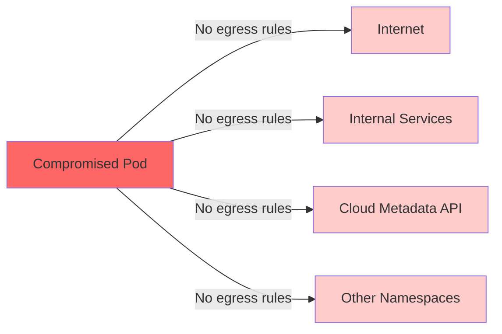
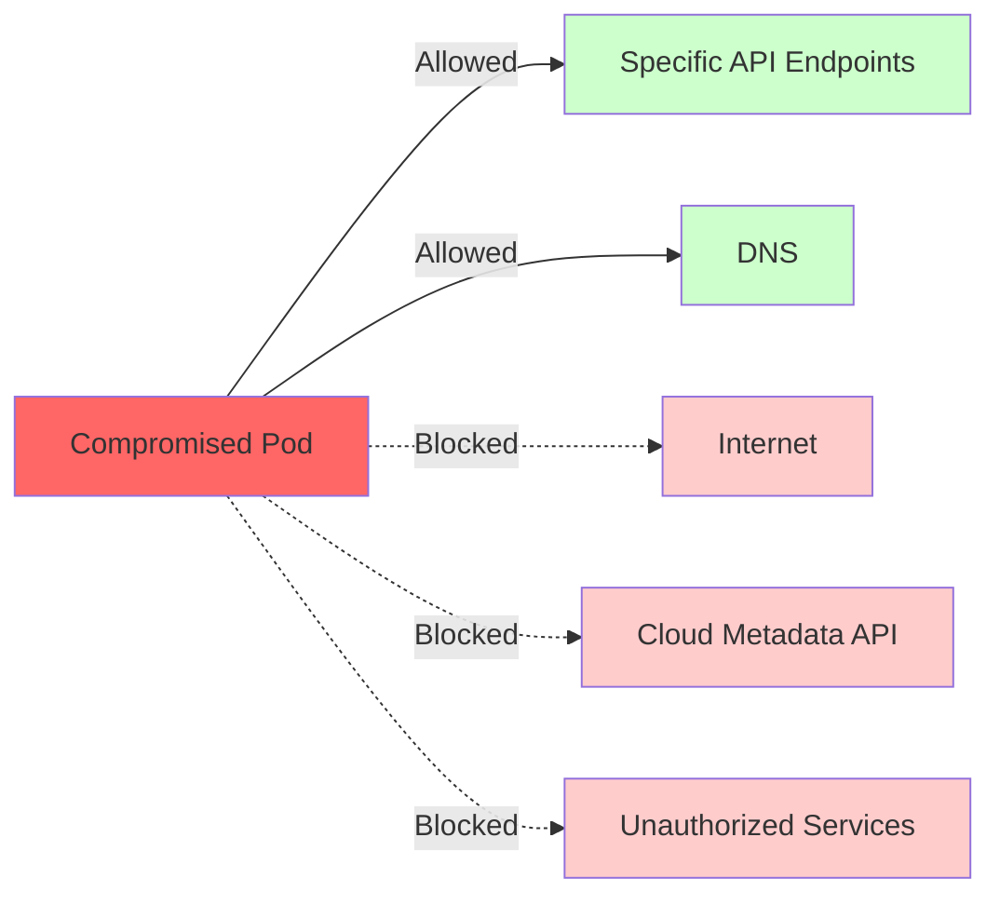

# How to Configure Egress Rules with ArgoCD

Author: [nawazdhandala](https://github.com/nawazdhandala)

Tags: ArgoCD, GitOps, Kubernetes, Network Policies, Security

Description: Learn how to configure and manage Kubernetes egress network policies with ArgoCD for controlling outbound traffic from pods to external services and the internet.

---

Egress rules control outbound traffic from your pods. While most teams start with ingress policies, egress control is equally important for security. Without egress restrictions, a compromised pod can exfiltrate data, communicate with command-and-control servers, or make unauthorized API calls. Managing egress rules through ArgoCD ensures these critical security controls are version-controlled, reviewed, and consistently applied.

This guide covers implementing egress network policies with ArgoCD, from basic outbound restrictions to advanced patterns.

## Why Egress Control Matters

Consider what happens without egress controls:



With egress rules:



## Base Egress Deny Policy

Start with a default-deny egress policy:

```yaml
# default-deny-egress.yaml
apiVersion: networking.k8s.io/v1
kind: NetworkPolicy
metadata:
  name: default-deny-egress
  namespace: production
spec:
  podSelector: {}
  policyTypes:
    - Egress
```

This blocks all outbound traffic. Now you selectively allow what is needed.

## Essential Egress Allowances

Every namespace needs certain egress permissions to function:

```yaml
# allow-dns-egress.yaml
# Pods must be able to resolve DNS
apiVersion: networking.k8s.io/v1
kind: NetworkPolicy
metadata:
  name: allow-dns-egress
  namespace: production
spec:
  podSelector: {}
  policyTypes:
    - Egress
  egress:
    - to:
        - namespaceSelector:
            matchLabels:
              kubernetes.io/metadata.name: kube-system
        - ipBlock:
            # CoreDNS ClusterIP range
            cidr: 10.96.0.0/16
      ports:
        - protocol: UDP
          port: 53
        - protocol: TCP
          port: 53

---
# allow-kubernetes-api.yaml
# Some pods need to talk to the Kubernetes API
apiVersion: networking.k8s.io/v1
kind: NetworkPolicy
metadata:
  name: allow-kubernetes-api
  namespace: production
spec:
  podSelector:
    matchLabels:
      needs-k8s-api: "true"
  policyTypes:
    - Egress
  egress:
    - to:
        - ipBlock:
            # Kubernetes API server IP
            cidr: 10.96.0.1/32
      ports:
        - protocol: TCP
          port: 443
```

## Application-Specific Egress Rules

Define egress rules per application:

```yaml
# api-server-egress.yaml
apiVersion: networking.k8s.io/v1
kind: NetworkPolicy
metadata:
  name: api-server-egress
  namespace: production
spec:
  podSelector:
    matchLabels:
      app: api-server
  policyTypes:
    - Egress
  egress:
    # Allow access to the database
    - to:
        - podSelector:
            matchLabels:
              app: postgresql
      ports:
        - protocol: TCP
          port: 5432

    # Allow access to Redis cache
    - to:
        - podSelector:
            matchLabels:
              app: redis
      ports:
        - protocol: TCP
          port: 6379

    # Allow access to internal microservices
    - to:
        - podSelector:
            matchLabels:
              tier: backend
      ports:
        - protocol: TCP
          port: 8080

    # Allow HTTPS to specific external APIs
    - to:
        - ipBlock:
            # Stripe API IPs
            cidr: 54.187.174.169/32
        - ipBlock:
            cidr: 54.187.205.235/32
      ports:
        - protocol: TCP
          port: 443

---
# payment-service-egress.yaml
apiVersion: networking.k8s.io/v1
kind: NetworkPolicy
metadata:
  name: payment-service-egress
  namespace: production
spec:
  podSelector:
    matchLabels:
      app: payment-service
  policyTypes:
    - Egress
  egress:
    # Allow access to payment processor only
    - to:
        - ipBlock:
            cidr: 54.187.174.169/32
        - ipBlock:
            cidr: 54.187.205.235/32
      ports:
        - protocol: TCP
          port: 443

    # Allow access to the database
    - to:
        - podSelector:
            matchLabels:
              app: postgresql
      ports:
        - protocol: TCP
          port: 5432
```

## Blocking Cloud Metadata API

Prevent pods from accessing the cloud provider metadata API, which is a common attack vector:

```yaml
# block-cloud-metadata.yaml
apiVersion: networking.k8s.io/v1
kind: NetworkPolicy
metadata:
  name: block-cloud-metadata
  namespace: production
spec:
  podSelector: {}
  policyTypes:
    - Egress
  egress:
    # Allow everything EXCEPT the metadata API
    - to:
        - ipBlock:
            cidr: 0.0.0.0/0
            except:
              # AWS metadata API
              - 169.254.169.254/32
              # GCP metadata API
              - metadata.google.internal/32
              # Azure metadata API
              - 169.254.169.254/32
```

## Cilium Network Policies for Advanced Egress

For more granular egress control, use Cilium's CiliumNetworkPolicy which supports FQDN-based rules:

```yaml
# Allow egress to specific domains
apiVersion: cilium.io/v2
kind: CiliumNetworkPolicy
metadata:
  name: api-server-fqdn-egress
  namespace: production
spec:
  endpointSelector:
    matchLabels:
      app: api-server
  egress:
    # Allow HTTPS to specific external domains
    - toFQDNs:
        - matchName: "api.stripe.com"
        - matchName: "api.sendgrid.com"
        - matchPattern: "*.amazonaws.com"
      toPorts:
        - ports:
            - port: "443"
              protocol: TCP

    # Allow access to internal services
    - toEndpoints:
        - matchLabels:
            app: postgresql
      toPorts:
        - ports:
            - port: "5432"
              protocol: TCP
```

## Repository Structure

```
egress-policies/
  base/
    kustomization.yaml
    default-deny-egress.yaml
    allow-dns.yaml
    block-cloud-metadata.yaml
  namespaces/
    production/
      kustomization.yaml
      api-server-egress.yaml
      payment-service-egress.yaml
      worker-egress.yaml
    staging/
      kustomization.yaml
      relaxed-egress.yaml
  overlays/
    cluster-prod/
      kustomization.yaml
    cluster-staging/
      kustomization.yaml
```

## ArgoCD Application

```yaml
apiVersion: argoproj.io/v1alpha1
kind: Application
metadata:
  name: egress-policies
  namespace: argocd
spec:
  project: security
  source:
    repoURL: https://github.com/your-org/egress-policies
    path: overlays/cluster-prod
    targetRevision: main
  destination:
    server: https://kubernetes.default.svc
  syncPolicy:
    automated:
      selfHeal: true
      prune: true
    syncOptions:
      - ApplyOutOfSyncOnly=true
```

## Environment-Specific Overrides

Staging typically needs more relaxed egress for development and debugging:

```yaml
# overlays/cluster-staging/relaxed-egress-patch.yaml
apiVersion: networking.k8s.io/v1
kind: NetworkPolicy
metadata:
  name: staging-allow-internet
  namespace: staging
spec:
  podSelector: {}
  policyTypes:
    - Egress
  egress:
    # Allow all outbound HTTPS in staging
    - to:
        - ipBlock:
            cidr: 0.0.0.0/0
            except:
              - 169.254.169.254/32
      ports:
        - protocol: TCP
          port: 443
        - protocol: TCP
          port: 80
```

## Testing Egress Rules

Verify egress rules are working correctly:

```bash
# Test from inside a pod
kubectl exec -n production deploy/api-server -- \
  curl -s --connect-timeout 5 https://api.stripe.com/v1/charges
# Should succeed

kubectl exec -n production deploy/api-server -- \
  curl -s --connect-timeout 5 https://evil-site.example.com
# Should timeout or connection refused

# Test cloud metadata block
kubectl exec -n production deploy/api-server -- \
  curl -s --connect-timeout 5 http://169.254.169.254/latest/meta-data/
# Should timeout
```

## Pre-Sync Validation

```yaml
apiVersion: batch/v1
kind: Job
metadata:
  name: validate-egress-policies
  annotations:
    argocd.argoproj.io/hook: PreSync
    argocd.argoproj.io/hook-delete-policy: HookSucceeded
spec:
  template:
    spec:
      containers:
        - name: validate
          image: bitnami/kubectl:1.29
          command:
            - sh
            - -c
            - |
              # Ensure DNS egress is always present
              if ! kubectl get networkpolicy allow-dns-egress \
                -n production -o name 2>/dev/null; then
                echo "WARNING: DNS egress policy will be created"
              fi

              # Validate all policies
              kubectl apply --dry-run=server \
                -f /policies/ 2>&1
              echo "Egress policy validation passed"
      restartPolicy: Never
  backoffLimit: 0
```

## Monitoring Egress Policy Impact

Track egress policy enforcement:

```promql
# Dropped egress packets (Calico)
sum(rate(
  calico_denied_packets_total{direction="egress"}[5m]
)) by (policy, namespace)

# Cilium egress drops
sum(rate(
  cilium_drop_count_total{
    reason="POLICY_DENIED",
    direction="egress"
  }[5m]
)) by (namespace)
```

Create alerts for unexpected egress blocks:

```yaml
apiVersion: monitoring.coreos.com/v1
kind: PrometheusRule
metadata:
  name: egress-policy-alerts
spec:
  groups:
    - name: egress-alerts
      rules:
        - alert: HighEgressDropRate
          expr: >
            sum(rate(
              calico_denied_packets_total{
                direction="egress"
              }[5m]
            )) by (namespace) > 100
          for: 5m
          labels:
            severity: warning
          annotations:
            summary: "High egress packet drop rate in {{ $labels.namespace }}"
```

## Summary

Configuring egress rules with ArgoCD brings GitOps discipline to outbound traffic control. Start with default-deny, allow DNS and essential services, then add application-specific egress permissions. Use FQDN-based policies with Cilium for more granular control. Managing these policies through ArgoCD ensures they are reviewed, auditable, and consistently applied. Combined with ingress policies, you achieve a comprehensive zero-trust networking posture managed entirely through Git.
