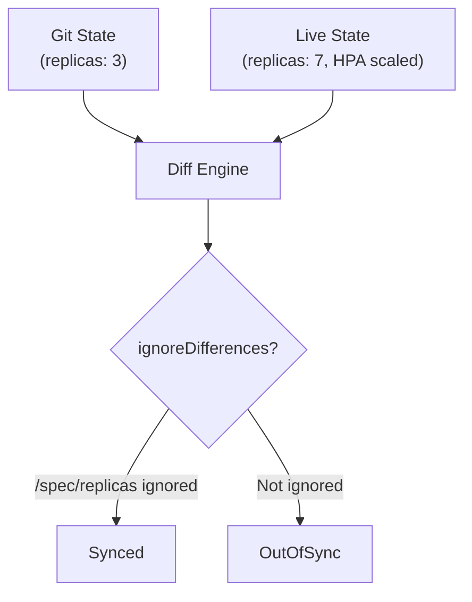

# How to Configure ignoreDifferences in ArgoCD

Author: [nawazdhandala](https://github.com/nawazdhandala)

Tags: ArgoCD, GitOps, Kubernetes, Diff Customization, Configuration

Description: Learn how to configure the ignoreDifferences field in ArgoCD Applications to suppress false OutOfSync reports from dynamic fields, operators, and admission controllers.

---

The `ignoreDifferences` field is one of the most commonly used configuration options in ArgoCD. It tells the diff engine to skip specific fields when comparing the desired state from Git against the live cluster state. Without it, dynamic fields like timestamps, generated values, and operator-managed annotations would constantly trigger false OutOfSync reports.

## Why ignoreDifferences Is Needed

Kubernetes resources frequently have fields that change at runtime without any user action. These changes come from:

- **API server defaulting**: Adding default values for omitted fields
- **Controllers**: Setting status fields, annotations, and labels
- **Admission webhooks**: Injecting sidecars, adding labels, modifying resources
- **Operators**: Managing specific fields of resources they control
- **HPAs**: Changing replica counts based on metrics

ArgoCD sees these changes as drift from the desired state and marks the application as OutOfSync. The `ignoreDifferences` configuration tells ArgoCD which of these changes are expected and should be ignored.



## Application-Level Configuration

Add `ignoreDifferences` to an individual Application:

```yaml
apiVersion: argoproj.io/v1alpha1
kind: Application
metadata:
  name: my-app
  namespace: argocd
spec:
  ignoreDifferences:
    # Ignore replicas (managed by HPA)
    - group: apps
      kind: Deployment
      jsonPointers:
        - /spec/replicas

    # Ignore a specific annotation on all Services
    - group: ""
      kind: Service
      jsonPointers:
        - /metadata/annotations/service.beta.kubernetes.io~1aws-load-balancer-internal

    # Ignore only for a named resource
    - group: apps
      kind: Deployment
      name: my-specific-deployment
      jsonPointers:
        - /spec/template/metadata/annotations/sidecar.istio.io~1inject
```

The `group`, `kind`, and optionally `name` and `namespace` fields identify which resources the rule applies to. The `jsonPointers` or `jqPathExpressions` specify which fields to ignore.

## Using JSON Pointers

JSON Pointers (RFC 6901) are path expressions that identify specific fields in a JSON document:

```yaml
ignoreDifferences:
  # Simple field path
  - group: apps
    kind: Deployment
    jsonPointers:
      - /spec/replicas

  # Nested field
  - group: apps
    kind: Deployment
    jsonPointers:
      - /spec/template/spec/terminationGracePeriodSeconds

  # Array element by index
  - group: apps
    kind: Deployment
    jsonPointers:
      - /spec/template/spec/containers/0/resources

  # Escaped forward slash (/ becomes ~1)
  - group: apps
    kind: Deployment
    jsonPointers:
      - /metadata/annotations/deployment.kubernetes.io~1revision

  # Escaped tilde (~ becomes ~0)
  - group: ""
    kind: ConfigMap
    jsonPointers:
      - /data/key~0with~0tilde
```

### JSON Pointer Escape Rules

| Character | Escaped As |
|-----------|-----------|
| / | ~1 |
| ~ | ~0 |

So the annotation key `deployment.kubernetes.io/revision` becomes `deployment.kubernetes.io~1revision` in a JSON Pointer.

## Using JQ Path Expressions

JQ expressions offer more power than JSON Pointers - they support filtering, conditional matching, and wildcards:

```yaml
ignoreDifferences:
  # Ignore a container by name (not index)
  - group: apps
    kind: Deployment
    jqPathExpressions:
      - '.spec.template.spec.containers[] | select(.name == "istio-proxy")'

  # Ignore all annotations starting with a prefix
  - group: apps
    kind: Deployment
    jqPathExpressions:
      - '.metadata.annotations | to_entries[] | select(.key | startswith("kubectl.kubernetes.io/"))'

  # Ignore env vars matching a pattern
  - group: apps
    kind: Deployment
    jqPathExpressions:
      - '.spec.template.spec.containers[].env[] | select(.name | test("^GENERATED_"))'

  # Ignore all volume mounts for a specific container
  - group: apps
    kind: Deployment
    jqPathExpressions:
      - '.spec.template.spec.containers[] | select(.name == "sidecar") | .volumeMounts'
```

## System-Level (Global) Configuration

Instead of adding ignoreDifferences to every Application, configure defaults in the `argocd-cm` ConfigMap:

```yaml
apiVersion: v1
kind: ConfigMap
metadata:
  name: argocd-cm
  namespace: argocd
data:
  # Ignore differences for ALL resource types
  resource.customizations.ignoreDifferences.all: |
    managedFields:
      - manager: kube-controller-manager
      - manager: kube-scheduler
    jsonPointers:
      - /metadata/annotations/kubectl.kubernetes.io~1last-applied-configuration

  # Ignore differences for specific resource types
  resource.customizations.ignoreDifferences.apps_Deployment: |
    jsonPointers:
      - /spec/replicas
    jqPathExpressions:
      - '.metadata.annotations | to_entries[] | select(.key | startswith("deployment.kubernetes.io/"))'

  resource.customizations.ignoreDifferences.admissionregistration.k8s.io_MutatingWebhookConfiguration: |
    jqPathExpressions:
      - '.webhooks[]?.clientConfig.caBundle'
      - '.webhooks[]?.rules'

  resource.customizations.ignoreDifferences._Service: |
    jsonPointers:
      - /spec/clusterIP
      - /spec/clusterIPs
```

The key format is `resource.customizations.ignoreDifferences.<group>_<kind>`. For core API group resources (like Service), use `_<kind>` (with a leading underscore and no group prefix).

## Using ManagedFields Manager

A newer approach uses the `managedFields` manager name to ignore fields owned by specific controllers:

```yaml
ignoreDifferences:
  - group: apps
    kind: Deployment
    managedFieldsManagers:
      - kube-controller-manager
      - rancher
```

This tells ArgoCD to ignore any fields where the specified manager is the owner. This is more robust than listing individual fields because it automatically covers all fields the manager owns.

You can also configure this globally:

```yaml
# In argocd-cm
resource.customizations.ignoreDifferences.all: |
  managedFields:
    - manager: kube-controller-manager
    - manager: cluster-autoscaler
    - manager: cert-manager-certificates
```

## Common ignoreDifferences Recipes

### HPA-Managed Replicas

```yaml
ignoreDifferences:
  - group: apps
    kind: Deployment
    jsonPointers:
      - /spec/replicas
  - group: apps
    kind: StatefulSet
    jsonPointers:
      - /spec/replicas
```

### Istio Sidecar Injection

```yaml
ignoreDifferences:
  - group: apps
    kind: Deployment
    jqPathExpressions:
      - '.spec.template.metadata.annotations | to_entries[] | select(.key | startswith("sidecar.istio.io/"))'
      - '.spec.template.metadata.labels["security.istio.io/tlsMode"]'
      - '.spec.template.spec.containers[] | select(.name == "istio-proxy")'
      - '.spec.template.spec.initContainers[] | select(.name == "istio-init")'
      - '.spec.template.spec.volumes[] | select(.name | startswith("istio"))'
```

### Cert-Manager CA Bundle

```yaml
ignoreDifferences:
  - group: admissionregistration.k8s.io
    kind: MutatingWebhookConfiguration
    jqPathExpressions:
      - '.webhooks[]?.clientConfig.caBundle'
  - group: admissionregistration.k8s.io
    kind: ValidatingWebhookConfiguration
    jqPathExpressions:
      - '.webhooks[]?.clientConfig.caBundle'
```

### AWS Load Balancer Controller Annotations

```yaml
ignoreDifferences:
  - group: ""
    kind: Service
    jqPathExpressions:
      - '.metadata.annotations | to_entries[] | select(.key | startswith("service.beta.kubernetes.io/aws-load-balancer"))'
  - group: networking.k8s.io
    kind: Ingress
    jqPathExpressions:
      - '.metadata.annotations | to_entries[] | select(.key | startswith("alb.ingress.kubernetes.io/"))'
```

### Kyverno Policy Status

```yaml
ignoreDifferences:
  - group: kyverno.io
    kind: ClusterPolicy
    jsonPointers:
      - /status
  - group: kyverno.io
    kind: Policy
    jsonPointers:
      - /status
```

## Combining with RespectIgnoreDifferences

By default, when ArgoCD syncs, it applies the full manifest from Git, which would overwrite the ignored fields. The `RespectIgnoreDifferences` sync option changes this behavior:

```yaml
apiVersion: argoproj.io/v1alpha1
kind: Application
metadata:
  name: my-app
  namespace: argocd
spec:
  ignoreDifferences:
    - group: apps
      kind: Deployment
      jsonPointers:
        - /spec/replicas
  syncPolicy:
    syncOptions:
      - RespectIgnoreDifferences=true
```

With this option:
- **Without RespectIgnoreDifferences**: Syncing sets replicas back to 3 (the Git value), fighting the HPA
- **With RespectIgnoreDifferences**: Syncing leaves replicas at the current value, preserving the HPA's decision

## Debugging ignoreDifferences

When your ignore rules are not working as expected:

```bash
# Check the full diff to see what fields are different
argocd app diff my-app

# Export both states for manual comparison
argocd app manifests my-app --source git > desired.yaml
argocd app manifests my-app --source live > live.yaml
diff desired.yaml live.yaml

# Verify the ignore rules are correct in the Application spec
kubectl get application my-app -n argocd \
  -o jsonpath='{.spec.ignoreDifferences}' | jq .
```

Common issues:

1. **Wrong group**: The core API group is `""` (empty string), not `core` or `v1`
2. **Wrong JSON pointer**: Test your pointer against the actual live resource JSON
3. **Escaped characters**: Remember `~1` for `/` and `~0` for `~` in JSON pointers
4. **JQ syntax error**: Test JQ expressions with the `jq` CLI tool first
5. **Missing name/namespace**: Without these, the rule applies to all resources of that kind

## Best Practices

1. **Start with system-level defaults** for common patterns (HPA replicas, webhook bundles)
2. **Use application-level overrides** for app-specific needs
3. **Prefer JSON Pointers** for simple paths - they are easier to read and debug
4. **Use JQ expressions** only when you need conditional logic
5. **Document why** each ignore rule exists with comments in your YAML
6. **Consider server-side diff** if you find yourself adding many ignore rules
7. **Review regularly** to remove rules that are no longer needed
8. **Test in staging** before adding ignore rules to production applications

The `ignoreDifferences` configuration is essential for maintaining clean sync status in ArgoCD. It bridges the gap between what you define in Git and what Kubernetes actually runs, ensuring that expected runtime changes do not create noise in your GitOps workflow. For the full picture on diff strategies, see [choosing the right diff strategy](https://oneuptime.com/blog/post/2026-02-26-argocd-choose-right-diff-strategy/view).
