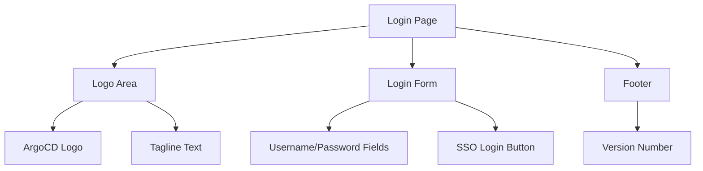

# How to Configure the ArgoCD Login Page

Author: [nawazdhandala](https://github.com/nawazdhandala)

Tags: ArgoCD, GitOps, Kubernetes, UI Customization, Security

Description: Learn how to customize the ArgoCD login page with company branding, custom messages, SSO button labels, and background styles to create a professional and informative authentication experience.

---

The ArgoCD login page is the first thing users see when they access the dashboard. Customizing it with your company branding, clear SSO instructions, and environment-specific messaging creates a more professional experience and helps prevent users from accidentally logging into the wrong environment.

This guide covers every aspect of login page customization, from basic branding to advanced CSS-based modifications.

## Default Login Page Elements

The standard ArgoCD login page contains:

- ArgoCD logo
- "Let's get stuff deployed!" tagline
- Username and password fields (for local accounts)
- SSO login button (if configured)
- ArgoCD version number



## Customizing the Logo

Replace the default ArgoCD logo with your company logo using custom CSS:

```yaml
apiVersion: v1
kind: ConfigMap
metadata:
  name: argocd-cm
  namespace: argocd
data:
  ui.cssurl: "./custom/custom.css"
```

```css
/* Replace the login page logo */
.login__logo img {
  content: url('https://cdn.example.com/company-logo.svg') !important;
  max-height: 60px !important;
  width: auto !important;
}
```

For a detailed guide on logo replacement, see our post on [adding company logo to ArgoCD](https://oneuptime.com/blog/post/2026-02-26-argocd-company-logo/view).

## Customizing the Login Page Text

### Changing the Tagline

The default tagline "Let's get stuff deployed!" can be replaced:

```css
/* Hide the default tagline */
.login__text {
  font-size: 0 !important;
  line-height: 0 !important;
}

/* Add custom tagline */
.login__text::after {
  content: "Welcome to Acme Corp Deployment Portal";
  font-size: 18px !important;
  line-height: 1.5 !important;
  color: #ffffff !important;
  display: block !important;
}
```

### Adding Instructions or Notices

You can add additional text below the tagline:

```css
/* Add login instructions below the tagline */
.login__text::before {
  content: "Use your corporate SSO credentials to log in. If you need access, contact #platform-engineering on Slack.";
  font-size: 13px !important;
  line-height: 1.5 !important;
  color: rgba(255, 255, 255, 0.7) !important;
  display: block !important;
  margin-bottom: 16px !important;
}
```

## Customizing the Login Form

### Styling the Login Box

```css
/* Custom login box styling */
.login__box {
  background-color: rgba(255, 255, 255, 0.95) !important;
  border-radius: 12px !important;
  box-shadow: 0 16px 48px rgba(0, 0, 0, 0.3) !important;
  padding: 32px !important;
  max-width: 400px !important;
}

/* Style input fields */
.login__box input[type="text"],
.login__box input[type="password"] {
  border: 2px solid #e0e0e0 !important;
  border-radius: 8px !important;
  padding: 12px 16px !important;
  font-size: 14px !important;
  transition: border-color 0.2s ease !important;
}

.login__box input[type="text"]:focus,
.login__box input[type="password"]:focus {
  border-color: #1a73e8 !important;
  outline: none !important;
}

/* Style the login button */
.login__box button[type="submit"] {
  background-color: #1a73e8 !important;
  border: none !important;
  border-radius: 8px !important;
  padding: 12px 24px !important;
  font-size: 14px !important;
  font-weight: 600 !important;
  cursor: pointer !important;
  transition: background-color 0.2s ease !important;
}

.login__box button[type="submit"]:hover {
  background-color: #1565c0 !important;
}
```

### Customizing the SSO Button

When SSO is configured, the login page shows a "Log In via SSO" button. You can customize its appearance:

```css
/* Style the SSO login button */
.login__box .argo-button--base {
  background-color: #0d47a1 !important;
  border: none !important;
  border-radius: 8px !important;
  padding: 12px 24px !important;
  font-weight: 600 !important;
  width: 100% !important;
  text-align: center !important;
}

.login__box .argo-button--base:hover {
  background-color: #1565c0 !important;
}
```

### Hiding the Local Login Form

If your organization uses SSO exclusively, you can hide the username/password form and only show the SSO button:

```css
/* Hide local login fields (show only SSO) */
.login__box form .argo-form-row {
  display: none !important;
}

/* Hide the local login submit button */
.login__box form button[type="submit"] {
  display: none !important;
}

/* Keep the SSO button visible */
.login__box .login__sso-button {
  display: block !important;
}
```

Note: This is cosmetic only. For actual security, disable local accounts in ArgoCD configuration:

```yaml
apiVersion: v1
kind: ConfigMap
metadata:
  name: argocd-cm
  namespace: argocd
data:
  # Disable admin account
  admin.enabled: "false"
```

## Customizing the Background

### Solid Color Background

```css
.login {
  background-color: #0a1929 !important;
}
```

### Gradient Background

```css
.login {
  background: linear-gradient(135deg, #0a1929 0%, #1a237e 50%, #4a148c 100%) !important;
}
```

### Background Image

```css
.login {
  background-image: url('https://cdn.example.com/login-background.jpg') !important;
  background-size: cover !important;
  background-position: center !important;
  background-repeat: no-repeat !important;
}

/* Add an overlay for readability */
.login::before {
  content: "" !important;
  position: absolute !important;
  top: 0 !important;
  left: 0 !important;
  right: 0 !important;
  bottom: 0 !important;
  background-color: rgba(0, 0, 0, 0.6) !important;
  z-index: 0 !important;
}

/* Ensure content is above the overlay */
.login > * {
  position: relative !important;
  z-index: 1 !important;
}
```

### Animated Background

```css
/* Animated gradient background */
@keyframes gradient-shift {
  0% { background-position: 0% 50%; }
  50% { background-position: 100% 50%; }
  100% { background-position: 0% 50%; }
}

.login {
  background: linear-gradient(-45deg, #0a1929, #1a237e, #4a148c, #0d47a1) !important;
  background-size: 400% 400% !important;
  animation: gradient-shift 15s ease infinite !important;
}
```

## Environment-Specific Login Pages

Differentiate login pages for different environments to prevent confusion:

### Production Login Page

```css
/* Red-tinted background for production */
.login {
  background: linear-gradient(135deg, #1a0000 0%, #4a0000 100%) !important;
}

/* Add production warning */
.login__text::after {
  content: "PRODUCTION ENVIRONMENT";
  font-size: 20px !important;
  color: #ff5252 !important;
  font-weight: bold !important;
  letter-spacing: 3px !important;
  display: block !important;
  margin-top: 8px !important;
}

/* Red accent on the login box */
.login__box {
  border-top: 4px solid #d32f2f !important;
}
```

### Staging Login Page

```css
/* Amber-tinted background for staging */
.login {
  background: linear-gradient(135deg, #1a1200 0%, #4a3500 100%) !important;
}

.login__text::after {
  content: "STAGING ENVIRONMENT";
  font-size: 20px !important;
  color: #ffab00 !important;
  font-weight: bold !important;
  letter-spacing: 3px !important;
  display: block !important;
}

.login__box {
  border-top: 4px solid #f57f17 !important;
}
```

### Development Login Page

```css
/* Green-tinted background for development */
.login {
  background: linear-gradient(135deg, #001a00 0%, #003500 100%) !important;
}

.login__text::after {
  content: "DEVELOPMENT ENVIRONMENT";
  font-size: 20px !important;
  color: #69f0ae !important;
  font-weight: bold !important;
  letter-spacing: 3px !important;
  display: block !important;
}

.login__box {
  border-top: 4px solid #2e7d32 !important;
}
```

## Adding a Footer or Copyright Notice

```css
/* Add a footer to the login page */
.login::after {
  content: "Acme Corp Internal Use Only | Contact support@acmecorp.com for help";
  position: fixed !important;
  bottom: 16px !important;
  left: 0 !important;
  right: 0 !important;
  text-align: center !important;
  color: rgba(255, 255, 255, 0.5) !important;
  font-size: 12px !important;
}
```

## Complete Login Page Customization

Here is a full CSS configuration that creates a branded login experience:

```css
/* === Login Page Complete Customization === */

/* Background */
.login {
  background: linear-gradient(135deg, #0a1929 0%, #1a237e 100%) !important;
}

/* Logo */
.login__logo img {
  content: url('https://cdn.example.com/acme-logo-white.svg') !important;
  max-height: 50px !important;
}

/* Tagline */
.login__text {
  font-size: 0 !important;
}

.login__text::after {
  content: "Acme Corp Deployment Portal";
  font-size: 22px !important;
  color: #ffffff !important;
  font-weight: 300 !important;
  display: block !important;
  margin-top: 8px !important;
}

/* Login box */
.login__box {
  background-color: rgba(255, 255, 255, 0.97) !important;
  border-radius: 12px !important;
  box-shadow: 0 20px 60px rgba(0, 0, 0, 0.3) !important;
  padding: 36px !important;
  border-top: 3px solid #1a73e8 !important;
}

/* SSO button */
.login__box .argo-button--base {
  background-color: #1a73e8 !important;
  border-radius: 8px !important;
  padding: 12px 24px !important;
  font-weight: 600 !important;
}

/* Footer */
.login::after {
  content: "Internal use only. Report issues to #platform-engineering.";
  position: fixed !important;
  bottom: 20px !important;
  width: 100% !important;
  text-align: center !important;
  color: rgba(255, 255, 255, 0.4) !important;
  font-size: 11px !important;
}

/* Hide ArgoCD version for cleaner look */
.login__footer {
  display: none !important;
}
```

## Applying the Configuration

```bash
# Create or update the CSS ConfigMap
kubectl create configmap argocd-custom-css \
  --from-file=custom.css=./login-custom.css \
  -n argocd --dry-run=client -o yaml | kubectl apply -f -

# Update argocd-cm to reference the CSS
kubectl patch configmap argocd-cm -n argocd --type merge \
  -p '{"data":{"ui.cssurl":"./custom/custom.css"}}'

# If volume mounts were changed, restart the server
kubectl rollout restart deployment argocd-server -n argocd
```

Open the ArgoCD login page in an incognito window to verify changes without cached styles.

## Conclusion

A customized login page makes ArgoCD feel like part of your internal platform rather than a standalone tool. Environment-specific branding is particularly valuable for preventing accidental production changes. Start with simple changes like the logo and background color, then iterate based on your team's feedback. The CSS approach is fully reversible - just remove the `ui.cssurl` setting to revert to the default login page.
