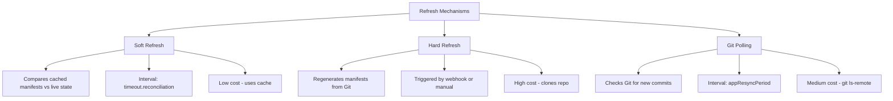

# How to Configure Optimal Refresh Intervals in ArgoCD

Author: [nawazdhandala](https://github.com/nawazdhandala)

Tags: ArgoCD, GitOps, Kubernetes, Performance Tuning, Configuration

Description: Learn how to configure ArgoCD refresh intervals for the right balance between responsiveness and resource efficiency, covering reconciliation, hard refresh, and polling settings.

---

ArgoCD uses multiple refresh mechanisms to keep applications in sync with their desired state. Each mechanism has its own interval, and configuring them correctly is the difference between a responsive system and one that either wastes resources polling constantly or takes minutes to detect changes. This guide explains every refresh interval in ArgoCD and how to set them optimally for your workload.

## The Three Types of Refresh

ArgoCD has three distinct refresh mechanisms, and they serve different purposes.



**Soft refresh** compares the cached desired state against the live cluster state. It does not re-fetch Git or regenerate manifests. This is cheap and runs frequently.

**Hard refresh** re-fetches the Git repository, regenerates manifests, and then compares against live state. This is expensive but necessary to detect changes in Git.

**Git polling** checks whether the tracked Git revision has new commits. This is a lightweight `git ls-remote` call that determines whether a hard refresh is needed.

## Configuring the Reconciliation Interval

The reconciliation interval controls how often the controller performs a soft refresh for each application. This is the primary mechanism for detecting cluster drift.

```yaml
# argocd-cm ConfigMap
apiVersion: v1
kind: ConfigMap
metadata:
  name: argocd-cm
  namespace: argocd
data:
  # Default: 180 (3 minutes)
  # How often each app is reconciled (soft refresh)
  timeout.reconciliation: "180"
```

### Choosing the Right Value

The optimal reconciliation interval depends on your requirements.

| Scenario | Recommended Interval | Rationale |
|----------|---------------------|-----------|
| Development cluster | 60s | Fast feedback on manual changes |
| Production with few apps (<50) | 120s | Good responsiveness without much load |
| Production with many apps (50-500) | 180s (default) | Balanced for most teams |
| Large-scale (500+ apps) | 300s | Reduces controller load |
| Compliance-critical | 60s | Faster drift detection |

Setting it to 0 disables automatic reconciliation entirely. Applications will only refresh on webhook events or manual triggers. This is not recommended for most environments.

## Configuring the App Resync Period

The app resync period controls how often ArgoCD polls Git repositories for changes. This is separate from the reconciliation interval.

```yaml
# argocd-cm ConfigMap
apiVersion: v1
kind: ConfigMap
metadata:
  name: argocd-cm
  namespace: argocd
data:
  # Default: 180 (3 minutes)
  # How often to check Git for new commits
  timeout.reconciliation: "180"
```

In ArgoCD, the `timeout.reconciliation` setting actually controls both the soft refresh interval and the Git polling interval. They are coupled by default. To decouple them, you need to use per-application refresh annotations.

### Per-Application Refresh Intervals

You can override the global reconciliation interval for individual applications using annotations.

```yaml
apiVersion: argoproj.io/v1alpha1
kind: Application
metadata:
  name: critical-app
  annotations:
    # Refresh this app every 30 seconds
    argocd.argoproj.io/refresh: "normal"
  namespace: argocd
spec:
  # ... app spec
```

For a more permanent per-application interval, use the `argocd.argoproj.io/reconcile-timeout` annotation (available in ArgoCD 2.9+).

```yaml
apiVersion: argoproj.io/v1alpha1
kind: Application
metadata:
  name: critical-payment-service
  annotations:
    # Override reconciliation interval for this app only
    argocd.argoproj.io/reconcile-timeout: "60"
  namespace: argocd
spec:
  source:
    repoURL: https://github.com/org/payments.git
    path: k8s/production
    targetRevision: main
```

This allows you to set aggressive intervals for critical applications while keeping the global default conservative.

## Webhook-Driven Refresh

The most efficient approach is to rely on webhooks for change detection and use reconciliation only as a safety net.

```yaml
# argocd-cm ConfigMap
apiVersion: v1
kind: ConfigMap
metadata:
  name: argocd-cm
  namespace: argocd
data:
  # Set a longer reconciliation interval since webhooks handle changes
  timeout.reconciliation: "300"

  # Configure webhook secrets
  webhook.github.secret: "your-webhook-secret"
```

With webhooks, changes are detected within seconds. The reconciliation interval only matters for detecting drift caused by manual cluster changes or webhook delivery failures.

### Setting Up GitHub Webhooks

```bash
# GitHub webhook configuration
# URL: https://argocd.example.com/api/webhook
# Content type: application/json
# Secret: your-webhook-secret
# Events: Push events, Pull request events

# Verify webhook delivery
curl -X POST https://argocd.example.com/api/webhook \
  -H "Content-Type: application/json" \
  -H "X-GitHub-Event: push" \
  -H "X-Hub-Signature-256: sha256=..." \
  -d '{"ref":"refs/heads/main","repository":{"url":"https://github.com/org/repo"}}'
```

## Hard Refresh Intervals

Hard refreshes regenerate manifests from scratch. They happen in these situations.

1. A webhook indicates a new commit
2. A user clicks "Hard Refresh" in the UI
3. A user runs `argocd app get --hard-refresh`
4. The cached manifests expire

The manifest cache expiration controls how often hard refreshes happen during normal operation.

```yaml
# argocd-cm ConfigMap
apiVersion: v1
kind: ConfigMap
metadata:
  name: argocd-cm
  namespace: argocd
data:
  # How long cached manifests live (default: 24h)
  reposerver.repo.cache.expiration: "24h"
```

For most environments, 24 hours is fine because webhooks trigger hard refreshes on actual changes. Reduce this if you need to pick up changes that do not trigger webhooks (for example, external Helm chart updates).

## Self-Heal Interval

If you enable self-healing, ArgoCD automatically syncs applications when drift is detected. The self-heal timeout controls the minimum interval between automatic syncs.

```yaml
apiVersion: argoproj.io/v1alpha1
kind: Application
metadata:
  name: my-app
spec:
  syncPolicy:
    automated:
      selfHeal: true
```

The self-heal check runs during every reconciliation. The controller flag `--self-heal-timeout-seconds` controls the minimum time between consecutive self-heal syncs for the same application.

```yaml
# argocd-application-controller args
- --self-heal-timeout-seconds=5
```

Setting this too low can cause rapid re-syncs if something is continuously modifying the resource in the cluster (for example, a mutating webhook or another controller).

## Balancing Responsiveness and Resource Usage

Here is a practical configuration for a medium-sized production environment with webhooks enabled.

```yaml
# argocd-cm ConfigMap
apiVersion: v1
kind: ConfigMap
metadata:
  name: argocd-cm
  namespace: argocd
data:
  # Webhooks handle immediate change detection
  webhook.github.secret: "your-secret"

  # Reconciliation is a safety net - 5 minutes is fine
  timeout.reconciliation: "300"

  # Manifest cache - 24h is fine with webhooks
  reposerver.repo.cache.expiration: "24h"
```

```yaml
# Critical apps get shorter intervals via annotation
apiVersion: argoproj.io/v1alpha1
kind: Application
metadata:
  name: payment-service
  annotations:
    argocd.argoproj.io/reconcile-timeout: "60"
```

This setup gives you near-instant detection of Git changes via webhooks, 60-second drift detection for critical apps, and 5-minute drift detection for everything else, all while keeping controller load manageable.

## Monitoring Refresh Performance

Track these metrics to verify your intervals are working correctly.

```promql
# Time since last successful reconciliation per app
argocd_app_info{reconcile_status="Succeeded"}

# Reconciliation frequency
rate(argocd_app_reconcile_count[5m])

# Controller queue depth (should be low)
workqueue_depth{name="app_reconciliation_queue"}
```

If the queue depth is consistently above zero, the controller cannot keep up with the reconciliation rate. Either increase the interval or add controller shards.

## Summary

Configure webhooks as the primary change detection mechanism, set the global reconciliation interval to 3-5 minutes as a safety net, and use per-application annotations for critical apps that need faster drift detection. This approach gives you both responsiveness and efficiency.
